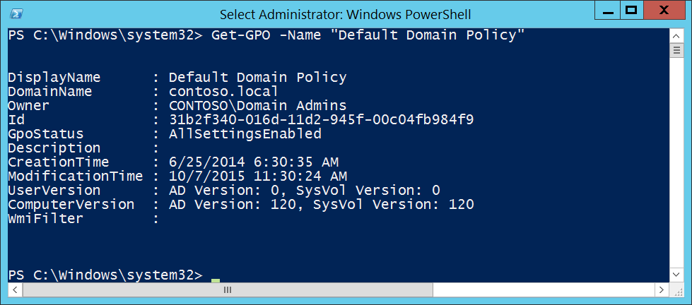

# 6145(F): One or more errors occurred while processing security policy in the group policy objects.

**Applies to**
-   Windows 10
-   Windows Server 2016


***Subcategory:***&nbsp;[Audit Other Policy Change Events](audit-other-policy-change-events.md)

***Event Description:***

This event generates every time settings from the “Security Settings” section in the group policy object are applied to a computer with one or more errors. This event generates on the target computer itself.

This event generates, for example, if the [SID](https://msdn.microsoft.com/library/windows/desktop/aa379571(v=vs.85).aspx) of a security principal which was included in one of the Group Policy settings cannot be resolved or translated to the real account name.

> **Note**&nbsp;&nbsp;For recommendations, see [Security Monitoring Recommendations](#security-monitoring-recommendations) for this event.

<br clear="all">

***Event XML:***
```
- <Event xmlns="http://schemas.microsoft.com/win/2004/08/events/event">
- <System>
 <Provider Name="Microsoft-Windows-Security-Auditing" Guid="{54849625-5478-4994-A5BA-3E3B0328C30D}" /> 
 <EventID>6145</EventID> 
 <Version>0</Version> 
 <Level>0</Level> 
 <Task>13573</Task> 
 <Opcode>0</Opcode> 
 <Keywords>0x8010000000000000</Keywords> 
 <TimeCreated SystemTime="2015-10-07T22:43:54.183603800Z" /> 
 <EventRecordID>1052680</EventRecordID> 
 <Correlation /> 
 <Execution ProcessID="524" ThreadID="3476" /> 
 <Channel>Security</Channel> 
 <Computer>DC01.contoso.local</Computer> 
 <Security /> 
 </System>
- <EventData>
 <Data Name="ErrorCode">1332</Data> 
 <Data Name="GPOList">{6AC1786C-016F-11D2-945F-00C04fB984F9} Default Domain Controllers Policy {31B2F340-016D-11D2-945F-00C04FB984F9} Default Domain Policy</Data> 
 </EventData>
 </Event>

```

***Required Server Roles:*** None.

***Minimum OS Version:*** Windows Server 2008, Windows Vista.

***Event Versions:*** 0.

***Field Descriptions:***

**Error Code** \[Type = UInt32\]: specific error code which shows the error which happened during Group Policy processing. You can find the meaning of specific error code here: <https://msdn.microsoft.com/library/windows/desktop/ms681381(v=vs.85).aspx>. For example, error code 1332 means that “no mapping between account names and security IDs was done”.

**GPO List** \[Type = UnicodeString\]: the list of Group Policy Objects that include “Security Settings” policies, and that were applied with errors to the computer. The format of the list item is: “GROUP\_POLICY\_GUID GROUP\_POLICY\_NAME”.

You can find specific GROUP\_POLICY\_GUID using **Get-GPO** PowerShell cmdlet with “**–Name** GROUP\_POLICY\_NAME” parameter. Row “Id” is the GUID of the Group Policy:



> **Note**&nbsp;&nbsp;**GUID** is an acronym for 'Globally Unique Identifier'. It is a 128-bit integer number used to identify resources, activities or instances.

## Security Monitoring Recommendations

For 6145(F): One or more errors occurred while processing security policy in the group policy objects.

-   This event indicates that Group Policy Objects which were applied to the computer or device had some errors during processing. If you see this event, we recommend checking settings in the GPOs from **GPO List** and resolving the cause of the errors.

-   If you have a pre-defined list of Group Policy Objects that contain Security Settings and that must be applied to specific computers, check this event to see if errors occurred when the Security Settings were applied. If so, you can review the error codes and investigate the cause of the failure.

-   Typically this event has an informational purpose and the reason is configuration errors in Group Policy’s security settings.

-   This event might be used for Group Policy troubleshooting purposes.

