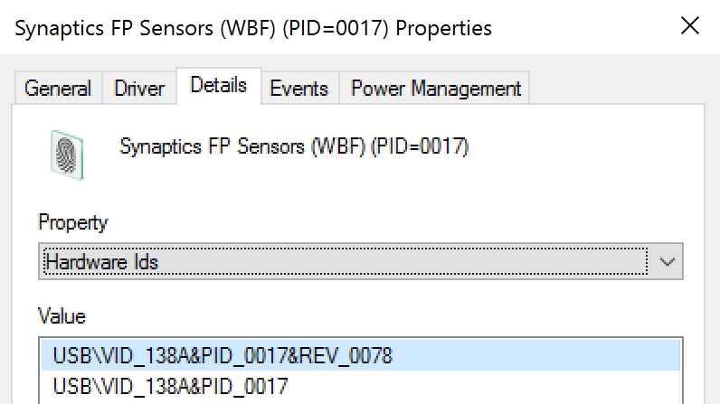
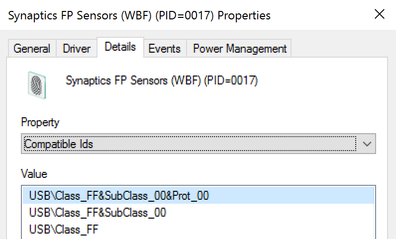

# 6416(S): A new external device was recognized by the System.


***Subcategory:***&nbsp;[Audit PNP Activity](audit-pnp-activity.md)

***Event Description:***

This event generates every time a new external device is recognized by a system.

This event generates, for example, when a new external device is connected or enabled.

> **Note**&nbsp;&nbsp;For recommendations, see [Security Monitoring Recommendations](#security-monitoring-recommendations) for this event.

<br clear="all">

***Event XML:***
```
- <Event xmlns="http://schemas.microsoft.com/win/2004/08/events/event">
- <System>
 <Provider Name="Microsoft-Windows-Security-Auditing" Guid="{54849625-5478-4994-A5BA-3E3B0328C30D}" /> 
 <EventID>6416</EventID> 
 <Version>1</Version> 
 <Level>0</Level> 
 <Task>13316</Task> 
 <Opcode>0</Opcode> 
 <Keywords>0x8020000000000000</Keywords> 
 <TimeCreated SystemTime="2015-11-13T18:20:16.818569900Z" /> 
 <EventRecordID>436</EventRecordID> 
 <Correlation /> 
 <Execution ProcessID="4" ThreadID="308" /> 
 <Channel>Security</Channel> 
 <Computer>DESKTOP-NFC0HVN</Computer> 
 <Security /> 
 </System>
- <EventData>
 <Data Name="SubjectUserSid">S-1-5-18</Data> 
 <Data Name="SubjectUserName">DESKTOP-NFC0HVN$</Data> 
 <Data Name="SubjectDomainName">WORKGROUP</Data> 
 <Data Name="SubjectLogonId">0x3e7</Data> 
 <Data Name="DeviceId">SCSI\\Disk&Ven\_Seagate&Prod\_Expansion\\000000</Data> 
 <Data Name="DeviceDescription">Seagate Expansion SCSI Disk Device</Data> 
 <Data Name="ClassId">{4D36E967-E325-11CE-BFC1-08002BE10318}</Data> 
 <Data Name="ClassName">DiskDrive</Data> 
 <Data Name="VendorIds">SCSI\\DiskSeagate\_Expansion\_\_\_\_\_\_\_0636 SCSI\\DiskSeagate\_Expansion\_\_\_\_\_\_\_ SCSI\\DiskSeagate\_ SCSI\\Seagate\_Expansion\_\_\_\_\_\_\_0 Seagate\_Expansion\_\_\_\_\_\_\_0 GenDisk</Data> 
 <Data Name="CompatibleIds">SCSI\\Disk SCSI\\RAW</Data> 
 <Data Name="LocationInformation">Bus Number 0, Target Id 0, LUN 0</Data> 
 </EventData>
</Event>

```

***Required Server Roles:*** None.

***Minimum OS Version:*** Windows Server 2016, Windows 10.

***Event Versions:***

-   0 - Windows 10.

-   1 - Windows 10 \[Version 1511\].

    -   Added “Device ID” field.

    -   Added “Device Name” field.

    -   Added “Class Name” field.

***Field Descriptions:***

**Subject:**

-   **Security ID** \[Type = SID\]**:** SID of account that registered the new device. Event Viewer automatically tries to resolve SIDs and show the account name. If the SID cannot be resolved, you will see the source data in the event.

> **Note**&nbsp;&nbsp;A **security identifier (SID)** is a unique value of variable length used to identify a trustee (security principal). Each account has a unique SID that is issued by an authority, such as an Active Directory domain controller, and stored in a security database. Each time a user logs on, the system retrieves the SID for that user from the database and places it in the access token for that user. The system uses the SID in the access token to identify the user in all subsequent interactions with Windows security. When a SID has been used as the unique identifier for a user or group, it cannot ever be used again to identify another user or group. For more information about SIDs, see [Security identifiers](/windows/access-protection/access-control/security-identifiers).

-   **Account Name** \[Type = UnicodeString\]**:** the name of the account that registered the new device.

-   **Account Domain** \[Type = UnicodeString\]**:** subject’s domain or computer name. Formats vary, and include the following:

    -   Domain NETBIOS name example: CONTOSO

    -   Lowercase full domain name: contoso.local

    -   Uppercase full domain name: CONTOSO.LOCAL

    -   For some [well-known security principals](/windows/security/identity-protection/access-control/security-identifiers), such as LOCAL SERVICE or ANONYMOUS LOGON, the value of this field is “NT AUTHORITY”.

    -   For local user accounts, this field will contain the name of the computer or device that this account belongs to, for example: “Win81”.

-   **Logon ID** \[Type = HexInt64\]**:** hexadecimal value that can help you correlate this event with recent events that might contain the same Logon ID, for example, “[4624](event-4624.md): An account was successfully logged on.”

**Device ID** \[Type = UnicodeString\] \[Version 1\]: “**Device instance path**” attribute of device. To see device properties, start Device Manager, open specific device properties, and click “Details”:


**Device Name** \[Type = UnicodeString\] \[Version 1\]: “**Device description**” attribute of device. To see device properties, start Device Manager, open specific device properties, and click “Details”:


**Class ID** \[Type = UnicodeString\]: “**Class Guid**” attribute of device. To see device properties, start Device Manager, open specific device properties, and click “Details”:


**Class Name** \[Type = UnicodeString\] \[Version 1\]: “**Class**” attribute of device. To see device properties, start Device Manager, open specific device properties, and click “Details”:


**Vendor IDs** \[Type = UnicodeString\]: “**Hardware Ids**” attribute of device. To see device properties, start Device Manager, open specific device properties, and click “Details”:



**Compatible IDs** \[Type = UnicodeString\]: “**Compatible Ids**” attribute of device. To see device properties, start Device Manager, open specific device properties, and click “Details”:



**Location Information** \[Type = UnicodeString\]: “**Location information**” attribute of device. To see device properties, start Device Manager, open specific device properties, and click “Details”:


## Security Monitoring Recommendations

For 6416(S): A new external device was recognized by the System.

> **Important**&nbsp;&nbsp;For this event, also see [Appendix A: Security monitoring recommendations for many audit events](appendix-a-security-monitoring-recommendations-for-many-audit-events.md).

-   Because this event is typically triggered by the SYSTEM account, we recommend that you report it whenever **“Subject\\Security ID”** is not SYSTEM.

-   You can use this event to track the events and event information shown in the following table by using the listed fields:

| Event and event information to monitor              | Field to use               |
|-----------------------------------------------------|----------------------------|
| Device recognition events, **Device Instance Path** | “**Device ID**”            |
| Device recognition events, **Device Description**   | “**Device Name**”          |
| Device recognition events, **Class GUID**           | “**Class ID**”             |
| Device recognition events, **Hardware IDs**         | “**Vendor IDs**”           |
| Device recognition events, **Compatible IDs**       | “**Compatible IDs**”       |
| Device recognition events, **Location information** | “**Location Information**” |

