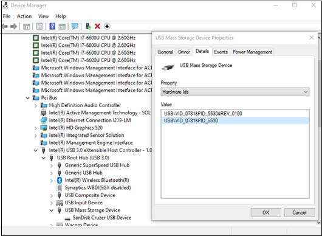
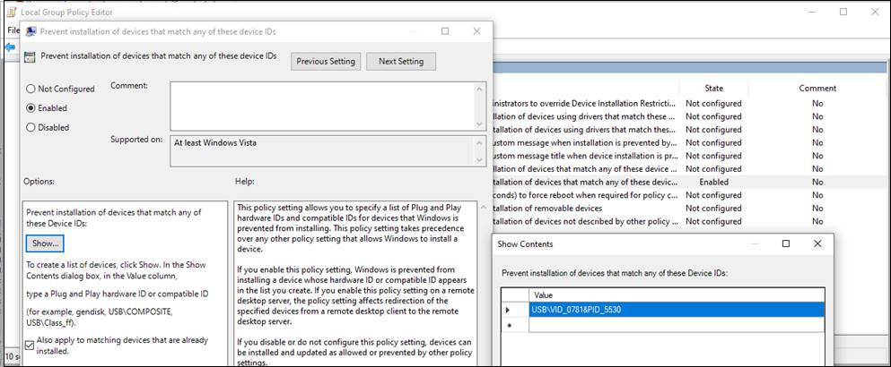

# How to control USB devices and other removable media using Microsoft Defender ATP

**Applies to:** [Microsoft Defender Advanced Threat Protection (Microsoft Defender ATP)](https://go.microsoft.com/fwlink/p/?linkid=2069559)

Microsoft recommends [a layered approach to securing removable media](https://aka.ms/devicecontrolblog), and Microsoft Defender ATP provides multiple monitoring and control features to help prevent threats in unauthorized peripherals from compromising your devices:

1. [Discover plug and play connected events for peripherals in Microsoft Defender ATP advanced hunting](#discover-plug-and-play-connected-events). Identify or investigate suspicious usage activity.

2. Configure to allow or block only certain removable devices and prevent threats.
    1. [Allow or block removable devices](#allow-or-block-removable-devices) based on granular configuration to deny write access to removable disks and approve or deny devices by USB vendor IDs, product IDs, device IDs, or a combination. Flexible policy assignment of device installation settings based on an individual or group of Azure Active Directory (Azure AD) users and devices.

    2. [Prevent threats from removable storage](#prevent-threats-from-removable-storage) introduced by removable storage devices by enabling:  
           - Windows Defender Antivirus real-time protection (RTP) to scan removable storage for malware.  
           - The Attack Surface Reduction (ASR) USB rule to block untrusted and unsigned processes that run from USB.  
           - Direct Memory Access (DMA) protection settings to mitigate DMA attacks, including Kernel DMA Protection for Thunderbolt and blocking DMA until a user signs in.  
3. [Create customized alerts and response actions](#create-customized-alerts-and-response-actions) to monitor usage of removable devices based on these plug and play events or any other Microsoft Defender ATP events with [custom detection rules](https://docs.microsoft.com/windows/security/threat-protection/microsoft-defender-atp/custom-detection-rules).

4. [Respond to threats](#respond-to-threats) from peripherals in real-time based on properties reported by each peripheral.

>[!Note]
>These threat reduction measures help prevent malware from coming into your environment. To protect enterprise data from leaving your environment, you can also configure data loss prevention measures. For example, on Windows 10 devices you can configure [BitLocker](https://docs.microsoft.com/windows/security/information-protection/bitlocker/bitlocker-overview) and [Windows Information Protection](https://docs.microsoft.com/windows/security/information-protection/windows-information-protection/create-wip-policy-using-intune-azure), which will encrypt company data even if it is stored on a personal device, or use the [Storage/RemovableDiskDenyWriteAccess CSP](https://docs.microsoft.com/windows/client-management/mdm/policy-csp-storage#storage-removablediskdenywriteaccess) to deny write access to removable disks. Additionally, you can [classify and protect files on Windows devices](https://docs.microsoft.com/windows/security/threat-protection/windows-defender-atp/information-protection-in-windows-overview) (including their mounted USB devices) by using Microsoft Defender ATP and Azure Information Protection.

## Discover plug and play connected events

You can view plug and play connected events in Microsoft Defender ATP advanced hunting to identify suspicious usage activity or perform internal investigations.
For examples of Microsoft Defender ATP advanced hunting queries, see the [Microsoft Defender ATP hunting queries GitHub repo](https://github.com/Microsoft/WindowsDefenderATP-Hunting-Queries).

Sample Power BI report templates are available for Microsoft Defender ATP that you can use for Advanced hunting queries. With these sample templates, including one for device control, you can integrate the power of Advanced hunting into Power BI. See the [GitHub repository for PowerBI templates](https://github.com/microsoft/MDATP-PowerBI-Templates) for more information. See [Create custom reports using Power BI](https://docs.microsoft.com/windows/security/threat-protection/microsoft-defender-atp/api-power-bi) to learn more about Power BI integration.

## Allow or block removable devices
The following table describes the ways Microsoft Defender ATP can allow or block removable devices based on granular configuration.

| Control  | Description |
|----------|-------------|
| [Restrict USB drives and other peripherals](#restrict-usb-drives-and-other-peripherals) | You can allow/prevent users to install only the USB drives and other peripherals included on a list of authorized/unauthorized devices or device types. |
| [Block installation and usage of removable storage](#block-installation-and-usage-of-removable-storage) | You can't install or use removable storage. |
| [Allow installation and usage of specifically approved peripherals](#allow-installation-and-usage-of-specifically-approved-peripherals)   | You can only install and use approved peripherals that report specific properties in their firmware. |
| [Prevent installation of specifically prohibited peripherals](#prevent-installation-of-specifically-prohibited-peripherals) | You can't install or use prohibited peripherals that report specific properties in their firmware. |
| [Allow installation and usage of specifically approved peripherals with matching device instance IDs](#allow-installation-and-usage-of-specifically-approved-peripherals-with-matching-device-instance-ids) | You can only install and use approved peripherals that match any of these device instance IDs. |
| [Prevent installation and usage of specifically prohibited peripherals with matching device instance IDs](#prevent-installation-and-usage-of-specifically-prohibited-peripherals-with-matching-device-instance-ids) | You can't install or use prohibited peripherals that match any of these device instance IDs. |
| [Limit services that use Bluetooth](#limit-services-that-use-bluetooth) | You can limit the services that can use Bluetooth. |
| [Use Microsoft Defender ATP baseline settings](#use-microsoft-defender-atp-baseline-settings) | You can set the recommended configuration for ATP by using the Microsoft Defender ATP security baseline. |

### Restrict USB drives and other peripherals

To prevent malware infections or data loss, an organization may restrict USB drives and other peripherals. The following table describes the ways Microsoft Defender ATP can help prevent installation and usage of USB drives and other peripherals.

| Control  | Description
|----------|-------------|
| [Allow installation and usage of USB drives and other peripherals](#allow-installation-and-usage-of-usb-drives-and-other-peripherals) | Allow users to install only the USB drives and other peripherals included on a list of authorized devices or device types |
| [Prevent installation and usage of USB drives and other peripherals](#prevent-installation-and-usage-of-usb-drives-and-other-peripherals) | Prevent users from installing USB drives and other peripherals included on a list of unauthorized devices and device types |

All of the above controls can be set through the Intune [Administrative Templates](https://docs.microsoft.com/intune/administrative-templates-windows). The relevant policies are located here in the Intune Administrator Templates:


>[!Note]
>Using Intune, you can apply device configuration policies to Azure AD user and/or device groups.
The above policies can also be set through the [Device Installation CSP settings](https://docs.microsoft.com/windows/client-management/mdm/policy-csp-deviceinstallation) and the [Device Installation GPOs](https://docs.microsoft.com/previous-versions/dotnet/articles/bb530324(v=msdn.10)).

> [!Note]
> Always test and refine these settings with a pilot group of users and devices first before applying them in production.
For more information about controlling USB devices, see the [Microsoft Defender ATP blog](https://www.microsoft.com/security/blog/2018/12/19/windows-defender-atp-has-protections-for-usb-and-removable-devices/).

#### Allow installation and usage of USB drives and other peripherals

One way to approach allowing installation and usage of USB drives and other peripherals is to start by allowing everything. Afterwards, you can start reducing the allowable USB drivers and other peripherals.

>[!Note]
>Because an unauthorized USB peripheral can have firmware that spoofs its USB properties, we recommend only allowing specifically approved USB peripherals and limiting the users who can access them.

1. Enable **Prevent installation of devices not described by other policy settings** to all users.
2. Enable **Allow installation of devices using drivers that match these device setup classes** for all [device setup classes](https://docs.microsoft.com/windows-hardware/drivers/install/system-defined-device-setup-classes-available-to-vendors).

To enforce the policy for already installed devices, apply the prevent policies that have this setting.

When configuring the allow device installation policy, you must allow all parent attributes as well. You can view the parents of a device by opening Device Manager and view by connection.


In this example, the following classes needed to be added: HID, Keyboard, and {36fc9e60-c465-11cf-8056-444553540000}. See [Microsoft-provided USB drivers](https://docs.microsoft.com/windows-hardware/drivers/usbcon/supported-usb-classes) for  more information.


If you want to restrict to certain devices, remove the device setup class of the peripheral that you want to limit. Then add the device ID that you want to add. To find the vendor or product IDs, see [Look up device vendor ID or product ID](#look-up-device-vendor-id-or-product-id). 

For example:

1. Remove class USBDevice from the **Allow installation of devices using drivers that match these device setup**.
2. Add the vendor ID or product ID to allow in the **Allow installation of device that match any of these device IDs**. 


#### Prevent installation and usage of USB drives and other peripherals

If you want to prevent the installation of a device class or certain devices, you can use the prevent device installation policies:

1. Enable **Prevent installation of devices that match any of these device IDs**.
2. Enable **Prevent installation of devices that match these device setup classes**.

> [!Note]
> The prevent device installation policies take precedence over the allow device installation policies.

The **Prevent installation of devices that match any of these device IDs** policy allows you to specify a list of vendor or product IDs for devices that Windows is prevented from installing. 

To prevent installation of devices that match any of these device IDs: 

1. [Look up device vendor ID or product ID](#look-up-device-vendor-id-or-product-id) for devices that you want Windows to prevent from installing.

2. Enable **Prevent installation of devices that match any of these device IDs** and add the vendor or product IDs to the list.


#### Look up device vendor ID or product ID
You can use Device Manager to look up a device vendor or product ID.

1. Open Device Manager.
2. Click **View** and select **Devices by connection**.
3. From the tree, right-click the device and select **Properties**.
4. In the dialog box for the selected device, click the **Details** tab.
5. Click the **Property** drop-down list and select **Hardware Ids**.
6. Right-click the top ID value and select **Copy**.

For information on vendor and product ID formats, see [Standard USB Identifiers](https://docs.microsoft.com/windows-hardware/drivers/install/standard-usb-identifiers).

For information on vendor IDs, see [USB members](https://www.usb.org/members).

The following is an example for looking up a device vendor ID or product ID using PowerShell: 
``` PowerShell
Get-WMIObject -Class Win32_DiskDrive |
Select-Object -Property * 
```

### Block installation and usage of removable storage

1. Sign in to the [Microsoft Azure portal](https://portal.azure.com/).
2. Click **Intune** > **Device configuration** > **Profiles** > **Create profile**.

   

3. Use the following settings:

   - Name: Type a name for the profile
   - Description: Type a description
   - Platform: Windows 10 and later
   - Profile type: Device restrictions

   

4. Click **Configure** > **General**.  

5. For **Removable storage** and **USB connection (mobile only)**, choose **Block**. **Removable storage** includes USB drives, whereas **USB connection (mobile only)** excludes USB charging but includes other USB connections on mobile devices only. 

   

6. Click **OK** to close **General** settings and **Device restrictions**.

7. Click **Create** to save the profile.

### Allow installation and usage of specifically approved peripherals

Peripherals that are allowed to be installed can be specified by their [hardware identity](https://docs.microsoft.com/windows-hardware/drivers/install/device-identification-strings). For a list of common identifier structures, see [Device Identifier Formats](https://docs.microsoft.com/windows-hardware/drivers/install/device-identifier-formats). Test the configuration prior to rolling it out to ensure it blocks and allows the devices expected. Ideally test various instances of the hardware. For example, test multiple USB keys rather than only one.

For a SyncML example that allows installation of specific device IDs, see [DeviceInstallation/AllowInstallationOfMatchingDeviceIDs CSP](https://docs.microsoft.com/windows/client-management/mdm/policy-csp-deviceinstallation#deviceinstallation-allowinstallationofmatchingdeviceids). To allow specific device classes, see [DeviceInstallation/AllowInstallationOfMatchingDeviceSetupClasses CSP](https://docs.microsoft.com/windows/client-management/mdm/policy-csp-deviceinstallation#deviceinstallation-allowinstallationofmatchingdevicesetupclasses).
Allowing installation of specific devices requires also enabling [DeviceInstallation/PreventInstallationOfDevicesNotDescribedByOtherPolicySettings](https://docs.microsoft.com/windows/client-management/mdm/policy-csp-deviceinstallation#deviceinstallation-preventinstallationofdevicesnotdescribedbyotherpolicysettings).

### Prevent installation of specifically prohibited peripherals

Microsoft Defender ATP blocks installation and usage of prohibited peripherals by using either of these options:

- [Administrative Templates](https://docs.microsoft.com/intune/administrative-templates-windows) can block any device with a matching hardware ID or setup class.  
- [Device Installation CSP settings](https://docs.microsoft.com/windows/client-management/mdm/policy-csp-deviceinstallation) with a custom profile in Intune. You can [prevent installation of specific device IDs](https://docs.microsoft.com/windows/client-management/mdm/policy-csp-deviceinstallation#deviceinstallation-preventinstallationofmatchingdeviceids) or [prevent specific device classes](https://docs.microsoft.com/windows/client-management/mdm/policy-csp-deviceinstallation#deviceinstallation-preventinstallationofmatchingdevicesetupclasses).

### Allow installation and usage of specifically approved peripherals with matching device instance IDs

Peripherals that are allowed to be installed can be specified by their [device instance IDs](https://docs.microsoft.com/windows-hardware/drivers/install/device-instance-ids). Test the configuration prior to rolling it out to ensure it allows the devices expected. Ideally test various instances of the hardware. For example, test multiple USB keys rather than only one.

You can allow installation and usage of approved peripherals with matching device instance IDs by configuring [DeviceInstallation/AllowInstallationOfMatchingDeviceInstanceIDs](https://docs.microsoft.com/windows/client-management/mdm/policy-csp-deviceinstallation#deviceinstallation-allowinstallationofmatchingdeviceinstanceids) policy setting.

### Prevent installation and usage of specifically prohibited peripherals with matching device instance IDs

Peripherals that are prohibited to be installed can be specified by their [device instance IDs](https://docs.microsoft.com/windows-hardware/drivers/install/device-instance-ids). Test the configuration prior to rolling it out to ensure it allows the devices expected. Ideally test various instances of the hardware. For example, test multiple USB keys rather than only one.

You can prevent installation of the prohibited peripherals with matching device instance IDs by configuring [DeviceInstallation/PreventInstallationOfMatchingDeviceInstanceIDs](https://docs.microsoft.com/windows/client-management/mdm/policy-csp-deviceinstallation#deviceinstallation-preventinstallationofmatchingdeviceinstanceids) policy setting.

### Limit services that use Bluetooth

Using Intune, you can limit the services that can use Bluetooth through the ["Bluetooth allowed services"](https://docs.microsoft.com/windows/client-management/mdm/policy-csp-bluetooth#servicesallowedlist-usage-guide). The default state of "Bluetooth allowed services" settings means everything is allowed.  As soon as a service is added, that becomes the allowed list. If the customer adds the Keyboards and Mice values, and doesn’t add the file transfer GUIDs, file transfer should be blocked.


### Use Microsoft Defender ATP baseline settings

The Microsoft Defender ATP baseline settings represent the recommended configuration for ATP. Configuration settings for baseline are located in the edit profile page of the configuration settings.


## Prevent threats from removable storage
  
Removable storage devices can introduce additional security risk to your organization. Microsoft Defender ATP can help identify and block malicious files on removable storage devices.

Microsoft Defender ATP can also prevent USB peripherals from being used on devices to help prevent external threats. It does this by using the properties reported by USB peripherals to determine whether or not they can be installed and used on the device.

Note that if you block USB devices or any other device classes using the device installation policies, connected devices, such as phones, can still charge.

>[!NOTE]
>Always test and refine these settings with a pilot group of users and devices first before widely distributing to your organization. 

The following table describes the ways Microsoft Defender ATP can help prevent threats from removable storage.

For more information about controlling USB devices, see the [Microsoft Defender ATP blog](https://aka.ms/devicecontrolblog).

| Control  | Description |
|----------|-------------|
| [Enable Windows Defender Antivirus Scanning](#enable-windows-defender-antivirus-scanning) | Enable Windows Defender Antivirus scanning for real-time protection or scheduled scans.|
| [Block untrusted and unsigned processes on USB peripherals](#block-untrusted-and-unsigned-processes-on-usb-peripherals) | Block USB files that are unsigned or untrusted. |
| [Protect against Direct Memory Access (DMA) attacks](#protect-against-direct-memory-access-dma-attacks) | Configure settings to protect against DMA attacks. |

>[!NOTE]
>Because an unauthorized USB peripheral can have firmware that spoofs its USB properties, we recommend only allowing specifically approved USB peripherals and limiting the users who can access them.

### Enable Windows Defender Antivirus Scanning

Protecting authorized removable storage with Windows Defender Antivirus requires [enabling real-time protection](https://docs.microsoft.com/windows/security/threat-protection/windows-defender-antivirus/configure-real-time-protection-windows-defender-antivirus) or scheduling scans and configuring removable drives for scans.

- If real-time protection is enabled, files are scanned before they are accessed and executed. The scanning scope includes all files, including those on mounted removable devices such as USB drives. You can optionally [run a PowerShell script to perform a custom scan](https://aka.ms/scanusb) of a USB drive after it is mounted, so that Windows Defender Antivirus starts scanning all files on a removable device once the removable device is attached. However, we recommend enabling real-time protection for improved scanning performance, especially for large storage devices.
- If scheduled scans are used, then you need to disable the DisableRemovableDriveScanning setting (enabled by default) to scan the removable device during a full scan. Removable devices are scanned during a quick or custom scan regardless of the DisableRemovableDriveScanning setting.

>[!NOTE]
>We recommend enabling real-time monitoring for scanning. In Intune, you can enable real-time monitoring for Windows 10 in **Device Restrictions** > **Configure** > **Windows Defender Antivirus** > **Real-time monitoring**.

<!-- Need to build out point in the preceding note. 
-->

### Block untrusted and unsigned processes on USB peripherals

End-users might plug in removable devices that are infected with malware.
To prevent infections, a company can block USB files that are unsigned or untrusted.
Alternatively, companies can leverage the audit feature of [attack surface reduction rules](https://docs.microsoft.com/windows/security/threat-protection/windows-defender-exploit-guard/attack-surface-reduction-exploit-guard) to monitor the activity of untrusted and unsigned processes that execute on a USB peripheral.
This can be done by setting **Untrusted and unsigned processes that run from USB** to either **Block** or **Audit only**, respectively.
With this rule, admins can prevent or audit unsigned or untrusted executable files from running from USB removable drives, including SD cards.
Affected file types include executable files (such as .exe, .dll, or .scr) and script files such as a PowerShell (.ps), VisualBasic (.vbs), or JavaScript (.js) files.

These settings require [enabling real-time protection](https://docs.microsoft.com/windows/security/threat-protection/windows-defender-antivirus/configure-real-time-protection-windows-defender-antivirus).

1. Sign in to the [Microsoft Azure portal](https://portal.azure.com/).
2. Click **Intune** > **Device configuration** > **Profiles** > **Create profile**.

   

3. Use the following settings:

   - Name: Type a name for the profile
   - Description: Type a description
   - Platform: Windows 10 or later
   - Profile type: Endpoint protection

   

4. Click **Configure** > **Windows Defender Exploit Guard** > **Attack Surface Reduction**.

5. For **Unsigned and untrusted processes that run from USB**, choose **Block**.

   

6. Click **OK** to close **Attack Surface Reduction**, **Windows Defender Exploit Guard**, and **Endpoint protection**.

7. Click **Create** to save the profile.

### Protect against Direct Memory Access (DMA) attacks

DMA attacks can lead to disclosure of sensitive information residing on a PC, or even injection of malware that allows attackers to bypass the lock screen or control PCs remotely. The following settings help to prevent DMA attacks:

1. Beginning with Windows 10 version 1803, Microsoft introduced [Kernel DMA Protection for Thunderbolt](https://docs.microsoft.com/windows/security/information-protection/kernel-dma-protection-for-thunderbolt) to provide native protection against DMA attacks via Thunderbolt ports. Kernel DMA Protection for Thunderbolt is enabled by system manufacturers and cannot be turned on or off by users.

   Beginning with Windows 10 version 1809, you can adjust the level of Kernel DMA Protection by configuring the [DMA Guard CSP](https://docs.microsoft.com/windows/client-management/mdm/policy-csp-dmaguard#dmaguard-deviceenumerationpolicy). This is an additional control for peripherals that don't support device memory isolation (also known as DMA-remapping). Memory isolation allows the OS to leverage the I/O Memory Management Unit (IOMMU) of a device to block unallowed I/O, or memory access, by the peripheral (memory sandboxing). In other words, the OS assigns a certain memory range to the peripheral. If the peripheral attempts to read/write to memory outside of the assigned range, the OS blocks it.

   Peripherals that support device memory isolation can always connect. Peripherals that don't can be blocked, allowed, or allowed only after the user signs in (default).

2. On Windows 10 systems that do not support Kernel DMA Protection, you can:

   - [Block DMA until a user signs in](https://docs.microsoft.com/windows/client-management/mdm/policy-csp-dataprotection#dataprotection-allowdirectmemoryaccess)
   - [Block all connections via the Thunderbolt ports (including USB devices)](https://support.microsoft.com/help/2516445/blocking-the-sbp-2-driver-and-thunderbolt-controllers-to-reduce-1394-d)

## Create customized alerts and response actions

You can create custom alerts and response actions with the WDATP Connector and the custom detection rules:

**Wdatp Connector response Actions:**

**Investigate:** Initiate investigations, collect investigation package, and isolate a machine.

**Threat Scanning** on USB devices.

**Restrict execution of all applications** on the machine except a predefined set
MDATP connector is one of over 200 pre-defined connectors including Outlook, Teams, Slack, etc. Custom connectors can be built.
- [More information on WDATP Connector Response Actions](https://docs.microsoft.com/connectors/wdatp/)

**Custom Detection Rules Response Action:**
Both machine and file level actions can be applied.
- [More information on Custom Detection Rules Response Actions](https://docs.microsoft.com/windows/security/threat-protection/microsoft-defender-atp/custom-detection-rules)

For information on device control related advance hunting events and examples on how to create custom alerts, see [Advanced hunting updates: USB events, machine-level actions, and schema changes](https://techcommunity.microsoft.com/t5/Microsoft-Defender-ATP/Advanced-hunting-updates-USB-events-machine-level-actions-and/ba-p/824152).

## Respond to threats

You can create custom alerts and automatic response actions with the [Microsoft Defender ATP Custom Detection Rules](https://docs.microsoft.com/windows/security/threat-protection/microsoft-defender-atp/custom-detection-rules). Response actions within the custom detection cover both machine and file level actions. You can also create alerts and automatic response actions using [PowerApps](https://powerapps.microsoft.com/) and [Flow](https://flow.microsoft.com/) with the [Microsoft Defender ATP connector](https://docs.microsoft.com/connectors/wdatp/). The connector supports actions for investigation, threat scanning, and restricting running applications. It is one of over 200 pre-defined connectors including Outlook, Teams, Slack, and more. Custom connectors can also be built. See [Connectors](https://docs.microsoft.com/connectors/) to learn more about connectors.
 
For example, using either approach, you can automatically have the Microsoft Defender Antivirus run when a USB device is mounted onto a machine.

## Related topics

- [Configure real-time protection for Windows Defender Antivirus](https://docs.microsoft.com/windows/security/threat-protection/windows-defender-antivirus/configure-real-time-protection-windows-defender-antivirus)
- [Defender/AllowFullScanRemovableDriveScanning](https://docs.microsoft.com/windows/client-management/mdm/policy-csp-defender#defender-allowfullscanremovabledrivescanning)
- [Policy/DeviceInstallation CSP](https://docs.microsoft.com/windows/client-management/mdm/policy-csp-deviceinstallation)
- [Perform a custom scan of a removable device](https://aka.ms/scanusb)
- [Device Control PowerBI Template for custom reporting](https://github.com/microsoft/MDATP-PowerBI-Templates)
- [BitLocker](https://docs.microsoft.com/windows/security/information-protection/bitlocker/bitlocker-overview) 
- [Windows Information Protection](https://docs.microsoft.com/windows/security/information-protection/windows-information-protection/create-wip-policy-using-intune-azure)
