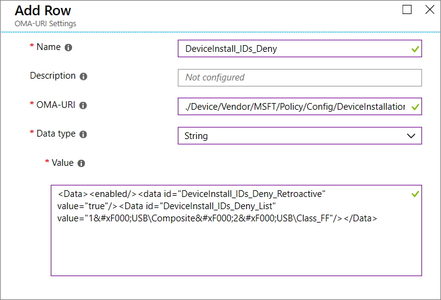

# How to control USB devices and other removable media using Windows Defender ATP

**Applies to:** [Windows Defender Advanced Threat Protection (Windows Defender ATP)](https://wincom.blob.core.windows.net/documents/Windows10_Commercial_Comparison.pdf)

Windows Defender ATP provides multiple monitoring and control features for USB peripherals to help prevent threats in  unauthorized peripherals from compromising your devices: 

- [View plug and play events for USB peripherals in Windows Defender ATP advanced hunting](#view-plug-and-play-connected-events) to identify or investigate suspicious usage activity. Create customized alerts based on these PnP events or any other Windows Defender ATP events with [custom detection rules](https://docs.microsoft.com/windows/security/threat-protection/windows-defender-atp/custom-detection-rules).  
- [Prevent USB peripherals from being used on devices](#prevent-usb-peripheral-from-being-used-on-devices) in real-time based on properties reported by the USB peripheral.
  - Granular configuration to deny write access to removable disks and approve or deny devices by USB vendor code, product code, device IDs, or a combination. 
  - Flexible policy assignment of device installation settings based on an individual or group of Azure Active Directory (Azure AD) users and devices. 
- [Protect against threats](#protect-against-threats) introduced by removable storage devices by enabling: 
  - [Windows Defender Antivirus real-time protection (RTP)](https://docs.microsoft.com/windows/security/threat-protection/windows-defender-antivirus/configure-real-time-protection-windows-defender-antivirus) to scan removable storage for malware. 
  - [Exploit Guard Attack Surface Reduction (ASR) USB rule](https://docs.microsoft.com/windows/security/threat-protection/windows-defender-exploit-guard/attack-surface-reduction-exploit-guard) to block untrusted and unsigned processes that run from USB.  
  - [Direct Memory Access (DMA) protection settings](#protect-against-direct-memory-access--dma--attacks) to mitigate DMA attacks, including [Kernel DMA Protection for Thunderbolt](https://docs.microsoft.com/windows/security/information-protection/kernel-dma-protection-for-thunderbolt) and blocking DMA until a user signs in. 
   
> [!NOTE]
> These threat reduction measures help prevent malware from coming into your environment. To protect enterprise data from leaving your environment, you can also configure data loss prevention measures. For example, on Windows 10 devices you can configure [BitLocker](https://docs.microsoft.com/windows/security/information-protection/bitlocker/bitlocker-overview) and [Windows Information Protection](https://docs.microsoft.com/windows/security/information-protection/windows-information-protection/create-wip-policy-using-intune-azure), which will encrypt company data even if it is stored on a personal device, or use the [Storage/RemovableDiskDenyWriteAccess CSP](https://docs.microsoft.com/windows/client-management/mdm/policy-csp-storage#storage-removablediskdenywriteaccess) to deny write access to removable disks.

## View plug and play connected events

You can view plug and play connected events in Windows Defender ATP advanced hunting to identify suspicious usage activity or perform internal investigations. 
For examples of Windows Defender ATP advanced hunting queries, see the [Windows Defender ATP hunting queries GitHub repo](https://github.com/Microsoft/WindowsDefenderATP-Hunting-Queries). 
Based on any Windows Defender ATP event, including the plug and play events, you can create custom alerts using the Windows Defender ATP [custom detection rule feature](https://docs.microsoft.com/windows/security/threat-protection/windows-defender-atp/custom-detection-rules).

## Prevent USB peripherals from being used on devices

Windows Defender ATP can prevent USB peripherals from being used on devices to help prevent external threats. It does this by using the properties reported by USB peripherals to determine whether or not they can be installed and used on the device.

> [!Note] 
> Always test and refine these settings with a pilot group of users and devices first before applying them in production. 

The following table describes the two ways Windows Defender ATP can help prevent installation and usage of USB peripherals. 
For more information about controlling USB devices, see the [Microsoft Secure blog](https://cloudblogs.microsoft.com/microsoftsecure/).

| Control  | Description |
|----------|-------------|
| [Block installation and usage of removable USB storage](#block-installation-and-usage-of-removable-USB-storage) | Users cannot install and cannot use removable USB storage |
| [Only allow installation and usage of specific approved USB peripherals](#only-allow-installation-and-usage-of-specifically-approved-usb-peripherals)   | Users can only install and use approved peripherals that report specific USB properties in their firmware |

> [!Note] 
> Because unauthorized USB peripherals can have firmware that spoofs its USB properties, we recommend only allowing specifically approved USB peripherals and limiting the users that can access them.

### Block installation and usage of removable USB storage

1. Sign in to the [Microsoft Azure portal](https://portal.azure.com/).
2. Click **Intune** > **Device configuration** > **Profiles** > **Create profile**. 

   

3. Use the following settings: 

   - Name: Type a name for the profile 
   - Description: Type a description 
   - Platform: Windows 10 and later 
   - Profile type: Device restrictions 

   

4. Click **Configure** > **General**.  

5. For **Removable storage** and **USB connection (mobile only)**, choose **Block**. **Removable storage** includes USB drives, where **USB connection (mobile only)** excludes USB charging but includes other USB connections on mobile devices only. 

   

6. Click **OK** to close **General** settings and **Device restrictions**.

7. Click **Create** to save the profile.

### Only allow installation and usage of specifically approved USB peripherals

Windows Defender ATP also allows installation and usage of only specifically approved USB peripherals by creating a custom profile in Intune and configuring [DeviceInstallation policies](https://docs.microsoft.com/windows/client-management/mdm/policy-csp-deviceinstallation).

Instead of recommending a particular device ID to select, I would recommend we point the reader to the documentation on hardware identity .  That has information about how the identities work overall and link to the common identifier structures (https://docs.microsoft.com/en-us/windows-hardware/drivers/install/device-identifier-formats).  From there they can make an educated choice.  One suggestion we can put, is to ensure to test the configuration prior to rolling it out to ensure it blocks and allows the devices expected.  In testing, ideally various instances of the hardware should be used (i.e. two USB keys rather than only one example).

Peripherals that are allowed to be installed can be specified by their [hardware identity](https://docs.microsoft.com/windows-hardware/drivers/install/device-identification-strings). For a list of common identifier structures, see [Device Identifier Formats](https://docs.microsoft.com/en-us/windows-hardware/drivers/install/device-identifier-formats). Test the configuration prior to rolling it out to ensure it blocks and allows the devices expected. Ideally test various instances of the hardware. For example, test multiple USB keys rather than only one.

For a SyncML example that allows installation of specific device IDs, see [DeviceInstallation/AllowInstallationOfMatchingDeviceIDs CSP](https://docs.microsoft.com/windows/client-management/mdm/policy-csp-deviceinstallation#deviceinstallation-allowinstallationofmatchingdeviceids). To allow specific device classes, see [DeviceInstallation/AllowInstallationOfMatchingDeviceSetupClasses CSP](https://docs.microsoft.com/windows/client-management/mdm/policy-csp-deviceinstallation#deviceinstallation-allowinstallationofmatchingdevicesetupclasses).
Allowing installation of specific devices requires also enabling [DeviceInstallation/PreventInstallationOfDevicesNotDescribedByOtherPolicySettings](https://docs.microsoft.com/windows/client-management/mdm/policy-csp-deviceinstallation#deviceinstallation-preventinstallationofdevicesnotdescribedbyotherpolicysettings).

For a SyncML example that prevents installation of specific device IDs, see [DeviceInstallation/PreventInstallationOfMatchingDeviceIDs CSP](https://docs.microsoft.com/windows/client-management/mdm/policy-csp-deviceinstallation#deviceinstallation-preventinstallationofmatchingdeviceids). To prevent specific device classes, see [DeviceInstallation/PreventInstallationOfMatchingDeviceSetupClasses CSP](https://docs.microsoft.com/windows/client-management/mdm/policy-csp-deviceinstallation#deviceinstallation-preventinstallationofmatchingdevicesetupclasses). 

## Protect against threats on removable USB storage
  
Windows Defender ATP can help identify and block malicious files on allowed removeable USB storage peripherals.

### Enable Windows Defender Antivirus Scanning 

Protecting authorized removable storage with Windows Defender Antivirus requires [enabling real-time protection](https://docs.microsoft.com/windows/security/threat-protection/windows-defender-antivirus/configure-real-time-protection-windows-defender-antivirus) or scheduling scans and configuring removable drives for scans. 

- If real-time protection is enabled, files are scanned before they are accessed and executed. The scanning scope includes all files, including those on mounted removable devices such as USB drives. You can optionally [run a PowerShell script to perform a custom scan](https://aka.ms/scanusb) of a USB drive after it is mounted, so that Windows Defender Antivirus starts scanning all files on a removable device once the removable device is attached. However, we recommend enabling real-time protection for improved scanning performance, especially for large storage devices.
- If scheduled scans are used, then you need to disable the DisableRemovableDriveScanning (enabled by default) to scan the removable device during a full scan. Removable devices are scanned during a quick or custom scan regardless of the DisableRemovableDriveScanning setting.

> [!NOTE] 
> We recommend using the real-time protection for scanning.

<!-- Need to build out point in thneprecedeing note. I need to check if there is an Intune setting or if we need to use the Defender CSP).
-->

### Block untrusted and unsigned processes on USB peripherals

End-users might plug in removable devices that are infected with malware. 
In order to prevent infections, a company can block files that are not signed or are untrusted from USB peripherals. 
Alternatively, companies can leverage the audit feature of attack surface reduction rules to monitor the activity of untrusted and unsigned processes that execute on a USB peripheral. 
This can be done by setting **Untrusted and unsigned processes that run from USB** to either **Block** or **Audit only**, respectively. 
With this rule, admins can prevent or audit unsigned or untrusted executable files from running from USB removable drives, including SD cards. 
Affected file types include executable files (such as .exe, .dll, or .scr) and script files such as a PowerShell (.ps), VisualBasic (.vbs), or JavaScript (.js) files.

These settings require [enabling real-time protection](https://docs.microsoft.com/windows/security/threat-protection/windows-defender-antivirus/configure-real-time-protection-windows-defender-antivirus). 

1. Sign in to the [Microsoft Azure portal](https://portal.azure.com/).
2. Click **Intune** > **Device configuration** > **Profiles** > **Create profile**. 

   

3. Use the following settings:

   - Name: Type a name for the profile 
   - Description: Type a description 
   - Platform: Windows 10 or later 
   - Profile type: Endpoint protection 

   

4. Click **Configure** > **Windows Defender Exploit Guard** > **Attack Surface Reduction**. 

5. For **Unsigned and untrusted processes that run from USB**, choose **Block**. 

   

6. Click **OK** to close **Attack Surface Reduction**, **Windows Defender Exploit Guard**, and **Endpoint protection**.

7. Click **Create** to save the profile.

### Protect against Direct Memory Access (DMA) attacks

DMA attacks can lead to disclosure of sensitive information residing on a PC, or even injection of malware that allows attackers to bypass the lock screen or control PCs remotely. The following settings help to prevent DMA attacks:

1. Beginning with Windows 10 version 1803, Microsoft introduced [Kernel DMA Protection for Thunderbolt](https://docs.microsoft.com/windows/security/information-protection/kernel-dma-protection-for-thunderbolt) to provide native protection against DMA attacks via Thunderbolt ports. Kernel DMA Protection for Thunderbolt is enabled by system manufacturers and cannot be turned on or off by users. 

   Beginning with Windows 10 version 1809, you can adjust the level of Kernel DMA Protection by configuring the [DMA Guard CSP](https://docs.microsoft.com/windows/client-management/mdm/policy-csp-dmaguard#dmaguard-deviceenumerationpolicy). This is an additional control for devices that don't support device memory isolation (also known as DMA-remapping). These devices can be blocked, allowed, or allowed only after the user signs in (default). Devices that do support device memory isolation can always connect.  

2. On Windows 10 systems that do not suppprt Kernel DMA Protection, you can:

   - [Block DMA until a user signs in](https://docs.microsoft.com/windows/client-management/mdm/policy-csp-dataprotection#dataprotection-allowdirectmemoryaccess)
   - [Block all connections via the Thunderbolt ports (including USB devices)](https://support.microsoft.com/help/2516445/blocking-the-sbp-2-driver-and-thunderbolt-controllers-to-reduce-1394-d)

## Related topics

- [Configure real-time protection for Windows Defender Antivirus](https://docs.microsoft.com/windows/security/threat-protection/windows-defender-antivirus/configure-real-time-protection-windows-defender-antivirus)
- [DeviceInstallation CSP](https://docs.microsoft.com/windows/client-management/mdm/policy-csp-deviceinstallation)
- [Perform a custom scan of a removable device](https://aka.ms/scanusb)
- [BitLocker](https://docs.microsoft.com/windows/security/information-protection/bitlocker/bitlocker-overview) 
- [Windows Information Protection](https://docs.microsoft.com/windows/security/information-protection/windows-information-protection/create-wip-policy-using-intune-azure)

