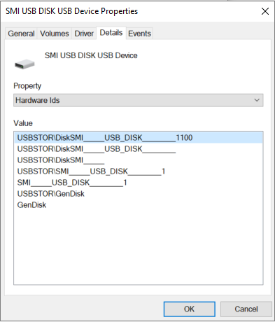

# How to control USB devices and other removable media using Windows Defender ATP

**Applies to:** [Windows Defender Advanced Threat Protection (Windows Defender ATP)](https://wincom.blob.core.windows.net/documents/Windows10_Commercial_Comparison.pdf)

Windows Defender ATP enables security administrators to view, prevent, and protect unauthorized peripherals such as cameras and removeable storage devices from threat infections that compromise devices or from being used to exfiltrate sensitive information (data loss prevention).  

- [View plug and play connected events in Windows Defender ATP advanced hunting](#view-plug-and-play-connected-events) to identify or investigate suspicious usage activity. Based on any WDATP event, you can customize alerts using a [custom detection rule](https://docs.microsoft.com/windows/security/threat-protection/windows-defender-atp/custom-detection-rules). 
- [Prevent or limit peripherals](#prevent-or-limit-peripherals) from being seen by or interacted with devices. Device installation restrictions can also be set to handle an active incident, such as immediately blocking a user or machine’s access to all removable storage. The following policy and configurations let you do this: 
  - Granular configuration to deny write access to removable disks and approve or deny devices by USB vendor code, product code, device IDs, or a combination. 
  - Flexible policy assignment of device installation settings based on an individual or group of Azure Active Directory (Azure AD) users and devices. 
- [Protect against threats](#protect-against-threats) introduced by removable storage devices by enabling: 
  - [Windows Defender Antivirus real-time protection (RTP)](https://docs.microsoft.com/windows/security/threat-protection/windows-defender-antivirus/configure-real-time-protection-windows-defender-antivirus) to scan removable storage for malware. 
  - [Exploit Guard Attack Surface Reduction (ASR) USB rule](https://docs.microsoft.com/windows/security/threat-protection/windows-defender-exploit-guard/attack-surface-reduction-exploit-guard) to block untrusted and unsigned processes that run from USB.  
  - [Direct Memory Access (DMA) protection settings](#protect-against-direct-memory-access--dma--attacks) to mitigate DMA attacks, including [Kernel DMA Protection for Thunderbolt](https://docs.microsoft.com/windows/security/information-protection/kernel-dma-protection-for-thunderbolt) and blocking DMA until a user signs in. 
   
> [!NOTE]
> These threat reduction measures help prevent malware from coming into your environment. To protect enterprise data from leaving your environment, you can also configure data loss prevention measures. For example, on Windows 10 devices you can configure [BitLocker](https://docs.microsoft.com/windows/security/information-protection/bitlocker/bitlocker-overview) and [Windows Information Protection](https://docs.microsoft.com/windows/security/information-protection/windows-information-protection/create-wip-policy-using-intune-azure), which will encrypt company data even if it is stored on a personal device, or use the [Storage/RemovableDiskDenyWriteAccess CSP](https://docs.microsoft.com/windows/client-management/mdm/policy-csp-storage#storage-removablediskdenywriteaccess) to deny write access to removable disks.

## View plug and play connected events

You can view plug and play connected events in Windows Defender ATP advanced hunting to identify suspicious usage activity or perform internal investigations. 
For examples of Windows Defender ATP advanced hunting queries, see the [Windows Defender ATP hunting queries GitHub repo](https://github.com/Microsoft/WindowsDefenderATP-Hunting-Queries). 
Based on any Windows Defender ATP event, including the plug and play events, you can create custom alerts using the Windows Defender ATP [custom detection rule feature](https://docs.microsoft.com/windows/security/threat-protection/windows-defender-atp/custom-detection-rules).

## Prevent or limit peripherals

WDATP can help reduce threats from removable storage such as USB devices. 
The following table describes different scenarios for controlling installation and usage of removeable storage and other devices. 
For more information about controlling USB devices, see the [Microsoft Secure blog](https://cloudblogs.microsoft.com/microsoftsecure/).

| Control  | Description |
|----------|-------------|
| [Block installation of any removable storage device](#block-installation-of-any-removable-storage-device) | Users can't install any removable storage device. |
| [Allow installation of specific device IDs](#allow-installation-of-specific-device-ids)   | Users can install only specifically approved devices. |

To make sure removable storage is blocked or allowed as expected, we recommend trying these settings with a pilot group of users and devices, and refining the settings as needed before applying them in production. 
We recommend to block everything and allow only the removable storage properties of approved devices (such as vendor ID, and product ID) and limit users who need access because it is possible to spoof removable device properties. 

### Block installation of any removable storage device

1. Sign in to the [Microsoft Azure portal](https://portal.azure.com/).
2. Click **Intune** > **Device configuration** > **Profiles** > **Create profile**. 

   

3. Use the following settings: 

   - Name: Type a name for the profile 
   - Description: Type a description 
   - Platform: Windows 10 and later 
   - Profile type: Device restrictions 

   

4. Click **Configure** > **General**.  

5. For **Removable storage** and **USB connection (mobile only)**, choose **Block**. **Removable storage** includes USB drives, where **USB connection (mobile only)** excludes USB charging but includes other USB connections on mobile devices only. 

   

6. Click **OK** to close **General** settings and **Device restrictions**.

7. Click **Create** to save the profile.

### Allow installation of specific device IDs

Alternatively, you can create a custom profile in Intune and configure [DeviceInstallation](https://docs.microsoft.com/windows/client-management/mdm/policy-csp-deviceinstallation) policies to allow or prevent the installation of specific types of removable devices. 

Windows can use device identification strings to control device installation and configuration. 
There are two types of device identification strings: hardware IDs and compatible IDs.

Hardware IDs are the identifiers that provide the most exact match between a device and a driver package. The first string in the list of hardware IDs generally matches the make, model, and revision of the device. The other hardware IDs in the list match fewer details of the device. For example, a hardware ID might identify the make and model of the device but not the specific revision. This scheme allows Windows to use a driver for a different revision of the device if the driver for the correct revision is not available.

You can get the hardware ID of a USB device in Device Manager. Locate the USB under Disk drives:

Right-click the name of the device, click **Properties** > **Details** and select **Hardware Ids** as the **Property**: 

Windows uses compatible IDs to select a device driver if the operating system cannot find a match with the device ID or any of the other hardware IDs. Compatible IDs are listed in the order of decreasing suitability. These strings are often generic. When a match is made using a compatible ID, you might only the most basic functions of the device.

Some physical devices create one or more logical devices when they are installed. 
Each logical device might handle part of the functionality of the physical device. 
For example, a multi-function device, such as an all-in-one scanner/fax/printer, might have a different device identification string for each function.
You must allow or prevent all of the device identification strings for that device. 

For a SyncML example that allows installation of specific device IDs, see [DeviceInstallation/AllowInstallationOfMatchingDeviceIDs CSP](https://docs.microsoft.com/windows/client-management/mdm/policy-csp-deviceinstallation#deviceinstallation-allowinstallationofmatchingdeviceids). To allow specific device classes, see [DeviceInstallation/AllowInstallationOfMatchingDeviceSetupClasses CSP](https://docs.microsoft.com/windows/client-management/mdm/policy-csp-deviceinstallation#deviceinstallation-allowinstallationofmatchingdevicesetupclasses).
Allowing installation of specific devices requires also enabling [DeviceInstallation/PreventInstallationOfDevicesNotDescribedByOtherPolicySettings](https://docs.microsoft.com/windows/client-management/mdm/policy-csp-deviceinstallation#deviceinstallation-preventinstallationofdevicesnotdescribedbyotherpolicysettings).

For a SyncML example that prevents installation of specific device IDs, see [DeviceInstallation/PreventInstallationOfMatchingDeviceIDs CSP](https://docs.microsoft.com/windows/client-management/mdm/policy-csp-deviceinstallation#deviceinstallation-preventinstallationofmatchingdeviceids). To prevent specific device classes, see [DeviceInstallation/PreventInstallationOfMatchingDeviceSetupClasses CSP](https://docs.microsoft.com/windows/client-management/mdm/policy-csp-deviceinstallation#deviceinstallation-preventinstallationofmatchingdevicesetupclasses). 

## Protect against threats
  
If removable devices are fully or even partially allowed, you can add protection to identify and block malicious files.

### Enable Windows Defender Antivirus Scanning 

Protecting authorized removable storage with Windows Defender Antivirus requires [enabling real-time protection](https://docs.microsoft.com/windows/security/threat-protection/windows-defender-antivirus/configure-real-time-protection-windows-defender-antivirus). 
If real-time protection is enabled, files are scanned before they are accessed and executed. 
The scanning scope includes all files, including those on mounted removable devices such as USB drives.
You can optionally [run a PowerShell script to perform a custom scan](https://aka.ms/scanusb) of a USB drive after it is mounted. 
However, we recommend enabling real-time protection for improved scanning performance, especially for large storage devices.  

### Block untrusted and unsigned processes that run from USB attack surface reduction rule

End-users might plug in removable devices that are infected with malware. 
In order to prevent infections, a company can block files that are not signed or are untrusted from USB devices. 
Alternatively, companies can leverage the audit feature of attack surface reduction rules to monitor the activity of untrusted and unsigned processes that execute on a USB device. 
This can be done by setting **Untrusted and unsigned processes that run from USB** to either **Block** or **Audit only**, respectively. 
With this rule, admins can prevent or audit unsigned or untrusted executable files from running from USB removable drives, including SD cards. 
Affected file types include executable files (such as .exe, .dll, or .scr) and script files such as a PowerShell (.ps), VisualBasic (.vbs), or JavaScript (.js) files.

These settings require [enabling real-time protection](https://docs.microsoft.com/windows/security/threat-protection/windows-defender-antivirus/configure-real-time-protection-windows-defender-antivirus). 

1. Sign in to the [Microsoft Azure portal](https://portal.azure.com/).
2. Click **Intune** > **Device configuration** > **Profiles** > **Create profile**. 

   

3. Use the following settings:

   - Name: Type a name for the profile 
   - Description: Type a description 
   - Platform: Windows 10 or later 
   - Profile type: Endpoint protection 

   

4. Click **Configure** > **Windows Defender Exploit Guard** > **Attack Surface Reduction**. 

5. For **Unsigned and untrusted processes that run from USB**, choose **Block**. 

   

6. Click **OK** to close **Attack Surface Reduction**, **Windows Defender Exploit Guard**, and **Endpoint protection**.

7. Click **Create** to save the profile.

### Protect against Direct Memory Access (DMA) attacks

DMA attacks can lead to disclosure of sensitive information residing on a PC, or even injection of malware that allows attackers to bypass the lock screen or control PCs remotely. The following settings help to prevent DMA attacks:

1. Beginning with Windows 10 version 1803, Microsoft introduced [Kernel DMA Protection for Thunderbolt](https://docs.microsoft.com/windows/security/information-protection/kernel-dma-protection-for-thunderbolt) to provide native protection against DMA attacks via Thunderbolt ports. Kernel DMA Protection for Thunderbolt is enabled by system manufacturers and cannot be turned on or off by users. 

   Beginning with Windows 10 version 1809, you can adjust the level of Kernel DMA Protection by configuring the [DMA Guard CSP](https://docs.microsoft.com/windows/client-management/mdm/policy-csp-dmaguard#dmaguard-deviceenumerationpolicy). This is an additional control for devices that don't support device memory isolation (also known as DMA-remapping). These devices can be blocked, allowed, or allowed only after the user signs in. Devices that do support device memory isolation can always connect.  

2. On Windows 10 systems that do not suppprt Kernel DMA Protection, you can:

   - [Block DMA until a user signs in](https://docs.microsoft.com/windows/client-management/mdm/policy-csp-dataprotection#dataprotection-allowdirectmemoryaccess)
   - [Block all connections via the Thunderbolt ports (including USB devices)](https://support.microsoft.com/help/2516445/blocking-the-sbp-2-driver-and-thunderbolt-controllers-to-reduce-1394-d)

## Related topics

- [Configure real-time protection for Windows Defender Antivirus](https://docs.microsoft.com/windows/security/threat-protection/windows-defender-antivirus/configure-real-time-protection-windows-defender-antivirus)
- [DeviceInstallation CSP](https://docs.microsoft.com/windows/client-management/mdm/policy-csp-deviceinstallation)
- [Perform a custom scan of a removable device](https://aka.ms/scanusb)
- [BitLocker](https://docs.microsoft.com/windows/security/information-protection/bitlocker/bitlocker-overview) 
- [Windows Information Protection](https://docs.microsoft.com/windows/security/information-protection/windows-information-protection/create-wip-policy-using-intune-azure)

