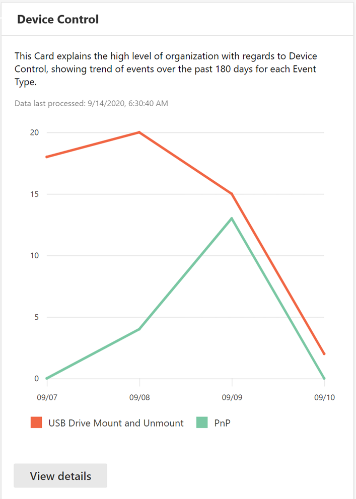
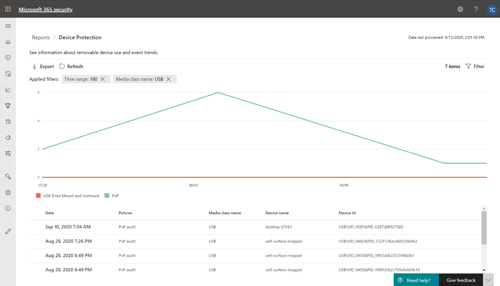
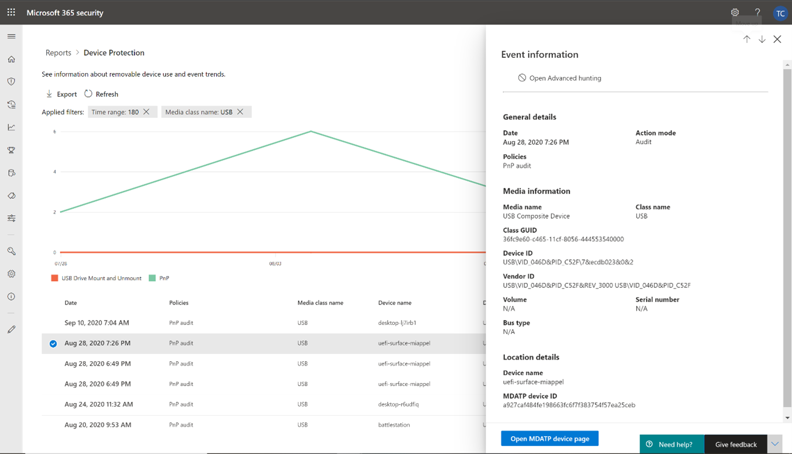
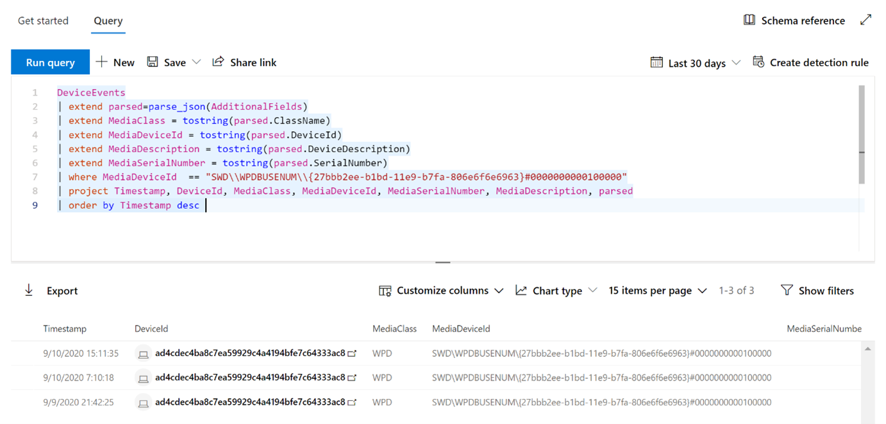
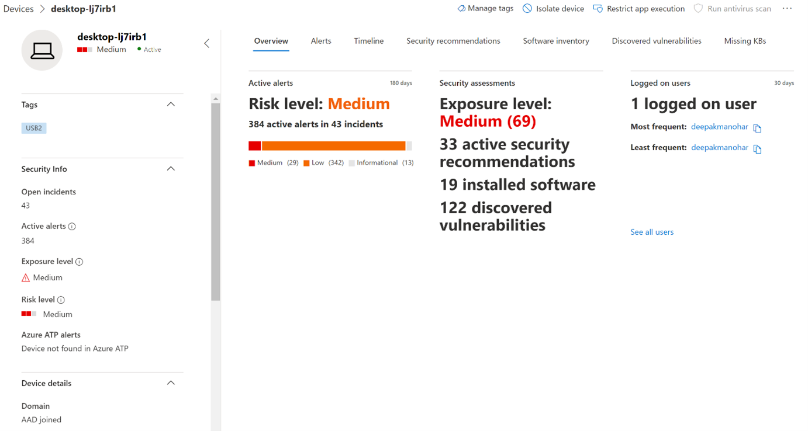

# Protect your organization’s data with device control

**Applies to:** [Microsoft Defender for Endpoint](https://go.microsoft.com/fwlink/p/?linkid=2069559)

Microsoft Defender for Endpoint device control protects against data loss, by monitoring and controlling media use by devices in your organization, such as the use of removable storage devices and USB drives.

With the device control report, you can view events that relate to media usage, such as:

- **Audit events:** Shows the number of audit events that occur when external media is connected.
- **Policy events:** Shows the number of policy events that occur when a device control policy is triggered.

> [!NOTE]
> The audit event to track media usage is enabled by default for devices onboarded to Microsoft Defender for Endpoint.

## Understanding the audit events

The audit events include:

- **USB drive mount and unmount:** Audit events that are generated when a USB drive is mounted or unmounted.
- **PnP:** Plug and Play audit events are generated when removable storage, a printer, or Bluetooth media is connected.

## Monitor device control security

Device control in Microsoft Defender for Endpoint empowers security administrators with tools that enable them to track their organization’s device control security through reports. You can find the device control report in the Microsoft 365 security center by going to **Reports > Device protection**.

The Device protection card on the **Reports** dashboard shows the number of audit events generated by media type, over the last 180 days.

> [!div class="mx-imgBorder"]
> 

The **View details** button shows more media usage data in the **device control report** page.

The page provides a dashboard with aggregated number of events per type and a list of events. Administrators can filter on time range, media class name, and device ID.

> [!div class="mx-imgBorder"]
> 

When you select an event, a flyout appears that shows you more information:

- **General details:** Date, Action mode, and the policy of this event.
- **Media information:** Media information includes Media name, Class name, Class GUID, Device ID, Vendor ID, Volume, Serial number, and Bus type.
- **Location details:** Device name and MDATP device ID.

> [!div class="mx-imgBorder"]
> 

To see real-time activity for this media across the organization, select the **Open Advanced hunting** button. This includes an embedded, pre-defined query.

> [!div class="mx-imgBorder"]
> 

To see the security of the device, select the **Open device page** button on the flyout. This button opens the device entity page.

> [!div class="mx-imgBorder"]
> 

## Reporting delays

The device control report can have a 12-hour delay from the time a media connection occurs to the time the event is reflected in the card or in the domain list.
