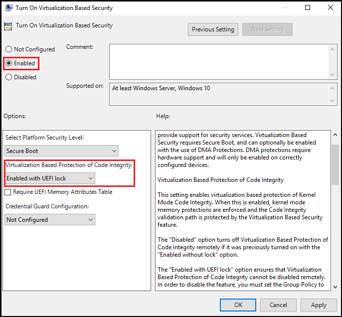

# Enable virtualization-based protection of code integrity

**Applies to**  

- [Microsoft Defender Advanced Threat Protection (Microsoft Defender ATP)](https://go.microsoft.com/fwlink/p/?linkid=2069559)

This topic covers different ways to enable Hypervisor-protected code integrity (HVCI) on Windows 10.
Some applications, including device drivers, may be incompatible with HVCI.
This can cause devices or software to malfunction and in rare cases may result in a blue screen. Such issues may occur after HVCI has been turned on or during the enablement process itself.
If this happens, see [Troubleshooting](#troubleshooting) for remediation steps.

>[!NOTE]
>HVCI works with modern 7th gen CPUs or higher and its equivalent on AMD. CPU new feature is required *Mode based execution control (MBE) Virtualization*. AMD CPUs do not have MBE.

>[!TIP]
> "The Secure Kernel relies on the Mode-Based Execution Control (MBEC) feature, if present in hardware, which enhances the SLAT with a user/kernel executable bit, or the hypervisor’s software emulation of this feature, called Restricted User Mode (RUM)." Mark Russinovich and Alex Ionescu. Windows Internals 7th Edition book

## HVCI Features

* HVCI protects modification of the Code Flow Guard (CFG) bitmap.
* HVCI also ensure your other Truslets, like Credential Guard have a valid certificate.
* Modern device drivers must also have an EV (Extended Validation) certificate and should support HVCI.

## How to turn on HVCI in Windows 10

To enable HVCI on Windows 10 devices with supporting hardware throughout an enterprise, use any of these options:
- [Windows Security app](#windows-security-app)
- [Microsoft Intune (or another MDM provider)](#enable-hvci-using-intune)
- [Group Policy](#enable-hvci-using-group-policy)
- [System Center Configuration Manager](https://cloudblogs.microsoft.com/enterprisemobility/2015/10/30/managing-windows-10-device-guard-with-configuration-manager/)
- [Registry](#use-registry-keys-to-enable-virtualization-based-protection-of-code-integrity)

### Windows Security app

HVCI is labeled **Memory integrity** in the Windows Security app and it can be accessed via **Settings** > **Update & Security** > **Windows Security** > **Device security** > **Core isolation details** > **Memory integrity**. For more information, see [KB4096339](https://support.microsoft.com/help/4096339/windows-10-device-protection-in-windows-defender-security-center).

### Enable HVCI using Intune

Enabling in Intune requires using the Code Integrity node in the [AppLocker CSP](https://docs.microsoft.com/windows/client-management/mdm/applocker-csp).

### Enable HVCI using Group Policy

1. Use Group Policy Editor (gpedit.msc) to either edit an existing GPO or create a new one.
2. Navigate to **Computer Configuration** > **Administrative Templates** > **System** > **Device Guard**.  
3. Double-click **Turn on Virtualization Based Security**.
4. Click **Enabled** and under **Virtualization Based Protection of Code Integrity**, select **Enabled with UEFI lock** to ensure HVCI cannot be disabled remotely or select **Enabled without UEFI lock**.

   

5. Click **Ok** to close the editor.

To apply the new policy on a domain-joined computer, either restart or run `gpupdate /force` in an elevated command prompt.

### Use registry keys to enable virtualization-based protection of code integrity

Set the following registry keys to enable HVCI. This provides exactly the same set of configuration options provided by Group Policy.

<!--This comment ensures that the Important above and the Warning below don't merge together. -->

> [!IMPORTANT]
> - Among the commands that follow, you can choose settings for **Secure Boot** and **Secure Boot with DMA**. In most situations, we recommend that you choose **Secure Boot**. This option provides Secure Boot with as much protection as is supported by a given computer’s hardware. A computer with input/output memory management units (IOMMUs) will have Secure Boot with DMA protection. A computer without IOMMUs will simply have Secure Boot enabled.<br>In contrast, with **Secure Boot with DMA**, the setting will enable Secure Boot—and VBS itself—only on a computer that supports DMA, that is, a computer with IOMMUs. With this setting, any computer without IOMMUs will not have VBS or HVCI protection, although it can still have WDAC enabled.<br>
> - All drivers on the system must be compatible with virtualization-based protection of code integrity; otherwise, your system may fail. We recommend that you enable these features on a group of test computers before you enable them on users' computers.

#### For Windows 10 version 1607 and later

Recommended settings (to enable virtualization-based protection of Code Integrity policies, without UEFI Lock):

``` commands
reg add "HKLM\SYSTEM\CurrentControlSet\Control\DeviceGuard" /v "EnableVirtualizationBasedSecurity" /t REG_DWORD /d 1 /f

reg add "HKLM\SYSTEM\CurrentControlSet\Control\DeviceGuard" /v "RequirePlatformSecurityFeatures" /t REG_DWORD /d 1 /f

reg add "HKLM\SYSTEM\CurrentControlSet\Control\DeviceGuard" /v "Locked" /t REG_DWORD /d 0 /f

reg add "HKLM\SYSTEM\CurrentControlSet\Control\DeviceGuard\Scenarios\HypervisorEnforcedCodeIntegrity" /v "Enabled" /t REG_DWORD /d 1 /f

reg add "HKLM\SYSTEM\CurrentControlSet\Control\DeviceGuard\Scenarios\HypervisorEnforcedCodeIntegrity" /v "Locked" /t REG_DWORD /d 0 /f
```

If you want to customize the preceding recommended settings, use the following settings.

**To enable VBS**

``` command
reg add "HKLM\SYSTEM\CurrentControlSet\Control\DeviceGuard" /v "EnableVirtualizationBasedSecurity" /t REG_DWORD /d 1 /f
```

**To enable VBS and require Secure boot only (value 1)**

``` command
reg add "HKLM\SYSTEM\CurrentControlSet\Control\DeviceGuard" /v "RequirePlatformSecurityFeatures" /t REG_DWORD /d 1 /f
```

> To enable **VBS with Secure Boot and DMA (value 3)**, in the preceding command, change **/d 1** to **/d 3**.

**To enable VBS without UEFI lock (value 0)**

``` command
reg add "HKLM\SYSTEM\CurrentControlSet\Control\DeviceGuard" /v "Locked" /t REG_DWORD /d 0 /f
```

> To enable **VBS with UEFI lock (value 1)**, in the preceding command, change **/d 0** to **/d 1**.

**To enable virtualization-based protection of Code Integrity policies**

``` command
reg add "HKLM\SYSTEM\CurrentControlSet\Control\DeviceGuard\Scenarios\HypervisorEnforcedCodeIntegrity" /v "Enabled" /t REG_DWORD /d 1 /f
```

**To enable virtualization-based protection of Code Integrity policies without UEFI lock (value 0)**

``` command
reg add "HKLM\SYSTEM\CurrentControlSet\Control\DeviceGuard\Scenarios\HypervisorEnforcedCodeIntegrity" /v "Locked" /t REG_DWORD /d 0 /f
```

> To enable **virtualization-based protection of Code Integrity policies with UEFI lock (value 1)**, in the preceding command, change **/d 0** to **/d 1**.

#### For Windows 10 version 1511 and earlier

Recommended settings (to enable virtualization-based protection of Code Integrity policies, without UEFI Lock):

``` command
reg add "HKLM\SYSTEM\CurrentControlSet\Control\DeviceGuard" /v "EnableVirtualizationBasedSecurity" /t REG_DWORD /d 1 /f

reg add "HKLM\SYSTEM\CurrentControlSet\Control\DeviceGuard" /v "RequirePlatformSecurityFeatures" /t REG_DWORD /d 1 /f

reg add "HKLM\SYSTEM\CurrentControlSet\Control\DeviceGuard" /v "HypervisorEnforcedCodeIntegrity" /t REG_DWORD /d 1 /f

reg add "HKLM\SYSTEM\CurrentControlSet\Control\DeviceGuard" /v "Unlocked" /t REG_DWORD /d 1 /f
```

If you want to customize the preceding recommended settings, use the following settings.

**To enable VBS (it is always locked to UEFI)**

``` command
reg add "HKLM\SYSTEM\CurrentControlSet\Control\DeviceGuard" /v "EnableVirtualizationBasedSecurity" /t REG_DWORD /d 1 /f
```

**To enable VBS and require Secure boot only (value 1)**

``` command
reg add "HKLM\SYSTEM\CurrentControlSet\Control\DeviceGuard" /v "RequirePlatformSecurityFeatures" /t REG_DWORD /d 1 /f
```

> To enable **VBS with Secure Boot and DMA (value 3)**, in the preceding command, change **/d 1** to **/d 3**.

**To enable virtualization-based protection of Code Integrity policies (with the default, UEFI lock)**

``` command
reg add "HKLM\SYSTEM\CurrentControlSet\Control\DeviceGuard" /v "HypervisorEnforcedCodeIntegrity" /t REG_DWORD /d 1 /f
```

**To enable virtualization-based protection of Code Integrity policies without UEFI lock**

``` command
reg add "HKLM\SYSTEM\CurrentControlSet\Control\DeviceGuard" /v "Unlocked" /t REG_DWORD /d 1 /f
```

### Validate enabled Windows Defender Device Guard hardware-based security features

Windows 10 and Windows Server 2016 have a WMI class for related properties and features: *Win32\_DeviceGuard*. This class can be queried from an elevated Windows PowerShell session by using the following command:

`Get-CimInstance –ClassName Win32_DeviceGuard –Namespace root\Microsoft\Windows\DeviceGuard`

> [!NOTE]
> The *Win32\_DeviceGuard* WMI class is only available on the Enterprise edition of Windows 10.

> [!NOTE]
> Mode Based Execution Control property will only be listed as available starting with Windows 10 version 1803.

The output of this command provides details of the available hardware-based security features as well as those features that are currently enabled.

#### AvailableSecurityProperties

This field helps to enumerate and report state on the relevant security properties for Windows Defender Device Guard.

Value | Description
-|-
**0.** | If present, no relevant properties exist on the device.
**1.** | If present, hypervisor support is available.
**2.** | If present, Secure Boot is available.
**3.** | If present, DMA protection is available.
**4.** | If present, Secure Memory Overwrite is available.
**5.** | If present, NX protections are available.
**6.** | If present, SMM mitigations are available.
**7.** | If present, Mode Based Execution Control is available.


#### InstanceIdentifier

A string that is unique to a particular device. Valid values are determined by WMI.

#### RequiredSecurityProperties

This field describes the required security properties to enable virtualization-based security.

Value | Description
-|-
**0.** | Nothing is required.
**1.** | If present, hypervisor support is needed.
**2.** | If present, Secure Boot is needed.
**3.** | If present, DMA protection is needed.
**4.** | If present, Secure Memory Overwrite is needed.
**5.** | If present, NX protections are needed.
**6.** | If present, SMM mitigations are needed.
**7.** | If present, Mode Based Execution Control is needed.

#### SecurityServicesConfigured

This field indicates whether the Windows Defender Credential Guard or HVCI service has been configured.

Value | Description
-|-
**0.** | No services configured.
**1.** | If present, Windows Defender Credential Guard is configured.
**2.** | If present, HVCI is configured.
**3.** | If present, System Guard Secure Launch is configured.

#### SecurityServicesRunning

This field indicates whether the Windows Defender Credential Guard or HVCI service is running.

Value | Description
-|-
**0.** | No services running.
**1.** | If present, Windows Defender Credential Guard is running.
**2.** | If present, HVCI is running.
**3.** | If present, System Guard Secure Launch is running.

#### Version

This field lists the version of this WMI class. The only valid value now is **1.0**.

#### VirtualizationBasedSecurityStatus

This field indicates whether VBS is enabled and running.

Value  | Description
-|-
**0.** | VBS is not enabled.
**1.** | VBS is enabled but not running.
**2.** | VBS is enabled and running.

#### PSComputerName

This field lists the computer name. All valid values for computer name.

Another method to determine the available and enabled Windows Defender Device Guard features is to run msinfo32.exe from an elevated PowerShell session. When you run this program, the Windows Defender Device Guard properties are displayed at the bottom of the **System Summary** section.


## Troubleshooting

A. If a device driver fails to load or crashes at runtime, you may be able to update the driver using **Device Manager**.

B. If you experience software or device malfunction after using the above procedure to turn on HVCI, but you are able to log in to Windows, you can turn off HVCI by renaming or deleting the SIPolicy.p7b file from the file location in step 3 above and then restart your device.

C. If you experience a critical error during boot or your system is unstable after using the above procedure to turn on HVCI, you can recover using the Windows Recovery Environment (Windows RE). To boot to Windows RE, see [Windows RE Technical Reference](https://docs.microsoft.com/windows-hardware/manufacture/desktop/windows-recovery-environment--windows-re--technical-reference). After logging in to Windows RE, you can turn off HVCI by renaming or deleting the SIPolicy.p7b file from the file location in step 3 above and then restart your device.

## How to turn off HVCI

1. Run the following command from an elevated prompt to set the HVCI registry key to off
``` command
reg add "HKLM\SYSTEM\CurrentControlSet\Control\DeviceGuard\Scenarios\HypervisorEnforcedCodeIntegrity" /v "Enabled" /t REG_DWORD /d 0 /f
```
2. Restart the device.
3. To confirm HVCI has been successfully disabled, open System Information and check **Virtualization-based security Services Running**, which should now have no value displayed.

## HVCI deployment in virtual machines

HVCI can protect a Hyper-V virtual machine, just as it would a physical machine. The steps to enable WDAC are the same from within the virtual machine.

WDAC protects against malware running in the guest virtual machine. It does not provide additional protection from the host administrator. From the host, you can disable WDAC for a virtual machine:

```powershell
Set-VMSecurity -VMName <VMName> -VirtualizationBasedSecurityOptOut $true
```

### Requirements for running HVCI in Hyper-V virtual machines 
-   The Hyper-V host must run at least Windows Server 2016 or Windows 10 version 1607.
-   The Hyper-V virtual machine must be Generation 2, and running at least Windows Server 2016 or Windows 10. 
-   HVCI and [nested virtualization](https://docs.microsoft.com/virtualization/hyper-v-on-windows/user-guide/nested-virtualization) can be enabled at the same time
-   Virtual Fibre Channel adapters are not compatible with HVCI. Before attaching a virtual Fibre Channel Adapter to a virtual machine, you must first opt out of virtualization-based security using `Set-VMSecurity`.
-   The AllowFullSCSICommandSet option for pass-through disks is not compatible with HVCI. Before configuring a pass-through disk with AllowFullSCSICommandSet, you must first opt out of virtualization-based security using `Set-VMSecurity`.
