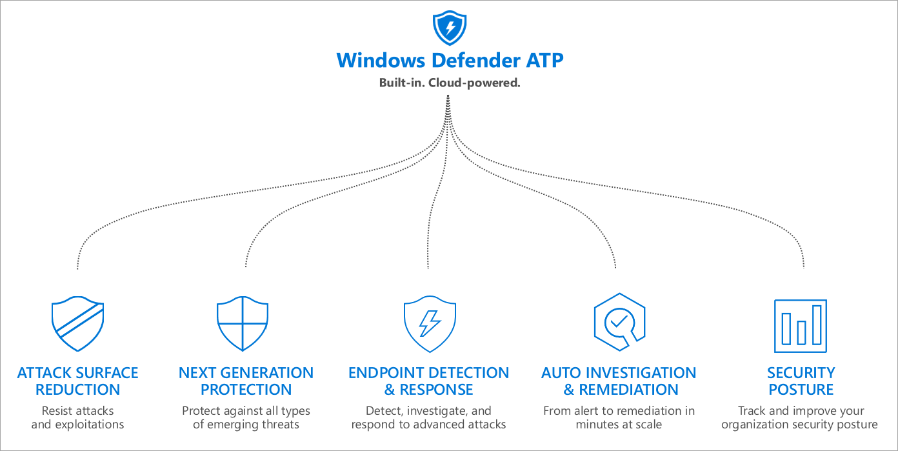

# Threat Protection
Windows Defender Advanced Threat Protection (Windows Defender ATP) is a unified endpoint security suite that uses built-in security technologies working together and powered by the cloud. 

The following products in the threat protection stack make up the capabilities under the Windows Defender ATP suite:

- Windows Defender Security Center 
- Windows Defender Antivirus
- Windows Defender Exploit Guard
- Windows Defender Application Control
- Windows Defender Application Guard
- Windows Firewall
- Windows Defender Security Analytics

You can configure these products individually in a way that best suites your organization. When you're done with setting them up, your security operations team will have the convenience of seeing everything in once place through the Windows Defender ATP portal. 

The Windows Defender ATP suite offers the following capabilities:

Learn more about how to help protect against threats in Windows 10 and Windows 10 Mobile.

| Section | Description |
|-|-|
|[Windows Defender Advanced Threat Protection portal](windows-defender-atp/windows-defender-advanced-threat-protection.md)|Provides info about the Windows Defender Advanced Threat Protection (Windows Defender ATP) portal, an out-of-the-box Windows enterprise security service that enables enterprise security operations teams to detect and respond to advanced threats on their networks.|
|[Windows Defender Antivirus in Windows 10](windows-defender-antivirus/windows-defender-antivirus-in-windows-10.md)|Provides info about Windows Defender Antivirus, a built-in antimalware solution that helps provide security and antimalware management for desktops, portable computers, and servers. Includes a list of system requirements and new features.|
|[Windows Defender Security Center](windows-defender-security-center/windows-defender-security-center.md)|Learn about the easy-to-use app that brings together common Windows security features.|
|[Windows Defender Application Guard](windows-defender-application-guard/wd-app-guard-overview.md)|Provides info about Windows Defender Application Guard, the hardware-based virtualization solution that helps to isolate a device and operating system from an untrusted browser session.|
|[Windows Defender Application Control](windows-defender-application-control/windows-defender-application-control.md)|Explains how Windows Defender Application Control restricts the applications that users are allowed to run and the code that runs in the System Core (kernel).|
|[Enable HVCI](windows-defender-exploit-guard/enable-virtualization-based-protection-of-code-integrity.md)|Explains how to enable HVCI to protect Windows kernel-mode processes against the injection and execution of malicious or unverified code.|
|[Windows Defender Smart​Screen](windows-defender-smartscreen/windows-defender-smartscreen-overview.md) |Learn more about Windows Defender SmartScreen.|
|[Mitigate threats by using Windows 10 security features](overview-of-threat-mitigations-in-windows-10.md) |Learn more about mitigating threats in Windows 10.|
|[Override Process Mitigation Options to help enforce app-related security policies](override-mitigation-options-for-app-related-security-policies.md) |Use Group Policy to override individual **Process Mitigation Options** settings and help to enforce specific app-related security policies.|
|[Use Windows Event Forwarding to help with intrusion detection](use-windows-event-forwarding-to-assist-in-intrusion-detection.md) |Learn about an approach to collect events from devices in your organization. This article talks about events in both normal operations and when an intrusion is suspected. |
|[Block untrusted fonts in an enterprise](block-untrusted-fonts-in-enterprise.md) |Provides info about how to help protect your company from attacks which may originate from untrusted or attacker controlled font files. |
