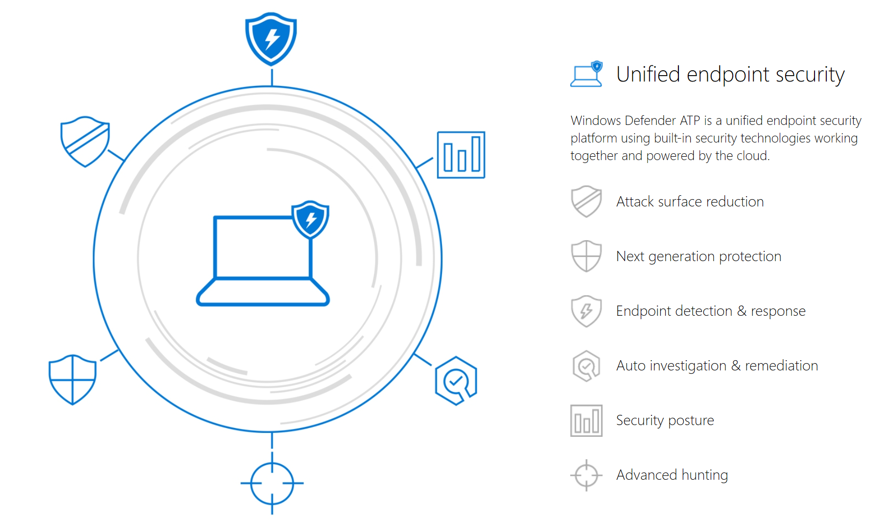

# Threat Protection
Windows Defender Advanced Threat Protection (Windows Defender ATP)is a unified platform for preventative protection, post-breach detection, automated investigation and response, employing intelligent protection to protect endpoints from cyber threats.

**Attack surface reduction** 
The attack surface reduction set of capabilities provide the first line of defense in the stack. By ensuring configuration settings are properly set and exploit mitigation techniques are applied, these set of capabilities resist attacks and exploitations. 

**Next generation protection** 
To further reinforce the security perimeter of your network, Windows Defender ATP uses next generation protection designed to catch all types of emerging threats.

**Endpoint detection and response** 
Endpoint detection and response capabilities are put in place to detect, investigate, and respond to advanced threats that may have made it past the first two security pillars. 

**Auto investigation and remediation** 
In conjunction with being able to quickly respond to advanced attacks, Windows Defender ATP offers automatic investigation and remediation capabilities that help reduce the volume of alerts in minutes at scale. 

**Security posture** 
Windows Defender ATP also provides a security posture capability to help you dynamically assess the security state of your enterprise network, identify unprotected systems, and take recommended actions to improve the overall security state of your network.

**Management and APIs** 
Windows Defender ATP provides integrated configuration management in the cloud. The service also supports third-party mobile device management (MDM) tools, cross-platform support, and APIs that allow customers to create custom threat intelligence and  automate workflows.

