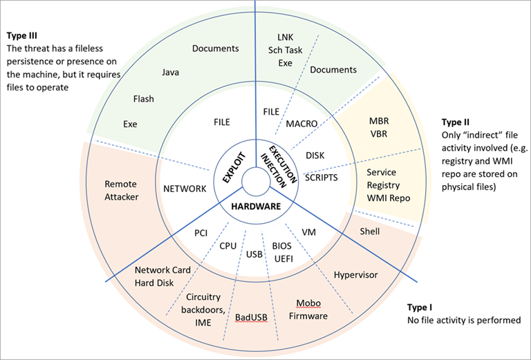
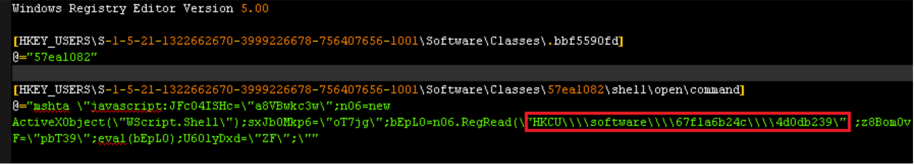

# Fileless threats

What exactly are fileless threats? The term "fileless" suggests that a threat does not come in a file, such as a backdoor that lives only in the memory of a machine. However, there's no generally accepted definition for fileless malware. The term is used broadly; it's also used to describe malware families that do rely on files to operate.

Given that attacks involve [several stages](https://attack.mitre.org/wiki/ATT&CK_Matrix) for functionalities like execution, persistence, or information theft, some parts of the attack chain may be fileless, while others may involve the filesystem in some form.

For clarity, fileless threats are grouped into different categories.

 
*Figure 1. Comprehensive diagram of fileless malware*

Fileless threats can be classified by their entry point, which indicates how fileless malware can arrive on a machine. They can arrive via an exploit, through compromised hardware, or via regular execution of applications and scripts.

Next, list the form of entry point. For example, exploits can be based on files or network data, PCI peripherals are a type of hardware vector, and scripts and executables are sub-categories of the execution vector.

Finally, classify the host of the infection. For example, a Flash application that may contain an exploit, a simple executable, malicious firmware from a hardware device, or an infected MBR, which could bootstrap the execution of a malware before the operating system even loads.

This helps you divide and categorize the various kinds of fileless threats. Clearly, the categories are not all the same: some are more dangerous but also more difficult to implement, while others are more commonly used despite (or precisely because of) not being very advanced.

From this categorization, you can glean three main types of fileless threats based on how much fingerprint they may leave on infected machines.

## Type I: No file activity performed

A completely fileless malware can be considered one that never requires writing a file on the disk. How would such malware infect a machine in the first place? An example scenario could be a target machine receiving malicious network packets that exploit the EternalBlue vulnerability, leading to the installation of the DoublePulsar backdoor, which ends up residing only in the kernel memory. In this case, there is no file or any data written on a file.

Another scenario could involve compromised devices, where malicious code could be hiding in device firmware (such as a BIOS), a USB peripheral (like the BadUSB attack), or even in the firmware of a network card. All these examples do not require a file on the disk to run and can theoretically live only in memory, surviving even reboots, disk reformats, and OS reinstalls.

Infections of this type can be extra difficult to detect and remediate. Antivirus products usually don’t have the capability to access firmware for inspection; even if they did, it would be extremely challenging to detect and remediate threats at this level. Because this type of fileless malware requires high levels of sophistication and often depend on particular hardware or software configuration, it’s not an attack vector that can be exploited easily and reliably. For this reason, while extremely dangerous, threats of this type tend to be very uncommon and not practical for most attacks.

## Type II: Indirect file activity

There are other ways that malware can achieve fileless presence on a machine without requiring significant engineering effort. Fileless malware of this type doesn't directly write files on the file system, but they can end up using files indirectly. This is the case for [Poshspy backdoor](https://www.fireeye.com/blog/threat-research/2017/03/dissecting_one_ofap.html). Attackers installed a malicious PowerShell command within the WMI repository and configured a WMI filter to run such command periodically.

It’s possible to carry out such installation via command line without requiring the presence of the backdoor to be on a file in the first place. The malware can thus be installed and theoretically run without ever touching the file system. However, the WMI repository is stored on a physical file that is a central storage area managed by the CIM Object Manager and usually contains legitimate data. Therefore, while the infection chain does technically use a physical file, for practical purposes it’s considered a fileless attack given that the WMI repository is a multi-purpose data container that cannot be simply detected and removed.

## Type III: Files required to operate

Some malware can have some sort of fileless persistence but not without using files to operate. An example for this scenario is Kovter, which creates a shell open verb handler in the registry for a random file extension. This action means that opening a file with such extension will lead to the execution of a script through the legitimate tool mshta.exe.

 
*Figure 2. Kovter’s registry key*

When the open verb is invoked, the associated command from the registry is launched, which results in the execution of a small script. This script reads data from a further registry key and executes it, in turn leading to the loading of the final payload. However, to trigger the open verb in the first place, Kovter has to drop a file with the same extension targeted by the verb (in the example above, the extension is .bbf5590fd). It also has to set an auto-run key configured to open such file when the machine starts.

Kovter is considered a fileless threat because the file system is of no practical use: the files with random extension contain junk data that is not usable in verifying the presence of the threat, and the files that store the registry are containers that cannot be detected and deleted if malicious content is present.

## Categorizing fileless threats by infection host

Having described the broad categories, we can now dig into the details and provide a breakdown of the infection hosts. This comprehensive classification covers the panorama of what is usually referred to as fileless malware. It drives our efforts to research and develop new protection features that neutralize classes of attacks and ensure malware does not get the upper hand in the arms race.

### Exploits

**File-based** (Type III: executable, Flash, Java, documents): An initial file may exploit the operating system, the browser, the Java engine, the Flash engine, etc. to execute a shellcode and deliver a payload in memory. While the payload is fileless, the initial entry vector is a file.

**Network-based** (Type I): A network communication that takes advantage of a vulnerability in the target machine can achieve code execution in the context of an application or the kernel. An example is WannaCry, which exploits a previously fixed vulnerability in the SMB protocol to deliver a backdoor within the kernel memory.

### Hardware

**Device-based** (Type I: network card, hard disk): Devices like hard disks and network cards require chipsets and dedicated software to function. Software residing and running in the chipset of a device is called firmware. Although a complex task, the firmware can be infected by malware, as the [Equation espionage group has been caught doing](https://www.kaspersky.com/blog/equation-hdd-malware/7623/).

**CPU-based** (Type I): Modern CPUs are extremely complex and may include subsystems running firmware for management purposes. Such firmware may be vulnerable to hijacking and allow the execution of malicious code that would hence operate from within the CPU. In December 2017, two researchers reported a vulnerability that can allow attackers to execute code inside the [Management Engine (ME)](https://en.wikipedia.org/wiki/Intel_Management_Engine) present in any modern CPU from Intel. Meanwhile, the attacker group PLATINUM has been observed to have the capability to use Intel's [Active Management Technology (AMT)](https://en.wikipedia.org/wiki/Intel_Active_Management_Technology) to perform [invisible network communications](https://cloudblogs.microsoft.com/microsoftsecure/2017/06/07/platinum-continues-to-evolve-find-ways-to-maintain-invisibility/) bypassing the installed operating system. ME and AMT are essentially autonomous micro-computers that live inside the CPU and that operate at a very low level. Because these technologies’ purpose is to provide remote manageability, they have direct access to hardware, are independent of the operating system, and can run even if the computer is turned off. Besides being vulnerable at the firmware level, CPUs could be manufactured with backdoors inserted directly in the hardware circuitry. This attack has been [researched and proved possible](https://www.emsec.rub.de/media/crypto/veroeffentlichungen/2015/03/19/beckerStealthyExtended.pdf) in the past. Just recently it has been reported that certain models of x86 processors contain a secondary embedded RISC-like CPU core that can [effectively provide a backdoor](https://www.theregister.co.uk/2018/08/10/via_c3_x86_processor_backdoor/) through which regular applications can gain privileged execution.

**USB-based** (Type I): USB devices of all kinds can be reprogrammed with malicious firmware capable of interacting with the operating system in nefarious ways. This is the case of the [BadUSB technique](https://arstechnica.com/information-technology/2014/07/this-thumbdrive-hacks-computers-badusb-exploit-makes-devices-turn-evil/), demonstrated few years ago, which allows a reprogrammed USB stick to act as a keyboard that sends commands to machines via keystrokes, or as a network card that can redirect traffic at will.

**BIOS-based** (Type I): A BIOS is a firmware running inside a chipset. It executes when a machine is powered on, initializes the hardware, and then transfers control to the boot sector. It’s a very important component that operates at a very low level and executes before the boot sector. It’s possible to reprogram the BIOS firmware with malicious code, as has happened in the past with the [Mebromi rootkit](https://www.webroot.com/blog/2011/09/13/mebromi-the-first-bios-rootkit-in-the-wild/).

**Hypervisor-based** (Type I): Modern CPUs provide hardware hypervisor support, allowing the operating system to create robust virtual machines. A virtual machine runs in a confined, simulated environment, and is in theory unaware of the emulation. A malware taking over a machine may implement a small hypervisor to hide itself outside of the realm of the running operating system. Malware of this kind has been theorized in the past, and eventually real hypervisor rootkits [have been observed](http://seclists.org/fulldisclosure/2017/Jun/29), although very few are known to date.

### Execution and injection

**File-based** (Type III: executables, DLLs, LNK files, scheduled tasks): This is the standard execution vector. A simple executable can be launched as a first-stage malware to run an additional payload in memory or inject it into other legitimate running processes.

**Macro-based** (Type III: Office documents): The [VBA language](https://msdn.microsoft.com/vba/office-shared-vba/articles/getting-started-with-vba-in-office) is a flexible and powerful tool designed to automate editing tasks and add dynamic functionality to documents. As such, it can be abused by attackers to carry out malicious operations like decoding, running, or injecting an executable payload, or even implementing an entire ransomware, like in [the case of qkG](https://blog.trendmicro.com/trendlabs-security-intelligence/qkg-filecoder-self-replicating-document-encrypting-ransomware/). Macros are executed within the context of an Office process (e.g., Winword.exe), and they’re implemented in a scripting language, so there is no binary executable that an antivirus can inspect. While Office apps require explicit consent from the user to execute macros from a document, attackers use social engineering techniques to trick users into allowing macros to execute.

**Script-based** (Type II: file, service, registry, WMI repo, shell): The JavaScript, VBScript, and PowerShell scripting languages are available by default on Windows platforms. Scripts have the same advantages as macros: they are textual files (not binary executables) and run within the context of the interpreter (e.g., wscript.exe, powershell.exe, etc.), which is a clean and legitimate component. Scripts are very versatile; they can be run from a file (e.g., by double-clicking them) or, in some cases, executed directly on the command line of an interpreter. Being able to run on the command line can allow malware to encode malicious command-line scripts as auto-start services inside [autorun registry keys](https://www.gdatasoftware.com/blog/2014/07/23947-poweliks-the-persistent-malware-without-a-file) as [WMI event subscriptions](https://www.fireeye.com/blog/threat-research/2017/03/dissecting_one_ofap.html) from the WMI repo. Furthermore, an attacker who has gained access to an infected machine may input the script on the command prompt.

**Disk-based** (Type II: Boot Record): The [Boot Record](https://en.wikipedia.org/wiki/Boot_sector) is the first sector of a disk or volume and contains executable code required to start the boot process of the operating system. Threats like [Petya](https://cloudblogs.microsoft.com/microsoftsecure/2017/06/27/new-ransomware-old-techniques-petya-adds-worm-capabilities/?source=mmpc) are capable of infecting the Boot Record by overwriting it with malicious code, so that when the machine is booted the malware immediately gains control (and in the case of Petya, with disastrous consequences). The Boot Record resides outside the file system, but it’s accessible by the operating system, and modern antivirus products have the capability to scan and restore it.

## Defeating fileless malware

At Microsoft, we actively monitor the security landscape to identify new threat trends and develop solutions that continuously enhance Windows security and mitigate classes of threats. We instrument durable protections that are effective against a wide range of threats. Through AntiMalware Scan Interface (AMSI), behavior monitoring, memory scanning, and boot sector protection, Microsoft Defender Advanced Threat Protection [(Microsoft Defender ATP)](https://www.microsoft.com/windowsforbusiness?ocid=docs-fileless) can inspect fileless threats even with heavy obfuscation. Machine learning technologies in the cloud allow us to scale these protections against new and emerging threats.

To learn more, read: [Out of sight but not invisible: Defeating fileless malware with behavior monitoring, AMSI, and next-gen AV](https://cloudblogs.microsoft.com/microsoftsecure/2018/09/27/out-of-sight-but-not-invisible-defeating-fileless-malware-with-behavior-monitoring-amsi-and-next-gen-av/)
