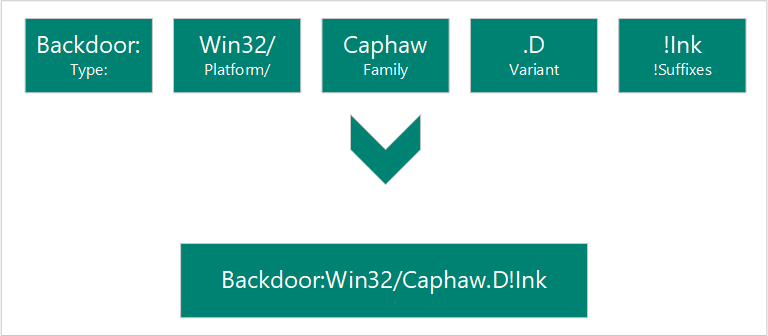

# Malware names

We name the malware and unwanted software that we detect according to the Computer Antivirus Research Organization (CARO) malware naming scheme. The scheme uses the following format:

When our analysts research a particular threat, they will determine what each of the components of the name will be.

## Type

Describes what the malware does on your computer. Worms, viruses, trojans, backdoors, and ransomware are some of the most common types of malware.

* Adware
* Backdoor
* Behavior
* BrowserModifier
* Constructor
* DDoS
* Exploit
* Hacktool
* Joke
* Misleading
* MonitoringTool
* Program
* PWS
* Ransom
* RemoteAccess
* Rogue
* SettingsModifier
* SoftwareBundler
* Spammer
* Spoofer
* Spyware
* Tool
* Trojan
* TrojanClicker
* TrojanDownloader
* TrojanNotifier
* TrojanProxy
* TrojanSpy
* VirTool
* Virus
* Worm

## Platforms

Indicates the operating system (such as Windows, Mac OS X, and Android) that the malware is designed to work on. The platform is also used to indicate programming languages and file formats.

### Operating systems

* AndroidOS: Android operating system
* DOS: MS-DOS platform
* EPOC: Psion devices
* FreeBSD: FreeBSD platform
* iPhoneOS: iPhone operating system
* Linux: Linux platform
* MacOS: MAC 9.x platform or earlier
* MacOS_X: MacOS X or later
* OS2: OS2 platform
* Palm: Palm operating system
* Solaris: System V-based Unix platforms
* SunOS: Unix platforms 4.1.3 or lower
* SymbOS: Symbian operating system
* Unix: general Unix platforms
* Win16: Win16 (3.1) platform
* Win2K: Windows 2000 platform
* Win32: Windows 32-bit platform
* Win64: Windows 64-bit platform
* Win95: Windows 95, 98 and ME platforms
* Win98: Windows 98 platform only
* WinCE: Windows CE platform
* WinNT: WinNT

### Scripting languages

* ABAP: Advanced Business Application Programming scripts
* ALisp: ALisp scripts
* AmiPro: AmiPro script
* ANSI: American National Standards Institute scripts
* AppleScript: compiled Apple scripts
* ASP: Active Server Pages scripts
* AutoIt: AutoIT scripts
* BAS: Basic scripts
* BAT: Basic scripts
* CorelScript: Corelscript scripts
* HTA: HTML Application scripts
* HTML: HTML Application scripts
* INF: Install scripts
* IRC: mIRC/pIRC scripts
* Java: Java binaries (classes)
* JS: Javascript scripts
* LOGO: LOGO scripts
* MPB: MapBasic scripts
* MSH: Monad shell scripts
* MSIL: .Net intermediate language scripts
* Perl: Perl scripts
* PHP: Hypertext Preprocessor scripts
* Python: Python scripts
* SAP: SAP platform scripts
* SH: Shell scripts
* VBA: Visual Basic for Applications scripts
* VBS: Visual Basic scripts
* WinBAT: Winbatch scripts
* WinHlp: Windows Help scripts
* WinREG: Windows registry scripts

### Macros

* A97M: Access 97, 2000, XP, 2003, 2007, and 2010 macros
* HE: macro scripting
* O97M: Office 97, 2000, XP, 2003, 2007, and 2010 macros - those that affect Word, Excel, and Powerpoint
* PP97M: PowerPoint 97, 2000, XP, 2003, 2007, and 2010 macros
* V5M: Visio5 macros
* W1M: Word1Macro
* W2M: Word2Macro
* W97M: Word 97, 2000, XP, 2003, 2007, and 2010 macros
* WM: Word 95 macros
* X97M: Excel 97, 2000, XP, 2003, 2007, and 2010 macros
* XF: Excel formulas
* XM: Excel 95 macros

### Other file types

* ASX: XML metafile of Windows Media .asf files
* HC: HyperCard Apple scripts
* MIME: MIME packets
* Netware: Novell Netware files
* QT: Quicktime files
* SB: StarBasic (Staroffice XML) files
* SWF: Shockwave Flash files
* TSQL: MS SQL server files
* XML: XML files

## Family

Grouping of malware based on common characteristics, including attribution to the same authors. Security software providers sometimes use different names for the same malware family.

## Variant letter

Used sequentially for every distinct version of a malware family. For example, the detection for the variant ".AF" would have been created after the detection for the variant ".AE".

## Suffixes

Provides extra detail about the malware, including how it is used as part of a multicomponent threat. In the example above, "!lnk" indicates that the threat component is a shortcut file used by Trojan:Win32/Reveton.T.

* .dam: damaged malware
* .dll: Dynamic Link Library component of a malware
* .dr: dropper component of a malware
* .gen: malware that is detected using a generic signature
* .kit: virus constructor
* .ldr: loader component of a malware
* .pak: compressed malware
* .plugin: plug-in component
* .remnants: remnants of a virus
* .worm: worm component of that malware
* !bit: an internal category used to refer to some threats
* !cl: an internal category used to refer to some threats
* !dha: an internal category used to refer to some threats
* !pfn: an internal category used to refer to some threats
* !plock: an internal category used to refer to some threats
* !rfn: an internal category used to refer to some threats
* !rootkit: rootkit component of that malware
* @m: worm mailers
* @mm: mass mailer worm
