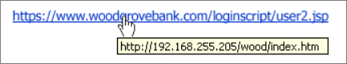

# Phishing

Phishing attacks attempt to steal sensitive information through emails, websites, text messages, or other forms of electronic communication that often look to be official communication from legitimate companies or individuals.

The information that phishers (as the cybercriminals behind phishing attacks are called) attempt to steal can be user names and passwords, credit card details, bank account information, or other credentials. Attackers can then use stolen information for malicious purposes, such as hacking, identity theft, or stealing money directly from bank accounts and credit cards. Phishers can also sell the information in cybercriminal underground marketplaces.  

## How phishing works

Phishing attacks are scams that often use social engineering bait or lure content. For example, during tax season, bait content involves tax-filing announcements that attempt to lure you into providing your personal information such as your Social Security number or bank account information.

Legitimate-looking communication, usually email, that links to a phishing site is one of the most common methods used in phishing attacks. The phishing site typically mimics sign-in pages that require users to input login credentials and account information. The phishing site then captures the sensitive information as soon as the user provides it, giving attackers access to the information.

Another common phishing technique is the use of emails that direct you to open a malicious attachment, for example a PDF file. The attachment often contains a message asking you to provide login credentials to another site such as email or file sharing websites to open the document. When you access these phishing sites using your login credentials, the attacker now has access to your information and can gain additional personal information about you.

## Phishing trends and techniques

### Invoice phishing

In this scam, the attacker attempts to lure you with an email stating that you have an outstanding invoice from a known vendor or company and provides a link for you to access and pay your invoice. When you access the site, the attacker is poised to steal your personal information and funds.

### Payment/delivery scam

You are asked to provide a credit card or other personal information so that your payment information can be updated with a commonly known vendor or supplier.  The update is requested so that you can take delivery of your ordered goods. Generally, you may be familiar with the company and have likely done business with them in the past, but you are not aware of any items you have recently purchased from them.

### Tax-themed phishing scams

A common IRS phishing scams is one in which an urgent email letter is sent indicating that you owe money to the IRS. Often the email threatens legal action if you do not access the site in a timely manner and pay your taxes. When you access the site, the attackers can steal your personal credit card or bank information and drain your accounts.

### Downloads

Another frequently-used phishing scam is one in which an attacker sends a fraudulent email requesting you to open or download a document, often one requiring you to sign in.

### Phishing emails that deliver other threats

Phishing emails can be very effective, and so attackers can using them to distribute [ransomware](ransomware-malware.md) through links or attachments in emails. When run, the ransomware encrypts files and displays a ransom note, which asks you to pay a sum of money to access to your files.

We have also seen phishing emails that have links to [tech support scam](support-scams.md) websites, which use various scare tactics to trick you into calling hotlines and paying for unnecessary "technical support services" that supposedly fix contrived device, platform, or software problems.

## Targeted attacks against enterprises

### Spear phishing

Spear phishing is a targeted phishing attack that involves highly customized lure content. To perform spear phishing, attackers will typically do reconnaissance work, surveying social media and other information sources about their intended target.

Spear phishing may involve tricking you into logging into fake sites and divulging credentials. Spear phishing may also be designed to lure you into opening documents by clicking on links that automatically install malware. With this malware in place, attackers can remotely manipulate the infected computer.

The implanted malware serves as the point of entry for a more sophisticated attack known as an advanced persistent threat (APT). APTs are generally designed to establish control and steal data over extended periods. As part of the attack, attackers often try to deploy more covert hacking tools, move laterally to other computers, compromise or create privileged accounts, and regularly exfiltrate information from compromised networks.

### Whaling

Whaling is a form of phishing in which the attack is directed at high-level or senior executives within specific companies with the direct goal of gaining access to their credentials and/or bank information. The content of the email may be written as a legal subpoena, customer complaint, or other executive issue. This type of attack can also lead to an APT attack within an organization. When the links or attachment are opened, it can assist the attacker in accessing credentials and other personal information, or launch a malware that will lead to an APT.  

### Business email compromise

Business email compromise (BEC) is a sophisticated scam that targets businesses often working with foreign suppliers and businesses that regularly perform wire transfer payments. One of the most common schemes used by BEC attackers involves gaining access to a company’s network through a spear phishing attack, where the attacker creates a domain similar to the company they are targeting or spoofs their email to scam users into releasing personal account information for money transfers.

## How to protect against phishing attacks

Social engineering attacks are designed to take advantage of a user's possible lapse in decision-making. Be aware and never provide sensitive or personal information through email or unknown websites, or over the phone. Remember, phishing emails are designed to appear legitimate.

### Awareness

The best protection is awareness and education. Don’t open attachments or click links in unsolicited emails, even if the emails came from a recognized source. If the email is unexpected, be wary about opening the attachment and verify the URL.

Enterprises should educate and train their employees to be wary of any communication that requests personal or financial information, and instruct them to report the threat to the company’s security operations team immediately.

Here are several telltale signs of a phishing scam:

* The links or URLs provided in emails are **not pointing to the correct location** or are attempting to have you access a third-party site that is not affiliated with the sender of the email. For example, in the image below the URL provided does not match the URL that you will be taken to.

    

* There is a **request for personal information** such as social security numbers or bank or financial information. Official communications won't generally request personal information from you in the form of an email.

* **Items in the email address will be changed** so that it is similar enough to a legitimate email address but has added numbers or changed letters.

* The message is **unexpected and unsolicited**. If you suddenly receive an email from an entity or a person you rarely deal with, consider this email suspect.

* The message or the attachment asks you to **enable macros, adjust security settings, or install applications**. Normal emails will not ask you to do this.

* The message contains **errors**. Legitimate corporate messages are less likely to have typographic or grammatical errors or contain wrong information.

* The **sender address does not match** the signature on the message itself. For example, an email is purported to be from Mary of Contoso Corp, but the sender address is john@example.com.

* There are **multiple recipients** in the “To” field and they appear to be random addresses. Corporate messages are normally sent directly to individual recipients.

* The greeting on the message itself **does not personally address you**. Apart from messages that mistakenly address a different person, those that misuse your name or pull your name directly from your email address tend to be malicious.

* The website looks familiar but there are **inconsistencies or things that are not quite right** such as outdated logos, typos, or ask users to give additional information that is not asked by legitimate sign-in websites.

* The page that opens is **not a live page** but rather an image that is designed to look like the site you are familiar with. A pop-up may appear that requests credentials.

If in doubt, contact the business by known channels to verify if any suspicious emails are in fact legitimate.

For more information, download and read this Microsoft [e-book on preventing social engineering attacks](https://info.microsoft.com/Protectyourweakestlink.html?ls=social), especially in enterprise environments.

### Software solutions for organizations

* [Microsoft Edge](https://docs.microsoft.com/microsoft-edge/deploy/index) and [Windows Defender Application Guard](https://docs.microsoft.com/windows/security/threat-protection/windows-defender-application-guard/wd-app-guard-overview) offer protection from the increasing threat of targeted attacks using Microsoft's industry leading Hyper-V virtualization technology. If a browsed website is deemed untrusted, the Hyper-V container will isolate that device from the rest of your network thereby preventing access to your enterprise data.

* [Microsoft Exchange Online Protection (EOP)](https://products.office.com/exchange/exchange-email-security-spam-protection) offers enterprise-class reliability and protection against spam and malware, while maintaining access to email during and after emergencies.  Using various layers of filtering, EOP can provide different controls for spam filtering, such as bulk mail controls and international spam, that will further enhance your protection services.

* Use [Office 365 Advanced Threat Protection (ATP)](https://products.office.com/exchange/online-email-threat-protection?ocid=cx-blog-mmpc) to help protect your email, files, and online storage against malware. It offers holistic protection in Microsoft Teams, Word, Excel, PowerPoint, Visio, SharePoint Online, and OneDrive for Business. By protecting against unsafe attachments and expanding protection against malicious links, it complements the security features of Exchange Online Protection to provide better zero-day protection.

For more tips and software solutions, see [prevent malware infection](prevent-malware-infection.md).

## What do I do if I've already been a victim of a phishing scam?

If you feel that you have been a victim of a phishing attack, contact your IT Admin. You should also immediately change all passwords associated with the accounts, and report any fraudulent activity to your bank, credit card company, etc.

### Reporting spam

Submit phishing scam emails to **Microsoft** by sending an email with the scam as an attachment to: phish@office365.microsoft.com. For more information on submitting messages to Microsoft, see [Submit spam, non-spam, and phishing scam messages to Microsoft for analysis](https://docs.microsoft.com/office365/SecurityCompliance/submit-spam-non-spam-and-phishing-scam-messages-to-microsoft-for-analysis).

For Outlook and Outlook on the web users, use the **Report Message Add-in** for Microsoft Outlook. For information about how to install and use this tool, see [Enable the Report Message add-in](https://support.office.com/article/4250c4bc-6102-420b-9e0a-a95064837676).

Send an email with the phishing scam to **The Anti-Phishing Working Group**: reportphishing@apwg.org. The group uses reports generated from emails sent to fight phishing scams and hackers. ISPs, security vendors, financial institutions and law enforcement agencies are involved.

## Where to find more information about phishing attacks

For information on the latest phishing attacks, techniques, and trends, you can read these entries on the [Microsoft Security blog](https://www.microsoft.com/security/blog/product/windows/):

* [Phishers unleash simple but effective social engineering techniques using PDF attachments](https://cloudblogs.microsoft.com/microsoftsecure/2017/01/26/phishers-unleash-simple-but-effective-social-engineering-techniques-using-pdf-attachments/?source=mmpc)

* [Tax themed phishing and malware attacks proliferate during the tax filing season](https://cloudblogs.microsoft.com/microsoftsecure/2017/03/20/tax-themed-phishing-and-malware-attacks-proliferate-during-the-tax-filing-season/?source=mmpc)

* [Phishing like emails lead to tech support scam](https://cloudblogs.microsoft.com/microsoftsecure/2017/08/07/links-in-phishing-like-emails-lead-to-tech-support-scam/?source=mmpc)
