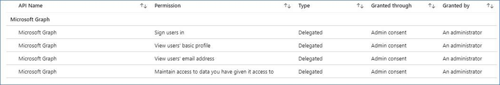
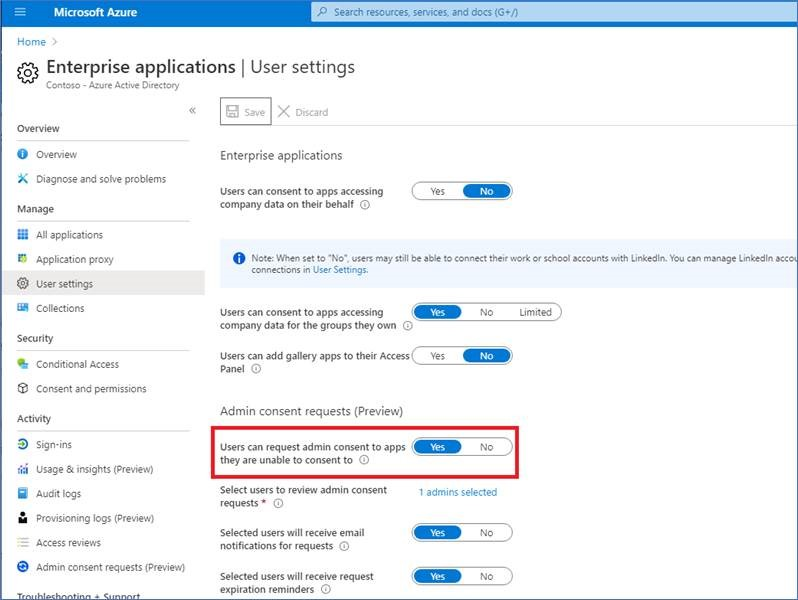
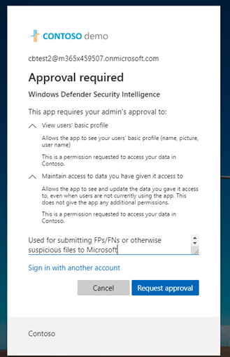
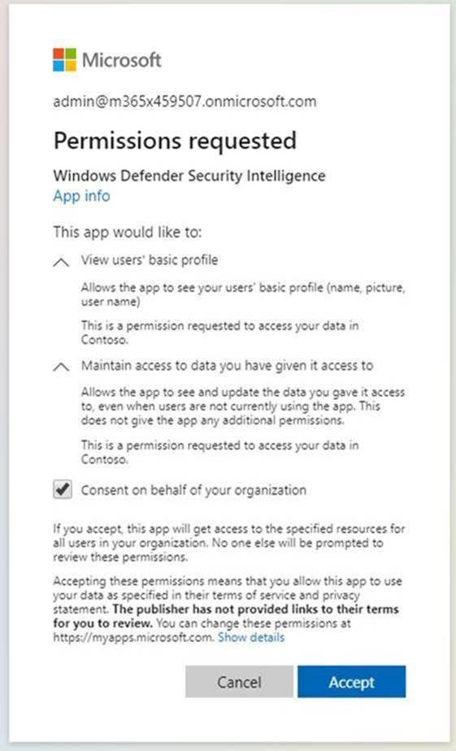
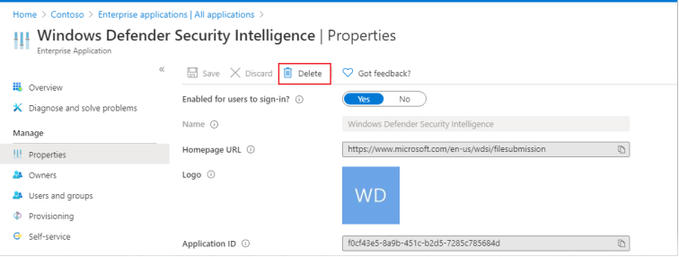
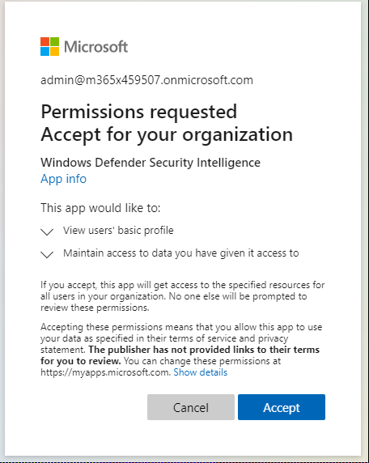
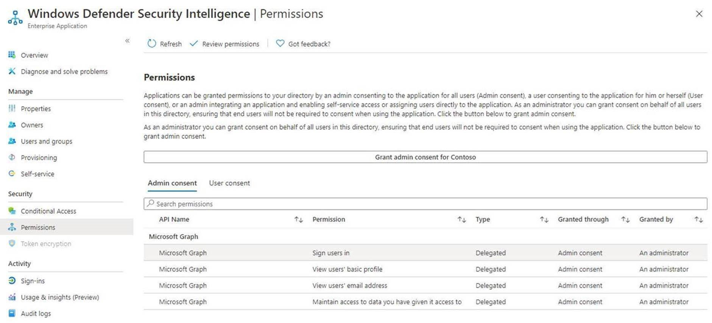

# Resolving malware submission errors caused by Administrator block
In some instances, an administrator block might cause submission issues when you try to submit a potentially infected file to the [Microsoft Security intelligence website](https://www.microsoft.com/wdsi) for analysis. The following process shows how to resolve this.

## Review your settings
Open your Azure [Enterprise application settings](https://portal.azure.com/#blade/Microsoft_AAD_IAM/StartboardApplicationsMenuBlade/UserSettings/menuId/). Under **Enterprise Applications** >  **Users can consent to apps accessing company data on their behalf**, check whether Yes or No is selected.

- If this is set to **No**,  an AAD administrator for the customer tenant will need to provide consent for the organization. Depending on the configuration with AAD, users might be able to submit a request right from the same dialog box. If there’s no option to ask for admin consent,  users need to request for these permissions to be added to their AAD admin. Go to the following section for more information.

- It this is set to **Yes**, ensure the Windows Defender Security Intelligence app setting **Enabled for users to sign-in?** is set to **Yes** [in Azure](https://portal.azure.com/#blade/Microsoft_AAD_IAM/ManagedAppMenuBlade/Properties/appId/f0cf43e5-8a9b-451c-b2d5-7285c785684d/objectId/4a918a14-4069-4108-9b7d-76486212d75d). If this is set to **No** you'll need to request an AAD admin enable it. 
  
## Implement Required Enterprise Application permissions 
This process requires a global or application admin in the tenant.
 1. Open [Enterprise Application settings](https://portal.azure.com/#blade/Microsoft_AAD_IAM/ManagedAppMenuBlade/Permissions/appId/f0cf43e5-8a9b-451c-b2d5-7285c785684d/objectId/4a918a14-4069-4108-9b7d-76486212d75d). 
 2. Click **Grant admin consent for organization**.
 3. If you're able to do so, Review the API permissions required for this application. This should be exactly the same as in the following image. Provide consent for the tenant.

  4. If the administrator receives an error while attempting to provide consent manually, try either [Option 1](#option-1-approve-enterprise-application-permissions-by-user-request) or [Option 2](#option-2-provide-admin-consent-by-authenticating-the-application-as-an-admin) as possible workarounds.
  
## Option 1 Approve enterprise application permissions by user request
> [!Note]
> This is currently a preview feature.

Azure Active Directory admins will need to allow for users to request admin consent to apps. Verify the setting is configured to **Yes** in [Enterprise applications](https://portal.azure.com/#blade/Microsoft_AAD_IAM/StartboardApplicationsMenuBlade/UserSettings/menuId/).

More information is available in [Configure Admin consent workflow](https://docs.microsoft.com/azure/active-directory/manage-apps/configure-admin-consent-workflow).

Once this setting is verified, users can go through the enterprise customer sign-in at [Microsoft security intelligence](https://www.microsoft.com/wdsi/filesubmission), and submit a request for admin consent, including justification.

Admin will be able to review and approve the application permissions [Azure admin consent requests](https://portal.azure.com/#blade/Microsoft_AAD_IAM/StartboardApplicationsMenuBlade/AccessRequests/menuId/).

After providing consent, all users in the tenant will be able to use the application.
  
## Option 2 Provide admin consent by authenticating the application as an admin 
This process requires that global admins go through the Enterprise customer sign-in flow at [Microsoft security intelligence](https://www.microsoft.com/wdsi/filesubmission).

Then, admins review the permissions and make sure to select **Consent on behalf of your organization**, and click **Accept**.

All users in the tenant will now be able to use this application.

## Option 3: Delete and re-add app permissions
If neither of these options resolve the issue, try the following steps (as an admin):

1. Remove previous configurations for the application. Go to [Enterprise applications](https://portal.azure.com/#blade/Microsoft_AAD_IAM/ManagedAppMenuBlade/Properties/appId/f0cf43e5-8a9b-451c-b2d5-7285c785684d/objectId/982e94b2-fea9-4d1f-9fca-318cda92f90b)
and click **delete**.

2. Capture TenantID from [Properties](https://portal.azure.com/#blade/Microsoft_AAD_IAM/ActiveDirectoryMenuBlade/Properties).

3. Replace {tenant-id} with the specific tenant that needs to grant consent to this application in the URL below. Copy this URL into browser. The rest of the parameters are already completed. 
``https://login.microsoftonline.com/{tenant-id}/v2.0/adminconsent?client_id=f0cf43e5-8a9b-451c-b2d5-7285c785684d&state=12345&redirect_uri=https%3a%2f%2fwww.microsoft.com%2fwdsi%2ffilesubmission&scope=openid+profile+email+offline_access``

4. Review the permissions required by the application, and then click **Accept**. 

5. Confirm the permissions are applied in the [Azure portal](https://portal.azure.com/#blade/Microsoft_AAD_IAM/ManagedAppMenuBlade/Permissions/appId/f0cf43e5-8a9b-451c-b2d5-7285c785684d/objectId/ce60a464-5fca-4819-8423-bcb46796b051).

4. Sign in to [Microsoft security intelligence](https://www.microsoft.com/wdsi/filesubmission) as an enterprise user with a non-admin account to see if you have access.

 If the warning is not resolved after following these troubleshooting steps, call Microsoft support.
