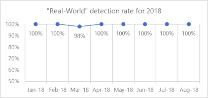
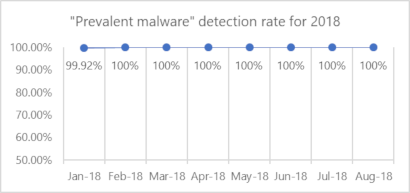

# Top scoring in industry tests

## **Endpoint detection & response**

The Windows Defender ATP endpoint detection and response capabilities provides near real-time actionable advance attacks detections, enables security analysts to effectively prioritize alerts, unfold the full scope of a breach and take response actions to remediate the threat.

When a threat is detected, alerts are be created in the system for an analyst to investigate. Alerts with the same attack techniques or attributed to the same attacker are aggregated into an entity called incident. Aggregating alerts in this manner makes it easy for analysts to collectively investigate and respond to threats.
  

## MITRE: industry-leading optics and detection capabilities

MITRE tested the ability of products to detect techniques commonly used by the targeted attack group APT3 (also known as Boron or UPS). To isolate detection capabilities, as part of the testing, all protection and prevention features were turned off. Microsoft is happy to be one of the first EDR vendors to sign up for the MITRE evaluation based on the ATT&CK framework, widely regarded today as the most comprehensive catalog of attacker techniques and tactics.

### ATT&CK-based evaluation: [Leading optics and detection capabilities](https://attackevals.mitre.org/) | [Analysis](https://cloudblogs.microsoft.com/microsoftsecure/2018/12/03/insights-from-the-mitre-attack-based-evaluation-of-windows-defender-atp/)

The breadth of telemetry, the strength of threat intelligence, and the advanced, automatic detection through machine learning, heuristics, and behavior monitoring delivered comprehensive coverage of attacker techniques across the entire attack chain.
  

## *Next generation protection*

[Windows Defender Antivirus](https://docs.microsoft.com/windows/security/threat-protection/windows-defender-antivirus/windows-defender-antivirus-in-windows-10?ocid=cx-docs-avreports) **consistently achieves high scores** in independent tests, displaying how it is a top choice in the antivirus market.

We want to be transparent and have gathered top industry reports that demonstrate our enterprise antivirus capabilities. Note that these tests only provide results for antivirus and do not test for additional security protections.

In the real world, millions of devices are protected from cyberattacks every day, sometimes [milliseconds after a campaign starts](https://cloudblogs.microsoft.com/microsoftsecure/2018/03/07/behavior-monitoring-combined-with-machine-learning-spoils-a-massive-dofoil-coin-mining-campaign?ocid=cx-docs-avreports). Windows Defender Antivirus is  part of the  [next generation](https://www.youtube.com/watch?v=Xy3MOxkX_o4) Windows Defender Advanced Threat Protection ([Windows Defender ATP](https://www.microsoft.com/WindowsForBusiness/windows-atp?ocid=cx-docs-avreports)) security stack which addresses the latest and most sophisticated threats today. In many cases, customers might not even know they were protected. That's because Windows Defender Antivirus detects and stops malware at first sight by using [machine learning](https://cloudblogs.microsoft.com/microsoftsecure/2018/06/07/machine-learning-vs-social-engineering?ocid=cx-docs-avreports), [artificial intelligence](https://cloudblogs.microsoft.com/microsoftsecure/2018/02/14/how-artificial-intelligence-stopped-an-emotet-outbreak?ocid=cx-docs-avreports), behavioral analysis, and other advanced technologies.
    

## AV-TEST: Protection score of 6.0/6.0 in the latest test

The AV-TEST Product Review and Certification Report tests on three categories: protection, performance, and usability. The scores listed below are for the Protection category which has two scores: Real-World Testing and the AV-TEST reference set (known as "Prevalent Malware").
> [!NOTE]
> [Download our latest analysis: Examining the AV-TEST July-August results](https://query.prod.cms.rt.microsoft.com/cms/api/am/binary/RE2IL3Y)

### September-October 2018 AV-TEST Business User test: [Protection score 6.0/6.0](https://www.av-test.org/en/antivirus/business-windows-client/windows-10/october-2018/microsoft-windows-defender-antivirus-4.18-184174/)

Windows Defender Antivirus achieved an overall Protection score of 6.0/6.0, with 21,568 malware samples tested.

### July-August 2018 AV-TEST Business User test: [Protection score 6.0/6.0](https://www.av-test.org/en/antivirus/business-windows-client/windows-10/august-2018/microsoft-windows-defender-antivirus-4.12--4.18-183212/) | [Analysis](https://query.prod.cms.rt.microsoft.com/cms/api/am/binary/RE2IL3Y)

 Windows Defender Antivirus achieved an overall Protection score of 6.0/6.0, detecting 100% of 20,022 malware samples. With the latest results, Windows Defender Antivirus has achieved 100% on 14 of the 16 most recent antivirus tests (combined "Real-World" and "Prevalent malware").

### May-June 2018 AV-TEST Business User test: [Protection score 6.0/6.0](https://www.av-test.org/en/antivirus/business-windows-client/windows-10/june-2018/microsoft-windows-defender-antivirus-4.12-182374/) | [Analysis](https://query.prod.cms.rt.microsoft.com/cms/api/am/binary/RE2v60I?ocid=cx-docs-avreports)

 Windows Defender Antivirus achieved an overall Protection score of 6.0/6.0, detecting 100% of 5,790 malware samples.

### March-April 2018 AV-TEST Business User test: [Protection score 5.5/6.0](https://www.av-test.org/en/antivirus/business-windows-client/windows-10/april-2018/microsoft-windows-defender-antivirus-4.12-181574/) | [Analysis](https://query.prod.cms.rt.microsoft.com/cms/api/am/binary/RE2ouJA?ocid=cx-docs-avreports)

 Windows Defender Antivirus achieved an overall Protection score of 5.5/6.0, missing 2 out of 5,680 malware samples (0.035% miss rate).

### January-February 2018 AV-TEST Business User test: [Protection score 6.0/6.0](https://www.av-test.org/en/antivirus/business-windows-client/windows-10/february-2018/microsoft-windows-defender-antivirus-4.12-180674/) | [Analysis](https://query.prod.cms.rt.microsoft.com/cms/api/am/binary/RE27O5A?ocid=cx-docs-avreports)

Windows Defender Antivirus achieved an overall Protection score of 6.0/6.0, with 5,105 malware samples tested.

|||
|---|---|
|||
  

## AV-Comparatives: Protection rating of 99.8% in the latest test

AV-Comparatives is an independent organization offering systematic testing for security software such as PC/Mac-based antivirus products and mobile security solutions.

### Real-World Protection Test August - September (Enterprise): [Protection Rate 99.8%](https://www.av-comparatives.org/tests/real-world-protection-test-enterprise-august-september-2018-testresult/) **Latest**

This test, as defined by AV-Comparatives, attempts to assess the effectiveness of each security program to protect a computer against active malware threats while online.
The test set contained 599 test cases (such as malicious URLs).

### Malware Protection Test August 2018 (Enterprise): [Protection Rate 99.9%](https://www.av-comparatives.org/tests/malware-protection-test-enterprise-august-2018-testresult/)

This test, as defined by AV-Comparatives, attempts to assesses a security program’s ability to protect a system against infection by malicious files before, during or after execution. The results are based on testing against 1,556 malware samples.

### Real-World Protection Test March - June (Enterprise): [Protection Rate 98.7%](https://www.av-comparatives.org/tests/real-world-protection-test-enterprise-march-june-2018-testresult/)

The test set contained 1,163 test cases (such as malicious URLs).

### Malware Protection Test March 2018 (Enterprise): [Protection Rate 99.9%](https://www.av-comparatives.org/tests/malware-protection-test-enterprise-march-2018-testresult/)

For this test, 1,470 recent malware samples were used.

[Historical AV-Comparatives Microsoft tests](https://www.av-comparatives.org/vendors/microsoft/)
  
  

## SE Labs: Total accuracy rating of AAA in the latest test

SE Labs tests a range of solutions used by products and services to detect and/or protect against attacks, including endpoint software, network appliances, and cloud services.

### Enterprise Endpoint Protection July - September 2018: [AAA award](https://selabs.uk/download/enterprise/epp/2018/jul-sep-2018-enterprise.pdf) **pdf**

Microsoft's next-gen protection was named as one of the most effective products, stopping all public and targeted attacks. It showcased its ability to block malicious URLs, deal with exploits, and classify legitimate apps and websites correctly.

### Enterprise Endpoint Protection April - June 2018: [AAA award](https://selabs.uk/download/enterprise/epp/2018/apr-jun-2018-enterprise.pdf) **pdf**

Microsoft's next-gen protection was named as one of the most effective products, stopping all targeted attacks and the vast majority of public threats.

## To what extent are tests representative of protection in the real world?

It is important to remember that Microsoft sees a wider and broader set of threats beyond what’s tested in the antivirus evaluations highlighted above. Windows Defender Antivirus encounters ~200 million samples every month, and the typical antivirus test consists of between 100-5,000 samples. The vastness of the malware landscape makes it extremely difficult to evaluate the quality of protection against real world threats.

The capabilities within [Windows Defender ATP](https://www.microsoft.com/WindowsForBusiness/windows-atp?ocid=cx-docs-avreports) also provide [additional layers of protection](https://cloudblogs.microsoft.com/microsoftsecure/2017/12/11/detonating-a-bad-rabbit-windows-defender-antivirus-and-layered-machine-learning-defenses?ocid=cx-docs-avreports) that are not factored into industry tests. These technologies address some of the latest and most sophisticated threats. Isolating AV from the rest of Windows Defender ATP creates a partial picture of how our security stack operates in the real world. For example, attack surface reduction and endpoint detection & response capabilities can help prevent malware from getting onto devices in the first place. We have proven that Windows Defender ATP components [catch samples that Windows Defender Antivirus missed](https://query.prod.cms.rt.microsoft.com/cms/api/am/binary/RE2ouJA?ocid=cx-docs-avreports) in these industry tests, which is more representative of how effectively our security suite protects customers in the real world.

Using independent tests, customers can view one aspect of their security suite but can't assess the complete protection of all the security features. Microsoft is highly engaged in working with several independent testers to evolve security testing to focus on the end-to-end security stack. In the meantime, customers can evaluate Windows Defender Advanced Threat Protection in their own networks by signing up for a [90-day trial of Windows Defender ATP](https://www.microsoft.com/windowsforbusiness/windows-atp?ocid=cx-docs-avreports), or [enabling Preview features on existing tenants](https://docs.microsoft.com/windows/security/threat-protection/windows-defender-atp/preview-settings-windows-defender-advanced-threat-protection?ocid=cx-docs-avreports).

