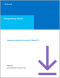
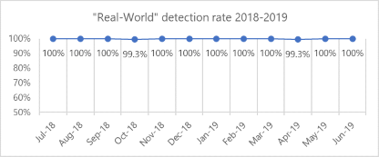
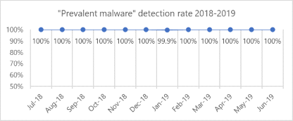
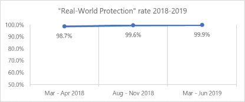

# Top scoring in industry tests

Microsoft Defender Advanced Threat Protection ([Microsoft Defender ATP](https://www.microsoft.com/en-us/WindowsForBusiness/windows-atp?ocid=cx-docs-avreports)) technologies consistently achieve high scores in independent tests, demonstrating the strength of its enterprise threat protection capabilities. Microsoft aims to be transparent about these test scores. This page summarizes the results and provides analysis.

## Next generation protection

[Windows Defender Antivirus](https://docs.microsoft.com/windows/security/threat-protection/windows-defender-antivirus/windows-defender-antivirus-in-windows-10?ocid=cx-docs-avreports) consistently performs highly in independent tests, displaying how it is a top choice in the antivirus market. Note that these tests only provide results for antivirus and do not test for additional security protections.

Windows Defender Antivirus is  part of the  [next generation](https://www.youtube.com/watch?v=Xy3MOxkX_o4) Microsoft Defender ATP security stack which addresses the latest and most sophisticated threats today. In some cases, customers might not even know they were protected because a cyberattack is stopped [milliseconds after a campaign starts](https://cloudblogs.microsoft.com/microsoftsecure/2018/03/07/behavior-monitoring-combined-with-machine-learning-spoils-a-massive-dofoil-coin-mining-campaign?ocid=cx-docs-avreports). That's because Windows Defender Antivirus detects and stops malware at first sight by using [machine learning](https://cloudblogs.microsoft.com/microsoftsecure/2018/06/07/machine-learning-vs-social-engineering?ocid=cx-docs-avreports), [artificial intelligence](https://cloudblogs.microsoft.com/microsoftsecure/2018/02/14/how-artificial-intelligence-stopped-an-emotet-outbreak?ocid=cx-docs-avreports), behavioral analysis, and other advanced technologies.
  

 **Download the latest transparency report: [Examining industry test results, May 2019](https://query.prod.cms.rt.microsoft.com/cms/api/am/binary/RE33cdd)**

### AV-TEST: Protection score of 6.0/6.0 in the latest test

The AV-TEST Product Review and Certification Report tests on three categories: protection, performance, and usability. The scores listed below are for the Protection category which has two scores: Real-World Testing and the AV-TEST reference set (known as "Prevalent Malware").

- May - June 2019 AV-TEST Business User test: [Protection score 6.0/6.0](https://www.av-test.org/en/antivirus/business-windows-client/windows-10/june-2019/microsoft-windows-defender-antivirus-4.18-192415/) **Latest**

    Windows Defender Antivirus achieved an overall Protection score of 6.0/6.0, detecting 100% of 2,735 malware samples used. This is the seventh consecutive cycle that Windows Defender Antivirus achieved a perfect Protection score.

- March - April 2019 AV-TEST Business User test: [Protection score 6.0/6.0](https://www.av-test.org/en/antivirus/business-windows-client/windows-10/april-2019/microsoft-windows-defender-antivirus-4.18-191517/)

- January - February 2019 AV-TEST Business User test: [Protection score 6.0/6.0](https://www.av-test.org/en/antivirus/business-windows-client/windows-10/february-2019/microsoft-windows-defender-antivirus-4.18-190611/) | [Analysis](https://query.prod.cms.rt.microsoft.com/cms/api/am/binary/RE33cdd)

- November - December 2018 AV-TEST Business User test: [Protection score 6.0/6.0](https://www.av-test.org/en/antivirus/business-windows-client/windows-10/december-2018/microsoft-windows-defender-antivirus-4.18-185074/) | [Analysis](https://query.prod.cms.rt.microsoft.com/cms/api/am/binary/RWusR9)

- September - October 2018 AV-TEST Business User test: [Protection score 6.0/6.0](https://www.av-test.org/en/antivirus/business-windows-client/windows-10/october-2018/microsoft-windows-defender-antivirus-4.18-184174/) | [Analysis](https://query.prod.cms.rt.microsoft.com/cms/api/am/binary/RWqOqD)

- July - August 2018 AV-TEST Business User test: [Protection score 6.0/6.0](https://www.av-test.org/en/antivirus/business-windows-client/windows-10/august-2018/microsoft-windows-defender-antivirus-4.12--4.18-183212/) | [Analysis](https://query.prod.cms.rt.microsoft.com/cms/api/am/binary/RE2IL3Y)

|||
|---|---|
|||

### AV-Comparatives: Protection rating of 99.9% in the latest test

Business Security Test consists of three main parts: the Real-World Protection Test which mimics online malware attacks, the Malware Protection Test where the malware enters the system from outside the internet (e.g. USB), and the Performance Test which looks at the impact on the system’s performance.

- Business Security Test 2019 (March - June): [Real-World Protection Rate 99.9%](https://www.av-comparatives.org/tests/business-security-test-2019-march-june/) **Latest**

    Windows Defender Antivirus has consistently improved in Real-World Protection Rates over the past year, with 99.9% in the latest test.

- Business Security Test 2018 (August - November): [Real-World Protection Rate 99.6%](https://www.av-comparatives.org/tests/business-security-test-2018-august-november/)

- Business Security Test 2018 (March - June): [Real-World Protection Rate 98.7%](https://www.av-comparatives.org/tests/business-security-test-2018-march-june/)

### SE Labs: Total accuracy rating of AAA in the latest test

SE Labs tests a range of solutions used by products and services to detect and/or protect against attacks, including endpoint software, network appliances, and cloud services.

- Enterprise Endpoint Protection April - June 2019: [AAA award](https://selabs.uk/download/enterprise/epp/2019/apr-jun-2019-enterprise.pdf) **pdf**

    Microsoft's next-gen protection was named as one of the leading products, stopping all of the targeted attacks and all but one public threat. It also handled the legitimate applications correctly.

- Enterprise Endpoint Protection January - March 2019: [AAA award](https://selabs.uk/download/enterprise/epp/2019/jan-mar-2019-enterprise.pdf) **pdf**

- Enterprise Endpoint Protection October - December 2018: [AAA award](https://selabs.uk/download/enterprise/epp/2018/oct-dec-2018-enterprise.pdf) | [Analysis](https://query.prod.cms.rt.microsoft.com/cms/api/am/binary/RE33cdd) **pdf**

- Enterprise Endpoint Protection July - September 2018: [AAA award](https://selabs.uk/download/enterprise/epp/2018/jul-sep-2018-enterprise.pdf) **pdf**

## Endpoint detection & response

Microsoft Defender ATP [endpoint detection and response](https://docs.microsoft.com/windows/security/threat-protection/microsoft-defender-atp/overview-endpoint-detection-response) capabilities provide advanced attack detections that are near real-time and actionable. Security analysts can prioritize alerts effectively, gain visibility into the full scope of a breach, and take response actions to remediate threats.

### MITRE: Industry-leading optics and detection capabilities

MITRE tested the ability of products to detect techniques commonly used by the targeted attack group APT3 (also known as Boron or UPS). To isolate detection capabilities, all protection and prevention features were turned off. Microsoft is happy to be one of the first EDR vendors to sign up for the MITRE evaluation based on the ATT&CK framework, widely regarded today as the most comprehensive catalog of attacker techniques and tactics.

- ATT&CK-based evaluation: [Leading optics and detection capabilities](https://www.microsoft.com/security/blog/2018/12/03/insights-from-the-mitre-attack-based-evaluation-of-windows-defender-atp/) | [Analysis](https://techcommunity.microsoft.com/t5/Windows-Defender-ATP/MITRE-evaluation-highlights-industry-leading-EDR-capabilities-in/ba-p/369831)

    Microsoft Defender ATP delivered comprehensive coverage of attacker techniques across the entire attack chain. Highlights included the breadth of telemetry, the strength of threat intelligence, and the advanced, automatic detection through machine learning, heuristics, and behavior monitoring.

## To what extent are tests representative of protection in the real world?

It is important to remember that Microsoft sees a wider and broader set of threats beyond what’s tested in the evaluations highlighted above. For example, in an average month, we identify over 100 million new threats.  Even if an independent tester can acquire and test 1% of those threats, that is a million tests across 20 or 30 products. In other words, the vastness of the malware landscape makes it extremely difficult to evaluate the quality of protection against real world threats.

The capabilities within [Microsoft Defender ATP](https://www.microsoft.com/en-us/windowsforbusiness?ocid=cx-docs-avreports) provide [additional layers of protection](https://cloudblogs.microsoft.com/microsoftsecure/2017/12/11/detonating-a-bad-rabbit-windows-defender-antivirus-and-layered-machine-learning-defenses?ocid=cx-docs-avreports) that are not factored into industry antivirus tests, and address some of the latest and most sophisticated threats. Isolating AV from the rest of Microsoft Defender ATP creates a partial picture of how our security stack operates in the real world. For example, attack surface reduction and endpoint detection & response capabilities can help prevent malware from getting onto devices in the first place. We have proven that [Microsoft Defender ATP components catch samples](https://query.prod.cms.rt.microsoft.com/cms/api/am/binary/RE2ouJA?ocid=cx-docs-avreports) that Windows Defender Antivirus missed in these industry tests, which is more representative of how effectively our security suite protects customers in the real world.

Using independent tests, customers can view one aspect of their security suite but can't assess the complete protection of all the security features. Microsoft is highly engaged in working with several independent testers to evolve security testing to focus on the end-to-end security stack. In the meantime, customers can evaluate Microsoft Defender Advanced Threat Protection in their own networks by signing up for a [90-day trial of Microsoft Defender ATP](https://www.microsoft.com/en-us/WindowsForBusiness/windows-atp?ocid=cx-docs-avreports), or [enabling Preview features on existing tenants](https://docs.microsoft.com/windows/security/threat-protection/windows-defender-atp/preview-settings-windows-defender-advanced-threat-protection?ocid=cx-docs-avreports).
