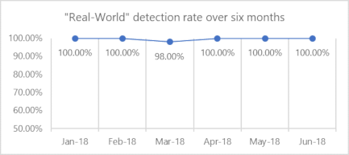
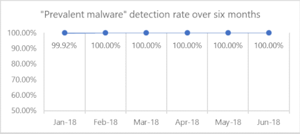

# Top scoring in industry antivirus tests

[Windows Defender Antivirus](https://docs.microsoft.com/windows/security/threat-protection/windows-defender-antivirus/windows-defender-antivirus-in-windows-10?ocid=cx-docs-avreports) **consistently achieves high scores** from independent tests, displaying how it is a top choice in the antivirus market.

We want to be transparent and have gathered top industry reports that demonstrate our enterprise antivirus capabilities. Note that these tests only provide results for antivirus and do not test for additional security protections.

In the real world, millions of devices are protected from cyberattacks every day, sometimes [milliseconds after a campaign starts](https://cloudblogs.microsoft.com/microsoftsecure/2018/03/07/behavior-monitoring-combined-with-machine-learning-spoils-a-massive-dofoil-coin-mining-campaign?ocid=cx-docs-avreports). In many cases, customers might not even know they were protected. That's because Windows Defender Advanced Threat Protection ([Windows Defender ATP](https://www.microsoft.com/WindowsForBusiness/windows-atp?ocid=cx-docs-avreports)) [next generation protection](https://www.youtube.com/watch?v=Xy3MOxkX_o4) detects and stops malware at first sight by using predictive technologies, [machine learning](https://cloudblogs.microsoft.com/microsoftsecure/2018/06/07/machine-learning-vs-social-engineering?ocid=cx-docs-avreports), [artificial intelligence](https://cloudblogs.microsoft.com/microsoftsecure/2018/02/14/how-artificial-intelligence-stopped-an-emotet-outbreak?ocid=cx-docs-avreports), behavioral analysis, and other advanced technologies.

> [!TIP]
> Learn why [Windows Defender Antivirus is the most deployed in the enterprise](https://cloudblogs.microsoft.com/microsoftsecure/2018/03/22/why-windows-defender-antivirus-is-the-most-deployed-in-the-enterprise?ocid=cx-docs-avreports).

    

## AV-TEST: Perfect protection score of 6.0/6.0 in the latest test

**[Analysis of the latest AV-TEST results](https://query.prod.cms.rt.microsoft.com/cms/api/am/binary/RE2v60I?ocid=cx-docs-avreports)**

The AV-TEST Product Review and Certification Report tests on three categories: protection, performance, and usability. The scores listed below are for the protection category which has two scores: real world testing and the AV-TEST reference set (known as "prevalent malware").

**Real-World testing** as defined by AV-TEST attempts to test protection against zero-day malware attacks, inclusive of web and email threats.

**Prevalent malware** as defined by AV-TEST attempts to test detection of widespread and prevalent malware discovered in the last four weeks.

The below scores are the results of AV-TEST's evaluations on **Windows Defender Antivirus**.

|Month (2018)|Real-World test score| Prevalent malware test score | AV-TEST report| Microsoft analysis|
|---|---|---|---|---|
|January| 100.00%| 99.92%| [Report (Jan-Feb)](https://www.av-test.org/en/antivirus/business-windows-client/windows-10/february-2018/microsoft-windows-defender-antivirus-4.12-180674/)| [Analysis (Jan-Feb)](https://query.prod.cms.rt.microsoft.com/cms/api/am/binary/RE27O5A?ocid=cx-docs-avreports)|
|February| 100.00% | 100.00%|[Report (Jan-Feb)](https://www.av-test.org/en/antivirus/business-windows-client/windows-10/february-2018/microsoft-windows-defender-antivirus-4.12-180674/)| [Analysis (Jan-Feb)](https://query.prod.cms.rt.microsoft.com/cms/api/am/binary/RE27O5A?ocid=cx-docs-avreports)|
March |98.00%| 100.00%|[Report (Mar-Apr)](https://www.av-test.org/en/antivirus/business-windows-client/windows-10/april-2018/microsoft-windows-defender-antivirus-4.12-181574/)|[Analysis (Mar-Apr)](https://query.prod.cms.rt.microsoft.com/cms/api/am/binary/RE2ouJA?ocid=cx-docs-avreports)|
April|100.00%| 100.00%|[Report (Mar-Apr)](https://www.av-test.org/en/antivirus/business-windows-client/windows-10/april-2018/microsoft-windows-defender-antivirus-4.12-181574/)|[Analysis (Mar-Apr)](https://query.prod.cms.rt.microsoft.com/cms/api/am/binary/RE2ouJA?ocid=cx-docs-avreports)|
May|100.00%| 100.00%| [Report (May-Jun)](https://www.av-test.org/en/antivirus/business-windows-client/windows-10/june-2018/microsoft-windows-defender-antivirus-4.12-182374/) |[Analysis (May-Jun)](https://query.prod.cms.rt.microsoft.com/cms/api/am/binary/RE2v60I?ocid=cx-docs-avreports)  **Latest**|
June|100.00%| 100.00%| [Report (May-Jun)](https://www.av-test.org/en/antivirus/business-windows-client/windows-10/june-2018/microsoft-windows-defender-antivirus-4.12-182374/)|[Analysis (May-Jun)](https://query.prod.cms.rt.microsoft.com/cms/api/am/binary/RE2v60I?ocid=cx-docs-avreports) **Latest**|

|||
|---|---|
|||
  

## AV-Comparatives: Perfect protection rating of 100% in the latest test

AV-Comparatives is an independent organization offering systematic testing for security software such as PC/Mac-based antivirus products and mobile security solutions.

### Real-World Protection Test July (consumer): [Protection Rate 100%](https://www.av-comparatives.org/tests/real-world-protection-test-july-2018-factsheet/)

Tested Microsoft Windows Defender 4.18

The results are based on testing against 186 malicious URLs that have working exploits or point directly to malware.

### Real-World Protection Test March - June (enterprise): [Protection Rate 98.7%](https://www.av-comparatives.org/tests/real-world-protection-test-enterprise-march-june-2018-testresult/)

Tested Microsoft Windows Defender for Enterprise with Intune 4.12 | 4.12 | 4.14 | 4.16

This test, as defined by AV-Comparatives, attempts to assess the effectiveness of each security program to protect a computer against active malware threats while online.

 The results are based on a testing against 1163 cases from March-June.

### Malware Protection Test Enterprise March 2018: [Protection Rate 99.9%](https://www.av-comparatives.org/tests/malware-protection-test-enterprise-march-2018-testresult/)

Tested Microsoft Windows Defender for Enterprise 4.12 | 4.12

This test, as defined by AV-Comparatives, attempts to assesses a security program’s ability to protect a system against infection by malicious files before, during or after execution.

1,470 recent malware samples were used.

### Other tests

[Business Security Test 2018 (March – June)](https://www.av-comparatives.org/tests/business-security-test-2018-march-june/#management-summary): Containing Real-World Protection, Malware Protection and Performance Tests & Product Reviews

[Historical AV-Comparatives Microsoft tests](https://www.av-comparatives.org/vendors/microsoft/)

## To what extent are tests representative of protection in the real world?

It is important to remember that Microsoft sees a wider and broader set of threats beyond just what’s tested in the antivirus evaluations highlighted above. Windows Defender AV encounters a staggering ~200 million samples every month, and the typical antivirus test consist of ~100 samples. The vastness of the malware landscape makes it extremely difficult to evaluate the quality of protection against real world threats. 
 
The capabilities within [Windows Defender ATP](https://www.microsoft.com/WindowsForBusiness/windows-atp?ocid=cx-docs-avreports) also provide [additional layers of protection](https://cloudblogs.microsoft.com/microsoftsecure/2017/12/11/detonating-a-bad-rabbit-windows-defender-antivirus-and-layered-machine-learning-defenses?ocid=cx-docs-avreports) that are not factored into antivirus tests.  There are other technologies in nearly every endpoint security suite not represented in antivirus tests that address some of the latest and most sophisticated threats. Isolating AV from the rest of the Windows Defender ATP stack discounts the synergy among components and creates conditions that don’t reflect the real world. For example, the capabilities such as attack surface reduction and endpoint detection & response help prevent malware from getting onto devices in the first place. For more information, check out [Microsoft's transparency report of AV-TEST results](https://query.prod.cms.rt.microsoft.com/cms/api/am/binary/RE2ouJA?ocid=cx-docs-avreports).

Using these tests, customer can view one aspect of their security suite but can't assess the complete protection of all the security features.

Microsoft is highly engaged in working with several independent testers to evolve security testing to focus on the end-to-end security stack. In the meantime, customers can evaluate Windows Defender Advanced Threat Protection in their own networks by signing up for a [90-day trial of Windows Defender ATP](https://www.microsoft.com/windowsforbusiness/windows-atp?ocid=cx-docs-avreports), or [enabling Preview features on existing tenants](https://docs.microsoft.com/windows/security/threat-protection/windows-defender-atp/preview-settings-windows-defender-advanced-threat-protection?ocid=cx-docs-avreports).

