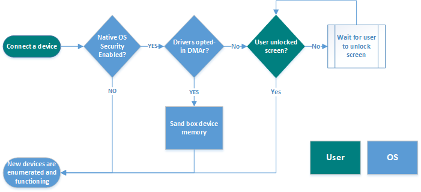

# Kernel DMA protection for Thunderbolt™ 3

Some bus types (such as PCI, Thunderbolt™3, ExpressCard, 1394, and so on) support Direct Memory Access (DMA). 
DMA-enabled buses can directly read and write to arbitrary physical memory addresses (that is, all of RAM). 
While this facilitates performance, it introduces security concerns as it can provide maliciously-constructed or compromised devices with the ability to read system secrets or modify system code and& data. 
So-called “DMA attacks” were popularized in 2004 but faded in recent times as DMA-capable external ports disappeared from laptops with the rise of USB. 
With the increasing popularity of Thunderbolt™ 3 hosts and peripherals, industry experts are exploring new possible physical DMA attack vectors via these ports.

Beginning in 2013, Intel added incremental capabilities to Thunderbolt technology to reduce DMA exposure. 
When the host is properly configured with these capabilities, an end user would have to first approve the Thunderbolt peripheral when initially attached to the port, approved as either “Connect Only Once” or “Connect Always”. Although this methodology mitigates most Physical DMA attacks from un-authorized Thunderbolt devices, if a Thunderbolt device with a PCIe slot is approved as “Connect Always”, a physical “DMA attack” might still be possible, given the correct hardware and physical access to a previously approved Thunderbolt device with PCIe expandability (such as ae.g. PCIe slot or, ExpressCard). 
Although the “Connect Only Once” does provide additional mitigation from such attacks, it places an unwelcome burden on the end user who would be required to approve the device every time it’s connected.

In the Windows 10 version 1803 release, Microsoft introduced a native OS solution for protecting PCs against drive-by DMA attacks via Thunderbolt™ 3 enabled ports called *kernel DMA protection*. 
Drive-by DMA attacks are attacks that can be performed in less the 10 minutes, with off-the-shelf equipment costing less than $1,000, that do not require disassembly of the PC chassis. 
Without protection, a drive-by DMA attacker could dump or overwrite the entire memory of the system, inject malware, or even short-circuit the login algorithm to gain full access to the PC being attacked.

Kernel DMA protection for Thunderbolt™ 3 will only be available for new systems that ship beginning with Windows 10 version 1803, as it requires changes in the system firmware/BIOS.

## Threat model for DMA attacks

The threat model for DMA attacks currently focuses on readily available, externally accessible ports on systems that are not physically secured. 
The attacker is expected to have a malicious deviceit could spoof any hardware ID, generate arbitrary bus cycles, ignores its own control registers (for example, PCI BusMasterEnable, 1394 PhysicalRequestFilters, and so on).

Internal ports that require opening the case, revealing other hardware such as RAM, flash, or storage media, are not in scope. 
Access to these components by a persistent, motivated attacker with physical access exposes a sophisticated attack surface whose protection is not addressed by Kernel DMA protection.

## Thunderbolt™ 3 OS Security Overview

Kernel DMA protection for Thunderbolt™ 3 hosts/PCs will rely on the system IOMMU to prevent drive-by DMA attacks. 
Using the system IOMMU will help the OS:

1.	Block all newly attached Thunderbolt™ 3 devices from starting and performing DMA until an authorized user is logged in and the screen is unlocked.
2.	Sandbox memory allocated to DMA remapping (DMAr) compatible device drivers, which allows the OS to enumerate and start DMAr compatible devices regardless of the lock screen state (that is, plug and use immediately), which significantly improves user experience and enhances the overall system security.

This feature will only be available for Intel x64 platforms beginning with Windows 10 version 1803. 

## Experience

Kernel DMA protection for Thunderbolt™ 3 hosts/PCs will reduce the user interaction required to enumerate newly connected Thunderbolt™ 3 devices, thus bringing the overall experience one step closer to the USB experience. Kernel DMA protection will replace the existing Intel Thunderbolt™ 3 Security mechanism, which requires users to approve newly attached devices via UI popups, starting with Windows 10 version 1803.

The following diagram illustrates the flow of enumerating and starting of an attached Thunderbolt™ 3 peripheral:



## Driver requirements

For PCI Thunderbolt™ 3 devices that are required to function before the user signs in or unlocks the screen, the device driver must be DMAr compatible and must opt in to DMAr<sup>1</sup>.

To be DMAr compatible and to opt in to DMAr, the device driver must:

1. Only perform DMA using the Microsoft standard DMA interfaces:
   - [WDF Drivers](https://docs.microsoft.com/windows-hardware/drivers/ddi/content/wdfdmaenabler/)
   - [NDIS Drivers](https://docs.microsoft.com/windows-hardware/drivers/ddi/content/_netvista/)
   - [WDM Drivers](https://docs.microsoft.com/windows-hardware/drivers/ddi/content/index)
2. Opt -in to DMAr using the following INF directive: 
   ```inf
   [MyServiceInstall_AddReg]
   HKR,Parameters,DmaRemappingCompatible,0x00010001,1  

   ;1 = opt-in, 2 = opt-in only for external devices
   ```
3. Enable driver verifier with all standard settings when testing the driver.
   - Under driver verifier (for testing purposes), the INF directive #2, opt-in for external devices, is promoted to INF directive #1, opt-in.
4. Fully test driver functionality on an Intel x64 system, with VT-d enabled, using the latest build for Windows 10 version 1803. 

<sup>1</sup>DMA remapping is not supported for graphics devices and drivers in Windows 10 version 1803.

## Frequently asked questions

### Would my driver require major refactoring to opt in to DMAr? 

No, all drivers that are currently using the WDM, WDF or NDIS DMA APIs, listed in [Driver requirements](#driver-requirements), for DMA would require few changes, if any. The main change for these drivers would be to add an INF directive that would allow the OS sandbox the memory allocated for these drivers. 

### What is the expected behavior of DMAr incompatible devices?

DMAr incompatible devices will be blocked from starting if the device(s) was plugged in before an authorized user logs in, or while the screen is locked. Once the system is unlocked, the device driver will be started by the OS, and the device will continue to function normally until the system is rebooted, or the device is unplugged. The devices will continue to function normally, if the user locks the screen or logs out of the system.

### Do in-market systems support Kernel DMA protection for Thunderbolt™ 3?

In market systems, released with Windows 10 version 1709 or earlier, will not support Kernel DMA protection for Thunderbolt™ 3 after upgrading to Windows 10 version 1803, as this feature requires the BIOS/platform firmware changes and guarantees.

### Is it required for system firmware to protect against pre-boot DMA attacks?

Absolutely. 
If the system firmware/BIOS does not protect against pre-boot DMA attacks, then an attacker can simply reboot the system and inject malicious code or disable all IOMMU-based security features during boot up. 

### How can I check if my system supports Kernel DMA Protection?

In MSINFO32.exe, check whether **Kernel DMA Protection** is On or Off. If the current state is Off, and the Virtualization technology is also disabled in the firmware, then reboot the system into the BIOS settings, enable Virtualization technology in the BIOS settings and reboot the system. If the state of **Kernel DMA Protection** remains Off, then the system does not support this feature.


## How can I check if a certain driver supports DMA remapping?

DMA Remapping (DMAr) is per device driver basis, and not global to all the devices and drivers on a platform. To check if a specific driver is opted into DMA remapping, check the following Property GUID in the details tab of a device in device manager: 


If the value for the property is 0, 1, then DMAr is not enabled for this driver instance. 
If the value is 2, then the driver is opted into DMAr for this driver instance.

Please check the driver instance for the device you are testing. Some drivers may have varying values depending on the location of the device (internal vs. external).
