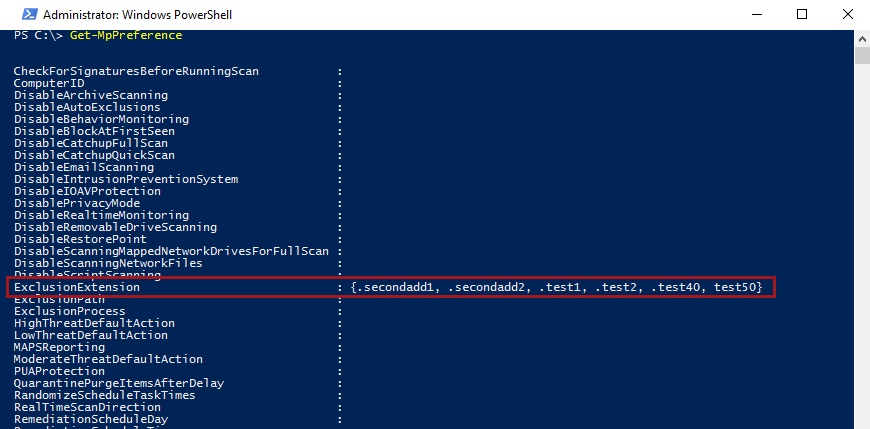
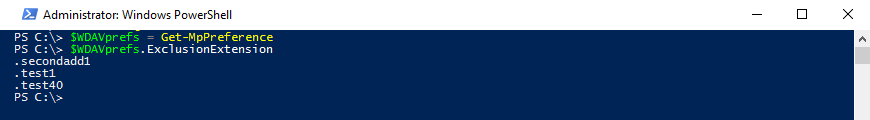

# Configure and validate exclusions based on file extension and folder location

**Applies to:**

- [Microsoft Defender Advanced Threat Protection (Microsoft Defender ATP)](https://go.microsoft.com/fwlink/p/?linkid=2069559)

> [!IMPORTANT]
> Microsoft Defender Antivirus exclusions don't apply to other Microsoft Defender ATP capabilities, including [endpoint detection and response (EDR)](../microsoft-defender-atp/overview-endpoint-detection-response.md), [attack surface reduction (ASR) rules](../microsoft-defender-atp/attack-surface-reduction.md), and [controlled folder access](../microsoft-defender-atp/controlled-folders.md). Files that you exclude using the methods described in this article can still trigger EDR alerts and other detections. To exclude files broadly, add them to the Microsoft Defender ATP [custom indicators](../microsoft-defender-atp/manage-indicators.md).

## Exclusion lists

You can exclude certain files from Microsoft Defender Antivirus scans by modifying exclusion lists. **Generally, you shouldn't need to apply exclusions**. Microsoft Defender Antivirus includes a number of automatic exclusions based on known operating system behaviors and typical management files, such as those used in enterprise management, database management, and other enterprise scenarios and situations.

> [!NOTE]
> Automatic exclusions apply only to Windows Server 2016 and above. These exclusions are not visible in the Windows Security app and in PowerShell.

This article  describes how to configure exclusion lists for the files and folders. See [Recommendations for defining exclusions](configure-exclusions-microsoft-defender-antivirus.md#recommendations-for-defining-exclusions) before defining your exclusion lists.

Exclusion | Examples | Exclusion list
---|---|---
Any file with a specific extension | All files with the specified extension, anywhere on the machine.<br/>Valid syntax: `.test` and `test`  | Extension exclusions
Any file under a specific folder | All files under the `c:\test\sample` folder | File and folder exclusions
A specific file in a specific folder | The file `c:\sample\sample.test` only | File and folder exclusions
A specific process | The executable file `c:\test\process.exe` | File and folder exclusions

Exclusion lists have the following characteristics:

- Folder exclusions apply to all files and folders under that folder, unless the subfolder is a reparse point. Reparse point subfolders must be excluded separately.
- File extensions apply to any file name with the defined extension if a path or folder is not defined.

>[!IMPORTANT]
>Using wildcards such as the asterisk (\*) will alter how the exclusion rules are interpreted. See the [Use wildcards in the file name and folder path or extension exclusion lists](#use-wildcards-in-the-file-name-and-folder-path-or-extension-exclusion-lists) section for important information about how wildcards work.
>
>You cannot exclude mapped network drives. You must specify the actual network path.
>
>Folders that are reparse points that are created after the Microsoft Defender Antivirus service starts and that have been added to the exclusion list will not be included. You must restart the service (by restarting Windows) for new reparse points to be recognized as a valid exclusion target.

To exclude files opened by a specific process, see [Configure and validate exclusions for files opened by processes](configure-process-opened-file-exclusions-microsoft-defender-antivirus.md).

The exclusions apply to [scheduled scans](scheduled-catch-up-scans-microsoft-defender-antivirus.md), [on-demand scans](run-scan-microsoft-defender-antivirus.md), and [real-time protection](configure-real-time-protection-microsoft-defender-antivirus.md).

>[!IMPORTANT]
>Exclusion list changes made with Group Policy **will show** in the lists in the [Windows Security app](microsoft-defender-security-center-antivirus.md#exclusions).
>
>Changes made in the Windows Security app **will not show** in the Group Policy lists.

By default, local changes made to the lists (by users with administrator privileges, including changes made with PowerShell and WMI) will be merged with the lists as defined (and deployed) by Group Policy, Configuration Manager, or Intune. The Group Policy lists take precedence when there are conflicts.

You can [configure how locally and globally defined exclusions lists are merged](configure-local-policy-overrides-microsoft-defender-antivirus.md#merge-lists) to allow local changes to override managed deployment settings.

## Configure the list of exclusions based on folder name or file extension

### Use Intune to configure file name, folder, or file extension exclusions

See the following articles:
- [Configure device restriction settings in Microsoft Intune](https://docs.microsoft.com/intune/device-restrictions-configure)
- [Microsoft Defender Antivirus device restriction settings for Windows 10 in Intune](https://docs.microsoft.com/intune/device-restrictions-windows-10#microsoft-defender-antivirus)

### Use Configuration Manager to configure file name, folder, or file extension exclusions

See [How to create and deploy antimalware policies: Exclusion settings](https://docs.microsoft.com/configmgr/protect/deploy-use/endpoint-antimalware-policies#exclusion-settings) for details on configuring Microsoft Endpoint Configuration Manager (current branch).

### Use Group Policy to configure folder or file extension exclusions

>[!NOTE]
>If you specify a fully qualified path to a file, then only that file is excluded. If a folder is defined in the exclusion, then all files and subdirectories under that folder are excluded.

1. On your Group Policy management computer, open the [Group Policy Management Console](https://technet.microsoft.com/library/cc731212.aspx), right-click the Group Policy Object you want to configure and click **Edit**.

2. In the **Group Policy Management Editor** go to **Computer configuration** and click **Administrative templates**.

3. Expand the tree to **Windows components > Microsoft Defender Antivirus > Exclusions**.

4. Double-click the **Path Exclusions** setting and add the exclusions.

    - Set the option to **Enabled**.
    - Under the **Options** section, click **Show...**.
    - Specify each folder on its own line under the **Value name** column.
    - If you are specifying a file, ensure you enter a fully qualified path to the file, including the drive letter, folder path, filename, and extension. Enter **0** in the **Value** column.

5. Click **OK**.

    

6. Double-click the **Extension Exclusions** setting and add the exclusions.

    - Set the option to **Enabled**.
    - Under the **Options** section, click **Show...**.
    - Enter each file extension on its own line under the **Value name** column.  Enter **0** in the **Value** column.

7. Click **OK**.

    

<a id="ps"></a>

### Use PowerShell cmdlets to configure file name, folder, or file extension exclusions

Using PowerShell to add or remove exclusions for files based on the extension, location, or file name requires using a combination of three cmdlets and the appropriate exclusion list parameter. The cmdlets are all in the [Defender module](https://technet.microsoft.com/itpro/powershell/windows/defender/defender).

The format for the cmdlets is as follows:

```PowerShell
<cmdlet> -<exclusion list> "<item>"
```

The following are allowed as the `<cmdlet>`:

Configuration action | PowerShell cmdlet
---|---
Create or overwrite the list | `Set-MpPreference`
Add to the list | `Add-MpPreference`
Remove item from the list | `Remove-MpPreference`

The following are allowed as the `<exclusion list>`:

Exclusion type | PowerShell parameter
---|---
All files with a specified file extension | `-ExclusionExtension`
All files under a folder (including files in subdirectories), or a specific file | `-ExclusionPath`

>[!IMPORTANT]
>If you have created a list, either with `Set-MpPreference` or `Add-MpPreference`, using the `Set-MpPreference` cmdlet again will overwrite the existing list.

For example, the following code snippet would cause Microsoft Defender AV scans to exclude any file with the `.test` file extension:

```PowerShell
Add-MpPreference -ExclusionExtension ".test"
```

For more information, see [Use PowerShell cmdlets to configure and run Microsoft Defender Antivirus](use-powershell-cmdlets-microsoft-defender-antivirus.md) and [Defender cmdlets](https://technet.microsoft.com/itpro/powershell/windows/defender/index).

### Use Windows Management Instruction (WMI) to configure file name, folder, or file extension exclusions

Use the [**Set**, **Add**, and **Remove** methods of the **MSFT_MpPreference**](https://msdn.microsoft.com/library/dn455323(v=vs.85).aspx) class for the following properties:

```WMI
ExclusionExtension
ExclusionPath
```

The use of **Set**, **Add**, and **Remove** is analogous to their counterparts in PowerShell: `Set-MpPreference`, `Add-MpPreference`, and `Remove-MpPreference`.

For more information, see [Windows Defender WMIv2 APIs](https://msdn.microsoft.com/library/dn439477(v=vs.85).aspx).

<a id="man-tools"></a>

### Use the Windows Security app to configure file name, folder, or file extension exclusions

See [Add exclusions in the Windows Security app](microsoft-defender-security-center-antivirus.md#exclusions) for instructions.

<a id="wildcards"></a>

## Use wildcards in the file name and folder path or extension exclusion lists

You can use the asterisk `*`, question mark `?`, or environment variables (such as `%ALLUSERSPROFILE%`) as wildcards when defining items in the file name or folder path exclusion list. The way in which these wildcards are interpreted differs from their usual usage in other apps and languages. Make sure to read this section to understand their specific limitations.

>[!IMPORTANT]
>There are key limitations and usage scenarios for these wildcards:
>
>- Environment variable usage is limited to machine variables and those applicable to processes running as an NT AUTHORITY\SYSTEM account.
>- You cannot use a wildcard in place of a drive letter.
>- An asterisk `*` in a folder exclusion stands in place for a single folder. Use multiple instances of `\*\` to indicate multiple nested folders with unspecified names.

The following table describes how the wildcards can be used and provides some examples.


|Wildcard  |Examples  |
|---------|---------|
|`*` (asterisk) <br/><br/>In **file name and file extension inclusions**, the asterisk replaces any number of characters, and only applies to files in the last folder defined in the argument. <br/><br/>In **folder exclusions**, the asterisk replaces a single folder. Use multiple `*` with folder slashes `\` to indicate multiple nested folders. After matching the number of wild carded and named folders, all subfolders are also included.   | `C:\MyData\*.txt` would include `C:\MyData\notes.txt`<br/><br/>`C:\somepath\*\Data` would include any file in `C:\somepath\Archives\Data and its subfolders` and `C:\somepath\Authorized\Data and its subfolders` <br/><br/>`C:\Serv\*\*\Backup` would include any file in `C:\Serv\Primary\Denied\Backup and its subfolders` and `C:\Serv\Secondary\Allowed\Backup and its subfolders`     |
|`?` (question mark)  <br/><br/>In **file name and file extension inclusions**, the question mark replaces a single character, and only applies to files in the last folder defined in the argument. <br/><br/>In **folder exclusions**, the question mark replaces a single character in a folder name. After matching the number of wild carded and named folders, all subfolders are also included.   |`C:\MyData\my` would include `C:\MyData\my1.zip` <br/><br/>`C:\somepath\?\Data` would include any file in `C:\somepath\P\Data` and its subfolders <br/><br/>`C:\somepath\test0?\Data` would include any file in `C:\somepath\test01\Data` and its subfolders          |
|Environment variables <br/><br/>The defined variable is populated as a path when the exclusion is evaluated.          |`%ALLUSERSPROFILE%\CustomLogFiles` would include `C:\ProgramData\CustomLogFiles\Folder1\file1.txt`         |
        

>[!IMPORTANT]
>If you mix a file exclusion argument with a folder exclusion argument, the rules will stop at the file argument match in the matched folder, and will not look for file matches in any subfolders.
>
>For example, you can exclude all files that start with "date" in the folders `c:\data\final\marked` and `c:\data\review\marked` by using the rule argument `c:\data\*\marked\date*`.
>
>This argument, however, will not match any files in subfolders under `c:\data\final\marked` or `c:\data\review\marked`.

<a id="review"></a>

### System environment variables

The following table lists and describes the system account environment variables. 

<table border="0" cellspacing="0" cellpadding="20">
<thead>
<tr>
<th valign="top">System environment variables</th>
<th valign="top">Will redirect to:</th>
</tr>
</thead><tbody>
<tr>
<td valign="top">%APPDATA%</td>
<td valign="top">C:\Users\UserName.DomainName\AppData\Roaming</td>
</tr>
<tr>
<td valign="top">%APPDATA%\Microsoft\Internet Explorer\Quick Launch</td>
<td valign="top">C:\Windows\System32\config\systemprofile\AppData\Roaming\Microsoft\Internet Explorer\Quick Launch</td>
</tr>
<tr>
<td valign="top">%APPDATA%\Microsoft\Windows\Start Menu</td>
<td valign="top">C:\Windows\System32\config\systemprofile\AppData\Roaming\Microsoft\Windows\Start Menu</td>
</tr>
<tr>
<td valign="top">%APPDATA%\Microsoft\Windows\Start Menu\Programs</td>
<td valign="top">C:\Windows\System32\config\systemprofile\AppData\Roaming\Microsoft\Windows\Start Menu\Programs</td>
</tr>
<tr>
<td valign="top">%LOCALAPPDATA% </td>
<td valign="top">C:\Windows\System32\config\systemprofile\AppData\Local</td>
</tr>
<tr>
<td valign="top">%ProgramData%</td>
<td valign="top">C:\ProgramData</td>
</tr>
<tr>
<td valign="top">%ProgramFiles%</td>
<td valign="top">C:\Program Files</td>
</tr>
<tr>
<td valign="top">%ProgramFiles%\Common Files </td>
<td valign="top">C:\Program Files\Common Files</td>
</tr>
<tr>
<td valign="top">%ProgramFiles%\Windows Sidebar\Gadgets </td>
<td valign="top">C:\Program Files\Windows Sidebar\Gadgets</td>
</tr>
<tr>
<td valign="top">%ProgramFiles%\Common Files</td>
<td valign="top">C:\Program Files\Common Files</td>
</tr>
<tr>
<td valign="top">%ProgramFiles(x86)% </td>
<td valign="top">C:\Program Files (x86)</td>
</tr>
<tr>
<td valign="top">%ProgramFiles(x86)%\Common Files </td>
<td valign="top">C:\Program Files (x86)\Common Files</td>
</tr>
<tr>
<td valign="top">%SystemDrive%</td>
<td valign="top">C:</td>
</tr>
<tr>
<td valign="top">%SystemDrive%\Program Files</td>
<td valign="top">C:\Program Files</td>
</tr>
<tr>
<td valign="top">%SystemDrive%\Program Files (x86) </td>
<td valign="top">C:\Program Files (x86)</td>
</tr>
<tr>
<td valign="top">%SystemDrive%\Users </td>
<td valign="top">C:\Users</td>
</tr>
<tr>
<td valign="top">%SystemDrive%\Users\Public</td>
<td valign="top">C:\Users\Public</td>
</tr>
<tr>
<td valign="top">%SystemRoot%</td>
<td valign="top"> C:\Windows</td>
</tr>
<tr>
<td valign="top">%windir%</td>
<td valign="top">C:\Windows</td>
</tr>
<tr>
<td valign="top">%windir%\Fonts</td>
<td valign="top">C:\Windows\Fonts</td>
</tr>
<tr>
<td valign="top">%windir%\Resources </td>
<td valign="top">C:\Windows\Resources</td>
</tr>
<tr>
<td valign="top">%windir%\resources\0409</td>
<td valign="top">C:\Windows\resources\0409</td>
</tr>
<tr>
<td valign="top">%windir%\system32</td>
<td valign="top">C:\Windows\System32</td>
</tr>
<tr>
<td valign="top">%ALLUSERSPROFILE%</td>
<td valign="top">C:\ProgramData</td>
</tr>
<tr>
<td valign="top">%ALLUSERSPROFILE%\Application Data</td>
<td valign="top">C:\ProgramData\Application Data</td>
</tr>
<tr>
<td valign="top">%ALLUSERSPROFILE%\Documents</td>
<td valign="top">C:\ProgramData\Documents</td>
</tr>
<tr>
<td valign="top">%ALLUSERSPROFILE%\Documents\My Music\Sample Music</td>
<td valign="top">
<p>C:\ProgramData\Documents\My Music\Sample Music</p>
<p>.</p>
</td>
</tr>
<tr>
<td valign="top">%ALLUSERSPROFILE%\Documents\My Music </td>
<td valign="top">C:\ProgramData\Documents\My Music</td>
</tr>
<tr>
<td valign="top">%ALLUSERSPROFILE%\Documents\My Pictures </td>
<td valign="top">
<p>C:\ProgramData\Documents\My Pictures
</p>
</td>
</tr>
<tr>
<td valign="top">%ALLUSERSPROFILE%\Documents\My Pictures\Sample Pictures </td>
<td valign="top">C:\ProgramData\Documents\My Pictures\Sample Pictures</td>
</tr>
<tr>
<td valign="top">%ALLUSERSPROFILE%\Documents\My Videos </td>
<td valign="top">C:\ProgramData\Documents\My Videos</td>
</tr>
<tr>
<td valign="top">%ALLUSERSPROFILE%\Microsoft\Windows\DeviceMetadataStore </td>
<td valign="top">C:\ProgramData\Microsoft\Windows\DeviceMetadataStore</td>
</tr>
<tr>
<td valign="top">%ALLUSERSPROFILE%\Microsoft\Windows\GameExplorer </td>
<td valign="top">C:\ProgramData\Microsoft\Windows\GameExplorer</td>
</tr>
<tr>
<td valign="top">%ALLUSERSPROFILE%\Microsoft\Windows\Ringtones </td>
<td valign="top">C:\ProgramData\Microsoft\Windows\Ringtones</td>
</tr>
<tr>
<td valign="top">%ALLUSERSPROFILE%\Microsoft\Windows\Start Menu </td>
<td valign="top">C:\ProgramData\Microsoft\Windows\Start Menu</td>
</tr>
<tr>
<td valign="top">%ALLUSERSPROFILE%\Microsoft\Windows\Start Menu\Programs </td>
<td valign="top">C:\ProgramData\Microsoft\Windows\Start Menu\Programs </td>
</tr>
<tr>
<td valign="top">%ALLUSERSPROFILE%\Microsoft\Windows\Start Menu\Programs\Administrative Tools</td>
<td valign="top">C:\ProgramData\Microsoft\Windows\Start Menu\Programs\Administrative Tools</td>
</tr>
<tr>
<td valign="top">%ALLUSERSPROFILE%\Microsoft\Windows\Start Menu\Programs\StartUp </td>
<td valign="top">C:\ProgramData\Microsoft\Windows\Start Menu\Programs\StartUp</td>
</tr>
<tr>
<td valign="top">%ALLUSERSPROFILE%\Microsoft\Windows\Templates </td>
<td valign="top">C:\ProgramData\Microsoft\Windows\Templates</td>
</tr>
<tr>
<td valign="top">%ALLUSERSPROFILE%\Start Menu </td>
<td valign="top">C:\ProgramData\Start Menu</td>
</tr>
<tr>
<td valign="top">%ALLUSERSPROFILE%\Start Menu\Programs </td>
<td valign="top">C:\ProgramData\Start Menu\Programs</td>
</tr>
<tr>
<td valign="top">%ALLUSERSPROFILE%\Start Menu\Programs\Administrative Tools </td>
<td valign="top">C:\ProgramData\Start Menu\Programs\Administrative Tools</td>
</tr>
<tr>
<td valign="top">%ALLUSERSPROFILE%\Templates </td>
<td valign="top">C:\ProgramData\Templates</td>
</tr>
<tr>
<td valign="top">%LOCALAPPDATA%\Microsoft\Windows\ConnectedSearch\Templates </td>
<td valign="top">C:\Windows\System32\config\systemprofile\AppData\Local\Microsoft\Windows\ConnectedSearch\Templates</td>
</tr>
<tr>
<td valign="top">%LOCALAPPDATA%\Microsoft\Windows\History </td>
<td valign="top">C:\Windows\System32\config\systemprofile\AppData\Local\Microsoft\Windows\History</td>
</tr>
<tr>
<td valign="top">
<p>
%PUBLIC% </p>
</td>
<td valign="top">C:\Users\Public</td>
</tr>
<tr>
<td valign="top">%PUBLIC%\AccountPictures </td>
<td valign="top">C:\Users\Public\AccountPictures</td>
</tr>
<tr>
<td valign="top">%PUBLIC%\Desktop </td>
<td valign="top">C:\Users\Public\Desktop</td>
</tr>
<tr>
<td valign="top">%PUBLIC%\Documents </td>
<td valign="top">C:\Users\Public\Documents</td>
</tr>
<tr>
<td valign="top">%PUBLIC%\Downloads </td>
<td valign="top">C:\Users\Public\Downloads</td>
</tr>
<tr>
<td valign="top">%PUBLIC%\Music\Sample Music </td>
<td valign="top">
<p>C:\Users\Public\Music\Sample Music</p>
<p>.</p>
</td>
</tr>
<tr>
<td valign="top">%PUBLIC%\Music\Sample Playlists </td>
<td valign="top">
<p>C:\Users\Public\Music\Sample Playlists</p>
<p>.</p>
</td>
</tr>
<tr>
<td valign="top">%PUBLIC%\Pictures\Sample Pictures </td>
<td valign="top">C:\Users\Public\Pictures\Sample Pictures</td>
</tr>
<tr>
<td valign="top">%PUBLIC%\RecordedTV.library-ms</td>
<td valign="top">C:\Users\Public\RecordedTV.library-ms</td>
</tr>
<tr>
<td valign="top">%PUBLIC%\Videos</td>
<td valign="top">C:\Users\Public\Videos</td>
</tr>
<tr>
<td valign="top">%PUBLIC%\Videos\Sample Videos</td>
<td valign="top">
<p>C:\Users\Public\Videos\Sample Videos</p>
<p>.</p>
</td>
</tr>
<tr>
<td valign="top">%USERPROFILE% </td>
<td valign="top">C:\Windows\System32\config\systemprofile</td>
</tr>
<tr>
<td valign="top">%USERPROFILE%\AppData\Local </td>
<td valign="top">C:\Windows\System32\config\systemprofile\AppData\Local</td>
</tr>
<tr>
<td valign="top">%USERPROFILE%\AppData\LocalLow </td>
<td valign="top">C:\Windows\System32\config\systemprofile\AppData\LocalLow</td>
</tr>
<tr>
<td valign="top">%USERPROFILE%\AppData\Roaming </td>
<td valign="top">C:\Windows\System32\config\systemprofile\AppData\Roaming</td>
</tr>
</tbody>
</table>


## Review the list of exclusions

You can retrieve the items in the exclusion list using one of the following methods:
- [Intune](https://docs.microsoft.com/intune/deploy-use/help-secure-windows-pcs-with-endpoint-protection-for-microsoft-intune)
- [Microsoft Endpoint Configuration Manager](https://docs.microsoft.com/configmgr/protect/deploy-use/endpoint-antimalware-policies#exclusion-settings)
- MpCmdRun
- PowerShell
- [Windows Security app](microsoft-defender-security-center-antivirus.md#exclusions)

>[!IMPORTANT]
>Exclusion list changes made with Group Policy **will show** in the lists in the [Windows Security app](microsoft-defender-security-center-antivirus.md#exclusions).
>
>Changes made in the Windows Security app **will not show** in the Group Policy lists.

If you use PowerShell, you can retrieve the list in two ways:

- Retrieve the status of all Microsoft Defender Antivirus preferences. Each of the lists are displayed on separate lines, but the items within each list are combined into the same line.
- Write the status of all preferences to a variable, and use that variable to only call the specific list you are interested in. Each use of `Add-MpPreference` is written to a new line.

### Validate the exclusion list by using MpCmdRun

To check exclusions with the dedicated [command-line tool mpcmdrun.exe](https://docs.microsoft.com/windows/security/threat-protection/microsoft-defender-antivirus/command-line-arguments-microsoft-defender-antivirus?branch=v-anbic-wdav-new-mpcmdrun-options), use the following command:

```DOS
Start, CMD (Run as admin)
cd "%programdata%\microsoft\windows defender\platform"
cd 4.18.1812.3 (Where 4.18.1812.3 is this month's MDAV "Platform Update".)
MpCmdRun.exe -CheckExclusion -path <path>
```

>[!NOTE]
>Checking exclusions with MpCmdRun requires Microsoft Defender Antivirus CAMP version 4.18.1812.3 (released in December 2018) or later.

### Review the list of exclusions alongside all other Microsoft Defender Antivirus preferences by using PowerShell

Use the following cmdlet:

```PowerShell
Get-MpPreference
```

In the following example, the items contained in the `ExclusionExtension` list are highlighted:



For more information, see [Use PowerShell cmdlets to configure and run Microsoft Defender Antivirus](use-powershell-cmdlets-microsoft-defender-antivirus.md) and [Defender cmdlets](https://technet.microsoft.com/itpro/powershell/windows/defender/index).

### Retrieve a specific exclusions list by using PowerShell

Use the following code snippet (enter each line as a separate command); replace **WDAVprefs** with whatever label you want to name the variable:

```PowerShell
$WDAVprefs = Get-MpPreference
$WDAVprefs.ExclusionExtension
$WDAVprefs.ExclusionPath
```

In the following example, the list is split into new lines for each use of the `Add-MpPreference` cmdlet:



For more information, see [Use PowerShell cmdlets to configure and run Microsoft Defender Antivirus](use-powershell-cmdlets-microsoft-defender-antivirus.md) and [Defender cmdlets](https://technet.microsoft.com/itpro/powershell/windows/defender/index).

<a id="validate"></a>

## Validate exclusions lists with the EICAR test file

You can validate that your exclusion lists are working by using PowerShell with either the `Invoke-WebRequest` cmdlet or the .NET WebClient class to download a test file.

In the following PowerShell snippet, replace *test.txt* with a file that conforms to your exclusion rules. For example, if you have excluded the `.testing` extension, replace `test.txt` with `test.testing`. If you are testing a path, ensure you run the cmdlet within that path.

```PowerShell
Invoke-WebRequest "http://www.eicar.org/download/eicar.com.txt" -OutFile "test.txt"
```

If Microsoft Defender Antivirus reports malware, then the rule is not working. If there is no report of malware and the downloaded file exists, then the exclusion is working. You can open the file to confirm the contents are the same as what is described on the [EICAR test file website](http://www.eicar.org/86-0-Intended-use.html).

You can also use the following PowerShell code, which calls the .NET WebClient class to download the test file - as with the `Invoke-WebRequest` cmdlet; replace *c:\test.txt* with a file that conforms to the rule you are validating:

```PowerShell
$client = new-object System.Net.WebClient
$client.DownloadFile("http://www.eicar.org/download/eicar.com.txt","c:\test.txt")
```

If you do not have Internet access, you can create your own EICAR test file by writing the EICAR string to a new text file with the following PowerShell command:

```PowerShell
[io.file]::WriteAllText("test.txt",'X5O!P%@AP[4\PZX54(P^)7CC)7}$EICAR-STANDARD-ANTIVIRUS-TEST-FILE!$H+H*')
```

You can also copy the string into a blank text file and attempt to save it with the file name or in the folder you are attempting to exclude.

## Related topics

- [Configure and validate exclusions in Microsoft Defender Antivirus scans](configure-exclusions-microsoft-defender-antivirus.md)
- [Configure and validate exclusions for files opened by processes](configure-process-opened-file-exclusions-microsoft-defender-antivirus.md)
- [Configure Microsoft Defender Antivirus exclusions on Windows Server](configure-server-exclusions-microsoft-defender-antivirus.md)
- [Common mistakes to avoid when defining exclusions](common-exclusion-mistakes-microsoft-defender-antivirus.md)
