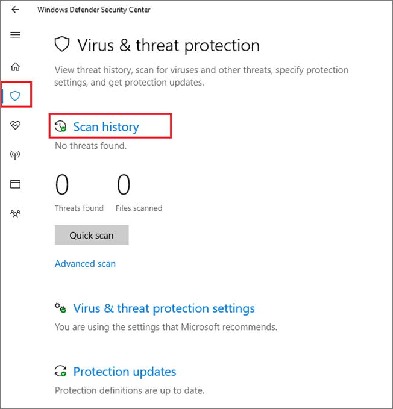

# Configure and validate Microsoft Defender Antivirus network connections

**Applies to:**

- [Microsoft Defender Advanced Threat Protection (Microsoft Defender ATP)](https://go.microsoft.com/fwlink/p/?linkid=2069559)

To ensure Microsoft Defender Antivirus cloud-delivered protection works properly, you need to configure your network to allow connections between your endpoints and certain Microsoft servers.

This article lists the connections that must be allowed, such as by using firewall rules, and provides instructions for validating your connection. Configuring your protection properly helps ensure that you receive the best value from your cloud-delivered protection services.

See the blog post [Important changes to Microsoft Active Protection Services endpoint](https://techcommunity.microsoft.com/t5/Configuration-Manager-Archive/Important-changes-to-Microsoft-Active-Protection-Service-MAPS/ba-p/274006) for some details about network connectivity.

>[!TIP]
>You can also visit the Microsoft Defender ATP demo website at [demo.wd.microsoft.com](https://demo.wd.microsoft.com?ocid=cx-wddocs-testground) to confirm the following features are working:
>
>- Cloud-delivered protection
>- Fast learning (including block at first sight)
>- Potentially unwanted application blocking

## Allow connections to the Microsoft Defender Antivirus cloud service

The Microsoft Defender Antivirus cloud service provides fast, strong protection for your endpoints. Enabling the cloud-delivered protection service is optional, however it is highly recommended because it provides important protection against malware on your endpoints and across your network.

>[!NOTE]
>The Microsoft Defender Antivirus cloud service is a mechanism for delivering updated protection to your network and endpoints. Although it is called a cloud service, it is not simply protection for files stored in the cloud, rather it uses distributed resources and machine learning to deliver protection to your endpoints at a rate that is far faster than traditional Security intelligence updates.

See [Enable cloud-delivered protection](enable-cloud-protection-microsoft-defender-antivirus.md) for details on enabling the service with Intune, Microsoft Endpoint Configuration Manager, Group Policy, PowerShell cmdlets, or on individual clients in the Windows Security app. 

After you've enabled the service, you may need to configure your network or firewall to allow connections between it and your endpoints.

Because your protection is a cloud service, computers must have access to the internet and reach the ATP machine learning services. Do not exclude the URL `*.blob.core.windows.net` from any kind of network inspection. 

The table below lists the services and their associated URLs. Make sure that there are no firewall or network filtering rules denying access to these URLs, or you may need to create an allow rule specifically for them (excluding the URL `*.blob.core.windows.net`). Below mention URLs are using port 443 for communication.


| **Service**| **Description** |**URL** |
| :--: | :-- | :-- |
| Microsoft Defender Antivirus cloud-delivered protection service, also referred to as Microsoft Active Protection Service (MAPS)|Used by Microsoft Defender Antivirus to provide cloud-delivered protection|`*.wdcp.microsoft.com` <br/> `*.wdcpalt.microsoft.com` <br/> `*.wd.microsoft.com`|
| Microsoft Update Service (MU) <br/> Windows Update Service (WU)|	Security intelligence and product updates	|`*.update.microsoft.com` <br/> `*.delivery.mp.microsoft.com`<br/> `*.windowsupdate.com` <br/><br/> For details see [Connection endpoints for Windows Update](https://docs.microsoft.com/windows/privacy/manage-windows-1709-endpoints#windows-update)|
|Security intelligence updates Alternate Download Location (ADL)|	Alternate location for Microsoft Defender Antivirus Security intelligence updates if the installed Security intelligence is out of date (7 or more days behind)|	`*.download.microsoft.com`  </br> `*.download.windowsupdate.com`</br> `https://fe3cr.delivery.mp.microsoft.com/ClientWebService/client.asmx`|
| Malware submission storage|Upload location for files submitted to Microsoft via the Submission form or automatic sample submission	| `ussus1eastprod.blob.core.windows.net` <br/>    `ussus1westprod.blob.core.windows.net` <br/>    `usseu1northprod.blob.core.windows.net` <br/>    `usseu1westprod.blob.core.windows.net` <br/>    `ussuk1southprod.blob.core.windows.net` <br/>    `ussuk1westprod.blob.core.windows.net` <br/>    `ussas1eastprod.blob.core.windows.net` <br/>    `ussas1southeastprod.blob.core.windows.net` <br/>    `ussau1eastprod.blob.core.windows.net` <br/>    `ussau1southeastprod.blob.core.windows.net` |
| Certificate Revocation List (CRL)|Used by Windows when creating the SSL connection to MAPS for updating the CRL	| `https://www.microsoft.com/pkiops/crl/` <br/> `https://www.microsoft.com/pkiops/certs` <br/>   `https://crl.microsoft.com/pki/crl/products` <br/> `https://www.microsoft.com/pki/certs` |
| Symbol Store|Used by Microsoft Defender Antivirus to restore certain critical files during remediation flows	| `https://msdl.microsoft.com/download/symbols` |
| Universal Telemetry Client| Used by Windows to send client diagnostic data; Microsoft Defender Antivirus uses this for product quality monitoring purposes	| This update uses SSL (TCP Port 443) to download manifests and upload diagnostic data to Microsoft that uses the following DNS endpoints:   `vortex-win.data.microsoft.com` <br/>   `settings-win.data.microsoft.com`|

## Validate connections between your network and the cloud

After allowing the URLs listed above, you can test if you are connected to the Microsoft Defender Antivirus cloud service and are correctly reporting and receiving information to ensure you are fully protected.

**Use the cmdline tool to validate cloud-delivered protection:**

Use the following argument with the Microsoft Defender Antivirus command-line utility (`mpcmdrun.exe`) to verify that your network can communicate with the Microsoft Defender Antivirus cloud service:

```console
"%ProgramFiles%\Windows Defender\MpCmdRun.exe" -ValidateMapsConnection
```

> [!NOTE]
> You need to open an administrator-level version of the command prompt. Right-click the item in the Start menu, click **Run as administrator** and click **Yes** at the permissions prompt. This command will only work on Windows 10, version 1703 or higher.

For more information, see [Manage Microsoft Defender Antivirus with the mpcmdrun.exe commandline tool](command-line-arguments-microsoft-defender-antivirus.md).

**Attempt to download a fake malware file from Microsoft:**

You can download a sample file that Microsoft Defender Antivirus will detect and block if you are properly connected to the cloud.

Download the file by visiting the following link:
- https://aka.ms/ioavtest

>[!NOTE]
>This file is not an actual piece of malware. It is a fake file that is designed to test if you are properly connected to the cloud.

If you are properly connected, you will see a warning Microsoft Defender Antivirus notification.

If you are using Microsoft Edge, you'll also see a notification message:


A similar message occurs if you are using Internet Explorer:


You will also see a detection under **Quarantined threats** in the **Scan history** section in the Windows Security app:

1. Open the Windows Security app by clicking the shield icon in the task bar or searching the start menu for **Defender**.

2. Click the **Virus & threat protection** tile (or the shield icon on the left menu bar) and then the **Scan history** label:

    

3. Under the **Quarantined threats** section, click the **See full history** label to see the detected fake malware.

   > [!NOTE]
   > Versions of Windows 10 before version 1703 have a different user interface. See [Microsoft Defender Antivirus in the Windows Security app](microsoft-defender-security-center-antivirus.md).

   The Windows event log will also show [Windows Defender client event ID 2050](troubleshoot-microsoft-defender-antivirus.md).

## Related articles

- [Microsoft Defender Antivirus in Windows 10](microsoft-defender-antivirus-in-windows-10.md)

- [Enable cloud-delivered protection](enable-cloud-protection-microsoft-defender-antivirus.md)

- [Command line arguments](command-line-arguments-microsoft-defender-antivirus.md)

- [Important changes to Microsoft Active Protection Services endpoint](https://techcommunity.microsoft.com/t5/Configuration-Manager-Archive/Important-changes-to-Microsoft-Active-Protection-Service-MAPS/ba-p/274006) 
