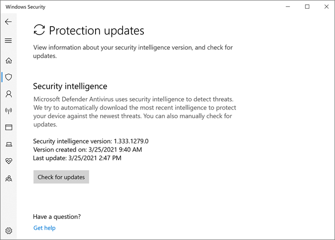

# Turn on cloud-delivered protection

[!INCLUDE [Microsoft 365 Defender rebranding](../../includes/microsoft-defender.md)]

**Applies to:**

- [Microsoft Defender for Endpoint](/microsoft-365/security/defender-endpoint/)

> [!NOTE]
> The Microsoft Defender Antivirus cloud service is a mechanism for delivering updated protection to your network and endpoints. Although it is called a cloud service, it is not simply protection for files stored in the cloud; rather, it uses distributed resources and machine learning to deliver protection to your endpoints at a rate that is far faster than traditional Security intelligence updates.

Microsoft Defender Antivirus uses multiple detection and prevention technologies to deliver accurate, real-time, and intelligent protection. [Get to know the advanced technologies at the core of Microsoft Defender for Endpoint next-generation protection](https://www.microsoft.com/security/blog/2019/06/24/inside-out-get-to-know-the-advanced-technologies-at-the-core-of-microsoft-defender-atp-next-generation-protection/).
  

You can turn Microsoft Defender Antivirus cloud-delivered protection on or off in several ways:

- Microsoft Intune
- Microsoft Endpoint Configuration Manager
- Group Policy
- PowerShell cmdlets.

 You can also turn it on or off in individual clients with the Windows Security app.

See [Use Microsoft cloud-delivered protection](utilize-microsoft-cloud-protection-microsoft-defender-antivirus.md) for an overview of Microsoft Defender Antivirus cloud-delivered protection.

For more information about the specific network-connectivity requirements to ensure your endpoints can connect to the cloud-delivered protection service, see [Configure and validate network connections](configure-network-connections-microsoft-defender-antivirus.md).

> [!NOTE]
> In Windows 10, there is no difference between the **Basic** and **Advanced** reporting options described in this topic. This is a legacy distinction and choosing either setting will result in the same level of cloud-delivered protection. There is no difference in the type or amount of information that is shared. For more information on what we collect, see the [Microsoft Privacy Statement](https://go.microsoft.com/fwlink/?linkid=521839).

## Use Intune to turn on cloud-delivered protection

1. Go to the Microsoft Endpoint Manager admin center ([https://endpoint.microsoft.com](https://endpoint.microsoft.com)) and log in.
2. On the **Home** pane, select **Device configuration > Profiles**.
3. Select the **Device restrictions** profile type you want to configure. If you need to create a new **Device restrictions** profile type, see [Configure device restriction settings in Microsoft Intune](/intune/device-restrictions-configure).
4. Select **Properties** > **Configuration settings: Edit** > **Microsoft Defender Antivirus**.
5. On the **Cloud-delivered protection** switch, select **Enable**.
6. In the **Prompt users before sample submission** dropdown, select **Send all data automatically**.

For more information about Intune device profiles, including how to create and configure their settings, see [What are Microsoft Intune device profiles?](/intune/device-profiles)

## Use Microsoft Endpoint Manager to turn on cloud-delivered protection

1. Go to the Microsoft Endpoint Manager admin center ([https://endpoint.microsoft.com](https://endpoint.microsoft.com)) and log in.
2. Choose **Endpoint security** > **Antivirus**.
3. Select an antivirus profile. (If you don't have one yet, or if you want to create a new profile, see [Configure device restriction settings in Microsoft Intune](/intune/device-restrictions-configure).
4. Select **Properties**. Then, next to **Configuration settings**, choose **Edit**.
5. Expand **Cloud protection**, and then in the **Cloud-delivered protection level** list, select one of the following:
    1. **High**: Applies a strong level of detection.
    2. **High plus**: Uses the **High** level and applies additional protection measures (may impact client performance).
    3. **Zero tolerance**: Blocks all unknown executables.
6. Select **Review + save**, then choose **Save**.

For more information about configuring Microsoft Endpoint Configuration Manager, see [How to create and deploy antimalware policies: Cloud-protection service](/configmgr/protect/deploy-use/endpoint-antimalware-policies#cloud-protection-service).

## Use Group Policy to turn on cloud-delivered protection

1. On your Group Policy management device, open the [Group Policy Management Console](/previous-versions/windows/it-pro/windows-server-2008-R2-and-2008/cc731212(v=ws.11)), right-click the Group Policy Object you want to configure and select **Edit**.

2. In the **Group Policy Management Editor**, go to **Computer configuration**.

3. Select **Administrative templates**.

4. Expand the tree to **Windows components > Microsoft Defender Antivirus > MAPS**

5. Double-click **Join Microsoft MAPS**. Ensure the option is turned on and set to **Basic MAPS** or **Advanced MAPS**. Select **OK**.

6. Double-click **Send file samples when further analysis is required**. Ensure that the first option is set to **Enabled** and that the other options are set to either:

    1. **Send safe samples** (1)
    2. **Send all samples** (3)

        >[!NOTE]
        > The **Send safe samples** (1) option means that most samples will be sent automatically. Files that are likely to contain personal information will still prompt and require additional confirmation.

        > [!WARNING]
        > Setting the option to **Always Prompt** (0) will lower the protection state of the device. Setting it to **Never send** (2) means that the [Block at First Sight](configure-block-at-first-sight-microsoft-defender-antivirus.md) feature of Microsoft Defender for Endpoint won't work.

7. Select **OK**.

## Use PowerShell cmdlets to turn on cloud-delivered protection

The following cmdlets can turn on cloud-delivered protection:

```PowerShell
Set-MpPreference -MAPSReporting Advanced
Set-MpPreference -SubmitSamplesConsent SendAllSamples
```

For more information on how to use PowerShell with Microsoft Defender Antivirus, see [Use PowerShell cmdlets to configure and run Microsoft Defender Antivirus](use-powershell-cmdlets-microsoft-defender-antivirus.md) and [Defender cmdlets](/powershell/module/defender/). [Policy CSP - Defender](/windows/client-management/mdm/policy-csp-defender) also has more information specifically on [-SubmitSamplesConsent](/windows/client-management/mdm/policy-csp-defender#defender-submitsamplesconsent).

>[!NOTE]
> You can also set **-SubmitSamplesConsent** to `SendSafeSamples` (the default setting), `NeverSend`, or `AlwaysPrompt`. The `SendSafeSamples` setting means that most samples will be sent automatically. Files that are likely to contain personal information will still prompt and require additional confirmation.

>[!WARNING]
> Setting **-SubmitSamplesConsent** to `NeverSend` or `AlwaysPrompt` will lower the protection level of the device. In addition, setting it to `NeverSend` means that the [Block at First Sight](configure-block-at-first-sight-microsoft-defender-antivirus.md) feature of Microsoft Defender for Endpoint won't work.

## Use Windows Management Instruction (WMI) to turn on cloud-delivered protection

Use the [**Set** method of the **MSFT_MpPreference**](/previous-versions/windows/desktop/defender/set-msft-mppreference) class for the following properties:

```WMI
MAPSReporting
SubmitSamplesConsent
```

For more information about allowed parameters, see [Windows Defender WMIv2 APIs](/previous-versions/windows/desktop/defender/windows-defender-wmiv2-apis-portal)

## Turn on cloud-delivered protection on individual clients with the Windows Security app

> [!NOTE]
> If the **Configure local setting override for reporting Microsoft MAPS** Group Policy setting is set to **Disabled**, then the **Cloud-based protection** setting in Windows Settings will be greyed-out and unavailable. Changes made through a Group Policy Object must first be deployed to individual endpoints before the setting will be updated in Windows Settings.

1. Open the Windows Security app by selecting the shield icon in the task bar, or by searching the start menu for **Defender**.

2. Select the **Virus & threat protection** tile (or the shield icon on the left menu bar) and then the **Virus & threat protection settings** label:

    

3. Confirm that **Cloud-based Protection** and **Automatic sample submission** are switched to **On**.

> [!NOTE]
> If automatic sample submission has been configured with Group Policy then the setting will be greyed-out and unavailable.

## Related articles

- [Configure the cloud block timeout period](configure-cloud-block-timeout-period-microsoft-defender-antivirus.md)
- [Configure block at first sight](configure-block-at-first-sight-microsoft-defender-antivirus.md)
- [Use PowerShell cmdlets to manage Microsoft Defender Antivirus](use-powershell-cmdlets-microsoft-defender-antivirus.md)
- [Help secure Windows PCs with Endpoint Protection for Microsoft Intune](/intune/deploy-use/help-secure-windows-pcs-with-endpoint-protection-for-microsoft-intune)]
- [Defender cmdlets](/powershell/module/defender/)
- [Use Microsoft cloud-delivered protection in Microsoft Defender Antivirus](utilize-microsoft-cloud-protection-microsoft-defender-antivirus.md)
- [How to create and deploy antimalware policies: Cloud-protection service](/configmgr/protect/deploy-use/endpoint-antimalware-policies#cloud-protection-service)
- [Microsoft Defender Antivirus in Windows 10](microsoft-defender-antivirus-in-windows-10.md)