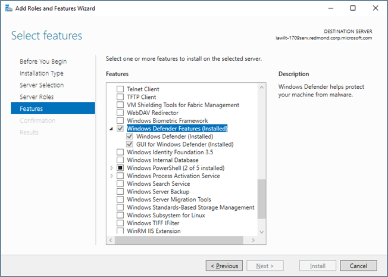

# Microsoft Defender Antivirus on Windows Server

[!INCLUDE [Microsoft 365 Defender rebranding](../../includes/microsoft-defender.md)]

**Applies to:**

- [Microsoft Defender for Endpoint](/microsoft-365/security/defender-endpoint/)

Microsoft Defender Antivirus is available on the following editions/versions of Windows Server:
- Windows Server 2019
- Windows Server, version  1803 or later
- Windows Server 2016. 

In some instances, Microsoft Defender Antivirus is referred to as *Endpoint Protection*; however, the protection engine is the same. Although the functionality, configuration, and management are largely the same for [Microsoft Defender Antivirus on Windows 10](microsoft-defender-antivirus-in-windows-10.md), there are a few key differences on Windows Server:

- In Windows Server, [automatic exclusions](configure-server-exclusions-microsoft-defender-antivirus.md) are applied based on your defined Server Role.
- In Windows Server, Microsoft Defender Antivirus does not automatically disable itself if you are running another antivirus product.

## The process at a glance

The process of setting up and running Microsoft Defender Antivirus on a server platform includes several steps:

1. [Enable the interface](#enable-the-user-interface-on-windows-server).
2. [Install Microsoft Defender Antivirus](#install-microsoft-defender-antivirus-on-windows-server).
3. [Verify Microsoft Defender Antivirus is running](#verify-microsoft-defender-antivirus-is-running).
4. [Update your antimalware Security intelligence](#update-antimalware-security-intelligence).
5. (As needed) [Submit samples](#submit-samples).
6. (As needed) [Configure automatic exclusions](#configure-automatic-exclusions).
7. (Only if necessary) [Set Microsoft Defender Antivirus to passive mode](#need-to-set-microsoft-defender-antivirus-to-passive-mode).

## Enable the user interface on Windows Server

By default, Microsoft Defender Antivirus is installed and functional on Windows Server. The user interface (GUI) is installed by default on some SKUs, but is not required because you can use PowerShell or other methods to manage Microsoft Defender Antivirus. If the GUI is not installed on your server, you can add it by using the **Add Roles and Features** wizard, or by using PowerShell cmdlets.

### Turn on the GUI using the Add Roles and Features Wizard

1. See [Install roles, role services, and features by using the add Roles and Features Wizard](/windows-server/administration/server-manager/install-or-uninstall-roles-role-services-or-features#install-roles-role-services-and-features-by-using-the-add-roles-and-features-wizard), and use the **Add Roles and Features Wizard**.

2. When you get to the **Features** step of the wizard, under **Windows Defender Features**, select the **GUI for Windows Defender** option.

   In Windows Server 2016, the **Add Roles and Features Wizard** looks like this:

   

   In Windows Server 2019, the **Add Roles and Feature Wizard** is similar.

### Turn on the GUI using PowerShell

The following PowerShell cmdlet will enable the interface: 

```PowerShell
Install-WindowsFeature -Name Windows-Defender-GUI
```

## Install Microsoft Defender Antivirus on Windows Server

You can use either the **Add Roles and Features Wizard** or PowerShell to install Microsoft Defender Antivirus.

### Use the Add Roles and Features Wizard

1. Refer to [this article](/windows-server/administration/server-manager/install-or-uninstall-roles-role-services-or-features#install-roles-role-services-and-features-by-using-the-add-roles-and-features-wizard), and use the **Add Roles and Features Wizard**.

2. When you get to the **Features** step of the wizard, select the Microsoft Defender Antivirus option. Also select the **GUI for Windows Defender** option.

### Use PowerShell

To use PowerShell to install Microsoft Defender Antivirus, run the following cmdlet:

```PowerShell
Install-WindowsFeature -Name Windows-Defender
```

Event messages for the antimalware engine included with Microsoft Defender Antivirus can be found in [Microsoft Defender AV Events](troubleshoot-microsoft-defender-antivirus.md).


## Verify Microsoft Defender Antivirus is running

To verify that Microsoft Defender Antivirus is running on your server, run the following PowerShell cmdlet:

```PowerShell
Get-Service -Name windefend
```

To verify that firewall protection is turned on, run the following PowerShell cmdlet:

```PowerShell 
Get-Service -Name mpssvc
```

As an alternative to PowerShell, you can use Command Prompt to verify that Microsoft Defender Antivirus is running. To do that, run the following command from a command prompt: 

```console
sc query Windefend
```

The `sc query` command returns information about the Microsoft Defender Antivirus service. When Microsoft Defender Antivirus is running, the `STATE` value displays `RUNNING`.

## Update antimalware Security intelligence 

To get updated antimalware security intelligence, you must have the Windows Update service running. If you use an update management service, like Windows Server Update Services (WSUS), make sure that updates for Microsoft Defender Antivirus Security intelligence are approved for the computers you manage.

By default, Windows Update does not download and install updates automatically on Windows Server 2019 or Windows Server 2016. You can change this configuration by using one of the following methods:


|Method  |Description  |
|---------|---------|
|**Windows Update** in Control Panel     |- **Install updates automatically** results in all updates being automatically installed, including Windows Defender Security intelligence updates. <br/>- **Download updates but let me choose whether to install them** allows Windows Defender to download and install Security intelligence updates automatically, but other updates are not automatically installed.       |
|**Group Policy**     | You can set up and manage Windows Update by using the settings available in Group Policy, in the following path: **Administrative Templates\Windows Components\Windows Update\Configure Automatic Updates**         |
|The **AUOptions** registry key     |The following two values allow Windows Update to automatically download and install Security intelligence updates: <br/>- **4** - **Install updates automatically**. This value results in all updates being automatically installed, including Windows Defender Security intelligence updates. <br/>- **3** - **Download updates but let me choose whether to install them**.  This value allows Windows Defender to download and install Security intelligence updates automatically, but other updates are not automatically installed.         |

To ensure that protection from malware is maintained, we recommend that you enable the following services:

- Windows Error Reporting service

- Windows Update service

The following table lists the services for Microsoft Defender Antivirus and the dependent services.

|Service Name|File Location|Description|
|--------|---------|--------|
|Windows Defender Service (WinDefend)|`C:\Program Files\Windows Defender\MsMpEng.exe`|This is the main Microsoft Defender Antivirus service that needs to be running at all times.|
|Windows Error Reporting Service (Wersvc)|`C:\WINDOWS\System32\svchost.exe -k WerSvcGroup`|This service sends error reports back to Microsoft.|
|Windows Defender Firewall (MpsSvc)|`C:\WINDOWS\system32\svchost.exe -k LocalServiceNoNetwork`|We recommend leaving the Windows Defender Firewall service enabled.|
|Windows Update (Wuauserv)|`C:\WINDOWS\system32\svchost.exe -k netsvcs`|Windows Update is needed to get Security intelligence updates and antimalware engine updates|

## Submit samples

Sample submission allows Microsoft to collect samples of potentially malicious software. To help provide continued and up-to-date protection, Microsoft researchers use these samples to analyze suspicious activities and produce updated antimalware Security intelligence. We collect program executable files, such as .exe files and .dll files. We do not collect files that contain personal data, like Microsoft Word documents and PDF files.

### Submit a file

1. Review the [submission guide](../intelligence/submission-guide.md).

2. Visit the [sample submission portal](https://www.microsoft.com/wdsi/filesubmission), and submit your file.


### Enable automatic sample submission

To enable automatic sample submission, start a Windows PowerShell console as an administrator, and set the **SubmitSamplesConsent** value data according to one of the following settings:

|Setting  |Description  |
|---------|---------|
|**0** - **Always prompt**     |The Microsoft Defender Antivirus service prompts you to confirm submission of all required files. This is the default setting for Microsoft Defender Antivirus, but is not recommended for installations on Windows Server 2016 or 2019 without a GUI.         |
|**1**  - **Send safe samples automatically**     |The Microsoft Defender Antivirus service sends all files marked as "safe" and prompts for the remainder of the files.         |
|**2** - **Never send**      |The Microsoft Defender Antivirus service does not prompt and does not send any files.         |
|**3** - **Send all samples automatically**     |The Microsoft Defender Antivirus service sends all files without a prompt for confirmation.         |

## Configure automatic exclusions

To help ensure security and performance, certain exclusions are automatically added based on the roles and features you install when using Microsoft Defender Antivirus on Windows Server 2016 or 2019.

See [Configure exclusions in Microsoft Defender Antivirus on Windows Server](configure-server-exclusions-microsoft-defender-antivirus.md). 

## Need to set Microsoft Defender Antivirus to passive mode?

If you are using a non-Microsoft antivirus product as your primary antivirus solution, set Microsoft Defender Antivirus to passive mode.  

### Set Microsoft Defender Antivirus to passive mode using a registry key

If you are using Windows Server, version 1803 or Windows Server 2019, you can set Microsoft Defender Antivirus to passive mode by setting the following registry key:
- Path: `HKLM\SOFTWARE\Policies\Microsoft\Windows Advanced Threat Protection`
- Name: `ForcePassiveMode`
- Type: `REG_DWORD`
- Value: `1`

### Disable Microsoft Defender Antivirus using the Remove Roles and Features wizard

1. See [Install or Uninstall Roles, Role Services, or Features](/windows-server/administration/server-manager/install-or-uninstall-roles-role-services-or-features#remove-roles-role-services-and-features-by-using-the-remove-roles-and-features-wizard), and use the **Remove Roles and Features Wizard**. 

2. When you get to the **Features** step of the wizard, clear the **Windows Defender Features** option. 

    If you clear **Windows Defender** by itself under the **Windows Defender Features** section, you will be prompted to remove the interface option **GUI for Windows Defender**. 
    
    Microsoft Defender Antivirus will still run normally without the user interface, but the user interface cannot be enabled if you disable the core **Windows Defender** feature.

### Turn off the Microsoft Defender Antivirus user interface using PowerShell

To turn off the Microsoft Defender Antivirus GUI, use the following PowerShell cmdlet:

```PowerShell
Uninstall-WindowsFeature -Name Windows-Defender-GUI
```

### Are you using Windows Server 2016?

If you are using Windows Server 2016 and a third-party antimalware/antivirus product that is not offered or developed by Microsoft, you'll need to disable/uninstall Microsoft Defender Antivirus. 

> [!NOTE]
> You can't uninstall the Windows Security app, but you can disable the interface with these instructions.

The following PowerShell cmdlet uninstalls Microsoft Defender Antivirus on Windows Server 2016:

```PowerShell
Uninstall-WindowsFeature -Name Windows-Defender
```

## See also

- [Microsoft Defender Antivirus in Windows 10](microsoft-defender-antivirus-in-windows-10.md)
- [Microsoft Defender Antivirus compatibility](microsoft-defender-antivirus-compatibility.md)