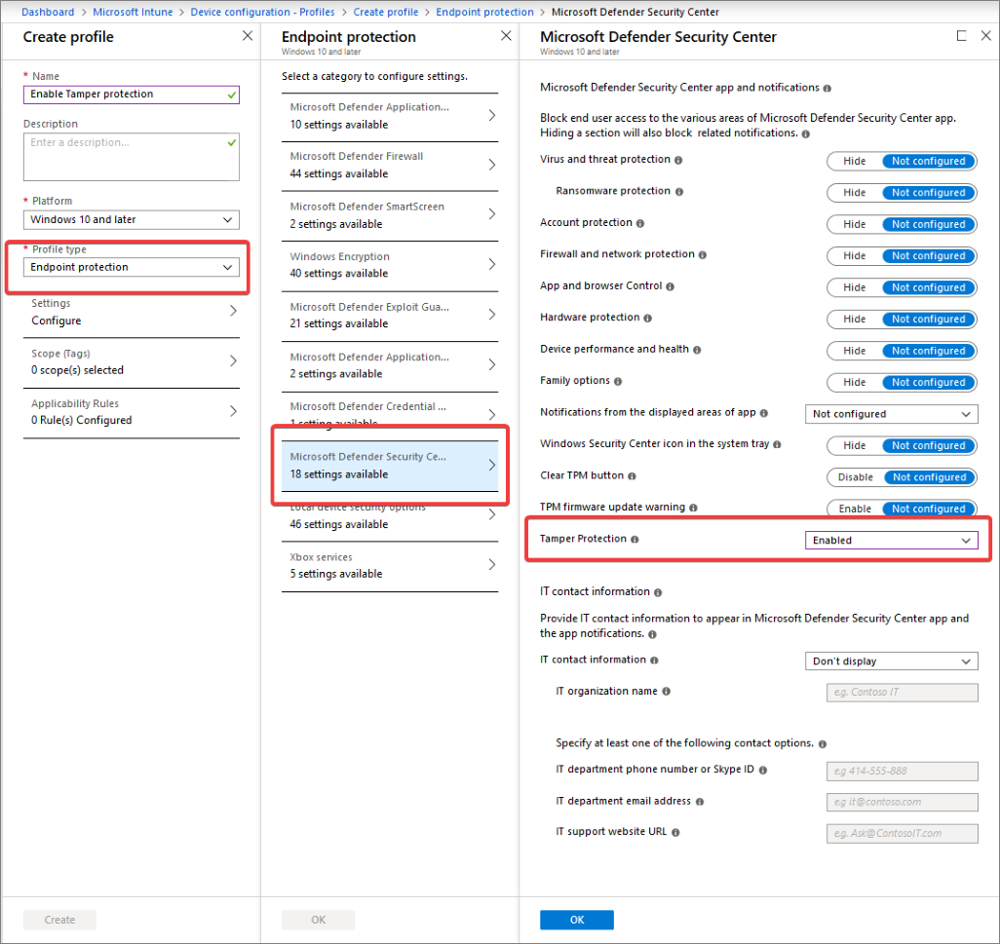
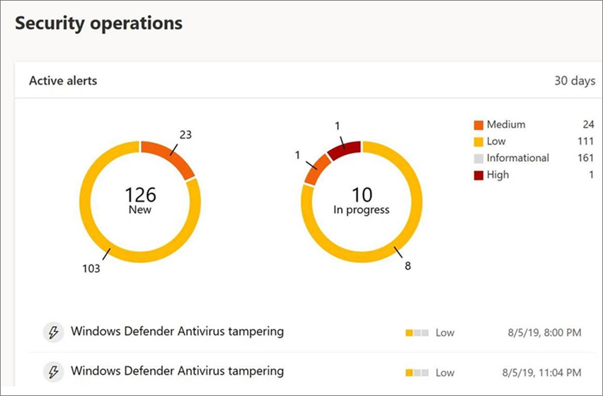
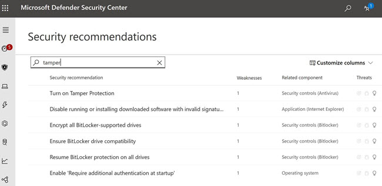
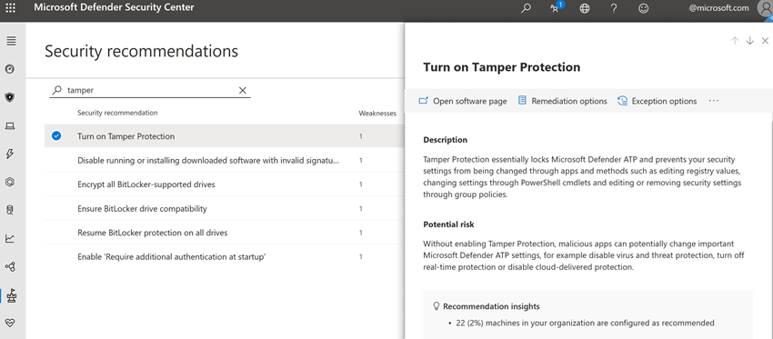

# Protect security settings with tamper protection

**Applies to:**

- Windows 10

## Overview

During some kinds of cyber attacks, bad actors try to disable security features, such as anti-virus protection, on your machines. They do this to get easier access to your data, to install malware, or to otherwise exploit your data, identity, and devices. Tamper protection helps prevent this from occurring.

With tamper protection, malicious apps are prevented from taking actions such as:

- Disabling virus and threat protection
- Disabling real-time protection
- Turning off behavior monitoring
- Disabling antivirus (such as IOfficeAntivirus (IOAV))
- Disabling cloud-delivered protection
- Removing security intelligence updates

### How it works

 Tamper protection essentially locks Microsoft Defender Antivirus and prevents your security settings from being changed through apps and methods such as:

- Configuring settings in Registry Editor on your Windows machine
- Changing settings through PowerShell cmdlets
- Editing or removing security settings through group policies

Tamper protection doesn't prevent you from viewing your security settings. And, tamper protection doesn't affect how third-party antivirus apps register with the Windows Security app. If your organization is using Windows 10 Enterprise E5, individual users can't change the tamper protection setting; this is managed by your security team.

### What do you want to do?

1. Turn tamper protection on  
    - [For an individual machine, use Windows Security](#turn-tamper-protection-on-or-off-for-an-individual-machine).
    - [For your organization, use Intune](#turn-tamper-protection-on-or-off-for-your-organization-using-intune).

2. [View information about tampering attempts](#view-information-about-tampering-attempts).

3. [Review your security recommendations](#review-your-security-recommendations).

4. [Browse the frequently asked questions](#view-information-about-tampering-attempts).

## Turn tamper protection on (or off) for an individual machine

> [!NOTE]
> Tamper protection blocks attempts to modify Microsoft Defender Antivirus settings through the registry.
>
> To help ensure that tamper protection doesn’t interfere with third-party security products or enterprise installation scripts that modify these settings, go to **Windows Security** and update **Security intelligence** to version 1.287.60.0 or later. (See [Security intelligence updates](https://www.microsoft.com/wdsi/definitions).)
>
> Once you’ve made this update, tamper protection will continue to protect your registry settings, and will also log attempts to modify them without returning errors.

If you are a home user, or you are not subject to settings managed by a security team, you can use the Windows Security app to turn tamper protection on or off. You must have appropriate admin permissions on your machine to do this.

1. Click **Start**, and start typing *Defender*. In the search results, select **Windows Security**.

2. Select **Virus & threat protection** > **Virus & threat protection settings**.

3. Set **Tamper Protection** to **On** or **Off**.

   Here's what you see in the Windows Security app:

   

## Turn tamper protection on (or off) for your organization using Intune

If you are part of your organization's security team, and your subscription includes [Intune](https://docs.microsoft.com/intune/fundamentals/what-is-intune), you can turn tamper protection on (or off) for your organization in the Microsoft 365 Device Management portal ([https://aka.ms/intuneportal](https://aka.ms/intuneportal)).

> [!NOTE]
> The ability to manage tamper protection in Intune is rolling out now; if you don't have it yet, you should very soon, assuming your organization has [Microsoft Defender Advanced Threat Protection](../microsoft-defender-atp/whats-new-in-microsoft-defender-atp.md) (Microsoft Defender ATP) and that you meet the prerequisites listed below.

You must have appropriate [permissions](../microsoft-defender-atp/assign-portal-access.md), such as global admin, security admin, or security operations, to perform the following task.

1. Make sure your organization meets all of the following requirements to manage tamper protection using Intune:

    - Your organization must have [Microsoft Defender ATP E5](https://www.microsoft.com/microsoft-365/windows/microsoft-defender-atp) (this is included in [Microsoft 365 E5](https://docs.microsoft.com/microsoft-365/enterprise/microsoft-365-overview)).
    - Your organization uses [Intune to manage devices](https://docs.microsoft.com/intune/fundamentals/what-is-device-management). ([Intune licenses](https://docs.microsoft.com/intune/fundamentals/licenses) are required; this is included in Microsoft 365 E5.)
    - Your Windows machines must be running Windows 10 OS [1709](https://docs.microsoft.com/windows/release-information/status-windows-10-1709), [1803](https://docs.microsoft.com/windows/release-information/status-windows-10-1803), [1809](https://docs.microsoft.com/windows/release-information/status-windows-10-1809-and-windows-server-2019) or later. (See [Windows 10 release information](https://docs.microsoft.com/windows/release-information/) for more details about releases.)
    - You must be using Windows security with [security intelligence](https://www.microsoft.com/wdsi/definitions) updated to version 1.287.60.0 (or above).
    - Your machines must be using anti-malware platform version 4.18.1906.3 (or above) and anti-malware engine version 1.1.15500.X (or above). ([Manage Microsoft Defender Antivirus updates and apply baselines](manage-updates-baselines-microsoft-defender-antivirus.md).)

2. Go to the Microsoft 365 Device Management portal ([https://devicemanagement.microsoft.com](https://devicemanagement.microsoft.com)) and sign in with your work or school account.

3. Select **Device configuration** > **Profiles**.

4. Create a profile as follows:

    - Platform: **Windows 10 and later**

    - Profile type: **Endpoint protection**

    - Category: **Microsoft Defender Security Center**

    - Tamper Protection: **Enabled**

    

5. Assign the profile to one or more groups.

### Are you using Windows OS 1709, 1803, or 1809?

If you are using Windows 10 OS [1709](https://docs.microsoft.com/windows/release-information/status-windows-10-1709), [1803](https://docs.microsoft.com/windows/release-information/status-windows-10-1803), or [1809](https://docs.microsoft.com/windows/release-information/status-windows-10-1809-and-windows-server-2019), you won't see **Tamper Protection** in the Windows Security app. In this case, you can use PowerShell to determine whether tamper protection is enabled.

#### Use PowerShell to determine whether tamper protection is turned on

1. Open the Windows PowerShell app.

2. Use the [Get-MpComputerStatus](https://docs.microsoft.com/powershell/module/defender/get-mpcomputerstatus?view=win10-ps) PowerShell cmdlet.

3. In the list of results, look for `IsTamperProtected`. (A value of *true* means tamper protection is enabled.)

## View information about tampering attempts

Tampering attempts typically indicate bigger cyberattacks. Bad actors try to change security settings as a way to persist and stay undetected. If you're part of your organization's security team, you can view information about such attempts, and then take appropriate actions to mitigate threats.

When a tampering attempt is detected, an alert is raised in the [Microsoft Defender Security Center](https://docs.microsoft.com/windows/security/threat-protection/microsoft-defender-atp/portal-overview) ([https://securitycenter.windows.com](https://securitycenter.windows.com)).

Using [endpoint detection and response](https://docs.microsoft.com/windows/security/threat-protection/microsoft-defender-atp/overview-endpoint-detection-response) and [advanced hunting](https://docs.microsoft.com/windows/security/threat-protection/microsoft-defender-atp/advanced-hunting-overview) capabilities in Microsoft Defender ATP, your security operations team can investigate and address such attempts.

## Review your security recommendations

Tamper protection integrates with [Threat & Vulnerability Management](https://docs.microsoft.com/windows/security/threat-protection/microsoft-defender-atp/next-gen-threat-and-vuln-mgt) capabilities. [Security recommendations](https://docs.microsoft.com/windows/security/threat-protection/microsoft-defender-atp/tvm-security-recommendation) include making sure tamper protection is turned on. For example, you can search on *tamper*, as shown in the following image:

In the results, you can select **Turn on Tamper Protection** to learn more and turn it on.

To learn more about Threat & Vulnerability Management, see [Threat & Vulnerability Management in Microsoft Defender Security Center](https://docs.microsoft.com/windows/security/threat-protection/microsoft-defender-atp/tvm-dashboard-insights#threat--vulnerability-management-in-microsoft-defender-security-center).

## Frequently asked questions

### To which Windows OS versions is configuring tamper protection is applicable?

Windows 10 OS [1709](https://docs.microsoft.com/windows/release-information/status-windows-10-1709), [1803](https://docs.microsoft.com/windows/release-information/status-windows-10-1803), [1809](https://docs.microsoft.com/windows/release-information/status-windows-10-1809-and-windows-server-2019), or later together with [Microsoft Defender Advanced Threat Protection E5](https://www.microsoft.com/microsoft-365/windows/microsoft-defender-atp).

### Is configuring tamper protection in Intune supported on servers?

No

### Will tamper protection have any impact on third party antivirus registration?

No. Third-party antivirus offerings will continue to register with the Windows Security application.

### What happens if Microsoft Defender Antivirus is not active on a device?

Tamper protection will not have any impact on such devices.

### How can I turn tamper protection on/off?

If you are a home user, see [Turn tamper protection on (or off) for an individual machine](#turn-tamper-protection-on-or-off-for-an-individual-machine).

If you are an organization using [Microsoft Defender ATP E5](https://www.microsoft.com/microsoft-365/windows/microsoft-defender-atp), you should be able to manage tamper protection in Intune similar to how you manage other endpoint protection features. See [Turn tamper protection on (or off) for your organization using Intune](#turn-tamper-protection-on-or-off-for-your-organization-using-intune).

### How does configuring tamper protection in Intune affect how I manage Microsoft Defender Antivirus through my group policy?

Your regular group policy doesn’t apply to tamper protection, and changes to Microsoft Defender Antivirus settings are ignored when tamper protection is on.

>[!NOTE]
>A small delay in Group Policy (GPO) processing may occur if Group Policy settings include values that control Microsoft Defender Antivirus features protected by tamper protection. To avoid any potential delays, we recommend that you remove settings that control Microsoft Defender Antivirus related behavior from GPO and simply allow tamper protection to protect Microsoft Defender Antivirus settings.   
> Sample Microsoft Defender Antivirus settings: 
> Turn off Microsoft Defender Antivirus (**Note:** Only applies to devices that have not received the August 2020 update to Microsoft Defender Antivirus)  
> Computer Configuration\Administrative Templates\Windows Components\Windows Defender\
Value DisableAntiSpyware = 0   
>Turn off real-time protection 
Computer Configuration\Administrative Templates\Windows Components\Microsoft Defender Antivirus\Real-time Protection\
Value DisableRealtimeMonitoring = 0

### For Microsoft Defender ATP E5, is configuring tamper protection in Intune targeted to the entire organization only?

Configuring tamper protection in Intune can be targeted to your entire organization as well as to specific devices and user groups.

### Can I configure Tamper Protection in Microsoft Endpoint Configuration Manager?

Currently we do not have support to manage Tamper Protection through Microsoft Endpoint Configuration Manager.

### I have the Windows E3 enrollment. Can I use configuring tamper protection in Intune?

Currently, configuring tamper protection in Intune is only available for customers who have [Microsoft Defender Advanced Threat Protection E5](https://www.microsoft.com/microsoft-365/windows/microsoft-defender-atp).

### What happens if I try to change Microsoft Defender ATP settings in Intune, Microsoft Endpoint Configuration Manager, and Windows Management Instrumentation when Tamper Protection is enabled on a device?

You won’t be able to change the features that are protected by tamper protection; such change requests are ignored.

### I’m an enterprise customer. Can local admins change tamper protection on their devices?

No. Local admins cannot change or modify tamper protection settings.

### What happens if my device is onboarded with Microsoft Defender ATP and then goes into an off-boarded state?

In this case, tamper protection status changes, and this feature is no longer applied.

### Will there be an alert about tamper protection status changing in the Microsoft Defender Security Center?

Yes. The alert is shown in [https://securitycenter.microsoft.com](https://securitycenter.microsoft.com) under **Alerts**.

In addition, your security operations team can use hunting queries, such as the following:

`DeviceAlertEvents | where Title == "Tamper Protection bypass"`

[View information about tampering attempts](#view-information-about-tampering-attempts).

### Will there be a group policy setting for tamper protection?

No.

## Related articles

[Help secure Windows PCs with Endpoint Protection for Microsoft Intune](https://docs.microsoft.com/intune/help-secure-windows-pcs-with-endpoint-protection-for-microsoft-intune)

[Get an overview of Microsoft Defender ATP E5](https://www.microsoft.com/microsoft-365/windows/microsoft-defender-atp)

[Better together: Microsoft Defender Antivirus and Microsoft Defender Advanced Threat Protection](why-use-microsoft-defender-antivirus.md)
