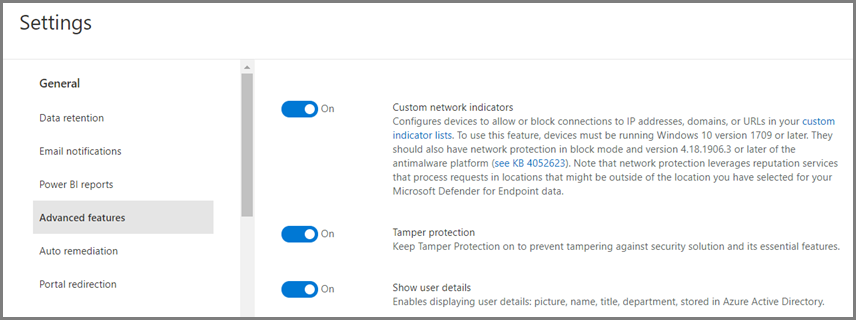
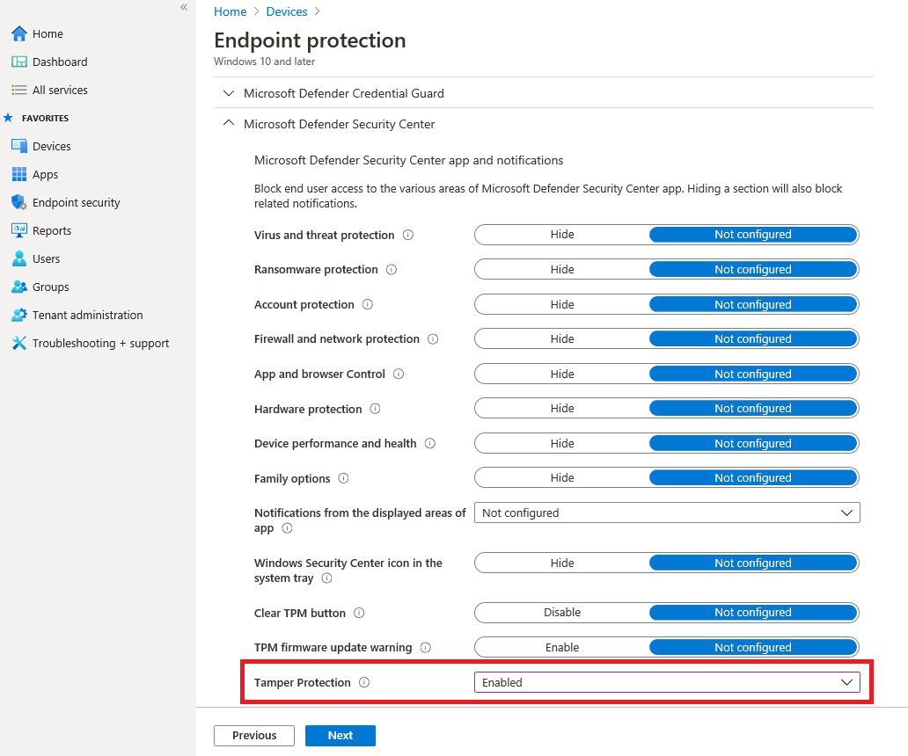
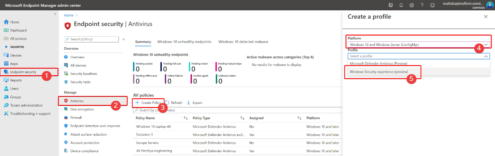

# Protect security settings with tamper protection

[!INCLUDE [Microsoft 365 Defender rebranding](../../includes/microsoft-defender.md)]

**Applies to:**

- [Microsoft Defender for Endpoint](/microsoft-365/security/defender-endpoint/)

Tamper protection is available for devices that are running one of the following versions of Windows:

- Windows 10
- Windows Server 2019
- Windows Server, version 1803 or later
- Windows Server 2016

## Overview

During some kinds of cyber attacks, bad actors try to disable security features, such as anti-virus protection, on your machines. Bad actors like to disable your security features to get easier access to your data, to install malware, or to otherwise exploit your data, identity, and devices. Tamper protection helps prevent these kinds of things from occurring.

With tamper protection, malicious apps are prevented from taking actions such as:

- Disabling virus and threat protection
- Disabling real-time protection
- Turning off behavior monitoring
- Disabling antivirus (such as IOfficeAntivirus (IOAV))
- Disabling cloud-delivered protection
- Removing security intelligence updates

### How it works

Tamper protection essentially locks Microsoft Defender Antivirus and prevents your security settings from being changed through apps and methods such as:

- Configuring settings in Registry Editor on your Windows device
- Changing settings through PowerShell cmdlets
- Editing or removing security settings through group policies

Tamper protection doesn't prevent you from viewing your security settings. And, tamper protection doesn't affect how third-party antivirus apps register with the Windows Security app. If your organization is using Windows 10 Enterprise E5, individual users can't change the tamper protection setting; in those cases, tamper protection is managed by your security team.

### What do you want to do?

| To perform this task... | See this section... |
|:---|:---|
| Turn tamper protection on (or off) in the Microsoft Defender Security Center 
Manage tamper protection across your tenant | [Manage tamper protection for your organization using the Microsoft Defender Security Center](#manage-tamper-protection-for-your-organization-using-the-microsoft-defender-security-center) |
| Turn tamper protection on (or off) for all or part of your organization using Intune 
Fine-tune tamper protection settings in your organization | [Manage tamper protection for your organization using Intune](#manage-tamper-protection-for-your-organization-using-intune) |
| Turn tamper protection on (or off) for your organization with Configuration Manager | [Manage tamper protection for your organization using tenant attach with Configuration Manager, version 2006](#manage-tamper-protection-for-your-organization-with-configuration-manager-version-2006) |
| Turn tamper protection on (or off) for an individual device | [Manage tamper protection on an individual device](#manage-tamper-protection-on-an-individual-device) |
| View details about tampering attempts on devices | [View information about tampering attempts](#view-information-about-tampering-attempts) |
| Review your security recommendations | [Review security recommendations](#review-your-security-recommendations) |
| Review the list of frequently asked questions (FAQs) | [Browse the FAQs](#view-information-about-tampering-attempts) |

## Manage tamper protection for your organization using the Microsoft Defender Security Center

Tamper protection can be turned on or off for your tenant using the Microsoft Defender Security Center ([https://securitycenter.windows.com](https://securitycenter.windows.com)). Here are a few points to keep in mind:

- Currently, the option to manage tamper protection in the Microsoft Defender Security Center is on by default for new deployments. For existing deployments, tamper protection is available on an opt-in basis, with plans to make this the default method in the near future. (To opt in, in the Microsoft Defender Security Center, choose **Settings** > **Advanced features** > **Tamper protection**.) 

- When you use the Microsoft Defender Security Center to manage tamper protection, you do not have to use Intune or the tenant attach method.

- When you manage tamper protection in the Microsoft Defender Security Center, the setting is applied tenant wide, affecting all of your devices that are running Windows 10, Windows Server 2016, or Windows Server 2019. To fine-tune tamper protection (such as having tamper protection on for some devices but off for others), use either [Intune](#manage-tamper-protection-for-your-organization-using-intune) or [Configuration Manager with tenant attach](#manage-tamper-protection-for-your-organization-with-configuration-manager-version-2006).

- If you have a hybrid environment, tamper protection settings configured in Intune take precedence over settings configured in the Microsoft Defender Security Center. 

### Requirements for managing tamper protection in the Microsoft Defender Security Center

- You must have appropriate [permissions](/microsoft-365/security/defender-endpoint/assign-portal-access), such as global admin, security admin, or security operations.

- Your Windows devices must be running one of the following versions of Windows:
   - Windows 10
   - [Windows Server 2019](/windows-server/get-started-19/whats-new-19)
   - Windows Server, version [1803](/windows/release-health/status-windows-10-1803) or later
   - [Windows Server 2016](/windows-server/get-started/whats-new-in-windows-server-2016)
   - For more information about releases, see [Windows 10 release information](/windows/release-health/release-information).

- Your devices must be [onboarded to Microsoft Defender for Endpoint](/microsoft-365/security/defender-endpoint/onboarding).

- Your devices must be using anti-malware platform version 4.18.2010.7 (or above) and anti-malware engine version 1.1.17600.5 (or above). ([Manage Microsoft Defender Antivirus updates and apply baselines](manage-updates-baselines-microsoft-defender-antivirus.md).)

- [Cloud-delivered protection](enable-cloud-protection-microsoft-defender-antivirus.md) must be turned on.

### Turn tamper protection on (or off) in the Microsoft Defender Security Center 

1. Go to the Microsoft Defender Security Center ([https://securitycenter.windows.com](https://securitycenter.windows.com)) and sign in.

2. Choose **Settings**.

3. Go to **General** > **Advanced features**, and then turn tamper protection on.

## Manage tamper protection for your organization using Intune

If you are part of your organization's security team, and your subscription includes [Intune](/intune/fundamentals/what-is-intune), you can turn tamper protection on (or off) for your organization in the [Microsoft Endpoint Manager admin center](https://endpoint.microsoft.com) portal. Use Intune when you want to fine-tune tamper protection settings. For example, if you want to enable tamper protection on some devices, but not all, use Intune.

### Requirements for managing tamper protection in Intune

- You must have appropriate [permissions](/microsoft-365/security/defender-endpoint/assign-portal-access), such as global admin, security admin, or security operations.

- Your organization uses [Intune to manage devices](/intune/fundamentals/what-is-device-management). ([Intune licenses](/intune/fundamentals/licenses) are required; Intune is included in Microsoft 365 E5.)

- Your Windows devices must be running Windows 10 OS [1709](/windows/release-health/status-windows-10-1709), [1803](/windows/release-health/status-windows-10-1803), [1809](/windows/release-health/status-windows-10-1809-and-windows-server-2019) or later. (For more information about releases, see [Windows 10 release information](/windows/release-health/release-information).)

- You must be using Windows security with [security intelligence](https://www.microsoft.com/wdsi/definitions) updated to version 1.287.60.0 (or above).

- Your devices must be using anti-malware platform version 4.18.1906.3 (or above) and anti-malware engine version 1.1.15500.X (or above). ([Manage Microsoft Defender Antivirus updates and apply baselines](manage-updates-baselines-microsoft-defender-antivirus.md).)

### Turn tamper protection on (or off) in Intune

1. Go to the [Microsoft Endpoint Manager admin center](https://endpoint.microsoft.com) and sign in with your work or school account.

2. Select **Devices** > **Configuration Profiles**.

3. Create a profile that includes the following settings:
    - **Platform: Windows 10 and later**
    - **Profile type: Endpoint protection**
    - **Category: Microsoft Defender Security Center**
    - **Tamper Protection: Enabled**

4. Assign the profile to one or more groups.

### Are you using Windows OS 1709, 1803, or 1809?

If you are using Windows 10 OS [1709](/windows/release-health/status-windows-10-1709), [1803](/windows/release-health/status-windows-10-1803), or [1809](/windows/release-health/status-windows-10-1809-and-windows-server-2019), you won't see **Tamper Protection** in the Windows Security app. Instead, you can use PowerShell to determine whether tamper protection is enabled.

#### Use PowerShell to determine whether tamper protection is turned on

1. Open the Windows PowerShell app.

2. Use the [Get-MpComputerStatus](/powershell/module/defender/get-mpcomputerstatus?preserve-view=true&view=win10-ps) PowerShell cmdlet.

3. In the list of results, look for `IsTamperProtected`. (A value of *true* means tamper protection is enabled.)

## Manage tamper protection for your organization with Configuration Manager, version 2006

If you're using [version 2006 of Configuration Manager](/mem/configmgr/core/plan-design/changes/whats-new-in-version-2006), you can manage tamper protection settings on Windows 10, Windows Server 2016, and Windows Server 2019 by using a method called *tenant attach*. Tenant attach enables you to sync your on-premises-only Configuration Manager devices into the Microsoft Endpoint Manager admin center, and then deliver endpoint security configuration policies to on-premises collections & devices.

> [!NOTE]
> The procedure can be used to extend tamper protection to devices running Windows 10 and Windows Server 2019. Make sure to review the prerequisites and other information in the resources mentioned in this procedure.

1. Set up tenant attach. To get help with this, see [Microsoft Endpoint Manager tenant attach: Device sync and device actions](/mem/configmgr/tenant-attach/device-sync-actions).

2. In the [Microsoft Endpoint Manager admin center](https://go.microsoft.com/fwlink/?linkid=2109431), go to **Endpoint security** > **Antivirus**, and then choose **+ Create Policy**.  
   - In the **Platform** list, select **Windows 10 and Windows Server (ConfigMgr)**.  
   - In the **Profile** list, select **Windows Security experience (preview)**.  

3. Deploy the policy to your device collection.

### Need help with this method? 

See the following resources:

- [Settings for the Windows Security experience profile in Microsoft Intune](/mem/intune/protect/antivirus-security-experience-windows-settings)
- [Tech Community Blog: Announcing Tamper Protection for Configuration Manager Tenant Attach clients](https://techcommunity.microsoft.com/t5/microsoft-endpoint-manager-blog/announcing-tamper-protection-for-configuration-manager-tenant/ba-p/1700246#.X3QLR5Ziqq8.linkedin)

## Manage tamper protection on an individual device

> [!NOTE]
> Tamper protection blocks attempts to modify Microsoft Defender Antivirus settings through the registry.
>
> To help ensure that tamper protection doesn’t interfere with third-party security products or enterprise installation scripts that modify these settings, go to **Windows Security** and update **Security intelligence** to version 1.287.60.0 or later. (See [Security intelligence updates](https://www.microsoft.com/wdsi/definitions).)
>
> Once you’ve made this update, tamper protection continues to protect your registry settings, and logs attempts to modify them without returning errors.

If you are a home user, or you are not subject to settings managed by a security team, you can use the Windows Security app to manage tamper protection. You must have appropriate admin permissions on your device to do change security settings, such as tamper protection.

Here's what you see in the Windows Security app:

1. Select **Start**, and start typing *Security*. In the search results, select **Windows Security**.

2. Select **Virus & threat protection** > **Virus & threat protection settings**.

3. Set **Tamper Protection** to **On** or **Off**.

## View information about tampering attempts

Tampering attempts typically indicate bigger cyberattacks. Bad actors try to change security settings as a way to persist and stay undetected. If you're part of your organization's security team, you can view information about such attempts, and then take appropriate actions to mitigate threats.

When a tampering attempt is detected, an alert is raised in the [Microsoft Defender Security Center](/microsoft-365/security/defender-endpoint/portal-overview) ([https://securitycenter.windows.com](https://securitycenter.windows.com)).

Using [endpoint detection and response](/microsoft-365/security/defender-endpoint/overview-endpoint-detection-response) and [advanced hunting](/microsoft-365/security/defender-endpoint/advanced-hunting-overview) capabilities in Microsoft Defender for Endpoint, your security operations team can investigate and address such attempts.

## Review your security recommendations

Tamper protection integrates with [Threat & Vulnerability Management](/microsoft-365/security/defender-endpoint/next-gen-threat-and-vuln-mgt) capabilities. [Security recommendations](/microsoft-365/security/defender-endpoint/tvm-security-recommendation) include making sure tamper protection is turned on. For example, you can search on *tamper*, as shown in the following image:

In the results, you can select **Turn on Tamper Protection** to learn more and turn it on.

To learn more about Threat & Vulnerability Management, see [Threat & Vulnerability Management in Microsoft Defender Security Center](/microsoft-365/security/defender-endpoint/tvm-dashboard-insights#threat--vulnerability-management-in-microsoft-defender-security-center).

## Frequently asked questions

### To which Windows OS versions is configuring tamper protection is applicable?

Windows 10 OS [1709](/windows/release-health/status-windows-10-1709), [1803](/windows/release-health/status-windows-10-1803), [1809](/windows/release-health/status-windows-10-1809-and-windows-server-2019), or later together with [Microsoft Defender for Endpoint](/microsoft-365/security/defender-endpoint).

If you are using Configuration Manager, version 2006, with tenant attach, tamper protection can be extended to Windows Server 2019. See [Tenant attach: Create and deploy endpoint security Antivirus policy from the admin center (preview)](/mem/configmgr/tenant-attach/deploy-antivirus-policy).

### Will tamper protection have any impact on third-party antivirus registration?

No. Third-party antivirus offerings will continue to register with the Windows Security application.

### What happens if Microsoft Defender Antivirus is not active on a device?

Devices that are onboarded to Microsoft Defender for Endpoint will have Microsoft Defender Antivirus running in passive mode. Tamper protection will continue to protect the service and its features. 

### How can I turn tamper protection on/off?

If you are a home user, see [Manage tamper protection on an individual device](#manage-tamper-protection-on-an-individual-device).

If you are an organization using [Microsoft Defender for Endpoint](/microsoft-365/security/defender-endpoint), you should be able to manage tamper protection in Intune similar to how you manage other endpoint protection features. See the following sections of this article: 

- [Manage tamper protection using Intune](#manage-tamper-protection-for-your-organization-using-intune)
- [Manage tamper protection using Configuration Manager, version 2006](#manage-tamper-protection-for-your-organization-with-configuration-manager-version-2006)
- [Manage tamper protection using the Microsoft Defender Security Center](#manage-tamper-protection-for-your-organization-using-the-microsoft-defender-security-center) (currently in preview)

### How does configuring tamper protection in Intune affect how I manage Microsoft Defender Antivirus through my group policy?

Your regular group policy doesn’t apply to tamper protection, and changes to Microsoft Defender Antivirus settings are ignored when tamper protection is on. 

### For Microsoft Defender for Endpoint, is configuring tamper protection in Intune targeted to the entire organization only?

Configuring tamper protection in Intune or Microsoft Endpoint Manager can be targeted to your entire organization and to specific devices and user groups.

### Can I configure Tamper Protection in Microsoft Endpoint Configuration Manager?

If you are using tenant attach, you can use Microsoft Endpoint Configuration Manager. See the following resources:
- [Manage tamper protection for your organization with Configuration Manager, version 2006](#manage-tamper-protection-for-your-organization-with-configuration-manager-version-2006)
- [Tech Community blog: Announcing Tamper Protection for Configuration Manager Tenant Attach clients](https://techcommunity.microsoft.com/t5/microsoft-endpoint-manager-blog/announcing-tamper-protection-for-configuration-manager-tenant/ba-p/1700246#.X3QLR5Ziqq8.linkedin)

### I have the Windows E3 enrollment. Can I use configuring tamper protection in Intune?

Currently, configuring tamper protection in Intune is only available for customers who have [Microsoft Defender for Endpoint](/microsoft-365/security/defender-endpoint).

### What happens if I try to change Microsoft Defender for Endpoint settings in Intune, Microsoft Endpoint Configuration Manager, and Windows Management Instrumentation when Tamper Protection is enabled on a device?

You won’t be able to change the features that are protected by tamper protection; such change requests are ignored.

### I’m an enterprise customer. Can local admins change tamper protection on their devices?

No. Local admins cannot change or modify tamper protection settings.

### What happens if my device is onboarded with Microsoft Defender for Endpoint and then goes into an off-boarded state?

If a device is off-boarded from Microsoft Defender for Endpoint, tamper protection is turned on, which is the default state for unmanaged devices. 

### Will there be an alert about tamper protection status changing in the Microsoft Defender Security Center?

Yes. The alert is shown in [https://securitycenter.microsoft.com](https://securitycenter.microsoft.com) under **Alerts**.

Your security operations team can also use hunting queries, such as the following example:

`DeviceAlertEvents | where Title == "Tamper Protection bypass"`

[View information about tampering attempts](#view-information-about-tampering-attempts).

## See also

[Help secure Windows PCs with Endpoint Protection for Microsoft Intune](/intune/help-secure-windows-pcs-with-endpoint-protection-for-microsoft-intune)

[Get an overview of Microsoft Defender for Endpoint](/microsoft-365/security/defender-endpoint)

[Better together: Microsoft Defender Antivirus and Microsoft Defender for Endpoint](why-use-microsoft-defender-antivirus.md)