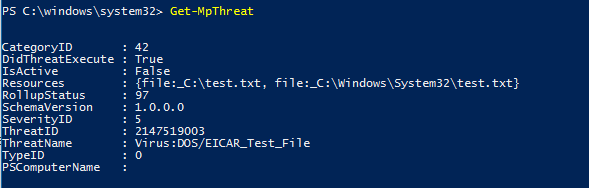

# Review Microsoft Defender Antivirus scan results

[!INCLUDE [Microsoft 365 Defender rebranding](../../includes/microsoft-defender.md)]


**Applies to:**

- [Microsoft Defender Advanced Threat Protection (Microsoft Defender ATP)](https://go.microsoft.com/fwlink/p/?linkid=2069559)

After a Microsoft Defender Antivirus scan completes, whether it is an [on-demand](run-scan-microsoft-defender-antivirus.md) or [scheduled scan](scheduled-catch-up-scans-microsoft-defender-antivirus.md), the results are recorded and you can view the results. 


## Use Configuration Manager to review scan results

See [How to monitor Endpoint Protection status](https://docs.microsoft.com/configmgr/protect/deploy-use/monitor-endpoint-protection).

## Use PowerShell cmdlets to review scan results

The following cmdlet will return each detection on the endpoint. If there are multiple detections of the same threat, each detection will be listed separately, based on the time of each detection:

```PowerShell
Get-MpThreatDetection
```


You can specify `-ThreatID` to limit the output to only show the detections for a specific threat.

If you want to list threat detections, but combine detections of the same threat into a single item, you can use the following cmdlet:

```PowerShell
Get-MpThreat
```



See [Use PowerShell cmdlets to configure and run Microsoft Defender Antivirus](use-powershell-cmdlets-microsoft-defender-antivirus.md) and [Defender cmdlets](https://technet.microsoft.com/itpro/powershell/windows/defender/index) for more information on how to use PowerShell with Microsoft Defender Antivirus.

## Use Windows Management Instruction (WMI) to review scan results

Use the [**Get** method of the **MSFT_MpThreat** and **MSFT_MpThreatDetection**](https://msdn.microsoft.com/library/dn439477(v=vs.85).aspx) classes.


## Related articles

- [Customize, initiate, and review the results of Microsoft Defender Antivirus scans and remediation](customize-run-review-remediate-scans-microsoft-defender-antivirus.md)
- [Microsoft Defender Antivirus in Windows 10](microsoft-defender-antivirus-in-windows-10.md)
