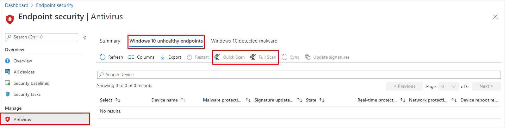

# Configure and run on-demand Microsoft Defender Antivirus scans

[!INCLUDE [Microsoft 365 Defender rebranding](../../includes/microsoft-defender.md)]

**Applies to:**

- [Microsoft Defender for Endpoint](/microsoft-365/security/defender-endpoint/)

You can run an on-demand scan on individual endpoints. These scans will start immediately, and you can define parameters for the scan, such as the location or type.

## Quick scan versus full scan

Quick scan looks at all the locations where there could be malware registered to start with the system, such as registry keys and known Windows startup folders.

> [!IMPORTANT]
> Microsoft Defender Antivirus runs in the context of the [LocalSystem](/windows/win32/services/localsystem-account) account when performing a local scan. For network scans, it uses the context of the device account. If the domain device account doesn't have appropriate permissions to access the share, the scan won't work. Ensure that the device has permissions to the access network share.

Combined with [always-on real-time protection capability](configure-real-time-protection-microsoft-defender-antivirus.md)--which reviews files when they're opened and closed, and whenever a user navigates to a folder--a quick scan helps provide strong coverage both for malware that starts with the system and kernel-level malware.  

In most instances, a quick scan is adequate to find malware that wasn't picked up by real-time protection.

A full scan can be useful on endpoints that have reported a malware threat. The scan can identify if there are any inactive components that require a more thorough clean-up. This is  ideal if your organization is running on-demand scans.

> [!NOTE]
> By default, quick scans run on mounted removable devices, such as USB drives.

## Use Microsoft Endpoint Manager to run a scan

1. Go to the Microsoft Endpoint Manager admin center ([https://endpoint.microsoft.com](https://endpoint.microsoft.com)) and log in.
2. Choose **Endpoint security** > **Antivirus**.
3. In the list of tabs, select **Windows 10 unhealthy endpoints**.
4. From the list of actions provided, select **Quick Scan** or **Full Scan**.

[  ](images/mem-antivirus-scan-on-demand.png#lightbox)

> [!TIP]
> For more information about using Microsoft Endpoint Manager to run a scan, see [Antimalware and firewall tasks: How to perform an on-demand scan](/configmgr/protect/deploy-use/endpoint-antimalware-firewall#how-to-perform-an-on-demand-scan-of-computers).

## Use the mpcmdrun.exe command-line utility to run a scan

Use the following `-scan` parameter:

```console
mpcmdrun.exe -scan -scantype 1
```

For more information about how to use the tool and additional parameters, including starting a full scan, or defining paths, see [Use the mpcmdrun.exe commandline tool to configure and manage Microsoft Defender Antivirus](command-line-arguments-microsoft-defender-antivirus.md).

## Use Microsoft Intune to run a scan

1. Go to the Microsoft Endpoint Manager admin center ([https://endpoint.microsoft.com](https://endpoint.microsoft.com)) and log in.
2. From the sidebar, select **Devices > All Devices** and choose the device you want to scan.
3. Select **...More**. From the options, select **Quick Scan** or **Full Scan**.

## Use the Windows Security app to run a scan

See [Run a scan in the Windows Security app](microsoft-defender-security-center-antivirus.md) for instructions on running a scan on individual endpoints.

## Use PowerShell cmdlets to run a scan

Use the following cmdlet:

```PowerShell
Start-MpScan
```

For more information on how to use PowerShell with Microsoft Defender Antivirus, see [Use PowerShell cmdlets to configure and run Microsoft Defender Antivirus](use-powershell-cmdlets-microsoft-defender-antivirus.md) and [Defender cmdlets](/powershell/module/defender/).

## Use Windows Management Instruction (WMI) to run a scan

Use the [**Start** method](/previous-versions/windows/desktop/defender/start-msft-mpscan) of the **MSFT_MpScan** class.

For more information about which parameters are allowed, see [Windows Defender WMIv2 APIs](/previous-versions/windows/desktop/defender/windows-defender-wmiv2-apis-portal)

## Related articles

- [Configure Microsoft Defender Antivirus scanning options](configure-advanced-scan-types-microsoft-defender-antivirus.md)
- [Configure scheduled Microsoft Defender Antivirus scans](scheduled-catch-up-scans-microsoft-defender-antivirus.md)
- [Microsoft Defender Antivirus in Windows 10](microsoft-defender-antivirus-in-windows-10.md)