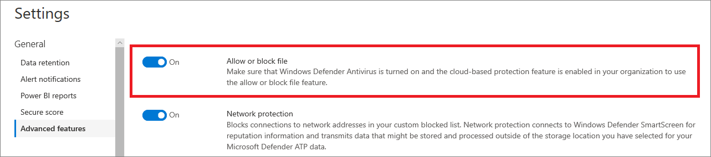

# Configure advanced features in Microsoft Defender ATP

**Applies to:**
- [Microsoft Defender Advanced Threat Protection (Microsoft Defender ATP)](https://go.microsoft.com/fwlink/p/?linkid=2069559)

>Want to experience Microsoft Defender ATP? [Sign up for a free trial.](https://www.microsoft.com/en-us/WindowsForBusiness/windows-atp?ocid=docs-wdatp-advancedfeats-abovefoldlink)

Depending on the Microsoft security products that you use, some advanced features might be available for you to integrate Microsoft Defender ATP with.

Use the following advanced features to get better protected from potentially malicious files and gain better insight during security investigations:

## Automated investigation

When you enable this feature, you'll be able to take advantage of the automated investigation and remediation features of the service. For more information, see [Automated investigations](automated-investigations.md).

## Live response

When you enable this feature, users with the appropriate permissions can initiate a live response session on machines.

For more information on role assignments see, [Create and manage roles](user-roles.md).

## Live response unsigned script execution

Enabling this feature allows you to run unsigned scripts in a live response session.

## Auto-resolve remediated alerts

For tenants created on or after Windows 10, version 1809 the automated investigations capability is configured by default to resolve alerts where the automated analysis result status is "No threats found" or "Remediated".  If you don’t want to have alerts auto-resolved, you’ll need to manually turn off the feature.

>[!TIP]
>For tenants created prior that version, you'll need to manually turn this feature on from the [Advanced features](https://securitycenter.windows.com/preferences2/integration) page.

>[!NOTE]
> - The result of the auto-resolve action may influence the Machine risk level calculation which is based on the active alerts found on a machine.  
>- If a security operations analyst manually sets the status of an alert to "In progress" or "Resolved" the auto-resolve capability will not overwrite it.

## Block file

Blocking is only available if your organization uses Windows Defender Antivirus as the active antimalware solution, and if the cloud-based protection feature is enabled.

This feature enables you to block potentially malicious files in your network. Blocking a file will prevent it from being read, written, or executed on machines in your organization.

To turn **Allow or block** files on:

1. In the navigation pane, select **Settings** > **Advanced features** > **Allow or block file**.

1. Toggle the setting between **On** and **Off**.

    

1. Select **Save preferences** at the bottom of the page.

Once you have enabled this feature, you can [block files](respond-file-alerts.md#allow-or-block-file) via the **Add Indicator** tab on a file's profile page.

## Show user details

When you enable this feature, you'll be able to see user details stored in Azure Active Directory including a user's picture, name, title, and department information  when investigating user account entities. You can find user account information in the following views:

- Security operations dashboard
- Alert queue
- Machine details page

For more information, see [Investigate a user account](investigate-user.md).

## Skype for Business integration

Enabling the Skype for Business integration gives you the ability to communicate with users using Skype for Business, email, or phone. This can be handy when you need to communicate with the user and mitigate risks.

>[!NOTE]
> When a machine is being isolated from the network, there's a pop-up where you can choose to enable Outlook and Skype communications which allows communications to the user while they are disconnected from the network. This setting applies to Skype and Outlook communication when machines are in isolation mode.

## Azure Advanced Threat Protection integration

The integration with Azure Advanced Threat Protection allows you to pivot directly into another Microsoft Identity security product. Azure Advanced Threat Protection augments an investigation with additional insights about a suspected compromised account and related resources. By enabling this feature, you'll enrich the machine-based investigation capability by pivoting across the network from an identify point of view.

>[!NOTE]
>You'll need to have the appropriate license to enable this feature.

### Enable the Microsoft Defender ATP integration from the Azure ATP portal

To receive contextual machine integration in Azure ATP, you'll also need to enable the feature in the Azure ATP portal.

1. Login to the [Azure portal](https://portal.atp.azure.com/) with a Global Administrator or Security Administrator role.

2. Click **Create a workspace** or use your primary workspace.

3. Toggle the Integration setting to **On** and click **Save**.

When you complete the integration steps on both portals, you'll be able to see relevant alerts in the machine details or user details page.

## Office 365 Threat Intelligence connection

This feature is only available if you have an active Office 365 E5 or the Threat Intelligence add-on. For more information, see the Office 365 Enterprise E5 product page.

When you enable this feature, you'll be able to incorporate data from Office 365 Advanced Threat Protection into Microsoft Defender Security Center to conduct a holistic security investigation across Office 365 mailboxes and Windows machines.

>[!NOTE]
>You'll need to have the appropriate license to enable this feature. 

To receive contextual machine integration in Office 365 Threat Intelligence, you'll need to enable the Microsoft Defender ATP settings in the Security & Compliance dashboard. For more information, see [Office 365 Threat Intelligence overview](https://support.office.com/en-us/article/Office-365-Threat-Intelligence-overview-32405DA5-BEE1-4A4B-82E5-8399DF94C512).

## Microsoft Threat Experts

Out of the two Microsoft Threat Expert components, targeted attack notification is in general availability, while  experts-on-demand capability is still in preview. You can only use the experts-on-demand capability if you have applied for preview and your application has been approved. You can receive targeted attack notifications from Microsoft Threat Experts through your Microsoft Defender ATP portal's alerts dashboard and via email if you configure it.

>[!NOTE]
>The Microsoft Threat Experts capability in Microsoft Defender ATP is available with an E5 license for [Enterprise Mobility + Security](https://www.microsoft.com/cloud-platform/enterprise-mobility-security).

## Microsoft Cloud App Security

Enabling this setting forwards Microsoft Defender ATP signals to Microsoft Cloud App Security to provide deeper visibility into cloud application usage. Forwarded data is stored and processed in the same location as your Cloud App Security data.

>[!NOTE]
>This feature will be available with an E5 license for [Enterprise Mobility + Security](https://www.microsoft.com/cloud-platform/enterprise-mobility-security) on machines running Windows 10, version 1709 (OS Build 16299.1085 with [KB4493441](https://support.microsoft.com/help/4493441)), Windows 10, version 1803 (OS Build 17134.704 with [KB4493464](https://support.microsoft.com/help/4493464)), Windows 10, version 1809 (OS Build 17763.379 with [KB4489899](https://support.microsoft.com/help/4489899)) or later Windows 10 versions.

## Azure Information Protection

Turning this setting on forwards signals to Azure Information Protection, giving data owners and administrators visibility into protected data on onboarded machines and machine risk ratings.

## Microsoft Intune connection

Microsoft Defender ATP can be integrated with [Microsoft Intune](https://docs.microsoft.com/intune/what-is-intune) to [enable device risk-based conditional access](https://docs.microsoft.com/intune/advanced-threat-protection#enable-windows-defender-atp-in-intune). When you [enable this feature](configure-conditional-access.md), you'll be able to share Microsoft Defender ATP device information with Intune, enhancing policy enforcement.

>[!IMPORTANT]
>You'll need to enable the integration on both Intune and Microsoft Defender ATP to use this feature. For more information on specific steps, see [Configure Conditional Access in Microsoft Defender ATP](configure-conditional-access.md).

This feature is only available if you have the following:

- A licensed tenant for Enterprise Mobility + Security E3, and Windows E5 (or Microsoft 365 Enterprise E5)
- An active Microsoft Intune environment, with Intune-managed Windows 10 devices [Azure AD-joined](https://docs.microsoft.com/azure/active-directory/devices/concept-azure-ad-join/).

### Conditional Access policy

When you enable Intune integration, Intune will automatically create a classic Conditional Access (CA) policy. This classic CA policy is a prerequisite for setting up status reports to Intune. It should not be deleted.

>[!NOTE]
> The classic CA policy created by Intune is distinct from modern [Conditional Access policies](https://docs.microsoft.com/azure/active-directory/conditional-access/overview/), which are used for configuring endpoints.

## Preview features

Learn about new features in the Microsoft Defender ATP preview release and be among the first to try upcoming features by turning on the preview experience.

You'll have access to upcoming features which you can provide feedback on to help improve the overall experience before features are generally available.

## Enable advanced features

1. In the navigation pane, select **Preferences setup** > **Advanced features**.
2. Select the advanced feature you want to configure and toggle the setting between **On** and **Off**.
3. Click **Save preferences**.

## Related topics

- [Update data retention settings](data-retention-settings.md)
- [Configure alert notifications](configure-email-notifications.md)
- [Enable and create Power BI reports using Microsoft Defender ATP data](powerbi-reports.md)
- [Enable Secure Score security controls](enable-secure-score.md)
