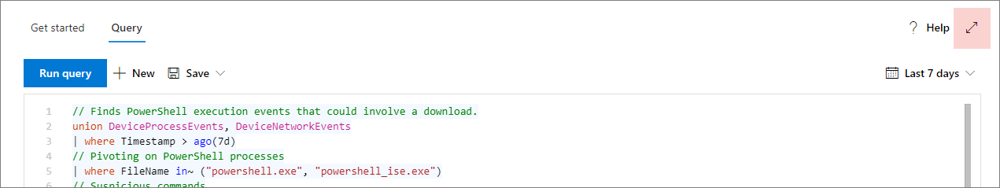
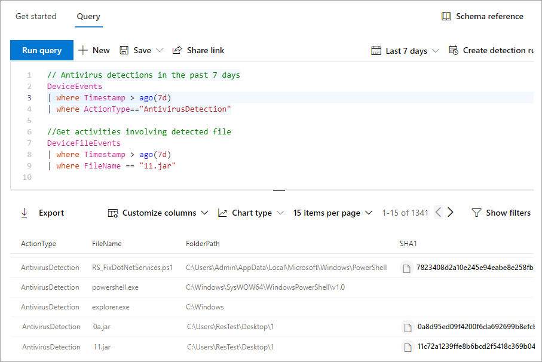

# Learn the advanced hunting query language

[!INCLUDE [Microsoft 365 Defender rebranding](../../includes/microsoft-defender.md)]

**Applies to:**
- [Defender for Endpoint](https://go.microsoft.com/fwlink/p/?linkid=2146631)

> Want to experience Defender for Endpoint? [Sign up for a free trial.](https://www.microsoft.com/microsoft-365/windows/microsoft-defender-atp?ocid=docs-wdatp-advancedhunting-abovefoldlink)

Advanced hunting is based on the [Kusto query language](https://docs.microsoft.com/azure/kusto/query/). You can use Kusto operators and statements to construct queries that locate information in a specialized [schema](advanced-hunting-schema-reference.md). To understand these concepts better, run your first query.

## Try your first query

In Microsoft Defender Security Center, go to **Advanced hunting** to run your first query. Use the following example:

```kusto
// Finds PowerShell execution events that could involve a download
union DeviceProcessEvents, DeviceNetworkEvents
| where Timestamp > ago(7d)
// Pivoting on PowerShell processes
| where FileName in~ ("powershell.exe", "powershell_ise.exe")
// Suspicious commands
| where ProcessCommandLine has_any("WebClient",
    "DownloadFile",
    "DownloadData",
    "DownloadString",
    "WebRequest",
    "Shellcode",
    "http",
    "https")
| project Timestamp, DeviceName, InitiatingProcessFileName, InitiatingProcessCommandLine, 
FileName, ProcessCommandLine, RemoteIP, RemoteUrl, RemotePort, RemoteIPType
| top 100 by Timestamp
```
**[Run this query in advanced hunting](https://securitycenter.windows.com/hunting?query=H4sIAAAAAAAEAI2TT0vDQBDF5yz4HUJPFcTqyZsXqyCIBFvxKNGWtpo_NVlbC8XP7m8mado0K5Zls8nkzdu3b2Z70pNAbmUmqYyk4D2UTJYyllwGMmWNGQHrN_NNvsSBzUBrbMFMiWieAx3xDEBl4GL4AuNd8B0bNgARENcdUmIZ3yM5liPwac3bN-YZPGPU5ET1rWDc7Ox4uod8YDp4MzI-GkjlX4Ne2nly0zEkKzFWh4ZE5sSuTN8Ehq5couvEMnvmUAhez-HsRBMipVa_W_OG6vEfGtT12JRHpqV064e1Kx04NsxFzXxW1aFjp_djXmDRPbfY3XMMcLogTz2bWZ2KqmIJI6q6wKe2WYnrRsa9KVeU9kCBBo2v7BzPxF_Bx2DKiqh63SGoRoc6Njti48z_yL71XHQAcgAur6rXRpcqH3l-4knZF23Utsbq2MircEqmw-G__xR1TdZ1r7zb7XLezmx3etkvGr-ze6NdGdW92azUfpcdluWvr-aqbh_nofnqcWI3aYyOsBV7giduRUO7187LMKTT5rxvHHX80_t8IeeMgLquvL7-Ak3q-kz8BAAA&runQuery=true&timeRangeId=week)**

### Describe the query and specify the tables to search
A short comment has been added to the beginning of the query to describe what it is for. This comment helps if you later decide to save the query and share it with others in your organization.

```kusto
// Finds PowerShell execution events that could involve a download
```
The query itself will typically start with a table name followed by several elements that start with a pipe (`|`). In this example, we start by creating a union of two tables,  `DeviceProcessEvents` and `DeviceNetworkEvents`, and add piped elements as needed.

```kusto
union DeviceProcessEvents, DeviceNetworkEvents
```
### Set the time range
The first piped element is a time filter scoped to the previous seven days. Limiting the time range helps ensure that queries perform well, return manageable results, and don't time out.

```kusto
| where Timestamp > ago(7d)
```

### Check specific processes
The time range is immediately followed by a search for process file names representing the PowerShell application.

```kusto
// Pivoting on PowerShell processes
| where FileName in~ ("powershell.exe", "powershell_ise.exe")
```

### Search for specific command strings
Afterwards, the query looks for strings in command lines that are typically used to download files using PowerShell.

```kusto
// Suspicious commands
| where ProcessCommandLine has_any("WebClient",
    "DownloadFile",
    "DownloadData",
    "DownloadString",
    "WebRequest",
    "Shellcode",
    "http",
    "https")
```

### Customize result columns and length 
Now that your query clearly identifies the data you want to locate, you can define what the results look like. `project` returns specific columns, and `top` limits the number of results. These operators help ensure the results are well-formatted and reasonably large and easy to process.

```kusto
| project Timestamp, DeviceName, InitiatingProcessFileName, InitiatingProcessCommandLine, 
FileName, ProcessCommandLine, RemoteIP, RemoteUrl, RemotePort, RemoteIPType
| top 100 by Timestamp
```

Select **Run query** to see the results. Use the expand icon at the top right of the query editor to focus on your hunting query and the results. 



>[!TIP]
>You can view query results as charts and quickly adjust filters. For guidance, [read about working with query results](advanced-hunting-query-results.md)

## Learn common query operators for advanced hunting

You've just run your first query and have a general idea of its components. It's time to backtrack slightly and learn some basics. The Kusto query language used by advanced hunting supports a range of operators, including the following common ones.

| Operator | Description and usage |
|--|--|
| `where` | Filter a table to the subset of rows that satisfy a predicate. |
| `summarize` | Produce a table that aggregates the content of the input table. |
| `join` | Merge the rows of two tables to form a new table by matching values of the specified column(s) from each table. |
| `count` | Return the number of records in the input record set. |
| `top` | Return the first N records sorted by the specified columns. |
| `limit` | Return up to the specified number of rows. |
| `project` | Select the columns to include, rename or drop, and insert new computed columns. |
| `extend` | Create calculated columns and append them to the result set. |
| `makeset` |  Return a dynamic (JSON) array of the set of distinct values that Expr takes in the group. |
| `find` | Find rows that match a predicate across a set of tables. |

To see a live example of these operators, run them from the **Get started** section of the advanced hunting page.

## Understand data types

Advanced hunting supports Kusto data types, including the following common types:

| Data type | Description and query implications |
|--|--|
| `datetime` | Data and time information typically representing event timestamps. [See supported datetime formats](https://docs.microsoft.com/azure/data-explorer/kusto/query/scalar-data-types/datetime) |
| `string` | Character string in UTF-8 enclosed in single quotes (`'`) or double quotes (`"`). [Read more about strings](https://docs.microsoft.com/azure/data-explorer/kusto/query/scalar-data-types/string) |
| `bool` | This data type supports `true` or `false` states. [See supported literals and operators](https://docs.microsoft.com/azure/data-explorer/kusto/query/scalar-data-types/bool) |
| `int` | 32-bit integer  |
| `long` | 64-bit integer |

To learn more about these data types, [read about Kusto scalar data types](https://docs.microsoft.com/azure/data-explorer/kusto/query/scalar-data-types/).

## Get help as you write queries
Take advantage of the following functionality to write queries faster:

- **Autosuggest**—as you write queries, advanced hunting provides suggestions from IntelliSense.
- **Schema tree**—a schema representation that includes the list of tables and their columns is provided next to your working area. For more information, hover over an item. Double-click an item to insert it to the query editor.
- **[Schema reference](advanced-hunting-schema-reference.md#get-schema-information-in-the-security-center)**—in-portal reference with table and column descriptions as well as supported event types (`ActionType` values) and sample queries

## Work with multiple queries in the editor
You can use the query editor to experiment with multiple queries. To use multiple queries:

- Separate each query with an empty line.
- Place the cursor on any part of a query to select that query before running it. This will run only the selected query. To run another query, move the cursor accordingly and select **Run query**.


_Query editor with multiple queries_


## Use sample queries

The **Get started** section provides a few simple queries using commonly used operators. Try running these queries and making small modifications to them.


> [!NOTE]
> Apart from the basic query samples, you can also access [shared queries](advanced-hunting-shared-queries.md) for specific threat hunting scenarios. Explore the shared queries on the left side of the page or the [GitHub query repository](https://aka.ms/hunting-queries).

## Access comprehensive query language reference

For detailed information about the query language, see [Kusto query language documentation](https://docs.microsoft.com/azure/kusto/query/).

## Related topics
- [Advanced hunting overview](advanced-hunting-overview.md)
- [Work with query results](advanced-hunting-query-results.md)
- [Use shared queries](advanced-hunting-shared-queries.md)
- [Understand the schema](advanced-hunting-schema-reference.md)
- [Apply query best practices](advanced-hunting-best-practices.md)
