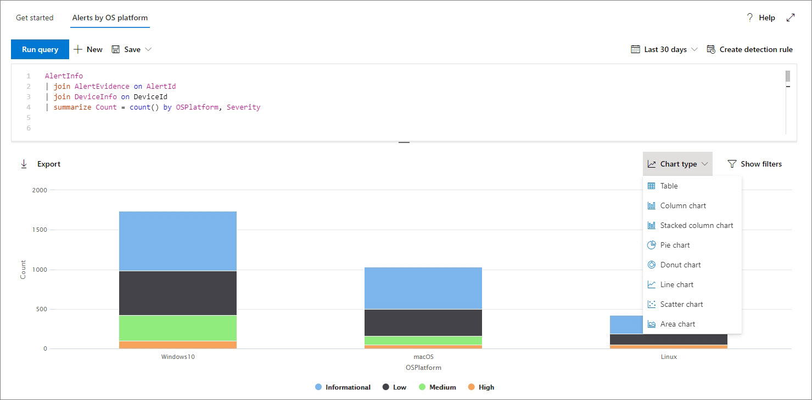
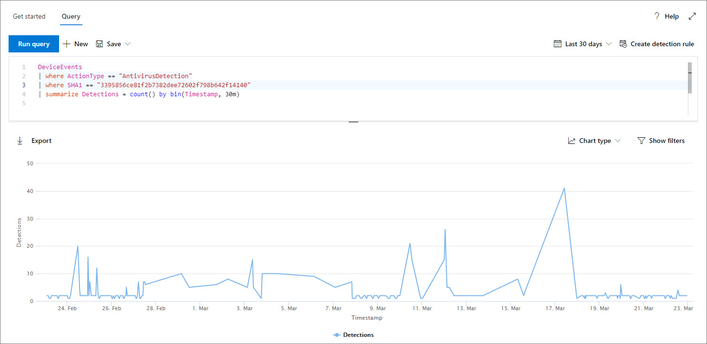
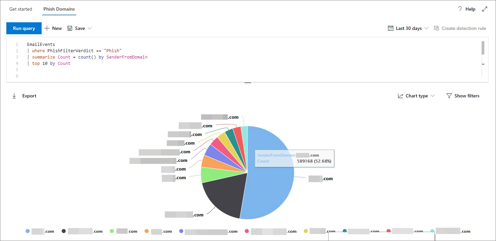

# Work with advanced hunting query results

**Applies to:**
- [Microsoft Defender Advanced Threat Protection (Microsoft Defender ATP)](https://go.microsoft.com/fwlink/p/?linkid=2069559)

>Want to experience Microsoft Defender ATP? [Sign up for a free trial.](https://www.microsoft.com/microsoft-365/windows/microsoft-defender-atp?ocid=docs-wdatp-advancedhunting-abovefoldlink)

While you can construct your [advanced hunting](advanced-hunting-overview.md) queries to return very precise information, you can also work with the query results to gain further insight and investigate specific activities and indicators. You can take the following actions on your query results:

- View results as a table or charts
- Export tables and charts
- Drill down to detailed entity information
- Tweak your queries directly from the results or apply filters

## View query results as tables or charts
By default, advanced hunting displays query results as tabular data. You can also display the same data as a chart.

*Query results for alerts by platform and severity displayed as a stacked chart*

To render charts, advanced hunting automatically identifies columns of interest and numeric values to aggregate. Advanced hunting supports the following views: 

| View type | Description |
| -- | -- |
| **Table** | Displays the query results in tabular format |
| **Column chart** | Renders a series of unique items on the x-axis as vertical bars whose heights represent numeric values from another field |
| **Stacked column chart** | Renders a series of unique items on the x-axis as stacked vertical bars whose heights represent numeric values from one or more other fields |
| **Pie chart** | Renders sectional pies representing unique items. The size of each pie represents numeric values from another field. |
| **Donut chart** | Renders sectional arcs representing unique items. The length of each arc represents numeric values from another field. |
| **Line chart** | Plots numeric values for a series of unique items and connects the plotted values |
| **Scatter chart** | Plots numeric values for a series of unique items |
| **Area chart** | Plots numeric values for a series of unique items and fills the sections below the plotted values |

*Line chart showing the number of events involving a specific file over time*

*Pie chart showing distribution of phishing emails by sender domain*

## Export tables and charts
After running a query, select **Export** to save the results to local file. Your chosen view determines how the results are exported:

- **Table view** — the query results are exported in tabular form as a Microsoft Excel workbook
- **Any chart** — the query results are exported as a JPEG image of the rendered chart

## Drill down from query results
To view more information about entities, such as machines, files, users, IP addresses, and URLs, in your query results, simply click the entity identifier. This opens a detailed profile page for the selected entity in Microsoft Defender Security Center.

## Tweak your queries from the results
Right-click a value in the result set to quickly enhance your query. You can use the options to:

- Explicitly look for the selected value (`==`)
- Exclude the selected value from the query (`!=`)
- Get more advanced operators for adding the value to your query, such as `contains`, `starts with` and `ends with` 

## Filter the query results
The filters displayed to the right provide a summary of the result set. Each column has its own section that lists the distinct values found for that column and the number of instances.

Refine your query by selecting the `+` or `-` buttons on the values that you want to include or exclude and then selecting **Run query**.

Once you apply the filter to modify the query and then run the query, the results are updated accordingly.

## Related topics
- [Advanced hunting overview](advanced-hunting-overview.md)
- [Learn the query language](advanced-hunting-query-language.md)
- [Use shared queries](advanced-hunting-shared-queries.md)
- [Hunt for threats across devices and emails](advanced-hunting-query-emails-devices.md)
- [Understand the schema](advanced-hunting-schema-tables.md)
- [Apply query best practices](advanced-hunting-best-practices.md)
- [Custom detections overview](custom-detections-overview.md)
