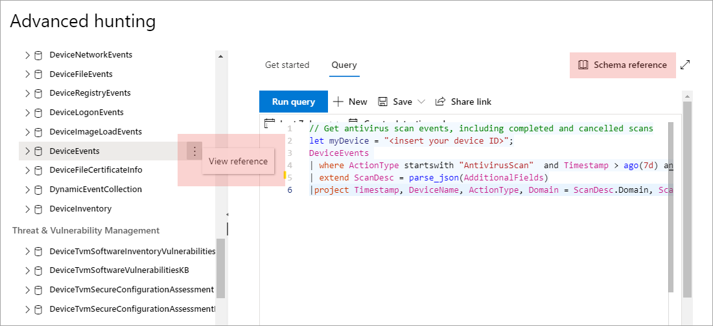

# Understand the advanced hunting schema

[!INCLUDE [Microsoft 365 Defender rebranding](../../includes/microsoft-defender.md)]

**Applies to:**
- [Microsoft Defender for Endpoint](https://go.microsoft.com/fwlink/?linkid=2154037)

>Want to experience Defender for Endpoint? [Sign up for a free trial.](https://www.microsoft.com/microsoft-365/windows/microsoft-defender-atp?ocid=docs-wdatp-advancedhuntingref-abovefoldlink)

[!include[Prerelease information](../../includes/prerelease.md)]

The [advanced hunting](advanced-hunting-overview.md) schema is made up of multiple tables that provide either event information or information about devices and other entities. To effectively build queries that span multiple tables, you need to understand the tables and the columns in the advanced hunting schema.

## Get schema information in the security center
While constructing queries, use the built-in schema reference to quickly get the following information about each table in the schema:

- **Tables description**—type of data contained in the table and the source of that data.
- **Columns**—all the columns in the table.
- **Action types**—possible values in the `ActionType` column representing the event types supported by the table. This is provided only for tables that contain event information.
- **Sample query**—example queries that feature how the table can be utilized.

### Access the schema reference
To quickly access the schema reference, select the **View reference** action next to the table name in the schema representation. You can also select **Schema reference** to search for a table.

## Learn the schema tables

The following reference lists all the tables in the advanced hunting schema. Each table name links to a page describing the column names for that table.

Table and column names are also listed within the Microsoft Defender Security Center, in the schema representation on the advanced hunting screen.

| Table name | Description |
|------------|-------------|
| **[DeviceAlertEvents](advanced-hunting-devicealertevents-table.md)** | Alerts on Microsoft Defender Security Center |
| **[DeviceInfo](advanced-hunting-deviceinfo-table.md)** | Device information, including OS information |
| **[DeviceNetworkInfo](advanced-hunting-devicenetworkinfo-table.md)** | Network properties of devices, including adapters, IP and MAC addresses, as well as connected networks and domains |
| **[DeviceProcessEvents](advanced-hunting-deviceprocessevents-table.md)** | Process creation and related events |
| **[DeviceNetworkEvents](advanced-hunting-devicenetworkevents-table.md)** | Network connection and related events |
| **[DeviceFileEvents](advanced-hunting-devicefileevents-table.md)** | File creation, modification, and other file system events |
| **[DeviceRegistryEvents](advanced-hunting-deviceregistryevents-table.md)** | Creation and modification of registry entries |
| **[DeviceLogonEvents](advanced-hunting-devicelogonevents-table.md)** | Sign-ins and other authentication events |
| **[DeviceImageLoadEvents](advanced-hunting-deviceimageloadevents-table.md)** | DLL loading events |
| **[DeviceEvents](advanced-hunting-deviceevents-table.md)** | Multiple event types, including events triggered by security controls such as Microsoft Defender Antivirus and exploit protection |
| **[DeviceFileCertificateInfo](advanced-hunting-devicefilecertificateinfo-table.md)** | Certificate information of signed files obtained from certificate verification events on endpoints |
| **[DeviceTvmSoftwareInventory](advanced-hunting-devicetvmsoftwareinventory-table.md)** | Inventory of software installed on devices, including their version information and end-of-support status |
| **[DeviceTvmSoftwareVulnerabilities](advanced-hunting-devicetvmsoftwarevulnerabilities-table.md)** | Software vulnerabilities found on devices and the list of available security updates that address each vulnerability |
| **[DeviceTvmSoftwareVulnerabilitiesKB ](advanced-hunting-devicetvmsoftwarevulnerabilitieskb-table.md)** | Knowledge base of publicly disclosed vulnerabilities, including whether exploit code is publicly available |
| **[DeviceTvmSecureConfigurationAssessment](advanced-hunting-devicetvmsecureconfigurationassessment-table.md)** | Threat & Vulnerability Management assessment events, indicating the status of various security configurations on devices |
| **[DeviceTvmSecureConfigurationAssessmentKB](advanced-hunting-devicetvmsecureconfigurationassessmentkb-table.md)** | Knowledge base of various security configurations used by Threat & Vulnerability Management to assess devices; includes mappings to various standards and benchmarks |

## Related topics
- [Advanced hunting overview](advanced-hunting-overview.md)
- [Learn the query language](advanced-hunting-query-language.md)
- [Work with query results](advanced-hunting-query-results.md)
- [Apply query best practices](advanced-hunting-best-practices.md)
- [Custom detections overview](overview-custom-detections.md)
- [Advanced hunting data schema changes](https://techcommunity.microsoft.com/t5/microsoft-defender-atp/advanced-hunting-data-schema-changes/ba-p/1043914)
