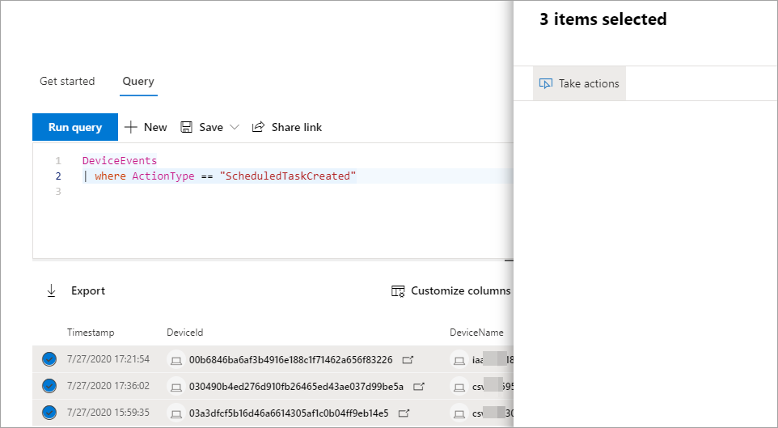

# Take action on advanced hunting query results

**Applies to:**
- [Microsoft Defender Advanced Threat Protection (Microsoft Defender ATP)](https://go.microsoft.com/fwlink/p/?linkid=2069559)

> Want to experience Microsoft Defender ATP? [Sign up for a free trial.](https://www.microsoft.com/microsoft-365/windows/microsoft-defender-atp?ocid=docs-wdatp-advancedhuntingref-abovefoldlink)

You can quickly contain threats or address compromised assets that you find in [advanced hunting](advanced-hunting-overview.md) using powerful and comprehensive action options. With these options, you can:

- Take various actions on devices
- Quarantine files

## Required permissions

To be able to take action through advanced hunting, you need a role in Microsoft Defender ATP with [permissions to submit remediation actions on devices](https://docs.microsoft.com/windows/security/threat-protection/microsoft-defender-atp/user-roles#permission-options). If you can't take action, contact a global administrator about getting the following permission:

*Active remediation actions > Threat and vulnerability management - Remediation handling*

## Take various actions on devices

You can take the following actions on devices identified by the `DeviceId` column in you query results:

- Isolate affected devices to contain an infection or prevent attacks from moving laterally
- Collect investigation package to obtain more forensic information
- Run an antivirus scan to find and remove threats using the latest security intelligence updates
- Initiate an automated investigation to check and remediate threats on the device and possibly other affected devices
- Restrict app execution to only Microsoft-signed executable files, preventing subsequent threat activity through malware or other untrusted executables

To learn more about how these response actions are performed through Microsoft Defender ATP, [read about response actions on devices](respond-machine-alerts.md).

## Quarantine files

You can deploy the *quarantine* action on files so that they are automatically quarantined when encountered. When selecting this action, you can choose between the following columns to identify which files in your query results to quarantine:

- `SHA1` — In most advanced hunting tables, this is the SHA-1 of the file that was affected by the recorded action. For example, if a file was copied, this would be the copied file.
- `InitiatingProcessSHA1` — In most advanced hunting tables, this is the file responsible for initiating the recorded action. For example, if a child process was launched, this would be the parent process. 
- `SHA256` — This is the SHA-256 equivalent of the file identified by the `SHA1` column.
- `InitiatingProcessSHA256` — This is the SHA-256 equivalent of the file identified by the `InitiatingProcessSHA1` column.

To learn more about how quarantine actions are taken and how files can be restored, [read about response actions on files](respond-file-alerts.md).

>[!NOTE]
>To locate files and quarantine them, the query results should also include `DeviceId` values as device identifiers.  

## Take action

To take any of the described actions, select one or more records in your query results and then select **Take actions**. A wizard will guide you through the process of selecting and then submitting your preferred actions.

## Review actions taken

Each action is individually recorded in the action center, under **Action center** > **History** ([security.microsoft.com/action-center/history](https://security.microsoft.com/action-center/history)). Go to the action center to check the status of each action.
 
## Related topics

- [Advanced hunting overview](advanced-hunting-overview.md)
- [Learn the query language](advanced-hunting-query-language.md)
- [Understand the schema](advanced-hunting-schema-reference.md)
- [Work with query results](advanced-hunting-query-results.md)
- [Apply query best practices](advanced-hunting-best-practices.md)
- [Custom detections overview](overview-custom-detections.md)
