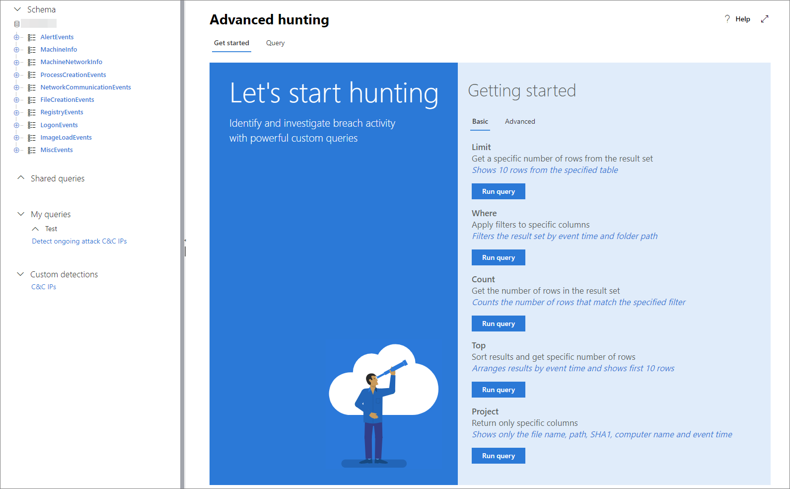
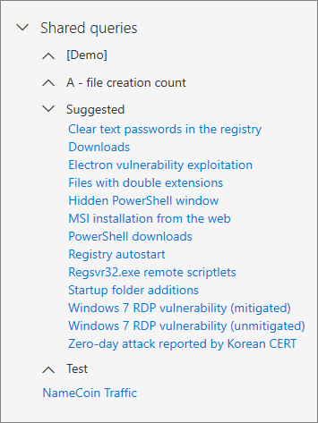
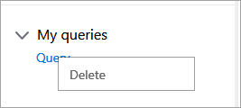
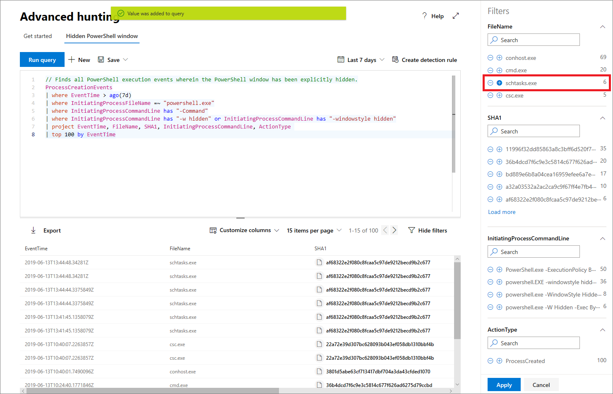

# Query data using Advanced hunting in Microsoft Defender ATP

>Want to experience Microsoft Defender ATP? [Sign up for a free trial.](https://www.microsoft.com/WindowsForBusiness/windows-atp?ocid=docs-wdatp-advancedhunting-abovefoldlink)

To get you started in querying your data, you can use the Basic or Advanced query examples, which have some preloaded queries to help you understand the basic query syntax.

## Use advanced hunting to query data

A typical query starts with a table name followed by a series of operators separated by **|**.

In the following example, we start with the table name **ProcessCreationEvents** and add piped elements as needed.

First, we define a time filter to review only records from the previous seven days. 

We then add a filter on the _FileName_  to contain only instances of _powershell.exe_.

Afterwards, we add a filter on the _ProcessCommandLine_. 

Finally, we  project only the columns we're interested in exploring and limit the results to 100 and click **Run query**.

You have the option of expanding the screen view so you can focus on your hunting query and related results.

### Use operators
The query language is very powerful and has a lot of available operators, some of them are - 

- **where** - Filter a table to the subset of rows that satisfy a predicate.
- **summarize** - Produce a table that aggregates the content of the input table.
- **join** - Merge the rows of two tables to form a new table by matching values of the specified column(s) from each table.
- **count** - Return the number of records in the input record set.
- **top** - Return the first N records sorted by the specified columns.
- **limit** - Return up to the specified number of rows.
- **project** - Select the columns to include, rename or drop, and insert new computed columns.
- **extend** - Create calculated columns and append them to the result set.
- **makeset** -  Return a dynamic (JSON) array of the set of distinct values that Expr takes in the group
- **find** - Find rows that match a predicate across a set of tables.

To see a live example of these operators, run them as part of the **Get started** section.

## Access query language documentation

For more information on the query language and supported operators, see  [Query Language](https://docs.microsoft.com/azure/log-analytics/query-language/query-language).

## Use exposed tables in Advanced hunting

The following tables are exposed as part of Advanced hunting:

- **AlertEvents** - Alerts on Microsoft Defender Security Center 
- **MachineInfo** - Machine information, including OS information 
- **MachineNetworkInfo** - Network properties of machines, including adapters, IP and MAC addresses, as well as connected networks and domains
- **ProcessCreationEvents** - Process creation and related events 
- **NetworkCommunicationEvents** - Network connection and related events
- **FileCreationEvents** - File creation, modification, and other file system events
- **RegistryEvents** - Creation and modification of registry entries 
- **LogonEvents** - Login and other authentication events 
- **ImageLoadEvents** - DLL loading events  
- **MiscEvents** - Multiple event types, such as process injection, creation of scheduled tasks, and LSASS access attempts

These tables include data from the last 30 days.

## Use shared queries
Shared queries are prepopulated queries that give you a starting point on running queries on your organization's data. It includes a couple of examples that help demonstrate the query language capabilities.

You can save, edit, update, or delete queries.

### Save a query
You can create or modify a query and save it as your own query or share it with users who are in the same tenant. 

1. Create or modify a query. 

2. Click the **Save query** drop-down button and select **Save as**.
    
3. Enter a name for the query. 

   

4. Select the folder where you'd like to save the query.
    - Shared queries - Allows other users in the tenant to access the query
    - My query - Accessible only to the user who saved the query
    
5. Click **Save**. 

### Update a query
These steps guide you on modifying and overwriting an existing query.

1. Edit an existing query.

2. Click the **Save**.

### Delete a query
1. Right-click on a query you want to delete.

    

2. Select **Delete** and confirm that you want to delete the query.

## Result set capabilities in Advanced hunting

The result set has several capabilities to provide you with effective investigation, including:

- Columns that return entity-related objects, such as Machine name, Machine ID, File name, SHA1, User, IP, and URL, are linked to their entity pages in Microsoft Defender Security Center.
- You can right-click on a cell in the result set and add a filter to your written query. The current filtering options are **include**, **exclude** or **advanced filter**, which provides additional filtering options on the cell value. These cell values are part of the row set. 

## Filter results in Advanced hunting
In Advanced hunting, you can use the advanced filter on the output result set of the query. 
The filters provide an overview of the result set where 
each column has it's own section and shows the distinct values that appear in the column and their prevalence.

You can refine your query based on the filter by clicking the "+" or "-" buttons on the values that you want to include or exclude and click **Run query**.

The filter selections will resolve as an additional query term and the results will be updated accordingly.

## Public Advanced hunting query GitHub repository  
Check out the [Advanced hunting repository](https://github.com/Microsoft/WindowsDefenderATP-Hunting-Queries). Contribute and use example queries shared by our customers. 

>Want to experience Microsoft Defender ATP? [Sign up for a free trial.](https://www.microsoft.com/WindowsForBusiness/windows-atp?ocid=docs-wdatp-advancedhunting-belowfoldlink)

## Related topic
- [Advanced hunting reference](advanced-hunting-reference.md)
- [Advanced hunting query language best practices](advanced-hunting-best-practices.md)
