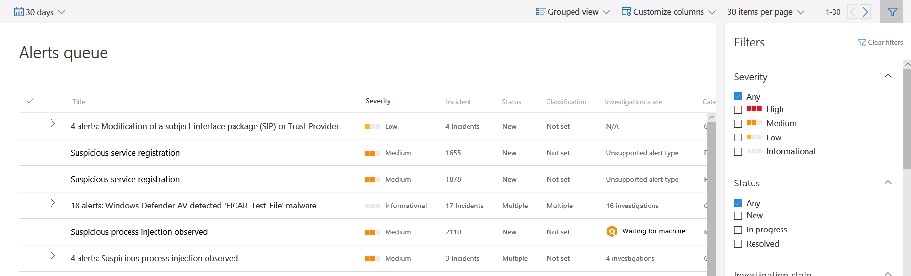

# View and organize the Microsoft Defender Advanced Threat Protection Alerts queue

**Applies to:**
- [Microsoft Defender Advanced Threat Protection (Microsoft Defender ATP)](https://go.microsoft.com/fwlink/p/?linkid=2069559)

>Want to experience Microsoft Defender ATP? [Sign up for a free trial.](https://www.microsoft.com/en-us/WindowsForBusiness/windows-atp?ocid=docs-wdatp-alertsq-abovefoldlink) 

The **Alerts queue** shows a list of alerts that were flagged from machines in your network. By default, the queue displays alerts seen in the last 30 days in a grouped view, with the most recent alerts showing at the top of the list, helping you see the most recent alerts first.

There are several options you can choose from to customize the alerts queue view. 

On the top navigation you can:
- Select grouped view or list view
- Customize columns to add or remove columns 
- Select the items to show per page
- Navigate between pages
- Apply filters

##  Sort, filter, and group the alerts queue
You can apply the following filters to limit the list of alerts and get a more focused view the alerts.

### Severity

Alert severity | Description
:---|:---
High  (Red) | Threats often associated with advanced persistent threats (APT). These alerts indicate a high risk due to the severity of damage they can inflict on machines.
Medium  (Orange) | Threats rarely observed in the organization, such as anomalous registry change, execution of suspicious files, and observed behaviors typical of attack stages.
Low  (Yellow) | Threats associated with prevalent malware and hack-tools that do not necessarily indicate an advanced threat targeting the organization.
Informational  (Grey) | Informational alerts are those that might not be considered harmful to the network but might be good to keep track of.

#### Understanding alert severity
It is important to understand that the Windows Defender Antivirus (Windows Defender AV) and Microsoft Defender ATP alert severities are different because they represent different scopes.

The Windows Defender AV threat severity represents the absolute severity of the detected threat (malware), and is assigned based on the potential risk to the individual machine, if infected.

The Microsoft Defender ATP alert severity represents the severity of the detected behavior, the actual risk to the machine but more importantly the potential risk to the organization.

So, for example:
-	The severity of a Microsoft Defender ATP alert about a Windows Defender AV detected threat that was completely prevented and did not infect the machine is categorized as "Informational" because there was no actual damage incurred.
-	An alert about a commercial malware was detected while executing, but blocked and remediated by Windows Defender AV, is categorized as  "Low" because it may have caused some damage to the individual machine but poses no organizational threat.
-	An alert about malware detected while executing which can pose a threat not only to the individual machine but to the organization, regardless if it was eventually blocked, may be ranked as "Medium" or "High".
-	Suspicious behavioral alerts which were not blocked or remediated will be ranked "Low", "Medium" or "High" following the same organizational threat considerations.

### Status
You can choose to limit the list of alerts based on their status.

### Investigation state
Corresponds to the automated investigation state.

### Assigned to
You can choose between showing alerts that are assigned to you or automation.

### Detection source
Select the source that triggered the alert detection.  Microsoft Threat Experts preview participants can now filter and see detections from the new threat experts managed hunting service.

>[!NOTE]
>The Windows Defender Antivirus filter will only appear if machines are using Windows Defender Antivirus as the default real-time protection antimalware product.

### OS platform
Limit the alerts queue view by selecting the OS platform that you're interested in investigating.

### Machine group
If you have specific machine groups that you're interested in checking the alerts on, you can select the groups to limit the alerts queue view to display just those machine groups.

### Associated threat
Use this filter to focus on alerts that are related to high profile threats. You can see the full list of high-profile threats in [Threat analytics](threat-analytics.md).

## Related topics
- [Manage Microsoft Defender Advanced Threat Protection alerts](manage-alerts.md)
- [Investigate Microsoft Defender Advanced Threat Protection alerts](investigate-alerts.md)
- [Investigate a file associated with a Microsoft Defender ATP alert](investigate-files.md)
- [Investigate machines in the Microsoft Defender ATP Machines list](investigate-machines.md)
- [Investigate an IP address associated with a Microsoft Defender ATP alert](investigate-ip.md)
- [Investigate a domain associated with a Microsoft Defender ATP alert](investigate-domain.md)
- [Investigate a user account in Microsoft Defender ATP](investigate-user.md)

