# Deploy Microsoft Defender ATP for Android with Microsoft Intune 

**Applies to:**

- [Microsoft Defender Advanced Threat Protection (Microsoft Defender ATP) for Android](microsoft-defender-atp-android.md)

This topic describes deploying Microsoft Defender ATP for Android on Intune
Company Portal enrolled devices. For more information about Intune device enrollment, see  [Enroll your
device](https://docs.microsoft.com/mem/intune/user-help/enroll-device-android-company-portal).

> [!NOTE]
> **Microsoft Defender ATP for Android is now available on Google Play.**
You can connect to Google Play from Intune to deploy app across Device Administrator and Android Enterprise entrollment modes. Updates to the app are automatic via Google Play.

## Deploy on Device Administrator enrolled devices

**Deploy Microsoft Defender ATP for Android on Intune Company Portal - Device
Administrator enrolled devices**

This topic describes how to deploy Microsoft Defender ATP for Android on Intune Company Portal - Device Administrator enrolled devices. 

> [!NOTE]
> If you have already deployed **Preview APK as "Line of Business (LOB)" app**, you need to redeploy by adding new app as "Android store app" 

### Add as Android store app

1. In [Microsoft Endpoint Manager admin
center](https://go.microsoft.com/fwlink/?linkid=2109431) , go to **Apps** \>
**Android Apps** \> **Add \> Android store app** and click **Select**.

    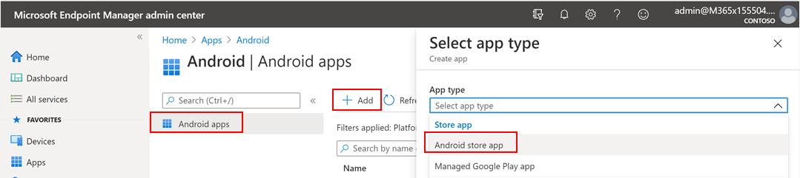

2. On the **Add app** page and in the *App Information* section enter **Name, Description**,
**Publisher** as Microsoft and 
**Appstore URL** as **Microsoft Defender ATP Preview** app Google Play Store URL: https://play.google.com/store/apps/details?id=com.microsoft.scmx
Other fields are optional and then select **Next**.

    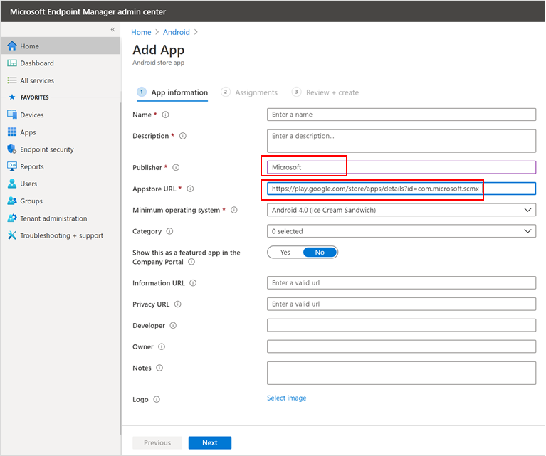

3. In the *Assignments* section, go to the **Required** section and select **Add
group.** You can then choose the user group(s) that you would like to target
Microsoft Defender ATP for Android app. Click **Select** and then **Next**.

    >[!NOTE]
    >The selected user group should consist of Intune enrolled users.

      

6. In the **Review+Create** section, verify that all the information entered is
correct and then select **Create**.

    In a few moments, the Microsoft Defender ATP app would be created successfully,
and a notification would show up at the top-right corner of the page.

    

7. In the app information page that is displayed, in the **Monitor** section,
select **Device install status** to verify that the device installation has
completed successfully.

    

### Complete onboarding and check status

1. Once Microsoft Defender ATP for Android has been installed on the device, you'll see the app icon.

    

2. Tap the Microsoft Defender ATP app icon and follow the on-screen instructions
to complete onboarding the app. The details include end-user acceptance of Android permissions required by Microsoft Defender ATP for Android.

>[!NOTE]
>If you already have **preview version of Microsoft Defender ATP app** installed, follow onboarding instruction to replace the existing version of app

3. Upon successful onboarding, the device will start showing up on the Devices
list in Microsoft Defender Security Center.

    

## Deploy on Android Enterprise enrolled devices

Microsoft Defender ATP for Android supports Android Enterprise enrolled devices.

For more information on the enrollment options supported by Intune, see 
[Enrollment
Options](https://docs.microsoft.com/mem/intune/enrollment/android-enroll) .

Currently only Personal devices with Work Profile enrolled  are supported for deployment. 

>[!NOTE]
> If you have already deployed **Preview version of Microsoft Defender for Android app**, you need to redeploy by adding new app as 'managed Google Play App'

## Add Microsoft Defender ATP for Android as a Managed Google Play app

Follow the steps below to add Microsoft
Defender ATP app into your managed Google Play.

1. In [Microsoft Endpoint Manager admin
center](https://go.microsoft.com/fwlink/?linkid=2109431) , go to **Apps** \>
**Android Apps** \> **Add** and select **managed Google Play app**.

    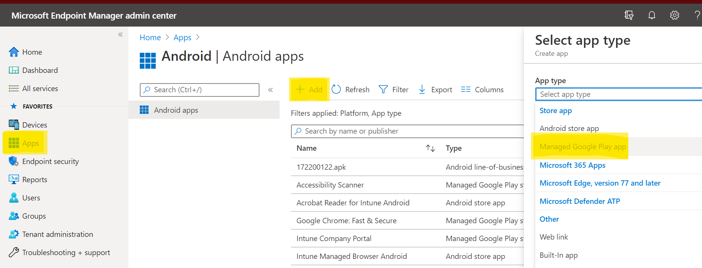

2. On your managed Google Play page that loads subsequently, go to the search
box and lookup **Microsoft Defender.** Your search should display the Microsoft
Defender ATP app in your Managed Google Play. Click on the Microsoft Defender
ATP app from the Apps search result.

    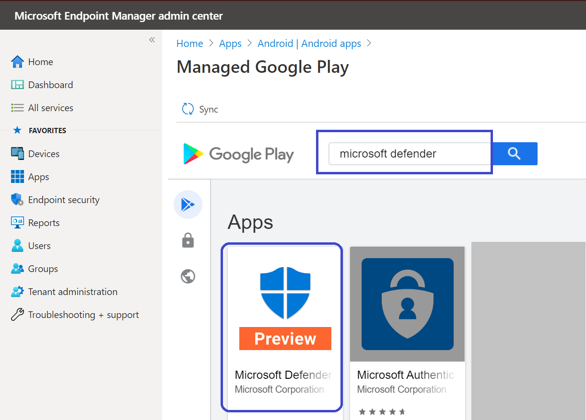

3. In the App description page that comes up next, you should be able to see app
details on Microsoft Defender ATP. Review the information on the page and then
select **Approve**.

    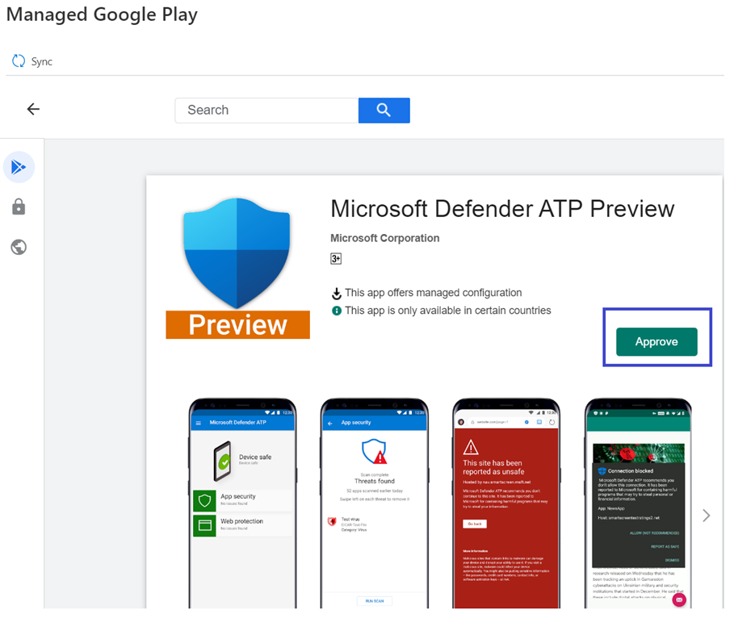

4. You should now be presented with the permissions that Microsoft Defender ATP
obtains for it to work. Review them and then select **Approve**.

    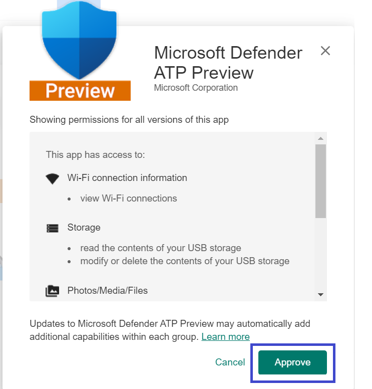

5. You'll be presented with the Approval settings page. The page confirms
your preference to handle new app permissions that Microsoft Defender ATP for
Android might ask. Review the choices and select your preferred option. Select
**Done**.

    By default, managed Google Play selects *Keep approved when app requests new
permissions*

   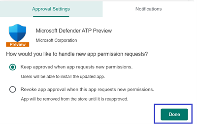

6. After the permissions handling selection is made, select **Sync** to sync
Microsoft Defender ATP to your apps list.

    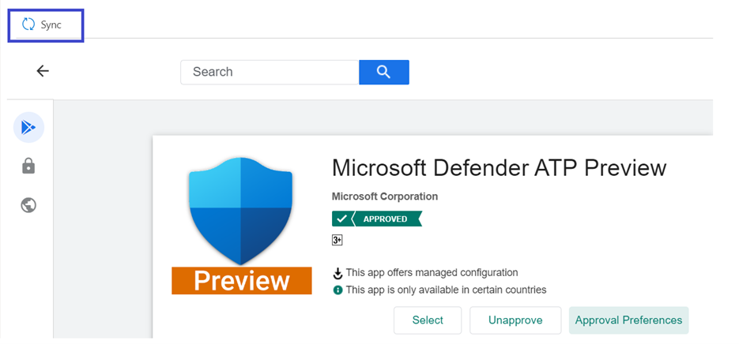

7. The sync will complete in a few minutes.

    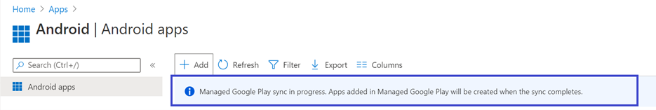

8. Select the **Refresh** button in the Android apps screen and Microsoft
Defender ATP should be visible in the apps list.

    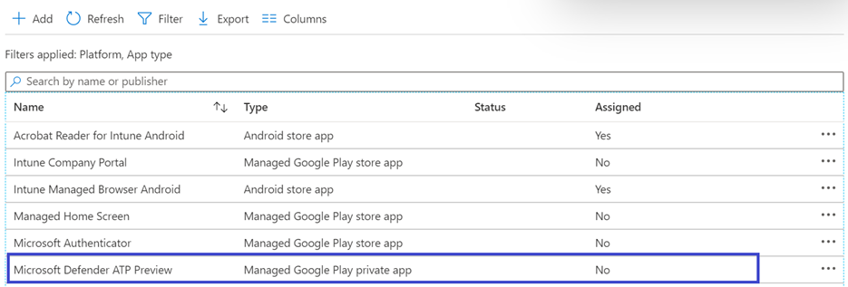

9. Microsoft Defender ATP supports App configuration policies for managed devices via Intune. This capability can be leveraged to autogrant applicable Android permission(s), so the end user does not need to accept these permission(s).

    a. In the **Apps** page, go to **Policy > App configuration policies > Add > Managed devices**.

    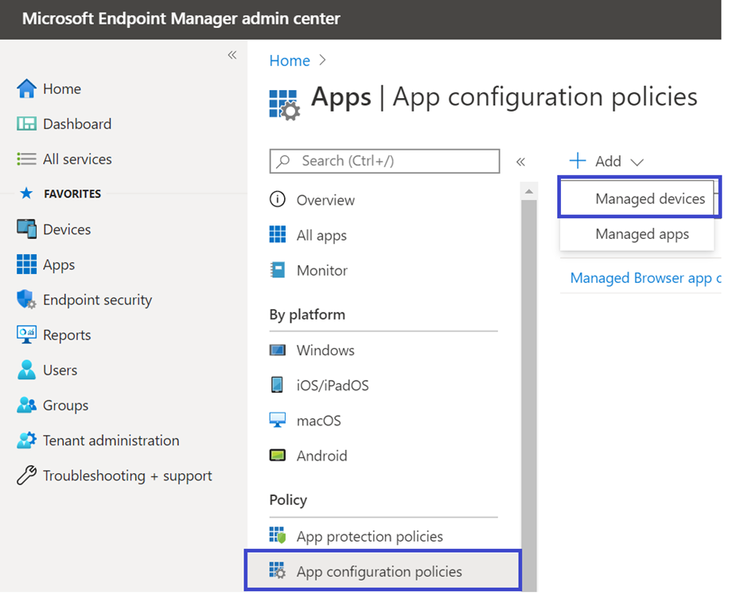

    b. In the **Create app configuration policy** page, enter the following details:
        - Name: Microsoft Defender ATP.
        - Choose **Android Enterprise** as platform.
        - Choose **Work Profile only** as Profile Type.
        - Click **Select App**, choose **Microsoft Defender ATP**, select **OK** and then **Next**.
    
    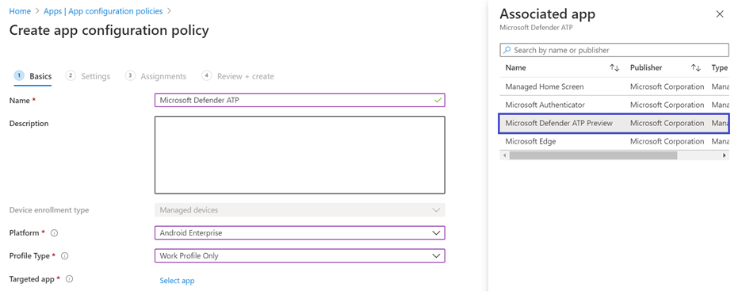

    c. In the **Settings** page, go to the Permissions section click on Add to view the list of supported permissions. In the Add Permissions section, select the following permissions 
    - External storage (read)
    - External storage (write)

    Then select **OK**.

    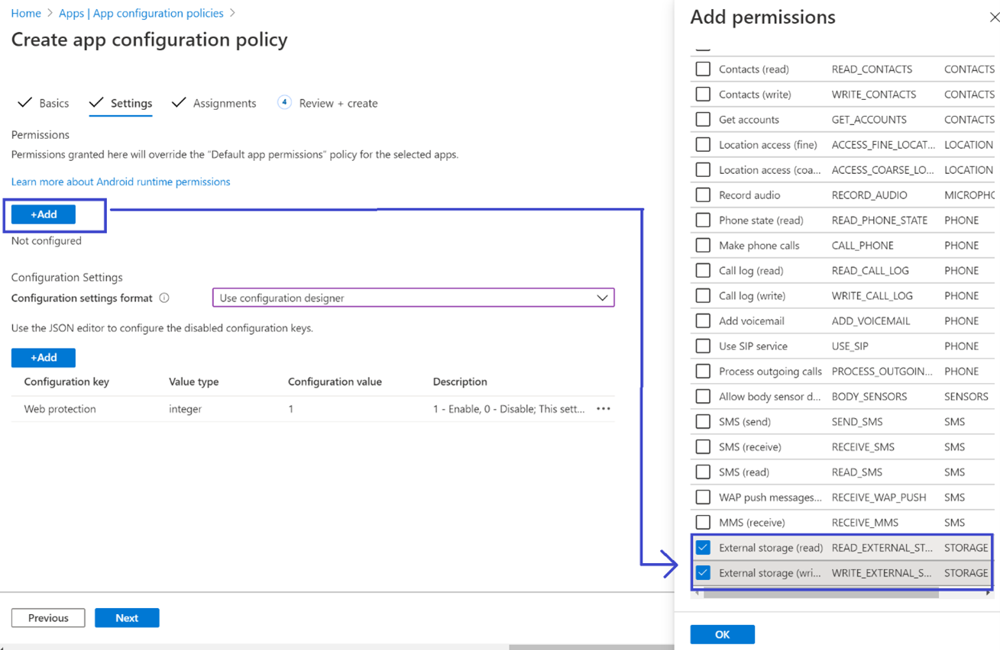

    
    d. You should now see both the permissions listed and now you can autogrant both by choosing autogrant in the **Permission state** drop-down and then select **Next**.

     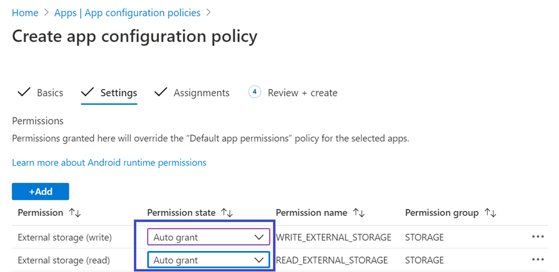

    e. In the **Assignments** page, select the user group to which this app config policy would be assigned to. Click **Select groups to include** and selecting the applicable group and then selecting **Next**.  The group selected here is usually the same group to which you would assign Microsoft Defender ATP Android app. 

    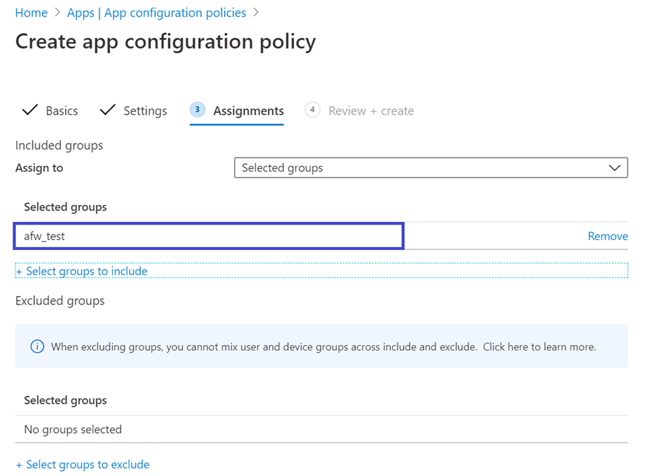
    

     f. In the **Review + Create** page that comes up next, review all the information and then select **Create**.  
    
    The app configuration policy for Microsoft Defender ATP auto-granting the storage permission is now assigned to the selected user group.

    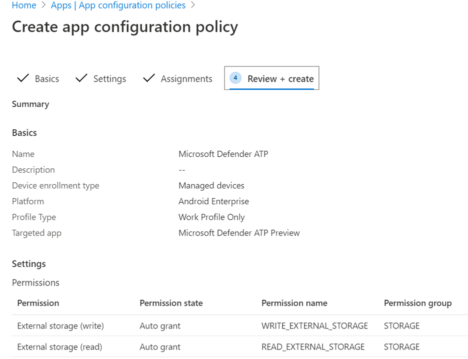

10. Select **Microsoft Defender ATP** app in the list \> **Properties** \>
**Assignments** \> **Edit**.

    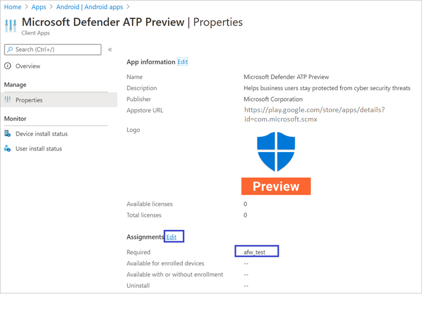

11. Assign the app as a *Required* app to a user group. It is automatically installed in the *work profile* during the next sync of
the device via Company Portal app. This assignment can be done by navigating to
the *Required* section \> **Add group,** selecting the user group and click
**Select**.

    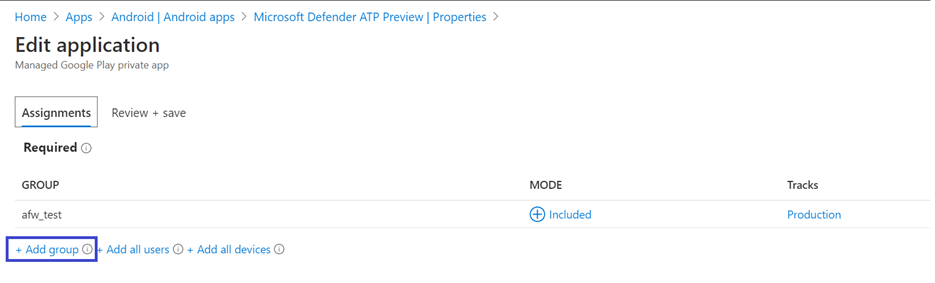

12. In the **Edit Application** page, review all the information that was entered
above. Then select **Review + Save** and then **Save** again to commence
assignment.

## Complete onboarding and check status

1. Confirm the installation status of Microsoft Defender ATP for Android by
clicking on the **Device Install Status**. Verify that the device is
displayed here.

    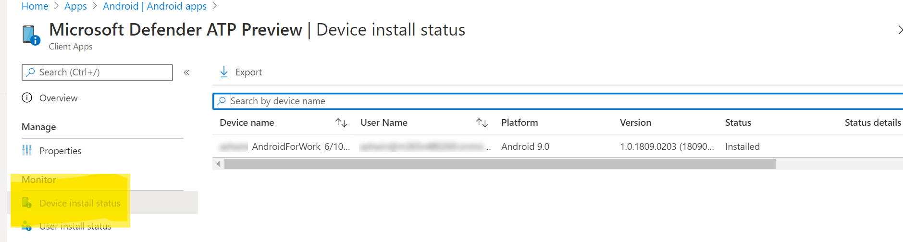

2. On the device, you can confirm the same by going to the **work profile** and
confirm that Microsoft Defender ATP is available.

    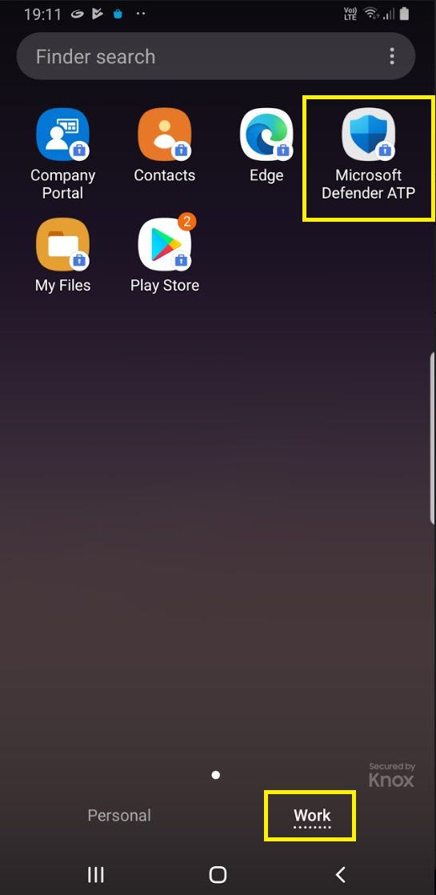

3. When the app is installed, open the app and accept the permissions
and then your onboarding should be successful.

    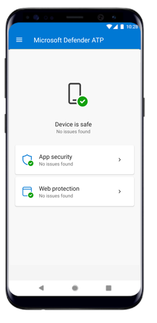

4. At this stage the device is successfully onboarded onto Microsoft Defender
ATP for Android. You can verify this on the [Microsoft Defender Security
Center](https://securitycenter.microsoft.com)
by navigating to the **Devices** page.

    

## Related topics
- [Overview of Microsoft Defender ATP for Android](microsoft-defender-atp-android.md)
- [Configure Microsoft Defender ATP for Android features](android-configure.md)
