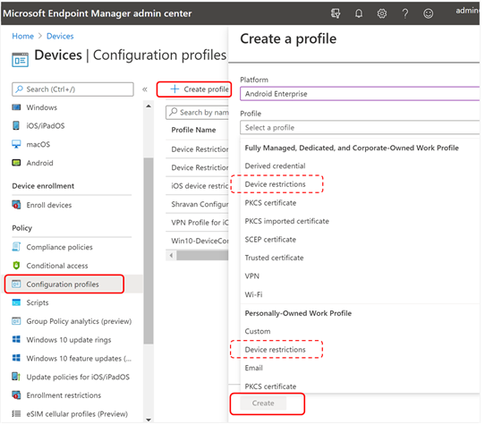
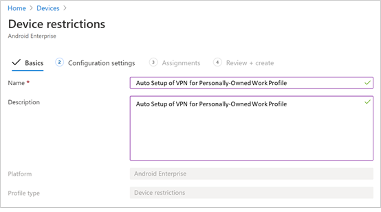
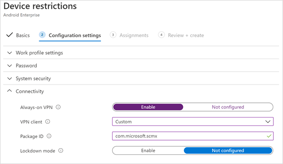
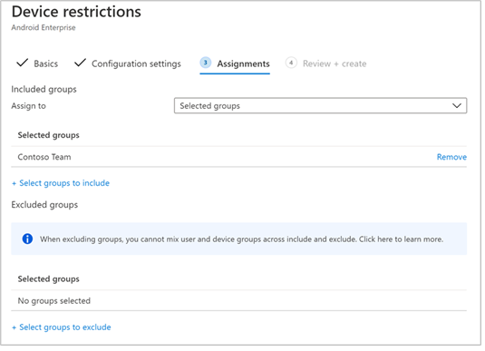
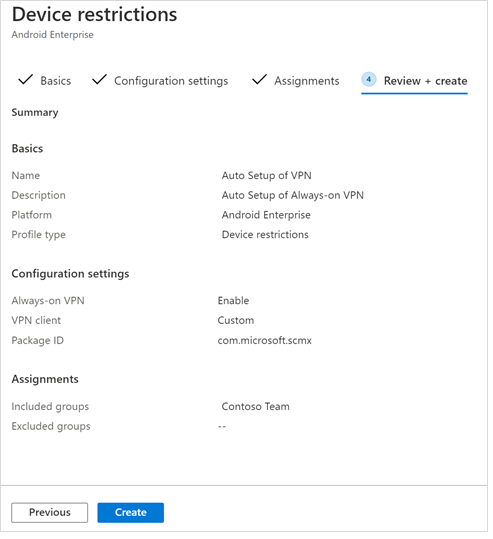

# Deploy Microsoft Defender for Endpoint for Android with Microsoft Intune 

[!INCLUDE [Microsoft 365 Defender rebranding](../../includes/microsoft-defender.md)]

**Applies to:**

- [Defender for Endpoint](microsoft-defender-atp-android.md)

Learn how to deploy Defender for Endpoint for Android on Intune
Company Portal enrolled devices. For more information about Intune device enrollment, see  [Enroll your
device](https://docs.microsoft.com/mem/intune/user-help/enroll-device-android-company-portal).

> [!NOTE]
> **Defender for Endpoint for Android is now available on [Google Play](https://play.google.com/store/apps/details?id=com.microsoft.scmx)**  
> You can connect to Google Play from Intune to deploy Defender for Endpoint app across Device Administrator and Android Enterprise entrollment modes.
  Updates to the app are automatic via Google Play.

## Deploy on Device Administrator enrolled devices

**Deploy Defender for Endpoint for Android on Intune Company Portal - Device
Administrator enrolled devices**

Learn how to deploy Defender for Endpoint for Android on Intune Company Portal - Device Administrator enrolled devices. 

### Add as Android store app

1. In [Microsoft Endpoint Manager admin
center](https://go.microsoft.com/fwlink/?linkid=2109431) , go to **Apps** \>
**Android Apps** \> **Add \> Android store app** and choose **Select**.

    

2. On the **Add app** page and in the *App Information* section enter: 

   - **Name** 
   - **Description**
   - **Publisher** as Microsoft.
   - **App store URL** as https://play.google.com/store/apps/details?id=com.microsoft.scmx (Defender for Endpoint app Google Play Store URL) 

   Other fields are optional. Select **Next**.

   

3. In the *Assignments* section, go to the **Required** section and select **Add group.** You can then choose the user group(s) that you would like to target Defender for Endpoint for Android app. Choose **Select** and then **Next**.

    >[!NOTE]
    >The selected user group should consist of Intune enrolled users.

    > [!div class="mx-imgBorder"]
    > 

4. In the **Review+Create** section, verify that all the information entered is correct and then select **Create**.

    In a few moments, the Defender for Endpoint app would be created successfully, and a notification would show up at the top-right corner of the page.

    

5. In the app information page that is displayed, in the **Monitor** section,
select **Device install status** to verify that the device installation has
completed successfully.

    > [!div class="mx-imgBorder"]
    > 

### Complete onboarding and check status

1. Once Defender for Endpoint for Android has been installed on the device, you'll see the app icon.

    

2. Tap the Microsoft Defender ATP app icon and follow the on-screen instructions
to complete onboarding the app. The details include end-user acceptance of Android permissions required by Defender for Endpoint for Android.

3. Upon successful onboarding, the device will start showing up on the Devices
list in Microsoft Defender Security Center.

    

## Deploy on Android Enterprise enrolled devices

Defender for Endpoint for Android supports Android Enterprise enrolled devices.

For more information on the enrollment options supported by Intune, see 
[Enrollment Options](https://docs.microsoft.com/mem/intune/enrollment/android-enroll).

**Currently, Personally owned devices with work profile and Corporate-owned fully managed user device enrollments are supported for deployment.**

## Add Microsoft Defender for Endpoint for Android as a Managed Google Play app

Follow the steps below to add Microsoft Defender for Endpoint app into your managed Google Play.

1. In [Microsoft Endpoint Manager admin
center](https://go.microsoft.com/fwlink/?linkid=2109431) , go to **Apps** \>
**Android Apps** \> **Add** and select **Managed Google Play app**.

    > [!div class="mx-imgBorder"]
    > 

2. On your managed Google Play page that loads subsequently, go to the search
box and lookup **Microsoft Defender.** Your search should display the Microsoft
Defender for Endpoint app in your Managed Google Play. Click on the Microsoft Defender for Endpoint app from the Apps search result.

    

3. In the App description page that comes up next, you should be able to see app
details on Defender for Endpoint. Review the information on the page and then
select **Approve**.

    > [!div class="mx-imgBorder"]
    > 

4. You'll be presented with the permissions that Defender for Endpoint
obtains for it to work. Review them and then select **Approve**.

    

5. You'll be presented with the Approval settings page. The page confirms
your preference to handle new app permissions that Defender for Endpoint for
Android might ask. Review the choices and select your preferred option. Select
**Done**.

    By default, managed Google Play selects *Keep approved when app requests new
permissions*

    > [!div class="mx-imgBorder"]
    > 

6. After the permissions handling selection is made, select **Sync** to sync Microsoft 
Defender for Endpoint to your apps list.

    > [!div class="mx-imgBorder"]
    > 

7. The sync will complete in a few minutes.

    

8. Select the **Refresh** button in the Android apps screen and Microsoft
Defender ATP should be visible in the apps list.

    > [!div class="mx-imgBorder"]
    > 

9. Defender for Endpoint supports App configuration policies for managed devices via Intune. This capability can be leveraged to autogrant applicable Android permission(s), so the end user does not need to accept these permission(s).

    1. In the **Apps** page, go to **Policy > App configuration policies > Add > Managed devices**.

       

    1. In the **Create app configuration policy** page, enter the following details:
    
        - Name: Microsoft Defender ATP.
        - Choose **Android Enterprise** as platform.
        - Choose **Work Profile only** as Profile Type.
        - Click **Select App**, choose **Microsoft Defender ATP**, select **OK** and then **Next**.
    
        > [!div class="mx-imgBorder"]
        > 

    1. In the **Settings** page, go to the Permissions section click on Add to view the list of supported permissions. In the Add Permissions section, select the following permissions:

       - External storage (read)
       - External storage (write)

       Then select **OK**.

       > [!div class="mx-imgBorder"]
       > 

    
    1. You should now see both the permissions listed and now you can autogrant both by choosing autogrant in the **Permission state** drop-down and then select **Next**.

       > [!div class="mx-imgBorder"]
       > 

    1. In the **Assignments** page, select the user group to which this app config policy would be assigned to. Click **Select groups to include** and selecting the applicable group and then selecting **Next**.  The group selected here is usually the same group to which you would assign Microsoft Defender for Endpoint Android app. 

       > [!div class="mx-imgBorder"]
       > 
    

     1. In the **Review + Create** page that comes up next, review all the information and then select **Create**.  
    
        The app configuration policy for Defender for Endpoint autogranting the storage permission is now assigned to the selected user group.

        > [!div class="mx-imgBorder"]
        > 

10. Select **Microsoft Defender ATP** app in the list \> **Properties** \>
**Assignments** \> **Edit**.

    

11. Assign the app as a *Required* app to a user group. It is automatically installed in the *work profile* during the next sync of
the device via Company Portal app. This assignment can be done by navigating to
the *Required* section \> **Add group,** selecting the user group and click
**Select**.

    > [!div class="mx-imgBorder"]
    > 

12. In the **Edit Application** page, review all the information that was entered
above. Then select **Review + Save** and then **Save** again to commence
assignment.

### Auto Setup of Always-on VPN 
Defender for Endpoint supports Device configuration policies for managed devices via Intune. This capability can be leveraged to **Auto setup of Always-on VPN** on Android Enterprise enrolled devices, so the end user does not need to set up VPN service while onboarding.
1.	On **Devices**, select **Configuration Profiles** > **Create Profile** > **Platform** > **Android Enterprise**
Select **Device restrictions** under one of the following, based on your device enrollment type 
- **Fully Managed, Dedicated, and Corporate-Owned Work Profile**
- **Personally owned Work Profile**

Select **Create**.
 
   > 
    
2. **Configuration Settings** 
  Provide a **Name** and a **Description** to uniquely identify the configuration profile. 

   > 
   
 3. Select **Connectivity** and configure VPN:
- Enable **Always-on VPN** 
Setup a VPN client in the work profile to automatically connect and reconnect to the VPN whenever possible. Only one VPN client can be configured for always-on VPN on a given device, so be sure to have no more than one always-on VPN policy deployed to a single device. 
- Select **Custom** in VPN client dropdown list
Custom VPN in this case is Defender for Endpoint VPN which is used to provide the Web Protection feature. 
    > [!NOTE]
    > Microsoft Defender ATP app must be installed on user’s device, in order to functioning of auto setup of this VPN.

- Enter **Package ID** of the Microsoft Defender ATP app in Google Play store. For the Defender app URL https://play.google.com/store/apps/details?id=com.microsoft.scmx, Package ID is **com.microsoft.scmx**  
- **Lockdown mode** Not configured (Default) 

     
   
4. **Assignment** 
In the **Assignments** page, select the user group to which this app config policy would be assigned to. Click **Select groups** to include and selecting the applicable group and then click **Next**. The group selected here is usually the same group to which you would assign Microsoft Defender for Endpoint Android app. 

     

5. In the **Review + Create** page that comes up next, review all the information and then select **Create**. 
The device configuration profile is now assigned to the selected user group.    

    

## Complete onboarding and check status

1. Confirm the installation status of Microsoft Defender for Endpoint for Android by
clicking on the **Device Install Status**. Verify that the device is
displayed here.

    > [!div class="mx-imgBorder"]
    > 

2. On the device, you can validate the onboarding status by going to the **work profile**. Confirm that Defender for Endpoint is available and that you are enrolled to the **Personally owned devices with work profile**.  If you are enrolled to a **Corporate-owned, fully managed user device**, you will have a single profile on the device where you can confirm that Defender for Endpoint is available.

    

3. When the app is installed, open the app and accept the permissions
and then your onboarding should be successful.

    

4. At this stage the device is successfully onboarded onto Defender for Endpoint for Android. You can verify this on the [Microsoft Defender Security
Center](https://securitycenter.microsoft.com)
by navigating to the **Devices** page.

    

## Related topics
- [Overview of Microsoft Defender for Endpoint for Android](microsoft-defender-atp-android.md)
- [Configure Microsoft Defender for Endpoint for Android features](android-configure.md)
