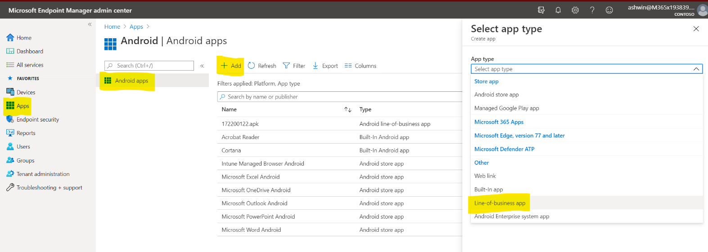
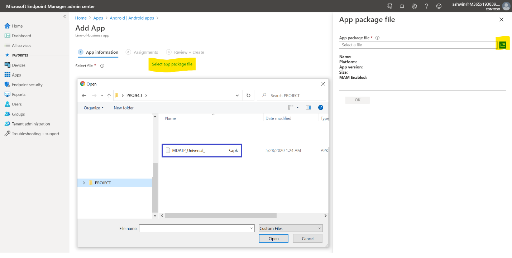
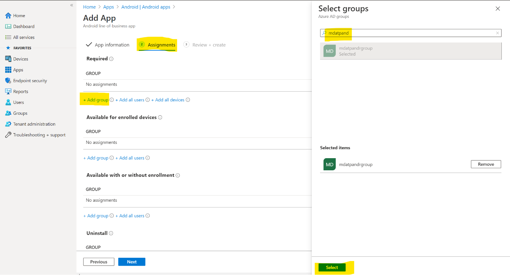
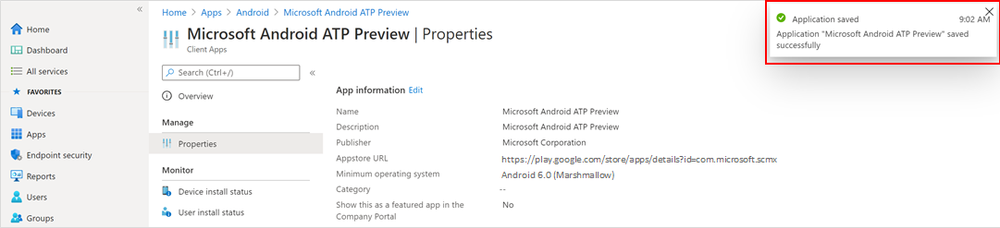
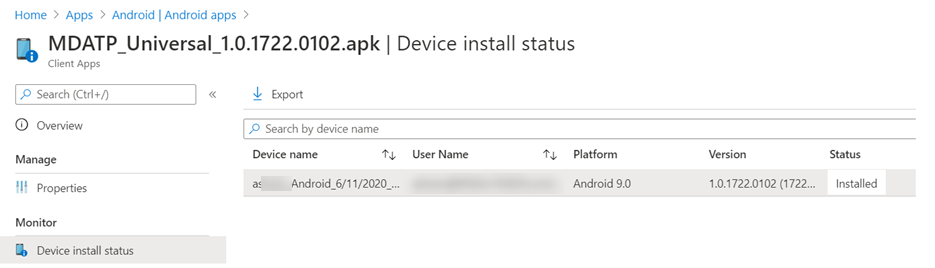
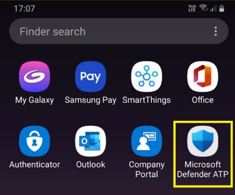
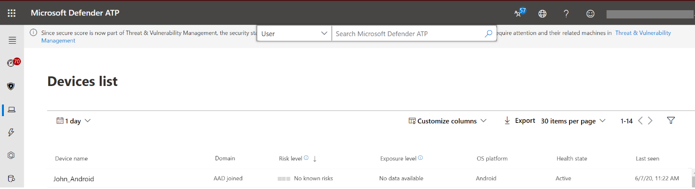

# Deploy Microsoft Defender ATP for with Microsoft Intune 

**Applies to:**

- [Microsoft Defender Advanced Threat Protection (Microsoft Defender ATP) for Android](microsoft-defender-atp-android.md)

This topic describes deploying Microsoft Defender ATP for Android on Intune
Company Portal enrolled devices. For more information about Intune device enrollment, see  [Enroll your
device](https://microsoft.sharepoint.com/teams/WDATPIndia/Shared%20Documents/General/PM%20Docs/External%20Documentation/aka.ms/enrollAndroid).

## Deploy on Device Administrator enrolled devices

**Deploy Microsoft Defender ATP for Android on Intune Company Portal - Device
Administrator enrolled devices**

This topic describes how to deploy Microsoft Defender ATP for Android on Intune Company Portal - Device Administrator enrolled devices. Upgrade from the Preview APK to the GA version on Google Play would be supported.

### Download the onboarding package

Download the onboarding package from Microsoft Defender Security Center.

1. In [Microsoft Defender Security
Center](https://microsoft.sharepoint.com/teams/WDATPIndia/Shared%20Documents/General/PM%20Docs/External%20Documentation/securitycenter.microsoft.com), go to **Settings** \> **Machine Management** \> **Onboarding**.

2. In the first drop down, select **Android** as the Operating system.

3. Select **Download Onboarding package** and save the downloaded .APK file.

### Add as Line of Business (LOB) App

The downloaded Microsoft Defender ATP for Android onboarding package which is a
.APK file can be deployed to user groups as a Line of Business app during the
preview from Microsoft Endpoint Manager Admin Center.

1. In [Microsoft Endpoint Manager admin
center](https://go.microsoft.com/fwlink/?linkid=2109431) , go to **Apps** \>
**Android Apps** \> **Add \> Line-of-business app** and click **Select**.

    

2. On the **Add app** page and in the *App Information* section, click **Select
add package file** and then click the  icon and select the MDATP Universal APK file that was downloaded from the *Download Onboarding package* step.

    

3. Select **OK**.

4. In the *App Information* section that comes up, enter the **Publisher** as
Microsoft. Other fields are optional and then select **Next**.

    

5. In the *Assignments* section, go to the **Required** section and select **Add
group.** You can then choose the user group(s) that you would like to target
Microsoft Defender ATP for Android app. Click **Select** and then **Next**.

   >[!NOTE] The selected user group should consist of Intune enrolled users.

    

6. In the **Review+Create** section, verify that all the information entered is
correct and then select **Create**.

    In a few moments, the Microsoft Defender ATP app would be created successfully,
and a notification would show up at the top right corner of the page.

    

7. In the app information page that is displayed, in the **Monitor** section,
click on **Device install status** to verify that the device installation has
completed successfully.

    

During Public Preview, to **update** Microsoft Defender ATP for Android deployed
as a Line of Business app, download the latest APK by following the steps in
*Download the onboarding package* page and follow instructions on how to [update
a Line of Business
App](https://docs.microsoft.com/mem/intune/apps/lob-apps-android#step-5-update-a-line-of-business-app).

### Complete onboarding and check status

1. Once Microsoft Defender ATP for Android has been installed on the device, you
should be able to see the app icon.

    

2. Tap the Microsoft Defender ATP app icon and follow the on-screen instructions
to complete onboarding the app that includes end user acceptance of Android
permissions required by Microsoft Defender ATP for Android.

3. Upon successful onboarding, the device will start showing up on the Devices
list in Microsoft Defender Security Center.

    

## Deploy on Android Enterprise enrolled devices

Microsoft Defender ATP for Android supports Android Enterprise enrolled devices.
For more information on the enrollment options supported by Intune, refer to
[Enrollment
Options](https://docs.microsoft.com/mem/intune/enrollment/android-enroll) .

As Microsoft Defender ATP for Android is deployed via managed Google Play,
updates to the app are automatic via Google Play.

Currently only Work Profile, Fully Managed devices are supported for deployment.

## Related topics
- [Overview of Microsoft Defender ATP for Android](microsoft-defender-atp-android.md)
- [Configure Microsoft Defender ATP for Android features](android-configure.md)