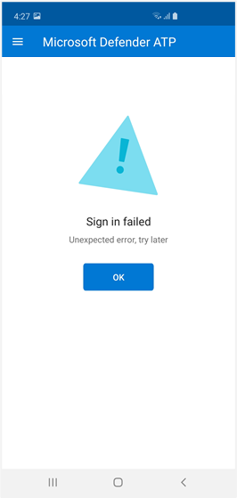
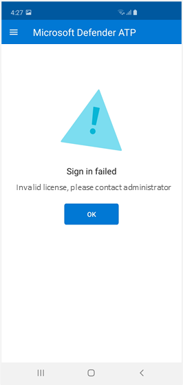
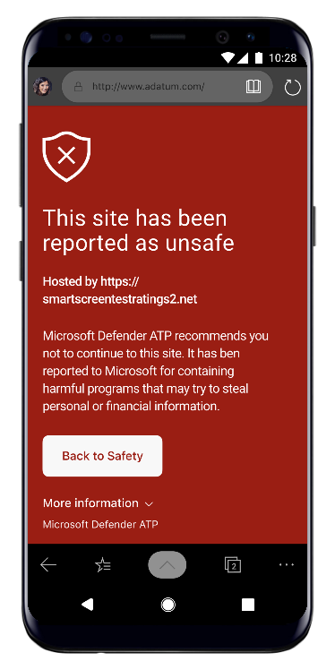
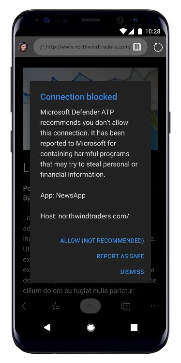
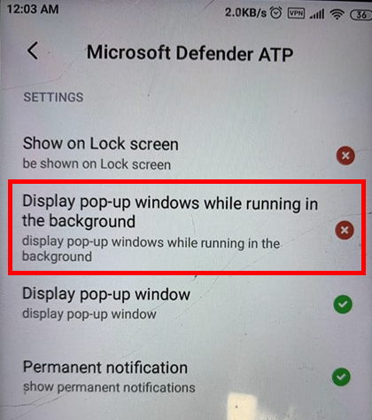

# Troubleshooting sign in issues on Microsoft Defender ATP for Android

**Applies to:**

-   [Microsoft Defender Advanced Threat Protection (Microsoft Defender ATP) for
    Android](https://docs.microsoft.com/en-us/windows/security/threat-protection/microsoft-defender-atp/microsoft-defender-atp-android)

During onboarding, you might encounter sign in issues after the app is installed on your device. 

This article provides solutions to address the sign on issues.  

## Sign in failed - unexpected error
**Sign in failed:** *Unexpected error, try later*

**Message:**

Unexpected error, try later

**Cause:**

You have an older version of "Microsoft Authenticator" app installed on your
device.

**Solution:**

Install latest version and of [Microsoft
Authenticator](https://play.google.com/store/apps/details?androidid=com.azure.authenticator)
from Google Play Store and try again

## Sign in failed - invalid license

**Sign in failed:** *Invalid license, please contact administrator*

**Message:** *Invalid license, please contact administrator*

**Cause:**

You do not have Microsoft 365 license assigned, or your organization does not
have a license for Microsoft 365 Enterprise subscription.

**Solution:**

Contact your administrator for help.

## Phishing pages and harmful web connections are not blocked on specific OEM devices

**Applies to:** Specific OEMs only

-   **Xiaomi**

Phishing and harmful web connection threats detected by Microsoft Defender ATP
for Android are not blocked on Xiaomi devices. The following functionality does not work
on these devices.

**Cause:**

Xiaomi devices introduced a new permission that prevents Microsoft Defender ATP
for Android app from displaying pop-up windows while running in the background.

Xiaomi devices permission: "Display pop-up windows while running in the
background."

**Solution:**

Enable the required permission on Xiaomi devices.

-   Display pop-up windows while running in the background.
