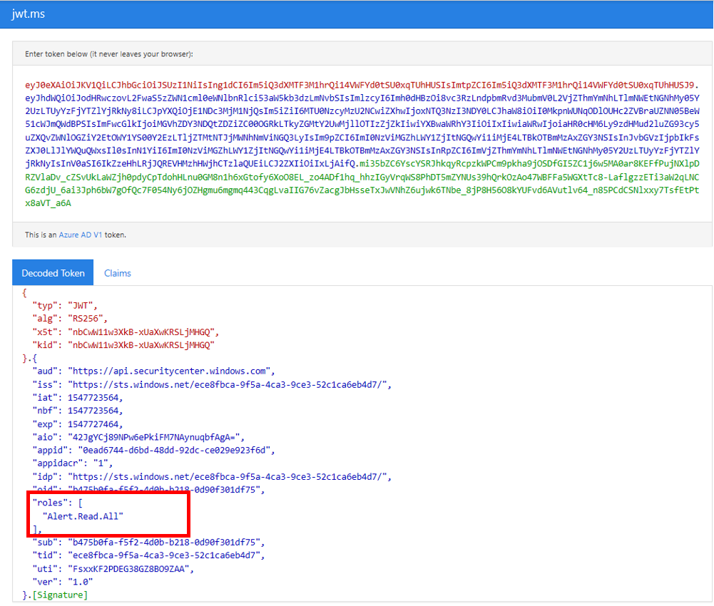

# Microsoft Defender ATP API - Hello World 

**Applies to:** 
- [Microsoft Defender Advanced Threat Protection (Microsoft Defender ATP)](https://go.microsoft.com/fwlink/p/?linkid=2069559)

> Want to experience Microsoft Defender ATP? [Sign up for a free trial.](https://www.microsoft.com/WindowsForBusiness/windows-atp?ocid=docs-wdatp-exposedapis-abovefoldlink) 


## Get Alerts using a simple PowerShell script

### How long it takes to go through this example?
It only takes 5 minutes done in two steps:
- Application registration
- Use examples: only requires copy/paste of a short PowerShell script

### Do I need a permission to connect?
For the Application registration stage, you must have a **Global administrator** role in your Azure Active Directory (Azure AD) tenant.

### Step 1 - Create an App in Azure Active Directory

1. Log on to [Azure](https://portal.azure.com) with your **Global administrator** user.

2. Navigate to **Azure Active Directory** > **App registrations** > **New registration**. 

   

3. In the registration form, choose a name for your application and then click **Register**.

4. Allow your Application to access Microsoft Defender ATP and assign it 'Read all alerts' permission:

   - On your application page, click **API Permissions** > **Add permission** > **APIs my organization uses** > type **WindowsDefenderATP** and click on **WindowsDefenderATP**.

    **Note**: WindowsDefenderATP does not appear in the original list. You need to start writing its name in the text box to see it appear.

	- Choose **Application permissions** > **Alert.Read.All** > Click on **Add permissions**

     

   - Click **Grant consent**

     **Note**: Every time you add permission you must click on **Grant consent** for the new permission to take effect.

     

5. Add a secret to the application.

	- Click **Certificates & secrets**, add description to the secret and click **Add**.

    **Important**: After click Add, **copy the generated secret value**. You won't be able to retrieve after you leave!

    

6. Write down your application ID and your tenant ID:

   - On your application page, go to **Overview** and copy the following:

   


Done! You have successfully registered an application!

### Step 2 - Get a token using the App and use this token to access the API.

-   Copy the script below to PowerShell ISE or to a text editor, and save it as "**Get-Token.ps1**"
-   Running this script will generate a token and will save it in the working folder under the name "**Latest-token.txt**".

```
# That code gets the App Context Token and save it to a file named "Latest-token.txt" under the current directory
# Paste below your Tenant ID, App ID and App Secret (App key).

$tenantId = '' ### Paste your tenant ID here
$appId = '' ### Paste your Application ID here
$appSecret = '' ### Paste your Application secret here

$resourceAppIdUri = 'https://api.securitycenter.windows.com'
$oAuthUri = "https://login.windows.net/$TenantId/oauth2/token"
$authBody = [Ordered] @{
    resource = "$resourceAppIdUri"
    client_id = "$appId"
    client_secret = "$appSecret"
    grant_type = 'client_credentials'
}
$authResponse = Invoke-RestMethod -Method Post -Uri $oAuthUri -Body $authBody -ErrorAction Stop
$token = $authResponse.access_token
Out-File -FilePath "./Latest-token.txt" -InputObject $token
return $token
```

-   Sanity Check:<br>
Run the script.<br>
In your browser go to: https://jwt.ms/ <br>
Copy the token (the content of the Latest-token.txt file).<br>
Paste in the top box.<br>
Look for the "roles" section. Find the Alert.Read.All role.



### Lets get the Alerts!

-   The script below will use **Get-Token.ps1** to access the API and will get the past 48 hours Alerts.
-   Save this script in the same folder you saved the previous script **Get-Token.ps1**. 
-   The script creates two files (json and csv) with the data in the same folder as the scripts.

```
# Returns Alerts created in the past 48 hours.

$token = ./Get-Token.ps1       #run the script Get-Token.ps1  - make sure you are running this script from the same folder of Get-Token.ps1

# Get Alert from the last 48 hours. Make sure you have alerts in that time frame.
$dateTime = (Get-Date).ToUniversalTime().AddHours(-48).ToString("o")       

# The URL contains the type of query and the time filter we create above
# Read more about other query options and filters at   Https://TBD- add the documentation link
$url = "https://api.securitycenter.windows.com/api/alerts?`$filter=alertCreationTime ge $dateTime"

# Set the WebRequest headers
$headers = @{ 
    'Content-Type' = 'application/json'
    Accept = 'application/json'
    Authorization = "Bearer $token" 
}

# Send the webrequest and get the results. 
$response = Invoke-WebRequest -Method Get -Uri $url -Headers $headers -ErrorAction Stop

# Extract the alerts from the results. 
$alerts =  ($response | ConvertFrom-Json).value | ConvertTo-Json

# Get string with the execution time. We concatenate that string to the output file to avoid overwrite the file
$dateTimeForFileName = Get-Date -Format o | foreach {$_ -replace ":", "."}    

# Save the result as json and as csv
$outputJsonPath = "./Latest Alerts $dateTimeForFileName.json"     
$outputCsvPath = "./Latest Alerts $dateTimeForFileName.csv"

Out-File -FilePath $outputJsonPath -InputObject $alerts
($alerts | ConvertFrom-Json) | Export-CSV $outputCsvPath -NoTypeInformation 
```

You’re all done! You have just successfully:
-   Created and registered and application
-   Granted permission for that application to read alerts
-   Connected the API
-   Used a PowerShell script to return alerts created in the past 48 hours


## Related topic
- [Microsoft Defender ATP APIs](exposed-apis-list.md)
- [Access Microsoft Defender ATP with application context](exposed-apis-create-app-webapp.md)
- [Access Microsoft Defender ATP with user context](exposed-apis-create-app-nativeapp.md)
