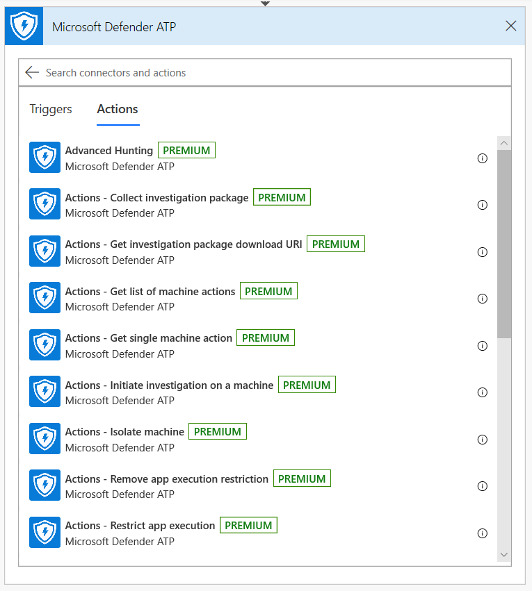
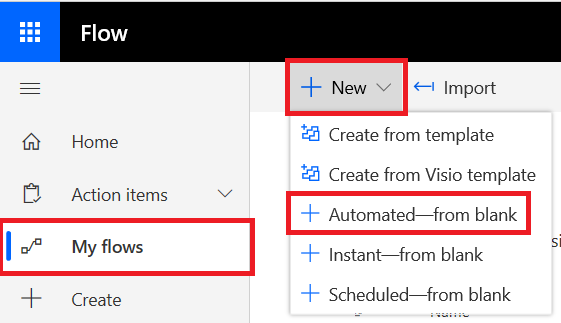

# Microsoft Defender ATP Flow connector

**Applies to:** [Microsoft Defender Advanced Threat Protection (Microsoft Defender ATP)](https://go.microsoft.com/fwlink/p/?linkid=2069559)

- Want to experience Microsoft Defender ATP? [Sign up for a free trial.](https://www.microsoft.com/WindowsForBusiness/windows-atp?ocid=docs-wdatp-exposedapis-abovefoldlink) 

Automating security procedures is a standard requirement for every modern Security Operations Center. The lack of professional Cyber defenders, forces SOC to work in the most efficient way and automation is a must. MS flow supports different connectors that were built exactly for that. You can build an end-to-end procedure automation within few minutes.

Microsoft Defender API has an official Flow Connector with a lot of capabilities: 

## Usage example

The following example demonstrates how you can create a Flow that will be triggered any time a new Alert occurs on your tenant.

- Login to [Microsoft Flow](https://flow.microsoft.com)

- Go to: My flows > New > Automated 

- Choose a name for your Flow, Search for **Microsoft Defender ATP Triggers** as the trigger and choose the new Alerts trigger.

- Now you have a Flow that is triggered every time a new Alert occurs. 

All you need to do now, is to choose your next steps.
Lets, for example, Isolate the machine if the Severity of the Alert is **High** and mail about it.
The Alert trigger gives us only the Alert ID and the Machine ID. We can use the Connector to expand these entities.

### Get the Alert entity using the connector 

- Choose Microsoft Defender ATP for new step. 

- Choose Alerts - Get single alert API.

- Set the Alert Id from the last step as Input.

### Isolate the machine if the Alert's severity is High

- Add **Condition** as a new step .

- Check if Alert severity equals to **High**.

- If yes, add Microsoft Defender ATP - Isolate machine action with the Machine Id and a comment.

Now you can add a new step for mailing about the Alert and the Isolation.
There are multiple Email connectors that are very easy to use, e.g. Outlook, GMail, etc..
Save your flow and that's all.

- You can also create **scheduled** flow that will run Advanced Hunting queries and much more! 

## Related topic
- [Microsoft Defender ATP APIs](apis-intro.md)
