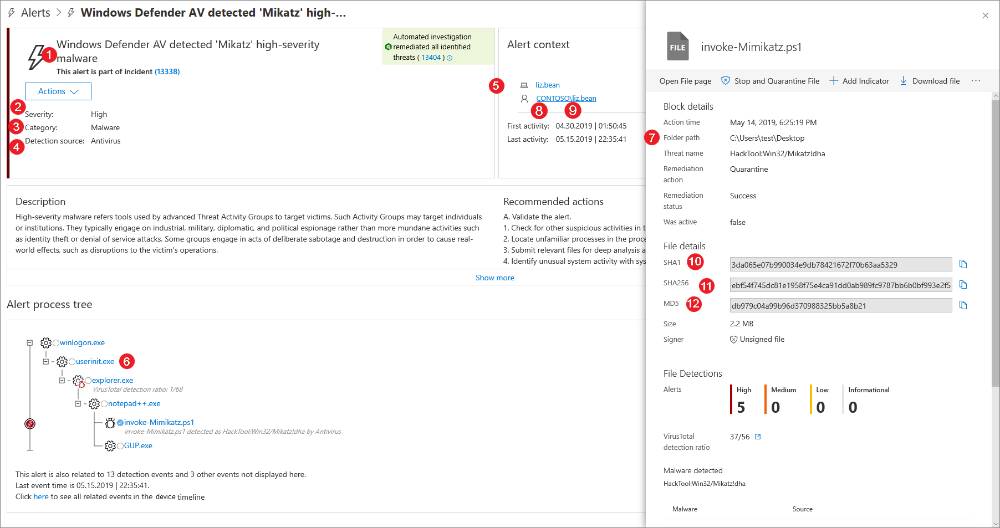
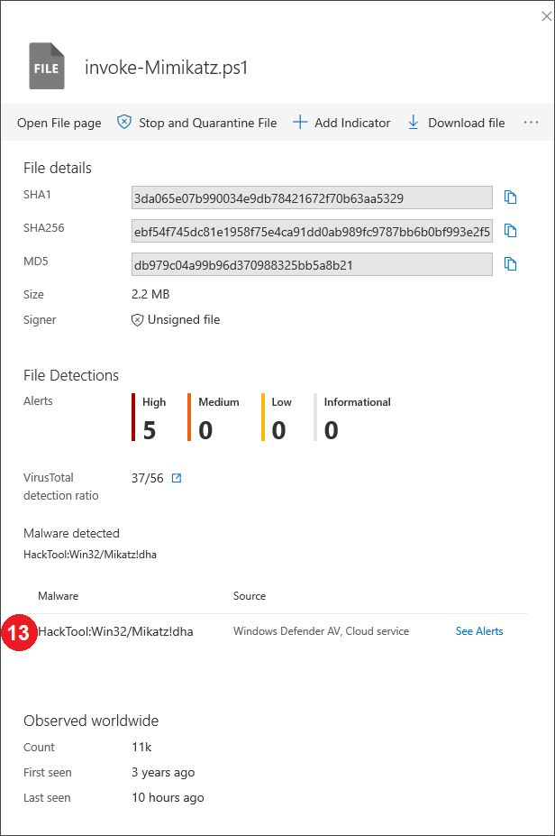
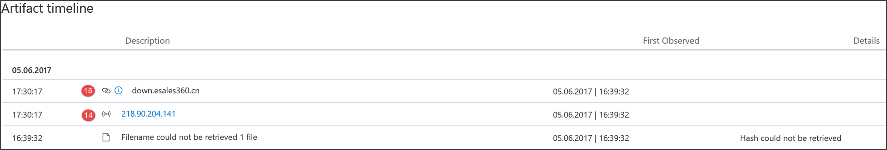
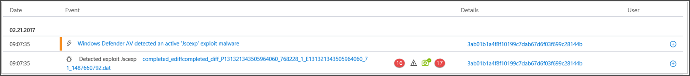
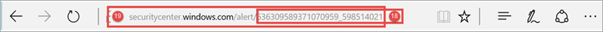
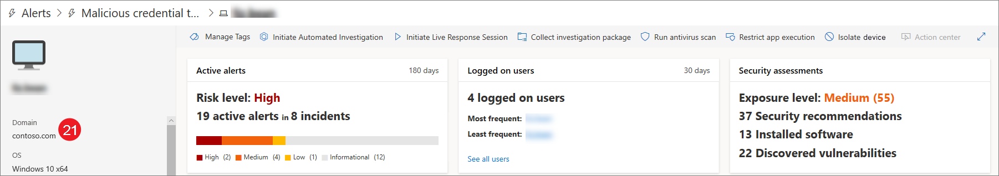

# Microsoft Defender ATP detections API fields

**Applies to:**

- [Microsoft Defender Advanced Threat Protection (Microsoft Defender ATP)](https://go.microsoft.com/fwlink/p/?linkid=2069559)

>Want to experience Microsoft Defender ATP? [Sign up for a free trial.](https://www.microsoft.com/en-us/WindowsForBusiness/windows-atp?ocid=docs-wdatp-apiportalmapping-abovefoldlink)

Understand what data fields are exposed as part of the detections API and how they map to Microsoft Defender Security Center.

>[!Note]
>- [Microsoft Defender ATP Alert](alerts.md) is composed from one or more detections
>- **Microsoft Defender ATP Detection** is composed from the suspicious event occurred on the Machine and its related **Alert** details.

## Detections API fields and portal mapping
The following table lists the available fields exposed in the detections API payload. It shows examples for the populated values and a reference on how data is reflected on the portal.

The ArcSight field column contains the default mapping between the Microsoft Defender ATP fields and the built-in fields in ArcSight. You can download the mapping file from the portal when you enable the SIEM integration feature and you can modify it to match the  needs of your organization. For more information, see [Enable SIEM integration in Microsoft Defender ATP](enable-siem-integration.md).

Field numbers match the numbers in the images below.

> [!div class="mx-tableFixed"]
> 
> | Portal   label   | SIEM field name           | ArcSight field      | Example value                                                                      | Description                                                                                                                                                                    |
> |------------------|---------------------------|---------------------|------------------------------------------------------------------------------------|--------------------------------------------------------------------------------------------------------------------------------------------------------------------------------|
> | 1                | AlertTitle                | name                | Windows Defender AV detected 'Mikatz' high-severity malware | Value available for every Detection.                                                                                                                                               |
> | 2                | Severity                  | deviceSeverity      | High                                                                             | Value available for every Detection.                                                                                                                                               |
> | 3                | Category                  | deviceEventCategory | Malware                                                               | Value available for every Detection.                                                                                                                                               |
> | 4                | Detection source                    | sourceServiceName   | Antivirus                                                                 | Windows Defender Antivirus or   Microsoft Defender ATP. Value available for every Detection.                                                                                         |
> | 5                | MachineName               | sourceHostName      | desktop-4a5ngd6                                                                           | Value available for every Detection.                                                                                                                                               |
> | 6                | FileName                  | fileName            | Robocopy.exe                                                                       | Available for detections associated   with a file or process.                                                                                                                      |
> | 7                | FilePath                  | filePath            | C:\Windows\System32\Robocopy.exe                                                   | Available for detections associated   with a file or process.                                                                                                                     |
> | 8                | UserDomain                | sourceNtDomain      | CONTOSO                                                                            | The domain of the user context   running the activity, available for Microsoft Defender ATP behavioral based detections.                                                           |
> | 9                | UserName                  | sourceUserName      | liz.bean                                                                           | The user context running the   activity, available for Microsoft Defender ATP behavioral based detections.                                                                           |
> | 10               | Sha1                      | fileHash            | 3da065e07b990034e9db7842167f70b63aa5329                                           | Available for detections associated   with a file or process.                                                                                                                      |
> | 11               | Sha256                    | deviceCustomString6 | ebf54f745dc81e1958f75e4ca91dd0ab989fc9787bb6b0bf993e2f5                   | Available for Windows Defender AV detections.                                                                                                                                    |
> | 12               | Md5                       | deviceCustomString5 | db979c04a99b96d370988325bb5a8b21                                                   | Available for Windows Defender AV detections.                                                                                                                                    |
> | 13               | ThreatName                | deviceCustomString1  | HackTool:Win32/Mikatz!dha                                                         | Available for Windows Defender AV detections.                                                                                                                                    |
> | 14               | IpAddress                 | sourceAddress       | 218.90.204.141                                                                     | Available for detections associated   to network events. For example, 'Communication to a malicious network   destination'.                                                        |
> | 15               | Url                       | requestUrl          | down.esales360.cn                                                                  | Available for detections associated to   network events. For example, 'Communication to a malicious network   destination'.                                                         |
> | 16               | RemediationIsSuccess      | deviceCustomNumber2 | TRUE                                                                               | Available for Windows Defender AV detections. ArcSight value is 1 when TRUE and 0 when FALSE.                                                                                    |
> | 17               | WasExecutingWhileDetected | deviceCustomNumber1 | FALSE                                                                              | Available for Windows Defender AV detections. ArcSight value is 1 when TRUE and 0 when FALSE.                                                                                    |
> | 18               | AlertId                   | externalId          | 636210704265059241_673569822                                                       | Value available for every Detection.                                                                                                                                               |
> | 19               | LinkToWDATP               | flexString1         | `https://securitycenter.windows.com/alert/636210704265059241_673569822`            | Value available for every Detection.                                                                                                                                               |
> | 20               | AlertTime                 | deviceReceiptTime   | 2017-05-07T01:56:59.3191352Z                                                       | The time the event occurred. Value available for every Detection.                                                                                       |
> | 21               | MachineDomain             | sourceDnsDomain     | contoso.com                                                                        | Domain name not relevant for AAD   joined machines. Value available for every Detection.                                                                                           |
> | 22               | Actor                     | deviceCustomString4 | BORON                                                                                   | Available for alerts related to a   known actor group.                                                                                                                         |
> | 21+5             | ComputerDnsName           | No mapping          | liz-bean.contoso.com                                                               | The machine fully qualified   domain name. Value available for every Detection.                                                                                                    |
> |                  | LogOnUsers                | sourceUserId        | contoso\liz-bean;   contoso\jay-hardee                                             | The domain and user of the   interactive logon user/s at the time of the event. Note: For machines on   Windows 10 version 1607, the domain information will not be available. |
> |                  | InternalIPv4List          | No mapping          | 192.168.1.7, 10.1.14.1                                                             | List of IPV4 internal IPs for active network interfaces.                                                                                                                                                                               |
> |                  | InternalIPv6List          | No mapping          | fd30:0000:0000:0001:ff4e:003e:0009:000e,   FE80:CD00:0000:0CDE:1257:0000:211E:729C | List of IPV6 internal IPs for active network interfaces.                                                                                                                                                                               |
> | Internal   field | LastProcessedTimeUtc      | No mapping          | 2017-05-07T01:56:58.9936648Z                                                       | Time when event arrived at the   backend. This field can be used when setting the request parameter for the range of time that detections are retrieved.                         |
> |                  | Not part of the schema    | deviceVendor        |                                                                                    | Static value in the ArcSight   mapping - 'Microsoft'.                                                                                                                          |
> |                  | Not part of the schema    | deviceProduct       |                                                                                    | Static value in the ArcSight   mapping - 'Microsoft Defender ATP'.                                                                                                               |
> |                  | Not part of the schema    | deviceVersion       |                                                                                    | Static value in the ArcSight   mapping - '2.0', used to identify the mapping versions.                                                                                         

## Related topics
- [Enable SIEM integration in Microsoft Defender ATP](enable-siem-integration.md)
- [Configure Splunk to pull Microsoft Defender ATP detections](configure-splunk.md)
- [Configure ArcSight to pull Microsoft Defender ATP detections](configure-arcsight.md)
- [Pull Microsoft Defender ATP detections using REST API](pull-alerts-using-rest-api.md)
- [Troubleshoot SIEM tool integration issues](troubleshoot-siem.md)
