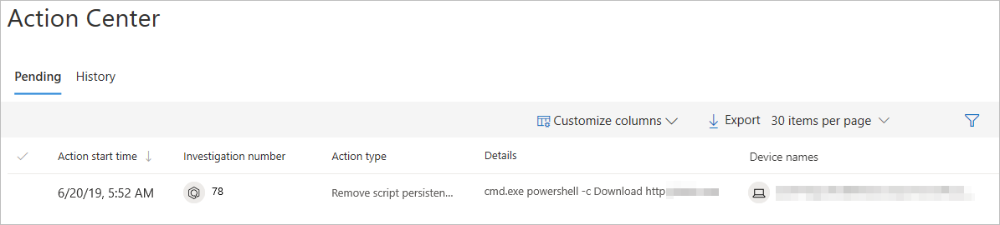

# Manage actions related to automated investigation and remediation

The Action center aggregates all investigations that require an action for an investigation to proceed or be completed. 

The action center consists of two main tabs:
- Pending actions - Displays a list of ongoing investigations that require attention. A recommended action is presented to the analyst, which they can approve or reject.
- History - Acts as an audit log for:
	- All actions taken by AutoIR or approved by an analyst with ability to undo actions that support this capability (for example, quarantine file).
	- All commands ran and remediation actions applied in Live Response with ability to undo actions that support this capability.
	- Remediation actions applied by Windows Defender AV with ability to undo actions that support this capability.

Use the Customize columns drop-down menu to select columns that you'd like to show or hide. 

From this view, you can also download the entire list in CSV format using the **Export** feature, specify the number of items to show per page, and navigate between pages.

>[!NOTE]
>The tab will only appear if there are pending actions for that category.

### Approve or reject an action
You'll need to manually approve or reject pending actions on each of these categories for the automated actions to proceed.

Selecting an investigation from any of the categories opens a panel where you can approve or reject the remediation. Other details such as file or service details, investigation details, and alert details are displayed.

From the panel, you can click on the Open investigation page link to see the investigation details.

You also have the option of selecting multiple investigations to approve or reject actions on multiple investigations. 

##Related topics
- [Automated investigation and investigation](automated-investigations.md)
- [Learn about the automated investigations dashboard](manage-auto-investigation.md)