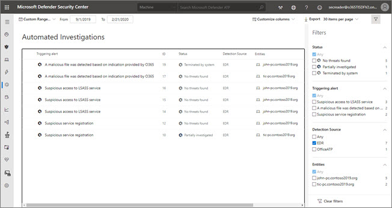

# View details and results of automated investigations

When an automated investigation runs, a verdict is generated for each piece of evidence investigated. Verdicts can be *Malicious*, *Suspicious*, or *Clean*. Depending on the type of threat and resulting verdict, remediation actions occur automatically or upon approval by your organization’s security operations team. 

Pending and completed actions are listed in the Action center ([https://securitycenter.windows.com/action-center](https://securitycenter.windows.com/action-center)) and the Investigations list ([https://securitycenter.windows.com/investigations](https://securitycenter.windows.com/investigations)).

## The Action center

The action center consists of two main tabs, as described in the following table.

|Tab  |Description  |
|---------|---------|
|Pending actions     |Displays a list of ongoing investigations that require attention. Recommended actions are presented that your security operations team can approve or reject.         |
|History     |Acts as an audit log for all of the following:  - All actions taken by automated investigation and remediation in Microsoft Defender ATP  Actions that were approved by your security operations team (some actions, such as sending a file to quarantine, can be undone)  - All commands ran and remediation actions that were applied in Live Response (some actions can be undone)  - Remediation actions applied by Windows Defender Antivirus (some actions can be undone) |

Use the Customize columns drop-down menu to select columns that you'd like to show or hide. 

From this view, you can also download the entire list in CSV format using the **Export** feature, specify the number of items to show per page, and navigate between pages.

>[!NOTE]
>The tab will only appear if there are pending actions for that category.

## Investigations page

On the **Investigations** page, you'll find a list of all automated investigations. Select an item in the list to view additional information about that automated investigation.

Use the Customize columns drop-down menu to select columns that you'd like to show or hide. 

From this view, you can also download the entire list in CSV format using the **Export** feature, specify the number of items to show per page, and navigate between pages.

### Approve or reject an action
You'll need to manually approve or reject pending actions on each of these categories for the automated actions to proceed.

Selecting an investigation from any of the categories opens a panel where you can approve or reject the remediation. Other details such as file or service details, investigation details, and alert details are displayed.

From the panel, you can click on the Open investigation page link to see the investigation details.

You also have the option of selecting multiple investigations to approve or reject actions on multiple investigations. 

## Related topics
- [Automated investigation and investigation](automated-investigations.md)
- [Learn about the automated investigations dashboard](manage-auto-investigation.md)
