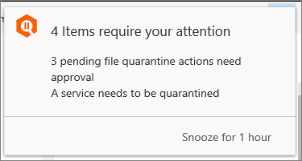

# View details and results of automated investigations

During and after an automated investigation, certain remediation actions can be identified. Depending on the threat and how Microsoft Defender Advanced Threat Protection (Microsoft Defender ATP) is configured for your organization, some actions are taken automatically. If you're part of your organization's security operations team, you can view pending and completed [remediation actions](manage-auto-investigation.md#remediation-actions) in the **Action center** ([https://securitycenter.windows.com/action-center](https://securitycenter.windows.com/action-center)). You can also use the **Investigations** page ([https://securitycenter.windows.com/investigations](https://securitycenter.windows.com/investigations)) to view details about an investigation.

>[!NOTE]
>If your organization has implemented role-based access to manage portal access, only authorized users or user groups who have permission to view the machine or machine group will be able to view the entire investigation. 

## The Action center

The action center consists of two main tabs: **Pending actions** and **History**.
- **Pending actions**  Displays a list of ongoing investigations that require attention. Recommended actions are presented that your security operations team can approve or reject. The Pending tab appears only if there are pending actions to be approved (or rejected). 
- **History**  Acts as an audit log for all of the following:  
   - Remediation actions that were taken as a result of an automated investigation
   - Remediation actions that were approved by your security operations team (some actions, such as sending a file to quarantine, can be undone) 
   - Commands that were run and remediation actions that were applied in Live Response sessions (some actions can be undone)
   - Remediation actions that were applied by Windows Defender Antivirus (some actions can be undone) 

Use the **Customize columns** menu to select columns that you'd like to show or hide. 

You can also download the entire list in CSV format using the **Export** feature, specify the number of items to show per page, and navigate between pages.

## The Investigations page

On the **Investigations** page, you'll find a list of all automated investigations. Select an item in the list to view additional information about that automated investigation.

By default, the automated investigations list displays investigations initiated in the last week. You can also choose to select other time ranges from the drop-down menu or specify a custom range. 

Use the **Customize columns** menu to select columns that you'd like to show or hide. 

From this view, you can also download the entire list in CSV format using the **Export** feature, specify the number of items to show per page, and navigate between pages.

### Filters for the list of investigations

On the **Investigations** page, you can view details and use filters to focus on specific information. The following table lists available filters:

|Filter  |Description  |
|---------|---------|
|**Status**     |(See [Automated investigation status](#automated-investigation-status))         |
|**Triggering alert** | The alert that initiated the automated investigation |
|**Detection source** |The source of the alert that initiated the automated investigation. |
|**Entities** | These can include device or machines, and machine groups. You can filter the automated investigations list to zone in a specific machine to see other investigations related to the machine, or to see specific machine groups that you might have created. |
|**Threat** |The category of threat detected during the automated investigation. |
|**Tags** |Filter using manually added tags that capture the context of an automated investigation.|
|**Comments** |Select between filtering the list between automated investigations that have comments and those that don't.|

## Automated investigation status

An automated investigation can be have one of the following status values:

|Status  |Description  |
|---------|---------|
| Running    | The investigation process has started and is underway. Malicious artifacts that are found are remediated.    |
| Partially investigated      | Entities directly related to the alert have been investigated. However, a problem stopped the investigation of collateral entities. Check the investigation log ([https://securitycenter.windows.com/investigations](https://securitycenter.windows.com/investigations)) for specific details. |
| No threats found | The investigation has finished and no threats were identified.  If you suspect something was missed (such as a false negative), you can use [advanced hunting](https://docs.microsoft.com/windows/security/threat-protection/microsoft-defender-atp/advanced-hunting-overview). |
| Pending action  | The investigation has found a threat, and an action to remediate that threat is awaiting approval. The Pending Action state is triggered when any threat with a corresponding action is found. However, the list of pending actions can increase as an investigation runs. Check the investigation log ([https://securitycenter.windows.com/investigations](https://securitycenter.windows.com/investigations)) to see if other items are still pending completion.  |
| Remediated   | The investigation finished and all actions were approved (fully remediated). |
| Partially remediated  | The investigation resulted in remediation actions, and some were approved and completed. Other actions are still pending. |
| Terminated by system  | The investigation stopped. An investigation can stop for several reasons: - The investigation's pending actions expired. Pending actions can time out after awaiting approval for an extended period of time.  - There are too many actions in the list. Visit the Action center ([https://securitycenter.windows.com/action-center](https://securitycenter.windows.com/action-center)) to view and approve any pending actions.     |
| Failed  | At least one investigation analyzer ran into a problem where it could not complete properly.   If an investigation fails after remediation actions were approved, the remediation actions might still have succeeded. Check the investigation log ([https://securitycenter.windows.com/investigations](https://securitycenter.windows.com/investigations)) for detailed results.      |
| Queued    | An investigation is being held in a queue. When other investigations complete, queued investigations begin.  |
| Waiting for machine | Investigation paused. The investigation will resume as soon as the machine is available. |
| Terminated by user    | A user stopped the investigation before it could complete.  |

## View details about an automated investigation

You can view the details of an automated investigation to see information such as the investigation graph, alerts associated with the investigation, the machine that was investigated, and other information.

In this view, you'll see the name of the investigation, when it started and ended. 

### Investigation graph

The investigation graph provides a graphical representation of an automated investigation. All investigation related information is simplified and arranged in specific sections. Clicking on any of the icons brings you the relevant section where you can view more information.

A progress ring shows two status indicators:
- Orange ring - shows the pending portion of the investigation
- Green ring - shows the running time portion of the investigation

 

In the example image, the automated investigation started on 10:26:59 AM and ended on 10:56:26 AM. Therefore, the entire investigation was running for 29 minutes and 27 seconds. 

The pending time of 16 minutes and 51 seconds reflects two possible pending states: pending for asset (for example, the device might have disconnected from the network) or pending for approval. 

From this view, you can also view and add comments and tags about the investigation.

### Alerts

The **Alerts** tab for an automated investigation shows details such as a short description of the alert that initiated the automated investigation, severity, category, the machine associated with the alert, user, time in queue, status, investigation state, and who the investigation is assigned to. 

Additional alerts seen on a machine can be added to an automated investigation as long as the investigation is ongoing. 

Selecting an alert using the check box brings up the alerts details pane where you have the option of opening the alert page, manage the alert by changing its status, see alert details, automated investigation details, related machine, logged-on users, and comments and history. 

Clicking on an alert title brings you the alert page.

### Machines

The **Machines** tab Shows details the machine name, IP address, group, users, operating system, remediation level, investigation count, and when it was last investigated.

Machines that show the same threat can be added to an ongoing investigation and will be displayed in this tab. If 10 or more machines are found during this expansion process from the same entity, then that expansion action will require an approval and will be seen in the **Pending actions** view.

Selecting a machine using the checkbox brings up the machine details pane where you can see more information such as machine details and logged-on users.

Clicking on an machine name brings you the machine page.

### Evidence

The **Evidence** tab shows details related to threats associated with this investigation. 

### Entities

The **Entities** tab shows details about entities such as files, process, services, drives, and IP addresses. The table details such as the number of entities that were analyzed. You'll gain insight into details such as how many are remediated, suspicious, or determined to be clean.

### Log

The **Log** tab gives a chronological detailed view of all the investigation actions taken on the alert. You'll see the action type, action, status, machine name, description of the action, comments entered by analysts who may have worked on the investigation, execution start time, duration, pending duration.

As with other sections, you can customize columns, select the number of items to show per page, and filter the log.

Available filters include action type, action, status, machine name, and description.

You can also click on an action to bring up the details pane where you'll see information such as the summary of the action and input data. 

### Pending actions

If there are pending actions on an automated investigation, you'll see a pop up similar to the following image. 

When you click on the pending actions link, you'll be taken to the Action center. You can also navigate to the page from the navigation page by going to **automated investigation** > **Action center**.

## Next steps

[View and approve remediation actions](manage-auto-investigation.md)
