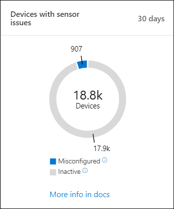
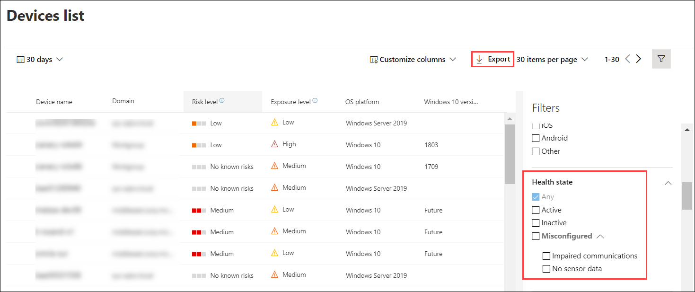

# Check sensor health state in Microsoft Defender for Endpoint

[!INCLUDE [Microsoft 365 Defender rebranding](../../includes/microsoft-defender.md)]

**Applies to:**
- [Microsoft Defender for Endpoint](https://go.microsoft.com/fwlink/p/?linkid=2146631)
- [Microsoft 365 Defender](https://go.microsoft.com/fwlink/?linkid=2118804)

>Want to experience Defender for Endpoint? [Sign up for a free trial.](https://www.microsoft.com/microsoft-365/windows/microsoft-defender-atp?ocid=docs-wdatp-checksensor-abovefoldlink)

The **Devices with sensor issues** tile is found on the Security Operations dashboard. This tile provides information on the individual device’s ability to provide sensor data and communicate with the Defender for Endpoint service. It reports how many devices require attention and helps you identify problematic devices and take action to correct known issues.

There are two status indicators on the tile that provide information on the number of devices that are not reporting properly to the service:
- **Misconfigured** - These devices might partially be reporting sensor data to the Defender for Endpoint service and might have configuration errors that need to be corrected.
- **Inactive** - Devices that have stopped reporting to the Defender for Endpoint service for more than seven days in the past month.

Clicking any of the groups directs you to **Devices list**, filtered according to your choice.

On **Devices list**, you can filter the health state list by the following status:
- **Active** - Devices that are actively reporting to the Defender for Endpoint service.
- **Misconfigured** - These devices might partially be reporting sensor data to the Defender for Endpoint service but have configuration errors that need to be corrected. Misconfigured devices can have either one or a combination of the following issues:
  - **No sensor data** - Devices has stopped sending sensor data. Limited alerts can be triggered from the device.
  - **Impaired communications** - Ability to communicate with device is impaired. Sending files for deep analysis, blocking files, isolating device from network and other actions that require communication with the device may not work.
- **Inactive** - Devices that have stopped reporting to the Defender for Endpoint service.

You can also download the entire list in CSV format using the **Export** feature. For more information on filters, see [View and organize the Devices list](machines-view-overview.md).

>[!NOTE]
>Export the list in CSV format to display the unfiltered data. The CSV file will include all devices in the organization, regardless of any filtering applied in the view itself and can take a significant amount of time to download, depending on how large your organization is.

You can view the device details when you click on a misconfigured or inactive device.

## Related topic
- [Fix unhealthy sensors in Defender for Endpoint](fix-unhealthy-sensors.md)
