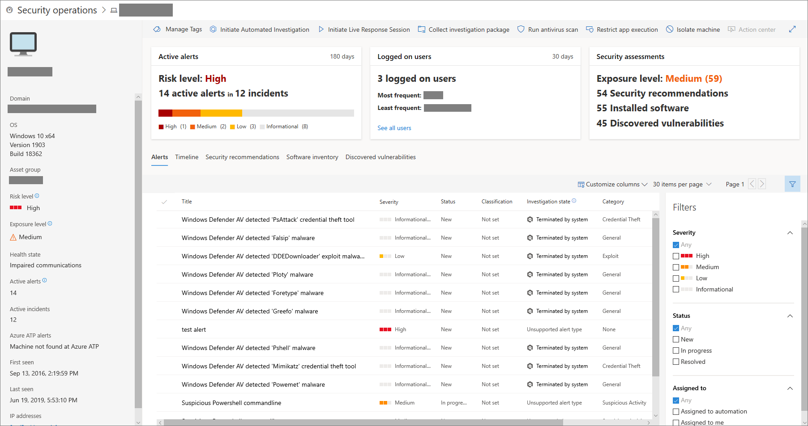

# Check sensor health state in Microsoft Defender ATP

**Applies to:**
- [Microsoft Defender Advanced Threat Protection (Microsoft Defender ATP)](https://go.microsoft.com/fwlink/p/?linkid=2069559)

>Want to experience Microsoft Defender ATP? [Sign up for a free trial.](https://www.microsoft.com/en-us/WindowsForBusiness/windows-atp?ocid=docs-wdatp-checksensor-abovefoldlink)

The sensor health tile provides information on the individual machine’s ability to provide sensor data and communicate with the Microsoft Defender ATP service. It reports how many machines require attention and helps you identify problematic machines and take action to correct known issues.

There are two status indicators on the tile that provide information on the number of machines that are not reporting properly to the service:
- **Misconfigured** - These machines might partially be reporting sensor data to the Microsoft Defender ATP service and might have configuration errors that need to be corrected.
- **Inactive** - Machines that have stopped reporting to the Microsoft Defender ATP service for more than seven days in the past month.

Clicking any of the groups directs you to Machines list, filtered according to your choice.

You can also download the entire list in CSV format using the **Export to CSV** feature. For more information on filters, see [View and organize the Machines list](machines-view-overview.md).

You can filter the health state list by the following status:
- **Active** - Machines that are actively reporting to the Microsoft Defender ATP service.
- **Misconfigured** - These machines might partially be reporting sensor data to the Microsoft Defender ATP service but have configuration errors that need to be corrected. Misconfigured machines can have either one or a combination of the following issues:
  - **No sensor data** - Machines has stopped sending sensor data. Limited alerts can be triggered from the machine.
  - **Impaired communications** - Ability to communicate with machine is impaired. Sending files for deep analysis, blocking files, isolating machine from network and other actions that require communication with the machine may not work.
- **Inactive** - Machines that have stopped reporting to the Microsoft Defender ATP service.

You can view the machine details when you click on a misconfigured or inactive machine. You’ll see more specific machine information when you click the information icon.

In the **Machines list**, you can download a full list of all the machines in your organization in a CSV format. 

>[!NOTE]
>Export the list in CSV format to display the unfiltered data. The CSV file will include all machines in the organization, regardless of any filtering applied in the view itself and can take a significant amount of time to download, depending on how large your organization is.

## Related topic
- [Fix unhealthy sensors in Microsoft Defender ATP](fix-unhealthy-sensors.md)
