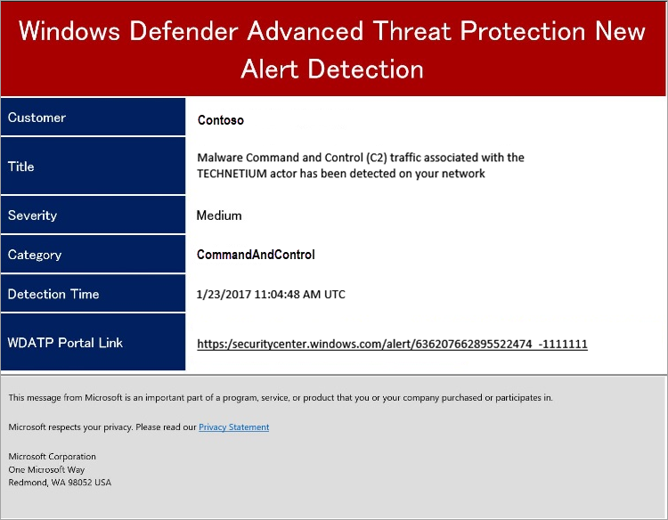

# Configure alert notifications in Microsoft Defender ATP

**Applies to:**
- [Microsoft Defender Advanced Threat Protection (Microsoft Defender ATP)](https://go.microsoft.com/fwlink/p/?linkid=2069559)

>Want to experience Microsoft Defender ATP? [Sign up for a free trial.](https://www.microsoft.com/en-us/WindowsForBusiness/windows-atp?ocid=docs-wdatp-emailconfig-abovefoldlink)

You can configure Microsoft Defender ATP to send email notifications to specified recipients for new alerts. This feature enables you to identify a group of individuals who will immediately be informed and can act on alerts based on their severity.

> [!NOTE]
> Only users with 'Manage security settings' permissions can configure email notifications. If you've chosen to use basic permissions management, users with Security Administrator or Global Administrator roles can configure email notifications.

You can set the alert severity levels that trigger notifications. You can also add or remove recipients of the email notification. New recipients get notified about alerts encountered after they are added. For more information about alerts, see [View and organize the Alerts queue](alerts-queue.md).

If you're using role-based access control (RBAC), recipients will only receive notifications based on the machine groups that were configured in the notification rule.
Users with the proper permission can only create, edit, or delete notifications that are limited to their machine group management scope.
Only users assigned to the Global administrator role can manage notification rules that are configured for all machine groups.

The email notification includes basic information about the alert and a link to the portal where you can do further investigation.

## Create rules for alert notifications
You can create rules that determine the machines and alert severities to send email notifications for and the notification recipients.

1. In the navigation pane, select **Settings** > **Alert notifications**.

2. Click **Add notification rule**.

3. Specify the General information:
    - **Rule name** - Specify a name for the notification rule.
    - **Include organization name** - Specify the customer name that appears on the email notification.
    - **Include tenant-specific portal link** - Adds a link with the tenant ID to allow access to a specific tenant.
    - **Include machine information** - Includes the machine name in the email alert body.
    
        >[!NOTE]
        > This information might be processed by recipient mail servers that ar not in the geographic location you have selected for your Microsoft Defender ATP data.

    - **Machines** - Choose whether to notify recipients for alerts on all machines (Global administrator role only) or on selected machine groups. For more information, see [Create and manage machine groups](machine-groups.md).
    - **Alert severity** - Choose the alert severity level.

4. Click **Next**.
	
5. Enter the recipient's email address then click **Add recipient**. You can add multiple email addresses.

6. Check that email recipients are able to receive the email notifications by selecting **Send test email**.

7. Click **Save notification rule**.

Here's an example email notification:

## Edit a notification rule
1. Select the notification rule you'd like to edit.

2. Update the General and Recipient tab information.

3. Click **Save notification rule**.

## Delete notification rule

1. Select the notification rule you'd like to delete.

2. Click **Delete**.

## Troubleshoot email notifications for alerts
This section lists various issues that you may encounter when using email notifications for alerts.

**Problem:** Intended recipients report they are not getting the notifications.

**Solution:** Make sure that the notifications are not blocked by email filters:

1. Check that the Microsoft Defender ATP email notifications are not sent to the Junk Email folder. Mark them as Not junk.
2. Check that your email security product is not blocking the email notifications from Microsoft Defender ATP.
3. Check your email application rules that might be catching and moving your Microsoft Defender ATP email notifications.

## Related topics
- [Update data retention settings](data-retention-settings.md)
- [Enable and create Power BI reports using Microsoft Defender ATP data](powerbi-reports.md)
- [Enable Secure Score security controls](enable-secure-score.md)
- [Configure advanced features](advanced-features.md)
