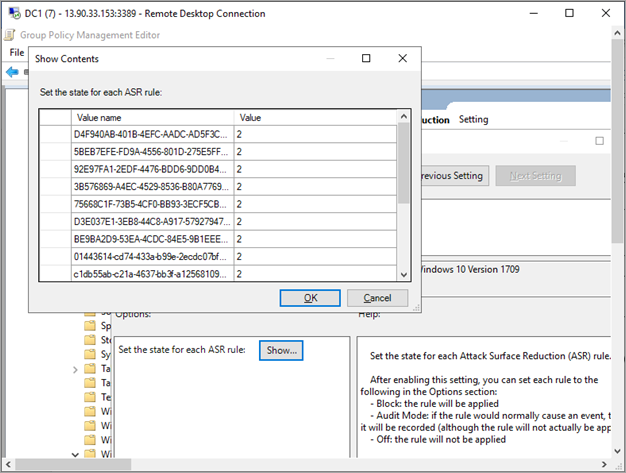

# Onboard Windows 10 devices using Group Policy 

[!INCLUDE [Microsoft 365 Defender rebranding](../../includes/microsoft-defender.md)]

**Applies to:**

- Group Policy

- [Microsoft Defender Advanced Threat Protection (Microsoft Defender ATP)](https://go.microsoft.com/fwlink/p/?linkid=2069559)

>Want to experience Microsoft Defender ATP? [Sign up for a free trial.](https://www.microsoft.com/microsoft-365/windows/microsoft-defender-atp?ocid=docs-wdatp-configureendpointsgp-abovefoldlink)

> [!NOTE]
> To use Group Policy (GP) updates to deploy the package, you must be on Windows Server 2008 R2 or later.

> For Windows Server 2019, you may need to replace NT AUTHORITY\Well-Known-System-Account with NT AUTHORITY\SYSTEM of the XML file that the Group Policy preference creates.

## Onboard devices using Group Policy
1. Open the GP configuration package .zip file (*WindowsDefenderATPOnboardingPackage.zip*) that you downloaded from the service onboarding wizard. You can also get the package from [Microsoft Defender Security Center](https://securitycenter.windows.com/):
 
    a.  In the navigation pane, select **Settings** > **Onboarding**.

    b. Select Windows 10 as the operating system.
    
    c. In the **Deployment method** field, select **Group policy**.
    
    d. Click **Download package** and save the .zip file.

2. Extract the contents of the .zip file to a shared, read-only location that can be accessed by the device. You should have a folder called *OptionalParamsPolicy* and the file *WindowsDefenderATPOnboardingScript.cmd*.

3. Open the [Group Policy Management Console](https://docs.microsoft.com/internet-explorer/ie11-deploy-guide/group-policy-and-group-policy-mgmt-console-ie11) (GPMC), right-click the Group Policy Object (GPO) you want to configure and click **Edit**.

4. In the **Group Policy Management Editor**, go to **Computer configuration**, then **Preferences**, and then **Control panel settings**.

5. Right-click **Scheduled tasks**, point to **New**, and then click **Immediate Task (At least Windows 7)**.

6. In the **Task** window that opens, go to the **General** tab. Under **Security options** click **Change User or Group** and type SYSTEM and then click **Check Names** then **OK**. NT AUTHORITY\SYSTEM appears as the user account the task will run as.

7. Select **Run whether user is logged on or not** and check the **Run with highest privileges** check box.

8. Go to the **Actions** tab and click **New...** Ensure that **Start a program** is selected in the **Action** field. Enter the file name and location of the shared *WindowsDefenderATPOnboardingScript.cmd* file.

9. Click **OK** and close any open GPMC windows.

>[!TIP]
> After onboarding the device, you can choose to run a detection test to verify that the device is properly onboarded to the service. For more information, see [Run a detection test on a newly onboarded Microsoft Defender ATP device](run-detection-test.md).

## Additional Microsoft Defender ATP configuration settings
For each device, you can state whether samples can be collected from the device when a request is made through Microsoft Defender Security Center to submit a file for deep analysis.

You can use Group Policy (GP) to configure settings, such as settings for the sample sharing used in the deep analysis feature.

### Configure sample collection settings
1.  On your GP management device, copy the following files from the
    configuration package:

    a.  Copy _AtpConfiguration.admx_ into _C:\\Windows\\PolicyDefinitions_

    b.  Copy _AtpConfiguration.adml_ into _C:\\Windows\\PolicyDefinitions\\en-US_

    If you are using a [Central Store for Group Policy Administrative Templates](https://support.microsoft.com/help/3087759/how-to-create-and-manage-the-central-store-for-group-policy-administra), copy the following files from the
    configuration package:
    
     a.  Copy _AtpConfiguration.admx_ into _\\\\\<forest.root\>\\SysVol\\\<forest.root\>\\Policies\\PolicyDefinitions_

     b.  Copy _AtpConfiguration.adml_ into _\\\\\<forest.root\>\\SysVol\\\<forest.root\>\\Policies\\PolicyDefinitions\\en-US_

2.  Open the [Group Policy Management Console](https://docs.microsoft.com/internet-explorer/ie11-deploy-guide/group-policy-and-group-policy-mgmt-console-ie11), right-click the GPO you want to configure and click **Edit**.

3.  In the **Group Policy Management Editor**, go to **Computer configuration**.

4.  Click **Policies**, then **Administrative templates**.

5.  Click **Windows components** and then **Windows Defender ATP**.

6.  Choose to enable or disable sample sharing from your devices.

>[!NOTE]
> If you don't set a value, the default value is to enable sample collection.

## Other recommended configuration settings

### Update endpoint protection configuration

After configuring the onboarding script, continue editing the same group policy to add endpoint protection configurations. Perform group policy edits from a system running Windows 10 or Server 2019 to ensure you have all of the required Microsoft Defender Antivirus capabilities. You may need to close and reopen the group policy object to register the Defender ATP configuration settings.

All policies are located under `Computer Configuration\Policies\Administrative Templates`.

**Policy location:** \Windows Components\Windows Defender ATP

Policy | Setting 
:---|:---
Enable\Disable Sample collection|	Enabled - "Enable sample collection on machines" checked

**Policy location:**  \Windows Components\Windows Defender Antivirus

Policy | Setting 
:---|:---
Configure detection for potentially unwanted applications | Enabled, Block

**Policy location:** \Windows Components\Windows Defender Antivirus\MAPS

Policy | Setting 
:---|:---
Join Microsoft MAPS | Enabled, Advanced MAPS
Send file samples when further analysis is required | Enabled, Send safe samples

**Policy location:** \Windows Components\Windows Defender Antivirus\Real-time Protection

Policy | Setting 
:---|:---
Turn off real-time protection|Disabled
Turn on behavior monitoring|Enabled
Scan all downloaded files and attachments|Enabled
Monitor file and program activity on your computer|Enabled

**Policy location:**  \Windows Components\Windows Defender Antivirus\Scan

These settings configure periodic scans of the endpoint. We recommend performing a weekly quick scan, performance permitting.

Policy | Setting 
:---|:---
Check for the latest virus and spyware security intelligence before running a scheduled scan |Enabled

**Policy location:** \Windows Components\Windows Defender Antivirus\Windows Defender Exploit Guard\Attack Surface Reduction

Get the current list of attack surface reduction GUIDs from [Customize attack surface reduction rules](customize-attack-surface-reduction.md)

1. Open the **Configure Attack Surface Reduction** policy.
2. Select **Enabled**.
3. Select the **Show…** button.
4. Add each GUID in the **Value Name** field with a Value of 2.

This will set each up for audit only.

Policy | Setting 
:---|:---
Configure Controlled folder access|	Enabled, Audit Mode

## Offboard devices using Group Policy
For security reasons, the package used to Offboard devices will expire 30 days after the date it was downloaded. Expired offboarding packages sent to a device will be rejected. When downloading an offboarding package you will be notified of the packages expiry date and it will also be included in the package name.

> [!NOTE]
> Onboarding and offboarding policies must not be deployed on the same device at the same time, otherwise this will cause unpredictable collisions.

1. Get the offboarding package from [Microsoft Defender Security Center](https://securitycenter.windows.com/):

    a. In the navigation pane, select **Settings** > **Offboarding**.

    b. Select Windows 10 as the operating system.
    
    c. In the **Deployment method** field, select **Group policy**.

    d. Click **Download package** and save the .zip file.

2. Extract the contents of the .zip file to a shared, read-only location that can be accessed by the device. You should have a file named *WindowsDefenderATPOffboardingScript_valid_until_YYYY-MM-DD.cmd*.

3. Open the [Group Policy Management Console](https://docs.microsoft.com/internet-explorer/ie11-deploy-guide/group-policy-and-group-policy-mgmt-console-ie11) (GPMC), right-click the Group Policy Object (GPO) you want to configure and click **Edit**.

4. In the **Group Policy Management Editor**, go to **Computer configuration,** then **Preferences**, and then **Control panel settings**.

5. Right-click **Scheduled tasks**, point to **New**, and then click **Immediate task**.

6. In the **Task** window that opens, go to the **General** tab. Choose the local SYSTEM user account (BUILTIN\SYSTEM) under **Security options**.

7. Select **Run whether user is logged on or not** and check the **Run with highest privileges** check-box.

8. Go to the **Actions** tab and click **New...**. Ensure that **Start a program** is selected in the **Action** field. Enter the file name and location of the shared  *WindowsDefenderATPOffboardingScript_valid_until_YYYY-MM-DD.cmd* file.

9. Click **OK** and close any open GPMC windows.

> [!IMPORTANT]
> Offboarding causes the device to stop sending sensor data to the portal but data from the device, including reference to any alerts it has had will be retained for up to 6 months.

## Monitor device configuration
With Group Policy there isn’t an option to monitor deployment of policies on the devices. Monitoring can be done directly on the portal, or by using the different deployment tools.

## Monitor devices using the portal
1. Go to [Microsoft Defender Security Center](https://securitycenter.windows.com/).
2. Click **Devices list**.
3. Verify that devices are appearing.

> [!NOTE]
> It can take several days for devices to start showing on the **Devices list**. This includes the time it takes for the policies to be distributed to the device, the time it takes before the user logs on, and the time it takes for the endpoint to start reporting.

## Related topics
- [Onboard Windows 10 devices using Microsoft Endpoint Configuration Manager](configure-endpoints-sccm.md)
- [Onboard Windows 10 devices using Mobile Device Management tools](configure-endpoints-mdm.md)
- [Onboard Windows 10 devices using a local script](configure-endpoints-script.md)
- [Onboard non-persistent virtual desktop infrastructure (VDI) devices](configure-endpoints-vdi.md)
- [Run a detection test on a newly onboarded Microsoft Defender ATP devices](run-detection-test.md)
- [Troubleshoot Microsoft Defender Advanced Threat Protection onboarding issues](troubleshoot-onboarding.md)
