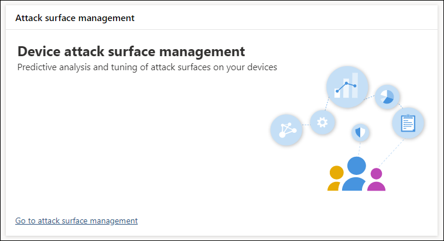
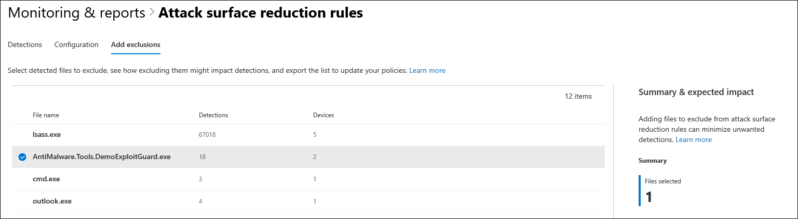

# Optimize ASR rule deployment and detections

**Applies to:**
- [Microsoft Defender Advanced Threat Protection (Microsoft Defender ATP)](https://go.microsoft.com/fwlink/p/?linkid=2069559)

[!include[Prerelease information](prerelease.md)]

>Want to experience Microsoft Defender ATP? [Sign up for a free trial.](https://www.microsoft.com/en-us/WindowsForBusiness/windows-atp?ocid=docs-wdatp-onboardconfigure-abovefoldlink)

[Attack surface reduction (ASR) rules](../windows-defender-exploit-guard/attack-surface-reduction-exploit-guard.md) identify and prevent actions that are typically taken by malware during exploitation. These rules control when and how potentially malicious code can run. For example, you can prevent JavaScript or VBScript from launching a downloaded executable, block Win32 API calls from Office macros, or block processes that run from USB drives.

 
*Attack surface management card*

The **Attack surface management** card is an entry point to tools in Microsoft 365 security center that you can use to:

- Understand how ASR rules are currently deployed in your organization
- Review ASR detections and identify possible incorrect detections
- Analyze the impact of exclusions and generate the list of file paths to exclude

Selecting **Go to attack surface management** takes you to **Monitoring & reports > Attack surface reduction rules > Add exclusions**. From there, you can navigate to other sections of Microsoft 365 security center.

 
*Add exclusions tab in the Attack surface reduction rules page in Microsoft 365 security center*

>[!NOTE]
>To access Microsoft 365 security center, you need a Microsoft 365 E3 or E5 license and an account that has certain roles on Azure Active Directory. [Read more about required licenses and permissions](https://docs.microsoft.com/office365/securitycompliance/microsoft-security-and-compliance#required-licenses-and-permissions)

For more information about optimizing ASR rule deployment in Microsoft 365 security center, read [Monitor and manage ASR rule deployment and detections](https://docs.microsoft.com/office365/securitycompliance/monitor-devices#monitor-and-manage-asr-rule-deployment-and-detections) 

>Want to experience Microsoft Defender ATP? [Sign up for a free trial.](https://www.microsoft.com/en-us/WindowsForBusiness/windows-atp?ocid=docs-wdatp-onboardconfigure-belowfoldlink)

# Related topics
- [Ensure your machines are configured properly](configure-machines.md)
- [Get machines onboarded to Microsoft Defender ATP](configure-machines-onboarding.md)
- [Increase compliance to the Microsoft Defender ATP security baseline](configure-machines-security-baseline.md)