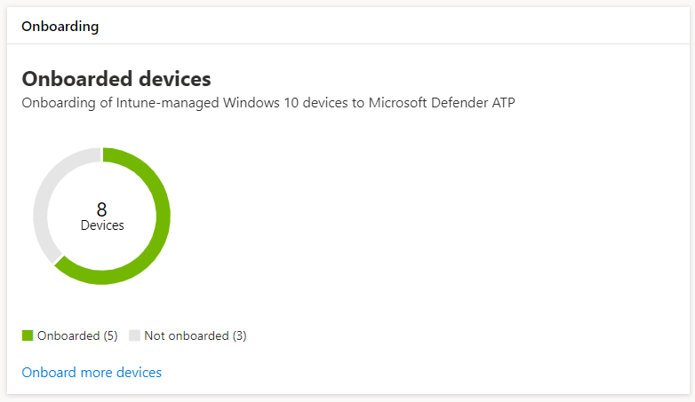
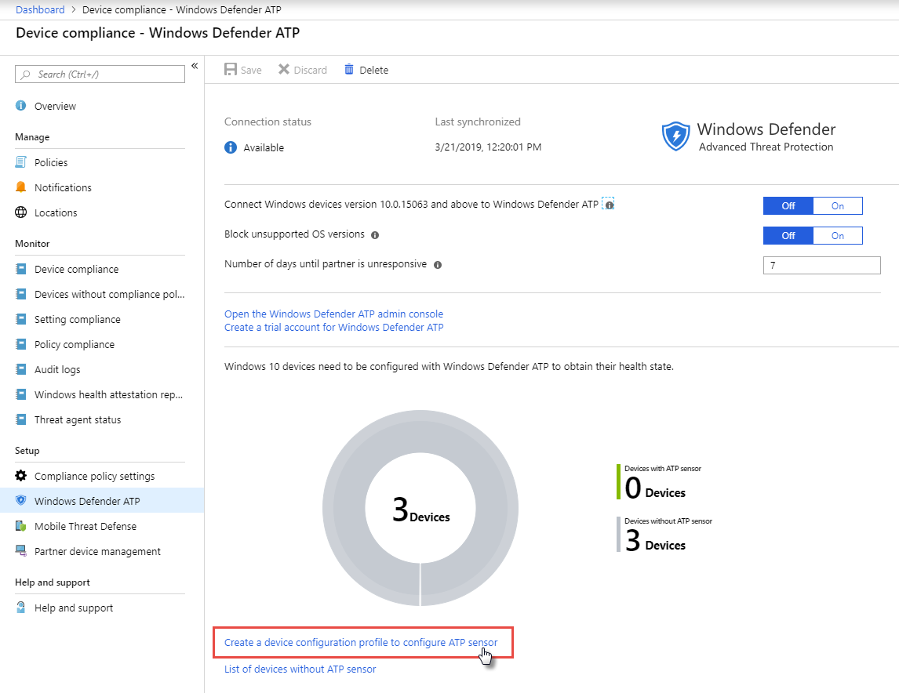
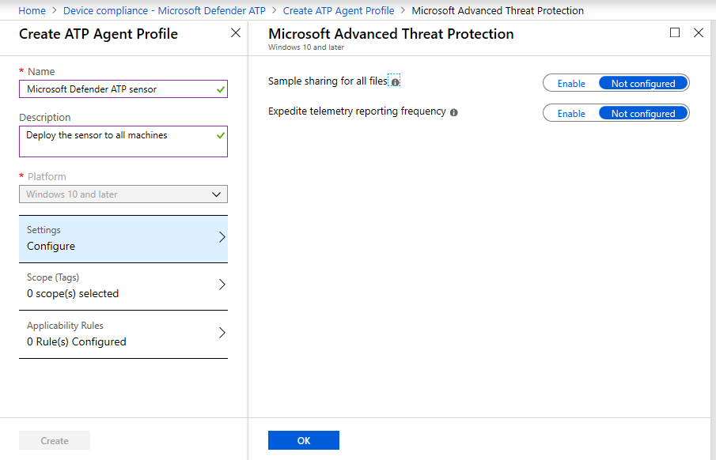
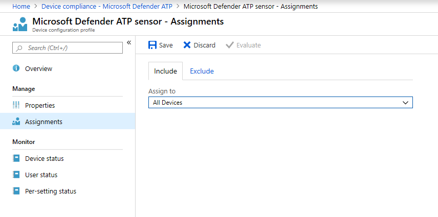

# Get machines onboarded to Microsoft Defender ATP

**Applies to:**
- [Microsoft Defender Advanced Threat Protection (Microsoft Defender ATP)](https://go.microsoft.com/fwlink/p/?linkid=2069559)

[!include[Prerelease information](prerelease.md)]

>Want to experience Microsoft Defender ATP? [Sign up for a free trial.](https://www.microsoft.com/en-us/WindowsForBusiness/windows-atp?ocid=docs-wdatp-onboardconfigure-abovefoldlink)

Each onboarded machine adds an additional endpoint detection and response (EDR) sensor and increases visibility over breach activity in your network. Onboarding also ensures that a machine can be checked for vulnerable components as well security configuration issues and can receive critical remediation actions during attacks.

## Discover and track unprotected machines

The **Onboarding** card provides a high-level overview of your onboarding rate by comparing the number of Windows 10 machines that have actually onboarded to Microsoft Defender ATP against the total number of Intune-managed Windows 10 machines.

*Card showing onboarded machines compared to the total number of Intune-managed Windows 10 machine*

>[!NOTE]
>- If you used Security Center Configuration Manager or other onboarding methods that don’t use Intune profiles, you might encounter data discrepancies. To resolve these discrepancies assign an Intune configuration profile to onboard the machines to Microsoft Defender ATP again.
> -During preview, you might experience discrepancies in aggregated data displayed on the machine configuration management page and those displayed on overview screens in Intune.

## Onboard more machines with Intune profiles

Microsoft Defender ATP provides several convenient options for [onboarding Windows 10 machines](onboard-configure.md). For Intune-managed machines, however, you can leverage Intune profiles to conveniently deploy the Microsoft Defender ATP sensor to select machines, effectively onboarding these devices to the service.

From the **Onboarding** card, select **Onboard more machines** to create and assign a profile on Intune. The link takes you to a similar overview of your onboarding state.

>[!TIP] 
>Alternatively, you can navigate to the Microsoft Defender ATP onboarding compliance page in the [Microsoft Azure portal](https://portal.azure.com/) from **All services > Intune > Device compliance > Microsoft Defender ATP**.

From the overview, create a configuration profile specifically for the deployment of the Microsoft Defender ATP sensor and assign that profile to the machines you want to onboard.

1. Select **Create a device configuration profile to configure ATP sensor**.

   

   *Microsoft Defender ATP device compliance page on Intune device management*

2. Specify a name for the profile, specify desired configuration options for sample sharing and reporting frequency, and select **Create** to save the new profile.

   

   *Configuration profile creation*

3. After creating the profile, assign it to all your machines. You can review profiles and their deployment status anytime by accessing **Device configuration > Profiles** on Intune.

   

   *Assigning the new agent profile to all machines*

To learn more about Intune profiles, [read Assign user and device profiles in Microsoft Intune](https://docs.microsoft.com/en-us/intune/device-profile-assign).

>Want to experience Microsoft Defender ATP? [Sign up for a free trial.](https://www.microsoft.com/en-us/WindowsForBusiness/windows-atp?ocid=docs-wdatp-onboardconfigure-belowfoldlink)

# Related topics
- [Ensure your machines are configured properly](configure-machines.md)
- [Increase compliance to the Microsoft Defender ATP security baseline](configure-machines-security-baseline.md)
- [Optimize ASR rule deployment and detections](configure-machines-asr.md)
