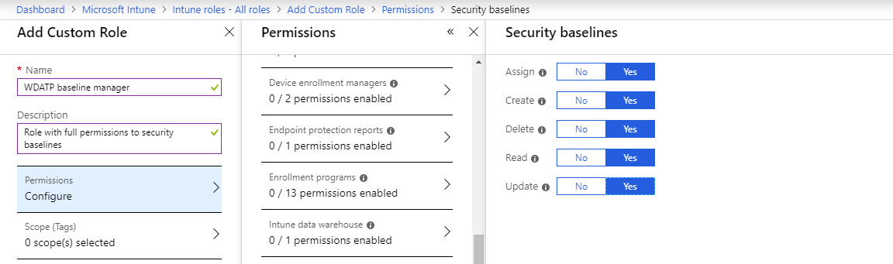
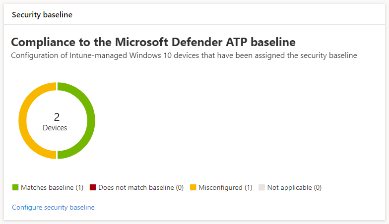
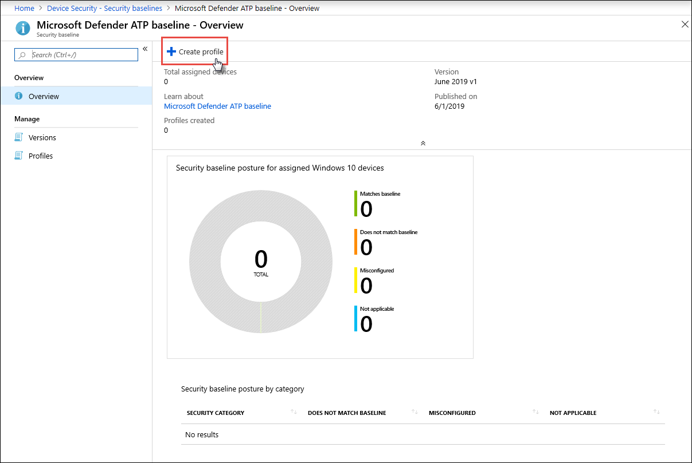
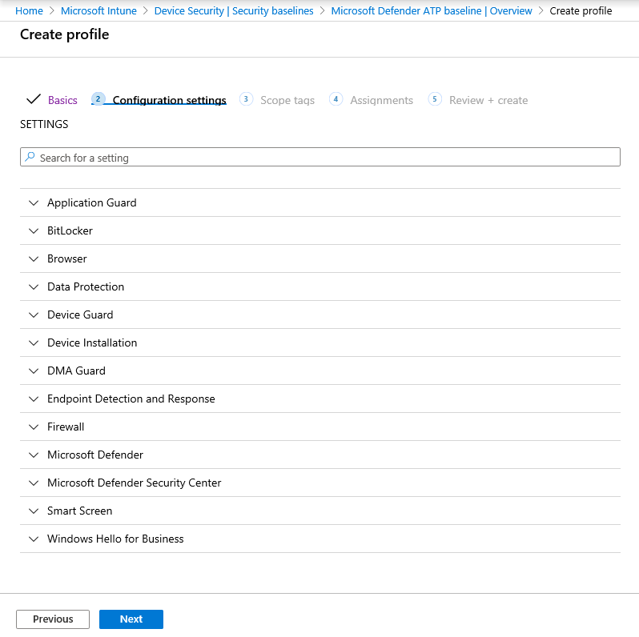
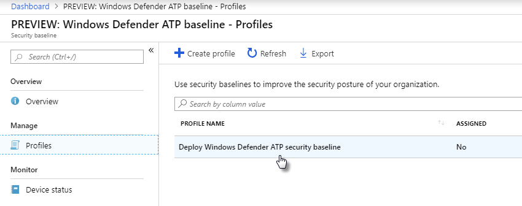
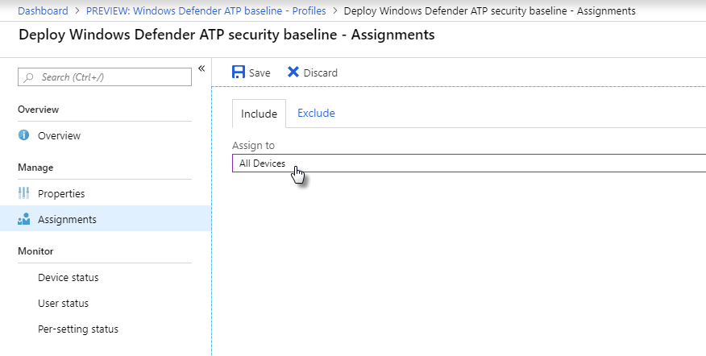

# Increase compliance to the Microsoft Defender ATP security baseline

**Applies to:**
- [Microsoft Defender Advanced Threat Protection (Microsoft Defender ATP)](https://go.microsoft.com/fwlink/p/?linkid=2069559)

[!include[Prerelease information](prerelease.md)]

>Want to experience Microsoft Defender ATP? [Sign up for a free trial.](https://www.microsoft.com/en-us/WindowsForBusiness/windows-atp?ocid=docs-wdatp-onboardconfigure-abovefoldlink)

Security baselines ensure that security features are configured according to guidance from both security experts and expert Windows system administrators. When deployed, the Microsoft Defender ATP security baseline sets Microsoft Defender ATP security controls to provide optimal protection.

To understand security baselines and how they are assigned on Intune using configuration profiles, [read this FAQ](https://docs.microsoft.com/intune/security-baselines#q--a).

## Compare the Microsoft Defender ATP and the Windows security baselines
The Windows security baseline on Intune provides a comprehensive set of recommended settings needed to securely configure machines running Windows, including browser settings, PowerShell settings, as well as settings for some security features like Windows Defender Antivirus. In contrast, the Microsoft Defender ATP baseline provides settings that optimize all the security controls in the Microsoft Defender ATP stack, including settings for endpoint detection and response (EDR) as well as settings also found in the Windows security baseline. For more information about each baseline, see:

- [Windows security baseline settings for Intune](https://docs.microsoft.com/intune/security-baseline-settings-windows)
- [Microsoft Defender ATP baseline settings for Intune](https://docs.microsoft.com/intune/security-baseline-settings-defender-atp)

Both baselines are maintained so that they complement one another and have identical values for shared settings. Deploying both baselines to the same machine will not result in conflicts. Ideally, machines onboarded to Microsoft Defender ATP are deployed both baselines: the Windows security baseline to initially secure Windows and then the Microsoft Defender ATP security baseline layered on top to optimally configure the Microsoft Defender ATP security controls.

## Get permissions to manage security baselines in Intune

By default, only users who have been assigned the Global Administrator or the Intune Service Administrator role on Azure AD can manage security baseline profiles. If you haven’t been assigned either role, work with a Global Administrator or an Intune Service Administrator to [create a custom role in Intune](https://docs.microsoft.com/intune/create-custom-role#to-create-a-custom-role) with full permissions to security baselines and then assign that role to your Azure AD group.

*Security baseline permissions on Intune*

## Monitor compliance to the security baseline

The **Security baseline** card on [machine configuration management](configure-machines.md) provides an overview of compliance across Windows 10 machines that have been assigned the Microsoft Defender ATP security baseline.

*Card showing compliance to the Microsoft Defender ATP security baseline*

Each machine is given one of the following status types:

- **Matches baseline**—machine settings match all the settings in the baseline
- **Does not match baseline**—at least one machine setting doesn't match the baseline
- **Misconfigured**—at least one baseline setting isn't properly configured on the machine and is in a conflict, error, or pending state
- **Not applicable**—At least one baseline setting isn't applicable on the machine

To review specific machines, select **Configure security baseline** on the card. This takes you to Intune device management. From there, select **Device status** for the names and statuses of the machines.

>[!NOTE] 
>During preview, you might encounter a few known limitations:
>- You might experience discrepancies in aggregated data displayed on the machine configuration management page and those displayed on overview screens in Intune.
>- The Microsoft Defender ATP security baseline currently doesn’t cover settings for all Microsoft Defender ATP security controls, including settings for exploit protection and Application Guard.

## Review and assign the Microsoft Defender ATP security baseline

Machine configuration management monitors baseline compliance only of Windows 10 machines that have been specifically assigned the Microsoft Defender ATP security baseline. You can conveniently review the baseline and assign it to machines on Intune device management.

1. Select **Configure security baseline** on the **Security baseline** card to go to Intune device management. A similar overview of baseline compliance is displayed.

   >[!TIP]
   > Alternatively, you can navigate to the Microsoft Defender ATP security baseline in the Microsoft Azure portal from **All services > Intune > Device security > Security baselines (preview) > PREVIEW: Windows Defender ATP baseline**.

2. Create a new profile.

   

   *Microsoft Defender ATP security baseline overview on Intune*

3. During profile creation, you can review and adjust specific settings on the baseline.

   

   *Security baseline options during profile creation on Intune*

4. After creating the new profile, you will be shown a list of profiles for the security baseline. Select the new profile from the list of profiles.

   

   *Security baseline profiles on Intune*

5. To deploy the security baseline, assign the profile to all your machines and save the profile.

   

   *Assigning the security baseline on Intune*

To learn more about Intune security baselines and assigning them, [read Create a Windows 10 security baseline in Intune](https://docs.microsoft.com/intune/security-baselines).

>Want to experience Microsoft Defender ATP? [Sign up for a free trial.](https://www.microsoft.com/en-us/WindowsForBusiness/windows-atp?ocid=docs-wdatp-onboardconfigure-belowfoldlink)

# Related topics
- [Ensure your machines are configured properly](configure-machines.md)
- [Get machines onboarded to Microsoft Defender ATP](configure-machines-onboaring.md)
- [Optimize ASR rule deployment and detections](configure-machines-asr.md)