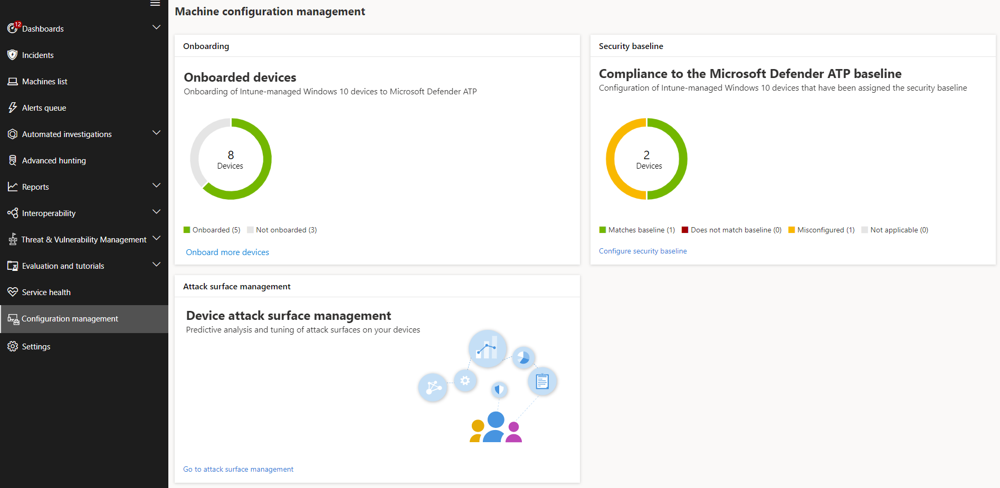
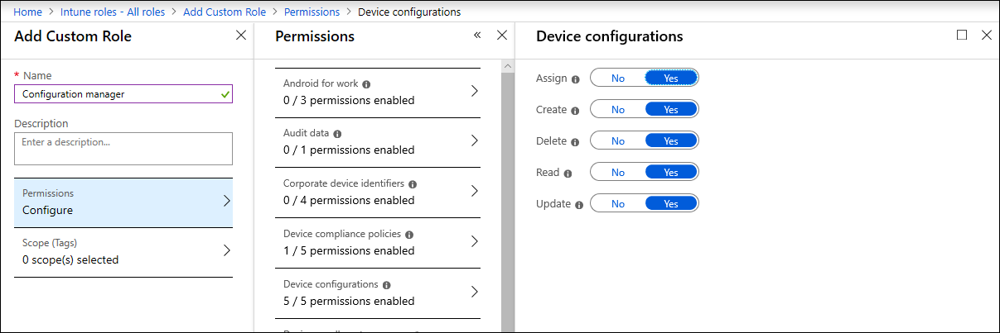

# Ensure your machines are configured properly

**Applies to:**
- [Microsoft Defender Advanced Threat Protection (Microsoft Defender ATP)](https://go.microsoft.com/fwlink/p/?linkid=2069559)

>Want to experience Microsoft Defender ATP? [Sign up for a free trial.](https://www.microsoft.com/en-us/WindowsForBusiness/windows-atp?ocid=docs-wdatp-onboardconfigure-abovefoldlink)

With properly configured machines, you can boost overall resilience against threats and enhance your capability to detect and respond to attacks. Security configuration management helps ensure that your machines:

- Onboard to Microsoft Defender ATP
- Meet or exceed the Microsoft Defender ATP security baseline configuration
- Have strategic attack surface mitigations in place

 
*Machine configuration management page*

You can track configuration status at an organizational level and quickly take action in response to poor onboarding coverage, compliance issues, and poorly optimized attack surface mitigations through direct, deep links to device management pages on Microsoft Intune and Microsoft 365 security center.

In doing so, you benefit from:
- Comprehensive visibility of the events on your machines
- Robust threat intelligence and powerful machine learning technologies for processing raw events and identifying the breach activity and threat indicators
- A full stack of security features configured to efficiently stop the installation of malicious implants, hijacking of system files and process, data exfiltration, and other threat activities
- Optimized attack surface mitigations, maximizing strategic defenses against threat activity while minimizing impact to productivity

## Enroll machines to Intune management

Machine configuration management works closely with Intune device management to establish the inventory of the machines in your organization and the baseline security configuration. You will be able to track and manage configuration issues on Intune-managed Windows 10 machines.

Before you can ensure your machines are configured properly, enroll them to Intune management. Intune enrollment is robust and has several enrollment options for Windows 10 machines. For more information about Intune enrollment options, read about [setting up enrollment for Windows devices](https://docs.microsoft.com/intune/windows-enroll).

>[!NOTE]
>To enroll Windows devices to Intune, administrators must have already been assigned licenses. [Read about assigning licenses for device enrollment](https://docs.microsoft.com/intune/licenses-assign).

>[!TIP] 
>To optimize machine management through Intune, [connect Intune to Microsoft Defender ATP](https://docs.microsoft.com/intune/advanced-threat-protection#enable-windows-defender-atp-in-intune).

## Obtain required permissions
By default, only users who have been assigned the Global Administrator or the Intune Service Administrator role on Azure AD can manage and assign the device configuration profiles needed for onboarding machines and deploying the security baseline.

If you have been assigned other roles, ensure you have the necessary permissions:

- Full permissions to device configurations
- Full permissions to security baselines
- Read permissions to device compliance policies
- Read permissions to the organization

 
*Device configuration permissions on Intune*

>[!TIP] 
>To learn more about assigning permissions on Intune, [read about creating custom roles](https://docs.microsoft.com/intune/create-custom-role#to-create-a-custom-role).

## In this section
Topic | Description
:---|:---
[Get machines onboarded to Microsoft Defender ATP](configure-machines-onboarding.md)| Track onboarding status of Intune-managed machines and onboard more machines through Intune. 
[Increase compliance to the Microsoft Defender ATP security baseline](configure-machines-security-baseline.md) | Track baseline compliance and noncompliance. Deploy the security baseline to more Intune-managed machines.
[Optimize ASR rule deployment and detections](configure-machines-asr.md) | Review rule deployment and tweak detections using impact analysis tools in Microsoft 365 security center.

>Want to experience Microsoft Defender ATP? [Sign up for a free trial.](https://www.microsoft.com/en-us/WindowsForBusiness/windows-atp?ocid=docs-wdatp-onboardconfigure-belowfoldlink)